# Dashboards

**Source:** [View in Confluence](https://rippling.atlassian.net/wiki/spaces/RDS/pages/3418030121)  
**Last Synced:** 11/3/2025, 6:37:50 PM  
**Confluence Version:** 20

---

### Team

-   PD:
    
-   PM :
    
-   ENG Manager:
    
-   BE ENG:
    
-   FE ENG:
    
-   UXR:
    

---

## **Overview**

Dashboards are business intelligence (BI) reporting tools that aggregate and display key performance indicators in a single place, enabling people to monitor business at a glance. Inside dashboards, embedded reports can be easily edited and/or reorganized in different positions and sizes, adapting the data to best suit its owner.

## **User Group(s)**

-   Primary: Admins - All levels
    
-   Secondary: Employees
    

## **Resources**

Jira Board: Link here

Document design file: [Dashboards](https://www.figma.com/file/5qu6fGZErbTz89FvUML8ms/Admin-dashboard-\(Alpha\)?node-id=35%3A107153&t=b9vDiesEf1s3PK3k-1)

Product walk through video: Link here

Slack channels:

-   #admin-dashboard-design
    
-   #dashboard-feedback
    
-   #embedded-reports-internal
    

Spoof Account: OZ (583fd88612fba0c57a866dd7)

note

**Dashboard main features:**

-   Add reports
    
-   Rearrange reports
    
-   Share dashboards
    
-   Apply global filters
    

**Dashboard main features:**

-   Add reports
    
-   Rearrange reports
    
-   Share dashboards
    
-   Apply global filters
    

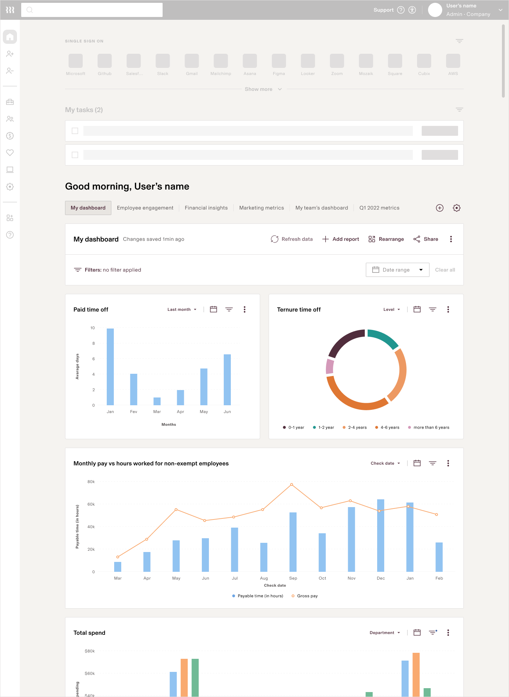

##   
Permissions

Anyone can be a dashboard viewer and consume its data based on their permissions. As a simple example, a manager might see his entire team/department data when opening the dashboard; whereas, their direct reports will only see their data.

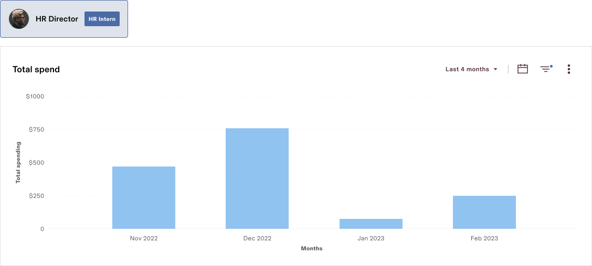

Permissions are based on data access and role, so users will only see the data they are authorized to see by Rippling’s system, admins, and/or dashboard owners.

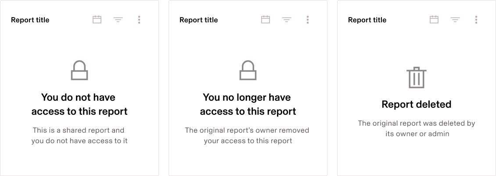

Empty state examples for report access restrictions

## Managing dashboards

“My dashboard” is the first dashboard created to people and contains the most relevant reports to the account’s owner. Other dashboards can be created and will show on the next tab.

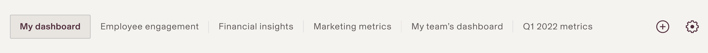

Dashboards can also be reordered, edited, or deleted under dashboard configuration icon.

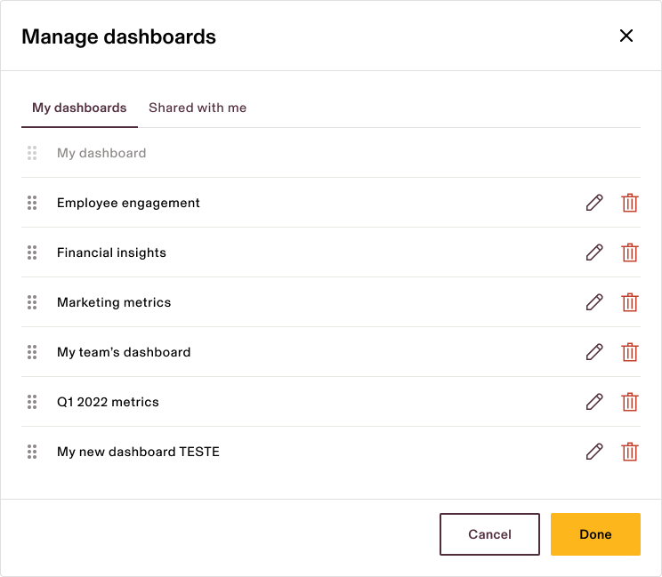

##   
Adding a report to dashboard

An empty dashboard is useless by itself, so adding a report is the best way to start building a dashboard. The dashboard header contains the most frequent actions such as refresh data, add report, rearrange, share, filters, date range, and more.

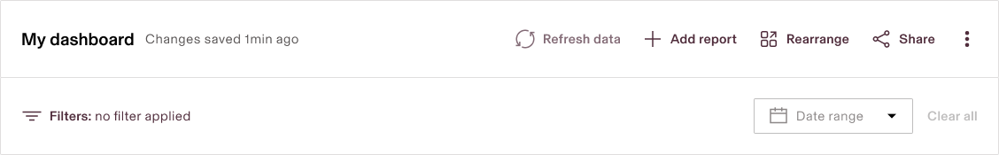

##   
Embedded reports (ER)

Reports can be found or created in Reports App. Embedded reports can either be standalone components on core Rippling apps (powered by recipes), or they can be inside a dashboard (cloned from a parent report). ERs can be tables, charts, and or any other visualization supported by Rippling reports. All ER must be create-able using the Rippling reports app, since the ER is that exact report, just embedded within another page.

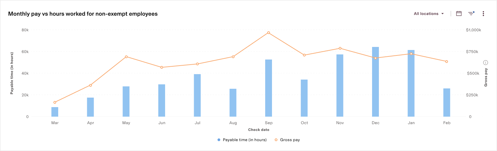note

**Embedded reports main features:**

-   Group by adjustment
    
-   Date range and filters
    
-   Drill down data
    
-   Edit visualization
    
-   Hide/show column
    
-   Add/remove column is NOT ALLOWED
    

**Embedded reports main features:**

-   Group by adjustment
    
-   Date range and filters
    
-   Drill down data
    
-   Edit visualization
    
-   Hide/show column
    
-   Add/remove column is NOT ALLOWED
    

##   
Visualization types

Reports can be visualized in different forms and the most basic one is a table. To be able to visualize different types of chart, the data must be grouped.

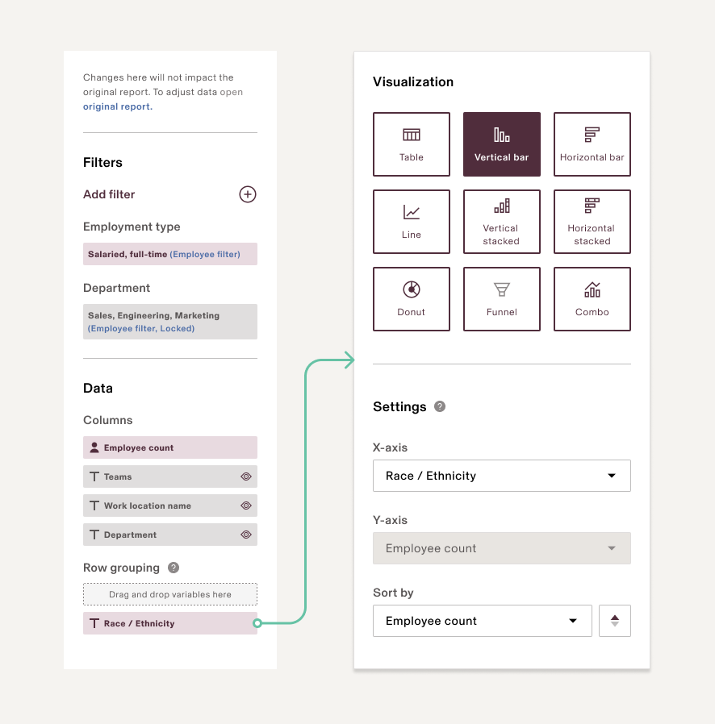

### **Global filters**

Consolidating multiple reports gets interesting when you can not only see all the data you care about in one view, but when you can adjust all that data in the same way at the same time, which can be used to compare, analyze, observe patterns. The global filter fully articulates the value of Rippling as the centralized home for all app data, and drives home the purpose of dashboards, from which insights, patterns, and comparisons can be found.

-   **Global filters** will allow users to apply a lens to see data for a specific dimension across all Rippling apps. Global filters allow users to hone in on a certain segment, to look at a core set of metrics first filtered for one team, then for another team, then filter for a certain time period, all in real-time on one view.
    
    -   Finance admins can look at reports about upcoming payroll expenses, most expensive vendors the last 3 months, and transaction approval status for top expenses, and apply quick filters to focus on one department, employee level, or location at a time
        
    -   Device admins can look at device metrics across the company then filter by employee level or start date to solve for certain device upgrades easily
        
    -   Super admins can look at their top company metrics by last week, then last month, then last 6 months to compare different views
        

note

### Global attribute filter

-   updates the employee attributes of all reports on the page.
    

### Global attribute filter

-   updates the employee attributes of all reports on the page.
    

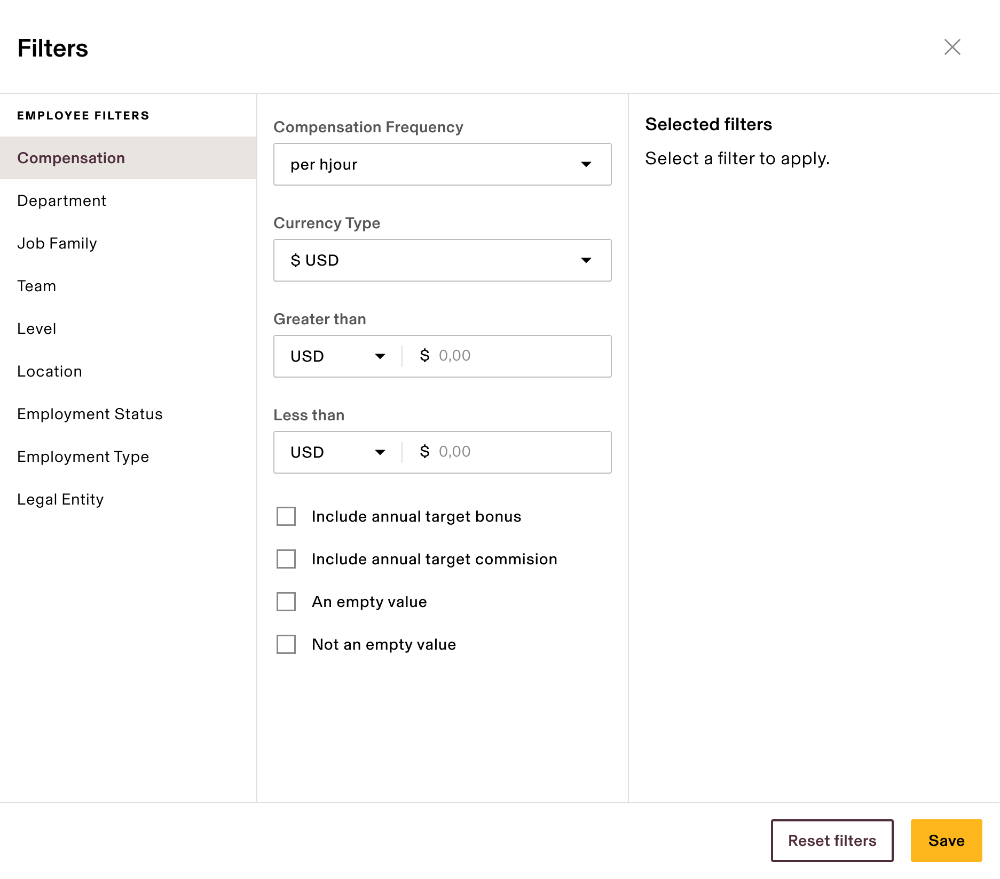

note

### Global date filter

-   adjusts the date attributes of all reports that are grouped by a date field simultaneously all with the same global date value
    

### Global date filter

-   adjusts the date attributes of all reports that are grouped by a date field simultaneously all with the same global date value
    

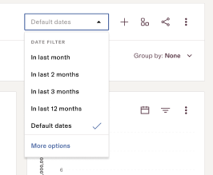

### **Local actions**

Often, users want to hone in on one specific report on the dashboard and make adjustments either 1) within the context of the dashboard, or 2) in a separate safe space.

#### 1) Within the Dashboard view

“As a dashboard user, I want to manipulate a specific report quickly in the context of the dashboard

There are buttons on the embedded report card itself that allow for quick adjustments:

-   date filter
    
-   attribute filter
    
-   group by
    
    -   specs for “group by” are here
        

P0: date filter as a modal, button shows calendar icon

P1: date filter button as a dropdown (designs below)

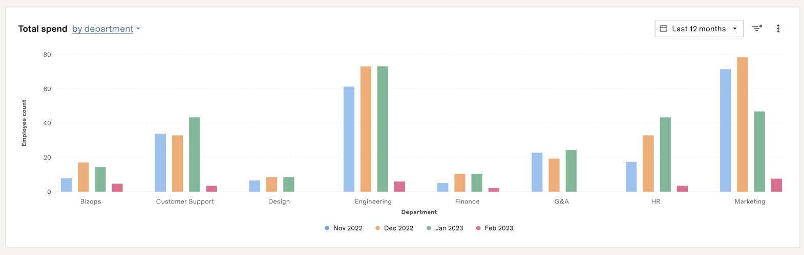

#### 2) Within Expand mode

“As a dashboard user, I want to adjust a specific report in a separate page to play around with data without impacting the dashboard

If a user clicks “expand” from an embedded report, the following are adjustable:

-   date filter
    
-   attribute filter
    
-   group by
    
-   column order
    
-   chart type
    
-   bucket by
    
-   pivot vs non-pivot
    

Expand Mode: Dashboards

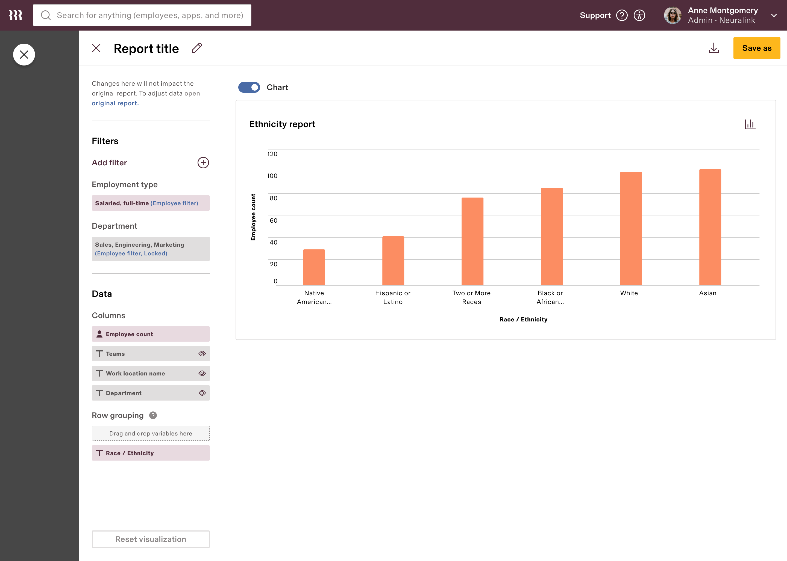

## App installation

During the app installation, admins can select and preview different types of tools to maximize their app experience. Reports and Workflows can be set up during the installation so people get up and running with their work.

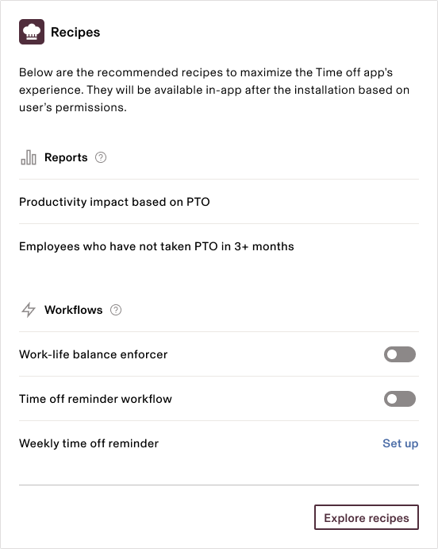
