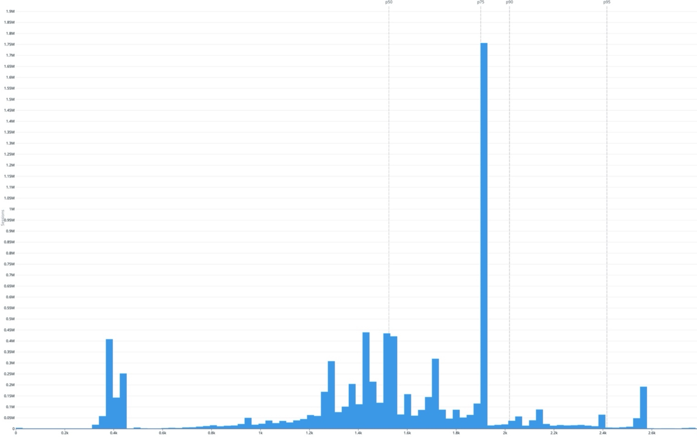
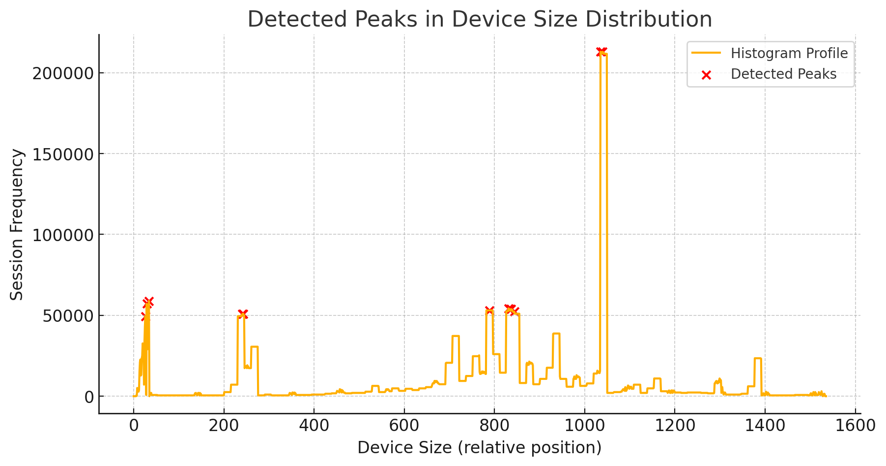

# Rippling responsive strategy

**Source:** [View in Confluence](https://rippling.atlassian.net/wiki/spaces/RDS/pages/4878237802)  
**Last Synced:** 11/3/2025, 6:37:44 PM  
**Confluence Version:** 4

---

## Abstract

This document is for the readers to understand the responsive strategy used at Rippling

**Driver**

**Status**

WIPYellow

**Reviewer(s)**

All core Pebble members

## Problem

The current breakpoints defined in Pebble are random values selected with no strong rationale. This leads us to swap presentation logic without any set rules.

## Proposal

We are proposing to override the values of the breakpoints via constants already defined. The graph attached shows the usage of Rippling across different breakpoint over a span of one month.

We took this graph and did some basic analysis on it to study the spike that helped us define the breakpoints.

#### New proposed values

typescript

## Research findings

The graph shown above can be found [here](https://app.datadoghq.com/dashboard/8xr-a43-k5y?fromUser=false&fullscreen_end_ts=1739177395940&fullscreen_paused=false&fullscreen_refresh_mode=sliding&fullscreen_section=overview&fullscreen_start_ts=1736498995940&fullscreen_widget=5474458265081779&from_ts=1739168378990&to_ts=1739171978990&live=true).

## Revisions
