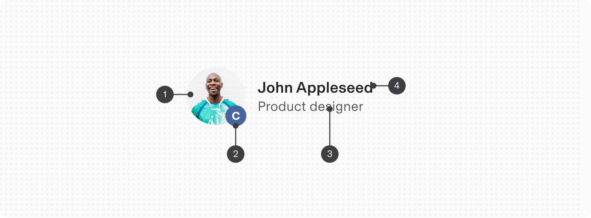
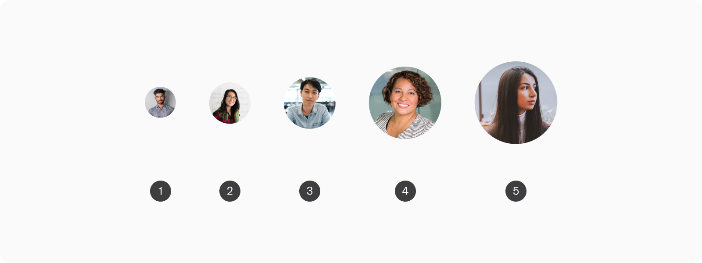
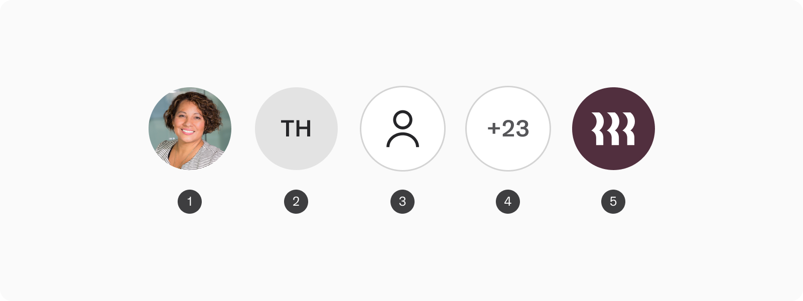
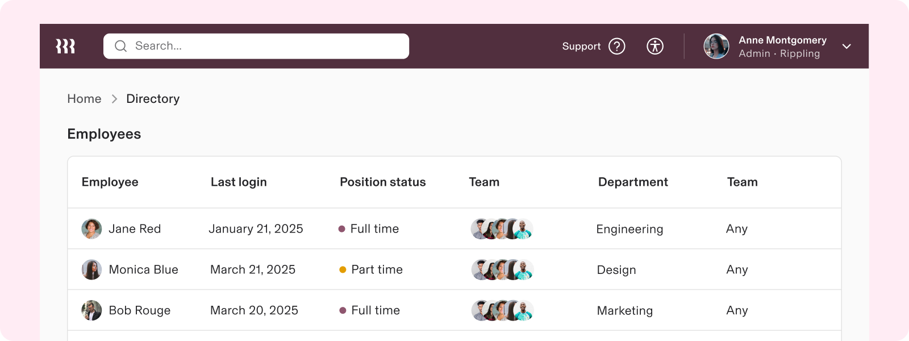

# Avatar

**Source:** [View in Confluence](https://rippling.atlassian.net/wiki/spaces/RDS/pages/3964109064)  
**Last Synced:** 11/3/2025, 6:08:07 PM  
**Confluence Version:** 4

---

A visual representation of an entity, such as a user, organization, or product.

---

# Overview

-   To visually represent a person, brand, or product
    
-   Two types: circular and rounded square
    

## Resources

**Type**

**Resource**

**Status**

Design

[Web Resources (Figma)](https://www.figma.com/file/ysWbTtfWqhVDHQd1Mg2LQ1/v2-Component-Library?type=design&node-id=959-220&mode=design)

AvailableGreen

Implementation

[Web Component (Storybook)](https://uikit.ripplinginternal.com/?path=/docs/components-avatar-avatarlist--props)

AvailableGreen

---

# Specs

## Anatomy

1.  Container
    
2.  Badge (optional)
    
3.  Label (optional)
    
4.  Sub label (optional)
    

## Configuration

### Shape

1.  **Circle**: Used to represent individual people
    
2.  **Rounded square**: Used to represent non-human entities like organizations, products, or brands
    

### Size

1.  Extra extra small
    
2.  Extra Small
    
3.  Small (default)
    
4.  Medium
    
5.  Large
    

### Type

1.  **Image**: Standard type
    
2.  **Text**: A fallback type that automatically uses the first and last initial of a name
    
3.  **Icon**: A utility type for specifying icons that represent entities
    
4.  **Number**: Used to indicate overflowing avatars in a list
    
5.  **Rippling**: An avatar exclusive to the Rippling brand
    

### Avatar list

Avatars can be displayed in a list with a maximum limit that automatically truncates with a number indicating the remaining entities.

---

# Usage

### When to use

-   To represent an entity, such as a user, organization, or product
    

## Guidelines

### Using the right avatar shape

Use a circular shape to represent people and rounded squares for objects, brands, or products. This helps distinguish between the two types of entities at a glance when scanning a page.

---

# Accessibility

Avatar can be a static element or rendered as a button depending on a provided action. If the avatar has an associated action, users must be able to: 

-   Navigate to and activate the avatar button with assistive technology
    

## Keyboard Navigation

**Keys**

**Action (single select)**

Tab

Moves focus to the non-static avatar

Space / Enter

Activates the non-static avatar action
