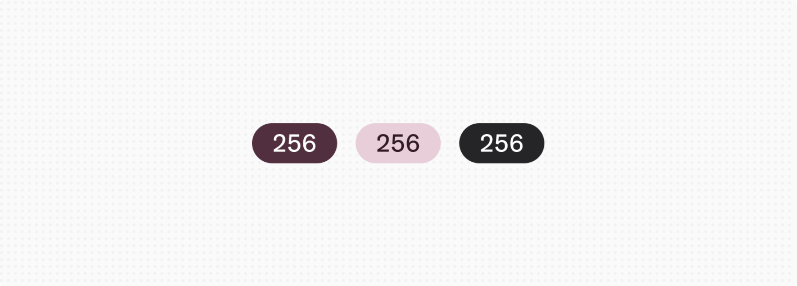
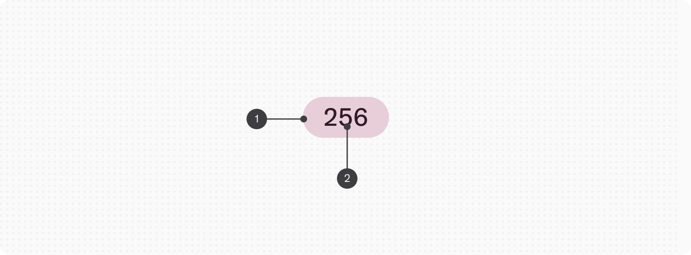
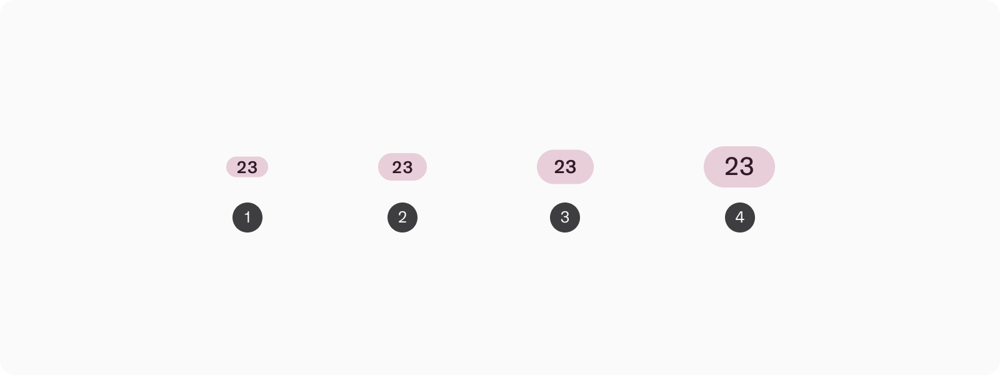
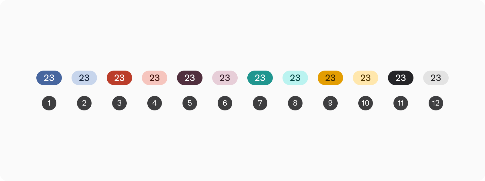
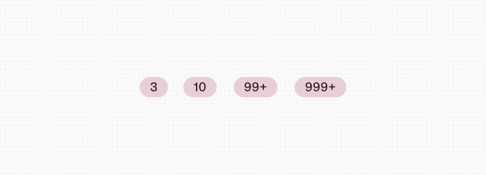
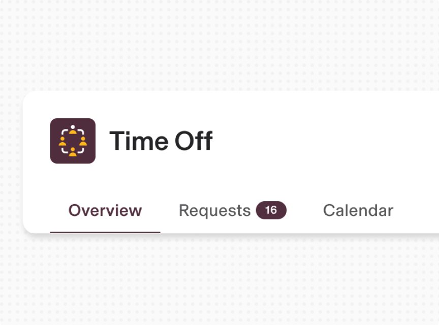
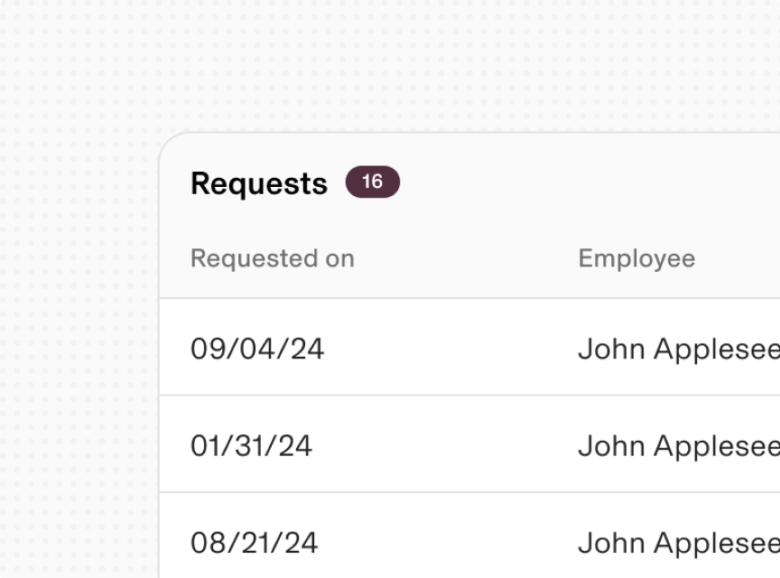
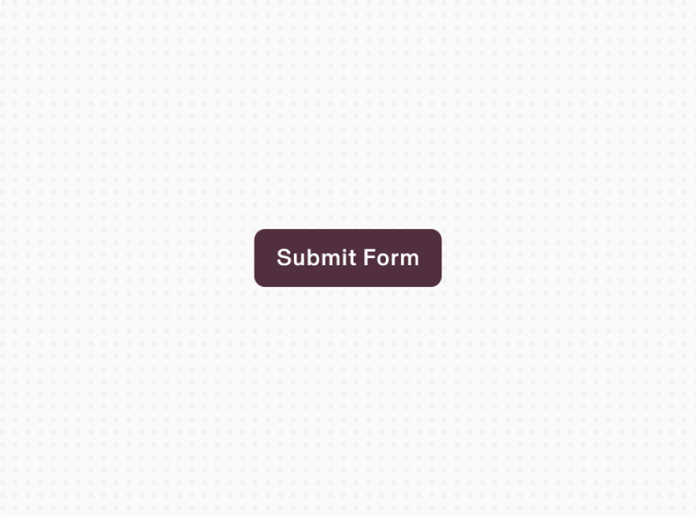
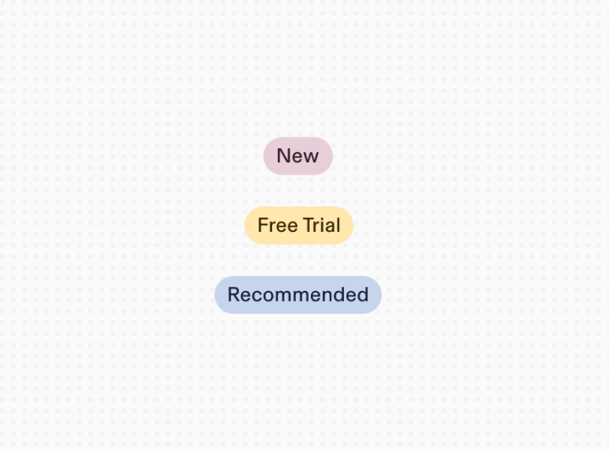
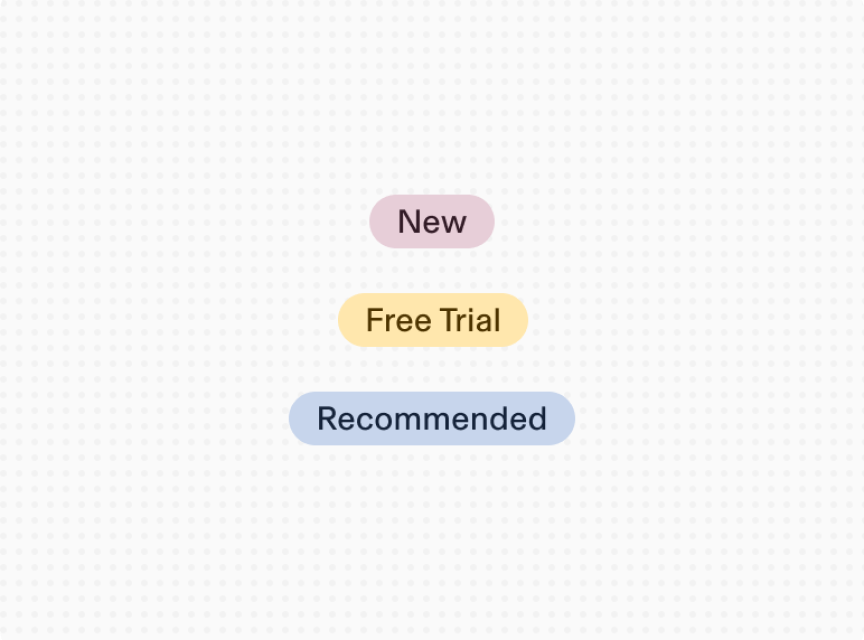

# Badge

**Source:** [View in Confluence](https://rippling.atlassian.net/wiki/spaces/RDS/pages/3947593734)  
**Last Synced:** 11/3/2025, 6:08:15 PM  
**Confluence Version:** 8

---

Introduction

A static indicator for displaying notifications, counts, or numerical status information.

[Figma](https://www.figma.com/file/ysWbTtfWqhVDHQd1Mg2LQ1/Component-Library-v2?type=design&node-id=1093-182&mode=design) [Storybook](https://uikit.ripplinginternal.com/?path=/docs/components-atoms-badge--props)

---

## Overview

-   Used to show counts and numbers
    
-   Used as a brief visual cue of quantities for updates, notifications, and important metrics
    

Writing in sentence cases ensures that capitalized words are intentional, reducing ambiguity around proper nouns and standard terms. This rule allows for avoiding subjectivity while deciding which words to capitalize. (except branded terms)

## Specs

### Anatomy

1.  Container
    
2.  Label
    

### Sizes

1.  Extra Small
    
2.  Small
    
3.  Medium
    
4.  Large
    

### Appearance

1.  Info dark
    
2.  Info light
    
3.  Error dark
    
4.  Error light
    

1.  Primary dark
    
2.  Primary light
    
3.  Success dark
    
4.  Success light
    

1.  Warning dark
    
2.  Warning light
    
3.  Neutral dark
    
4.  Neutral light
    

# Usage

### Limits

When exact numbers are not critical to know, it's recommended to round quantities to the nearest hundred or thousand and add a "+" at the end. This approach simplifies the Badge component and minimizes clutter in the user interface.

### With Tip

Badge with a Tip can be used to show more information related to the badge information.

## Best Practices

Do

Use Badges to highlight unread or pending items in tabs

Don’t

Avoid using Badge to show number of results in a table

Do

Use a Button component for an Action

Don’t

Badges cannot be used for Actions

Do

Use Label component to show a category of information

Don’t

Since Badge component only shows numerical value, avoid adding text
