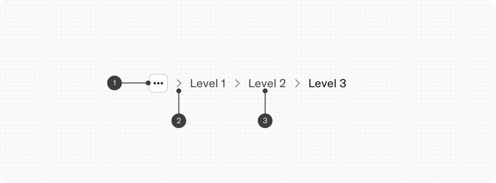
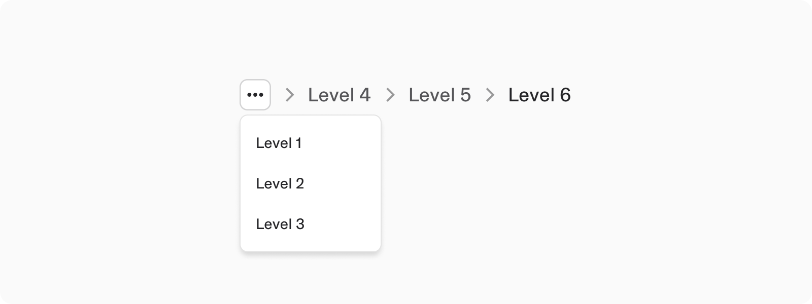
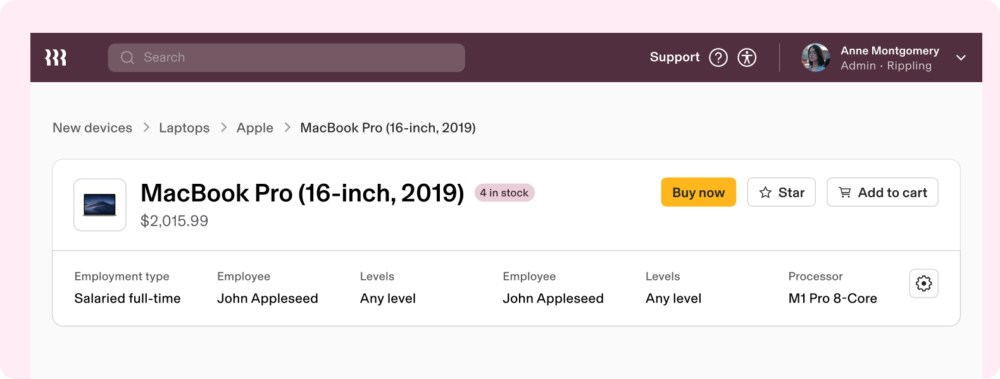

# Breadcrumbs

**Source:** [View in Confluence](https://rippling.atlassian.net/wiki/spaces/RDS/pages/3949625443)  
**Last Synced:** 11/3/2025, 6:08:10 PM  
**Confluence Version:** 4

---

Introduction

A sequential series of links that mark the nested hierarchy and navigational context for a user’s location within an app.

---

# Overview

-   A breadcrumb trail consists of a list of links to the parent pages of the current page in hierarchical order
    
-   Helps users find their place within a website or web application
    

## Resources

**Type**

**Resource**

**Status**

Design

[Web Component (Figma)](https://www.figma.com/file/ysWbTtfWqhVDHQd1Mg2LQ1/Component-Library-v2?type=design&node-id=1111-735&mode=design)

AVAILABLEGreen

Implementation

[Web Component (Storybook)](https://uikit.ripplinginternal.com/?path=/docs/components-miscellaneous-breadcrumb--props)

AVAILABLEGreen

---

# Specs

## Anatomy

1.  Overflow menu (optional)
    
2.  Delimiter
    
3.  Label
    

## Configuration

### Default

By default, breadcrumbs are displayed inline with the hierarchy shown in reading order.

### Overflow

Breadcrumbs can truncate to a menu when there is not enough room to display all levels of the list, or as a way of managing relevance of the visible breadcrumb items in a deeply nested hierarchy. The truncation of breadcrumb items begins when there is not enough room to display all items.

---

# Usage

### When to use

-   Ideal for areas with a complex information architecture. Breadcrumbs provide a clear path back to higher-level pages, making it easier for users to navigate in and out of layers of content.
    
-   They work best in conjunction with other primary navigation elements like menus or tabs, providing a quick way to return to previous levels without cluttering the UI.
    

### When to use something else

-   In cases where there is no hierarchical structure of pages or the content is relatively flat, breadcrumbs may not add value and could potentially clutter the interface. A simple back button may suffice for returning to the previous page.
    

---

# Accessibility

Users should be able to:

-   Understand where breadcrumb items navigate to
    

## Keyboard Navigation

**Keys**

**Action (single select)**

Tab

Moves focus to next item

Space / Enter

Selects item and navigates to that location. If focus is on menu, opens the menu

Up/Down Arrow

When menu is open, up and down arrow navigate through the menu items
