# Button

**Source:** [View in Confluence](https://rippling.atlassian.net/wiki/spaces/RDS/pages/3969712129)  
**Last Synced:** 11/3/2025, 6:08:23 PM  
**Confluence Version:** 25

---

Buttons are interactive elements that allow users to trigger an action.

---

# Overview

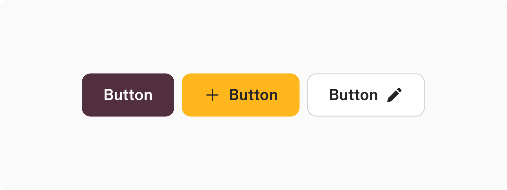

-   Allows users to trigger actions or events with a single click
    

## Resources

**Type**

**Resource**

**Status**

Design

[Web Resources (Figma)](https://www.figma.com/file/ysWbTtfWqhVDHQd1Mg2LQ1/Component-Library-v2?type=design&node-id=1046-1210&mode=design)

AvailableGreen

Implementation

[Web Component (Storybook)](https://uikit.ripplinginternal.com/?path=/docs/components-button-button--props)

AvailableGreen

---

# Specs

## Anatomy

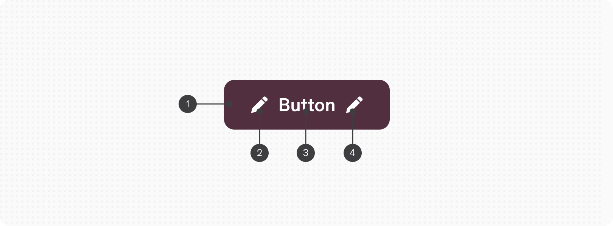

1.  Container
    
2.  Start icon (optional)
    
3.  Label
    
4.  End icon (optional)
    

## Configuration

### Appearance

Button Appearances

1.  **Primary**: Highlights the key call to action. It's unique per section and not mandatory on every screen
    
2.  **Accent**: Used for primary actions when the default style blends in too much
    
3.  **Outline**: Marks a secondary action or helps to de-emphasize actions of equal weight to reduce clutter
    
4.  **Solid**: A variation of the outline button, used against backgrounds that clash with the outline style
    
5.  **Ghost**: For less critical actions in a set or to minimize visual overload with a lot of visible buttons
    
6.  **Destructive**: The go-to for irreversible and destructive actions. Its red color should be used sparingly as it’s stressful to the user
    
7.  **Success**: Indicates actions that are expected to have positive outcomes
    
8.  **Info**: For neutral, informational purposes without pressing importance
    
9.  **Warning**: Highlights actions that might lead to unwanted results
    

Type or paste something here to turn it into an excerpt.

### Size

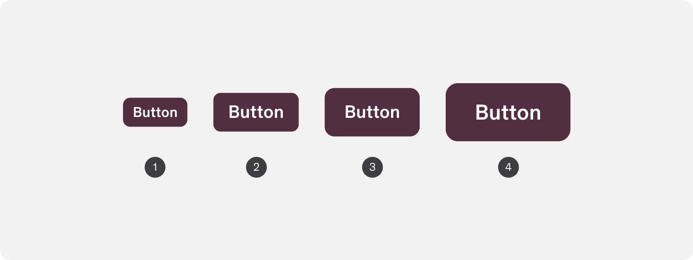

1.  Extra small (24px height) newGreen
    
2.  Small (32px height)
    
3.  Medium (40px height)
    
4.  Large (default) (48px height)
    

## Icons

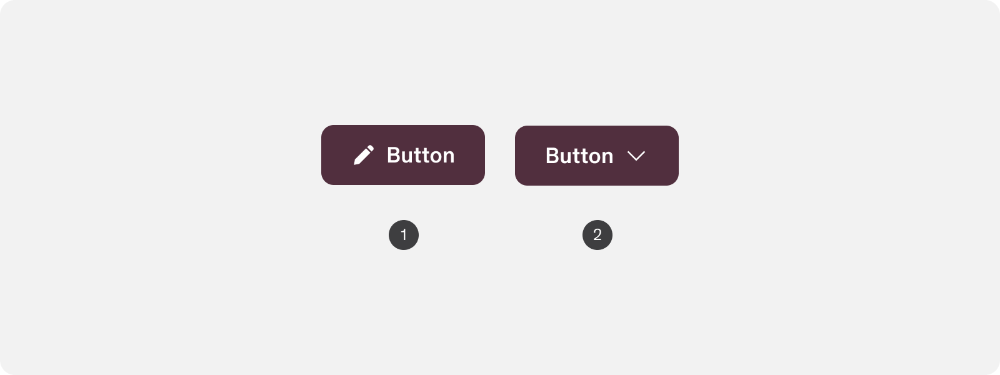

Icons can assume the start _or_ the end icon position.

1.  Start icon position
    
2.  End icon position
    

## Full width

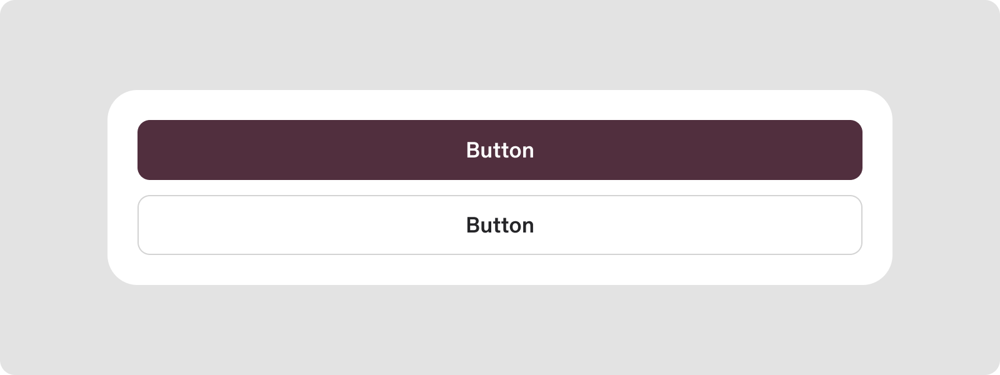

Buttons can become fluid and assume the width of a parent container instead of hugging the content.

---

# Usage

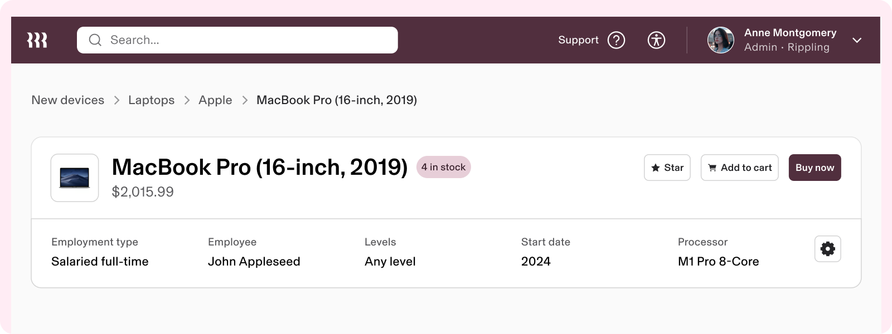

### When to use

-   To enable user action or decision
    
-   To draw attention and provide visual hierarchy to multiple actions in a user interface
    

### When to use something else

-   Do not use buttons as navigational elements. Instead, use links (anchor elements) when the desired action is to take the user to a new page.
    
-   When space is limited, repeated, and/or the action isn’t critical, consider using an icon button instead.
    

## Guidelines

### Communicate one action at a time

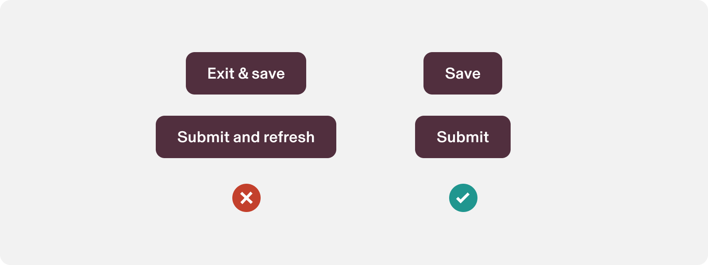

A button should typically serve a single function. Although there are instances where a button may lead to multiple outcomes, such as both saving changes and closing a dialog box, the standard practice is for a button to perform one main action, possibly with unavoidable or expected side effects (like closing the dialog).

Highlighting one primary action simplifies the experience and lowers the cognitive burden. Merging several main actions into one button typically suggests a need for the design to be refined and/or simplified.

There are instances where explicitly communicating multiple actions are warranted. This is meant to be a rule of thumb to not overcomplicate the button labels unneccessarily.

### Use icons only when necessary

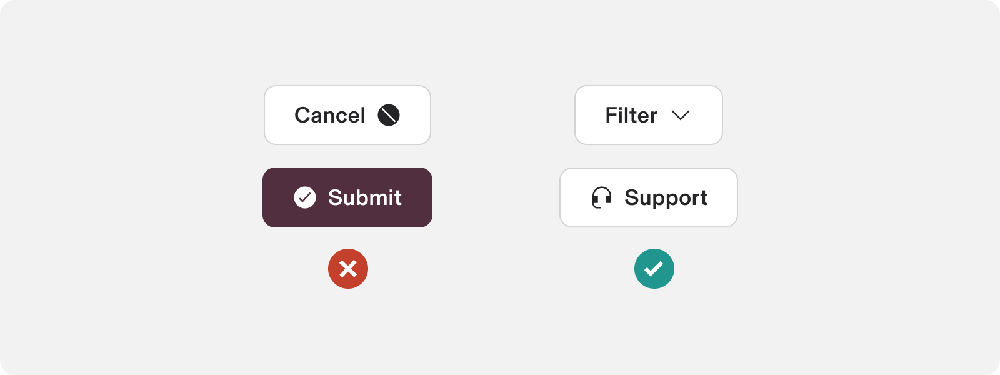

Opt for incorporating icons into buttons primarily when they enhance the button's clarity or intuitiveness. A prime example is the use of chevrons in menu buttons to signify the presence of a menu upon click.

note

Navigating the balance of when to use or not use icons can be difficult. The key consideration is to avoid using icons in buttons when the icon is redundant or merely for presentation purposes. Their inclusion should be considered carefully because there is a cost, such as increased complexity, demand on screen space, and cognitive load for users, which can become significant if icons are overused.

Navigating the balance of when to use or not use icons can be difficult. The key consideration is to avoid using icons in buttons when the icon is redundant or merely for presentation purposes. Their inclusion should be considered carefully because there is a cost, such as increased complexity, demand on screen space, and cognitive load for users, which can become significant if icons are overused.

### Use filled icons

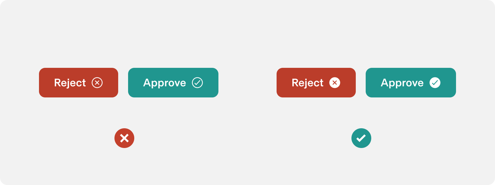

Filled icons usually work better inside buttons especially in small sizes. If a button is small it’s harder to distinguish outlined icon compared to it’s filled counterpart.

### Use destructive buttons with caution

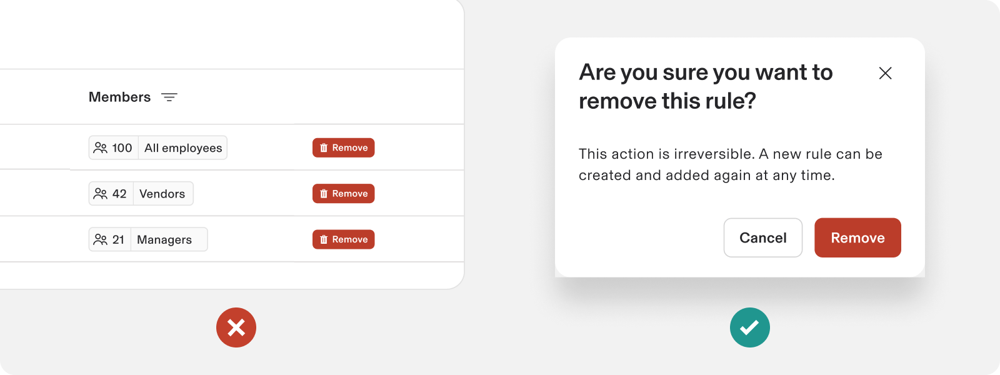

Repeated destructive actions, especially when signified by the color red, can cause stress for users. The use of destructive buttons is often more effectively applied within a confirmation modal, rather than directly or repeatedly in the interface.

### Use disabled buttons with caution

Using disabled buttons can be a helpful way to guide user interactions and prevent errors. However, their use should be carefully considered to ensure a positive user experience.

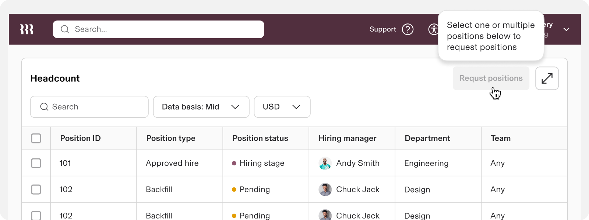

#### When to use disabled Buttons

1.  **Conditional actions:** To indicate that certain actions are currently unavailable but may become available based on user actions or system states
    
2.  **Loading states**: To prevent users from performing actions while the system is processing
    
3.  **Permissions control:** To reflect user permissions or roles. Admin-specific actions that are disabled for regular users
    

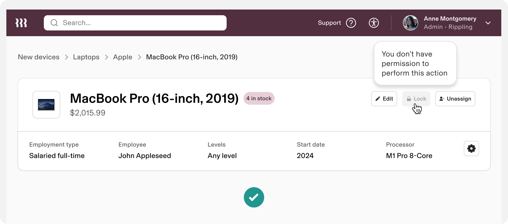

No permission

#### When to avoid disabled Buttons

1.  **Forms**: User may not understand why a Submit/Continue button is disabled in a form. This could lead to confusion thinking it’s a dead end and even bounce off the app. Always keep the CTA button active in a Form. In case a form is incomplete or invalid trigger immediate error state on button click. Provide clear feedback in the error state to guide user on which inptus need to be corrected or completed
    
2.  **Critical Actions**: Disabling critical actions and CTAs without an alternative can hinder user tasks. Always ensure that there is a clear path or instructions for users to follow to enable the critical action.
    

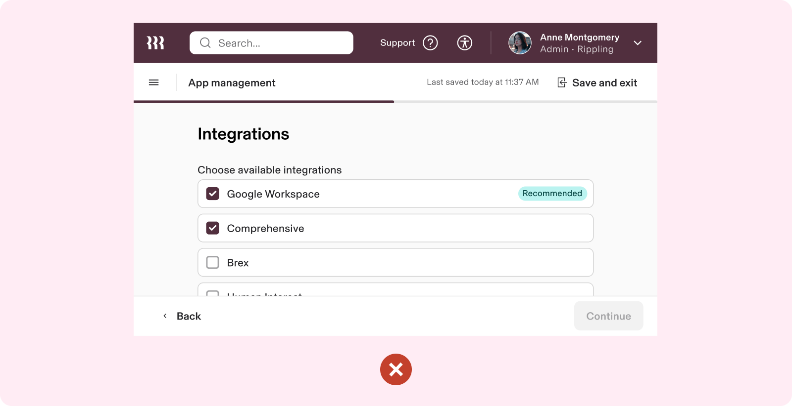

Do not disable buttons in a form

#### Alternatives and best practices

1.  **Dynamic UI updates**: update the UI dynamically to show or hide buttons based on user input rather than disabling them
    
2.  **Progressive disclosure**: reveal buttons or actions only when they become relevant or available, reducing the need for disabled states
    
3.  **Tooltips and helpers**: use tooltips or helper texts to provide guidance on why an action is not available and how to enable it
    

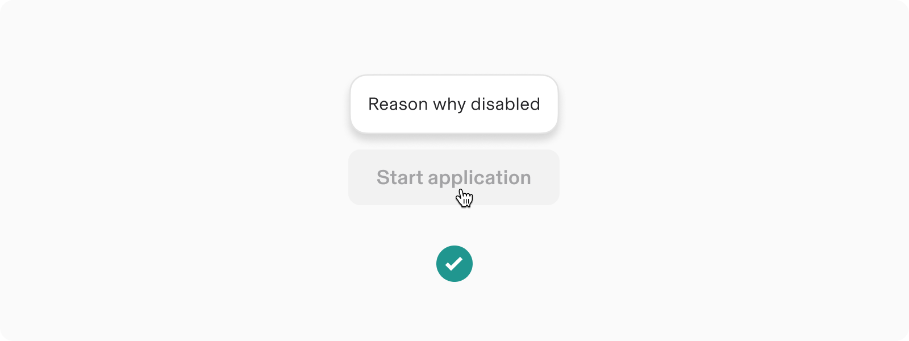

Tooltip on hover

### Buttons are for actions, links are for navigation

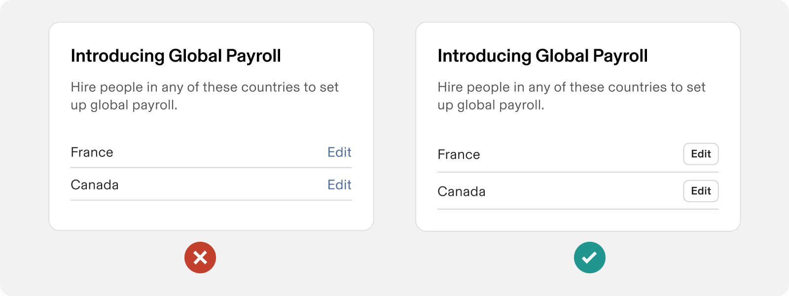

A link (or anchor element) should be used if clicking the element will navigate the user to a different page. Buttons are used for when the user wants to take an action.

note

This can be a difficult line to walk in context. A helpful qualifier is if the label suggests an action but navigating is a secondary effect of completing the action, opt for a button. If the primary goal is to guide the user to a different page, using a link is most likely the better option.

Another helpful qualifier is if the action requires being opened in a new tab or window with `Cmd + Click`, it will require a link. Buttons don’t support opening new tabs or windows in this way.

This can be a difficult line to walk in context. A helpful qualifier is if the label suggests an action but navigating is a secondary effect of completing the action, opt for a button. If the primary goal is to guide the user to a different page, using a link is most likely the better option.

Another helpful qualifier is if the action requires being opened in a new tab or window with `Cmd + Click`, it will require a link. Buttons don’t support opening new tabs or windows in this way.

## Content standards

### Writing effective button labels

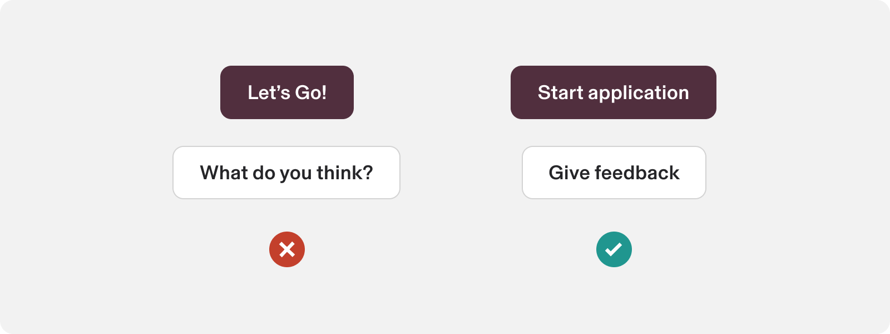

[Like all in-product content](https://rippling.atlassian.net/wiki/spaces/RDS/pages/3774153201/Guidelines#3.-Use-sentence-case-for-everything-except-branded-terms) at Rippling, button labels are written in sentence case and don’t use punctuation marks such as periods or exclamation points. Button text should be as concise as possible: ideally 1 or 2 words and no longer than 4. Avoid unnecessary words and articles such as “the,” “an,” or “a.” Don’t use the words “I” or “me” in buttons. 

### Lead with action in an active voice

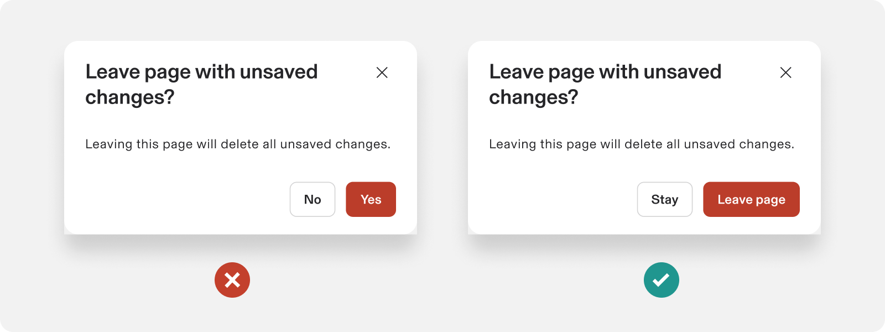

Buttons represent an action, and so leading button labels with a verb is a great way to keep them concise and [stay in active voice.](https://www.grammarly.com/blog/active-vs-passive-voice/) Labels written as nouns or adjectives are often unclear and ambiguous.

The verb should match the user’s mindset or what they’re supposed to be doing on the page/screen/modal. For example, if they’re installing a flow with multiple steps, use “Continue”. If the heading of the page/screen/modal is “Add people to Rippling”, then the button should be “Add people”.

# Accessibility

Users should be able to: 

-   Use a button to perform an action
    
-   Navigate to and activate a button with assistive technology
    

### Labeling

The accessibility label for a button ideally comes from the visible label text in the button.

### Keyboard Navigation

**Keys**

**Action**

Tab

Focus lands on the (non-disabled) button

Space / Enter

Activates the (non-disabled) button
