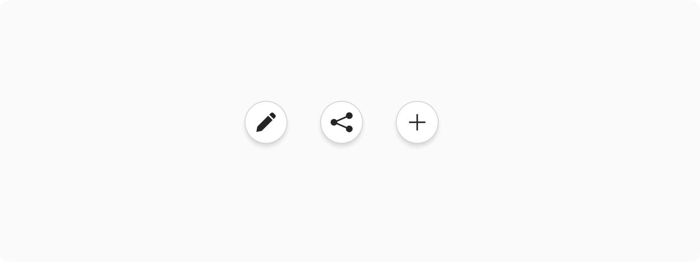
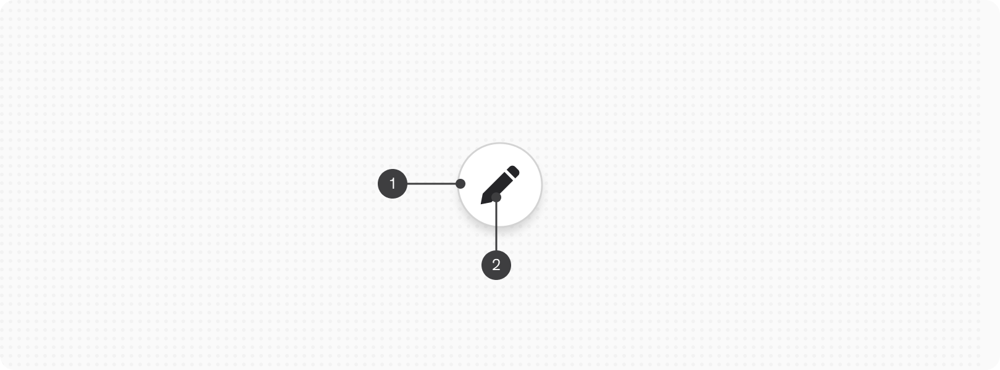
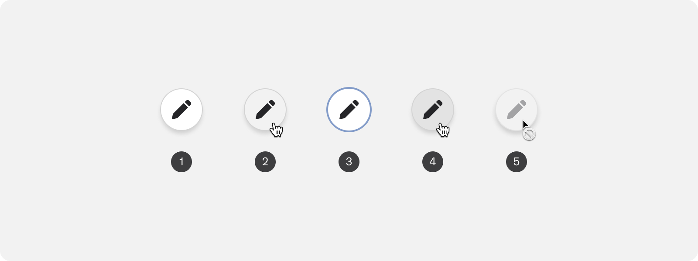
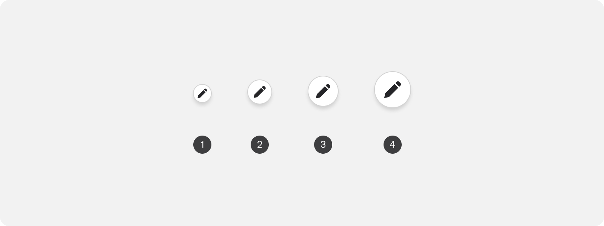
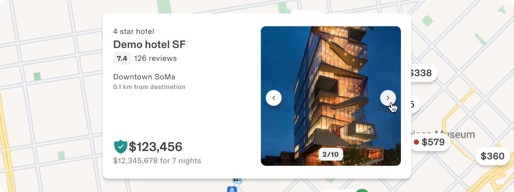
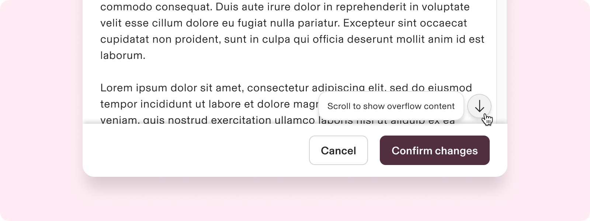
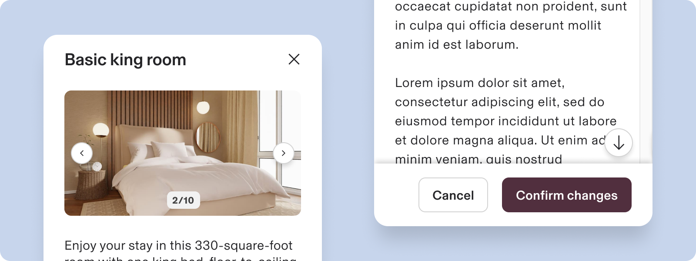
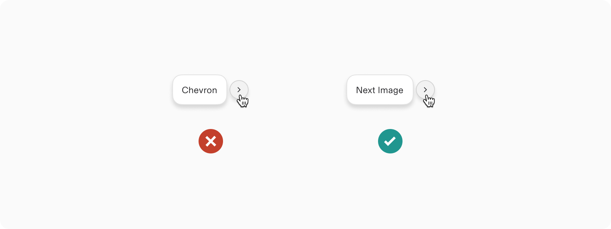

# Floating Button

**Source:** [View in Confluence](https://rippling.atlassian.net/wiki/spaces/RDS/pages/4535615950)  
**Last Synced:** 11/3/2025, 6:08:31 PM  
**Confluence Version:** 2

---

Floating Button highlights the main action on a screen, staying visible above other content.

---

# Overview

### Purpose

-   Highlights the primary or most common action on a screen.
    
-   Ensures the action is always visible for easy access.
    

### Design & behavior

-   Floats above content, remains visible while scrolling (as content scrolls underneath), and uses icons to convey actions.
    
-   Utilizes icons to convey actions, similar to an Icon Button .
    
-   It allows quick access to core actions and can trigger drop-down or modals when pressed.
    

## Resources

**Type**

**Resource**

**Status**

Design

[Web Resources (Figma)](https://www.figma.com/design/nhtRzieeGFf1tGVWnRxSK3/Web-Component-Library-\(v3\)?node-id=66677-250272&node-type=instance&t=uU1RTupM0zjyrXRU-11)

AvailableGreen

Implementation

[Web Component (Storybook)](https://rippling-pebble.vercel.app/?path=/docs/components-button-floating--docs)

AvailableGreen

---

# Specs

## Anatomy

1.  Container
    
2.  Icon
    

## Configuration

### States

1.  Default
    
2.  Hovered
    
3.  Focussed
    
4.  Pressed
    
5.  Disabled
    

### Size

1.  **xs**: Extra small (24px height)
    
2.  **sm**: Small (32px height)
    
3.  **md**: Medium (40px height)
    
4.  **lg**: Large (default) (48px height)
    

---

# Usage

### When to use

-   For highlighting a screen's high-emphasis action that must remain constantly visible.
    
-   Suitable for actions on the current screen, opening a new screen, or completing tasks via modals or popovers.
    
-   Ideal for key tasks like: creating, favoriting, sharing, or starting a process.
    

### When to use something else

-   Use a regular button with text and an icon for critical actions needing more context.
    
-   Opt for display icons when no action is needed.
    
-   Avoid the Floating Button if constant visibility isn't required.
    
-   Maintain visual hierarchy by not using multiple extended Floating Buttons on a screen.
    
-   Do not replace established navigation patterns with a Floating Button.
    
-   Avoid using the Floating Button for non-destructive actions.
    

## Guidelines

### Context with tooltip

Floating button necessitates a tooltip on hover.

> _Tooltip offers users supplementary context regarding the action being performed._

### Placement

-   Floating button should remain in the same spot of the screen for better discoverability.
    
-   Usually, only one floating button should be present on the screen for page level actions.
    
-   The floating button should be at the bottom of the screen (aligned with the edge. ) or center-aligned.
    

> For RTL languages, floating button should be right-aligned; for LTR languages, its left-aligned.

## Content standards

-   **DO:** Use a descriptive label starting with a verb to convey the Floating button's purpose effectively.
    
-   **DON’T:** Use descriptive verbs in labels instead of "image" or "icon." Choose words like "Save" or "Edit" that clearly convey the action.
    

### Localisation

Since, floating buttons allow tooltip, ensure that all text strings are properly localised.

> _Keep in mind that localisation may increase the length of the text by 20 to 30 percent._

---

# Accessibility

### Users should be able to:

To navigate and activate the floating button using assistive technology, follow these steps:

1.  **Navigate to the floating button**: Use your assistive tech to locate the floating button on the screen.
    
2.  **Activate the floating button**: Perform the designated action associated with the floating button.
    
3.  **Expand and Minimize the Extended FAB**: Use the appropriate commands to expand or minimize the extended options of the FAB as needed.
    

### Focus - behaviour

-   Ensure the Floating Button is prioritised in the focus order for efficient navigation with assistive technology.
    
-   In a mobile app, the focus should start at the top app bar, move to the navigation bar, and then directly to the floating button, skipping other content. Also, display a tooltip when the FAB is focused.
    

> _Floating button should be contained within the role="contentinfo" container on a page._
> 
> _This gives screen reader users the ability to skip any main content and go directly to the action buttons using the rotor._

### Labeling Elements

Since Floating Buttons lacks visible text, the accessibility label must clearly indicate the button's action.  
For example, a floating button with an arrow icon could be labeled "Scroll to see overflow content"

### Keyboard Interaction

**Keys**

**Action**

Tab

Focus lands on (non-disabled) floating button

Space / Enter

Perform the default action on an item
