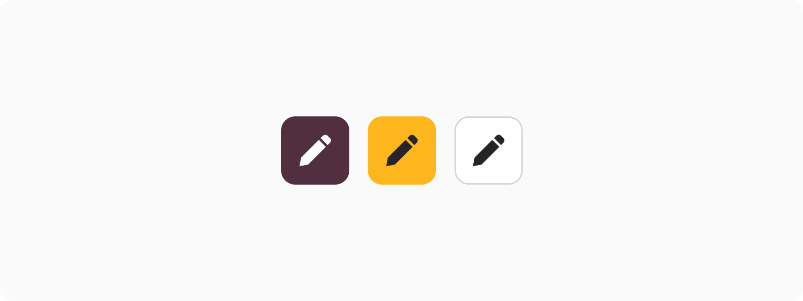
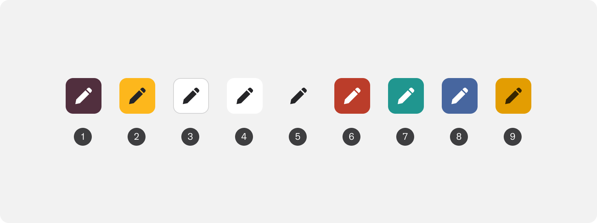
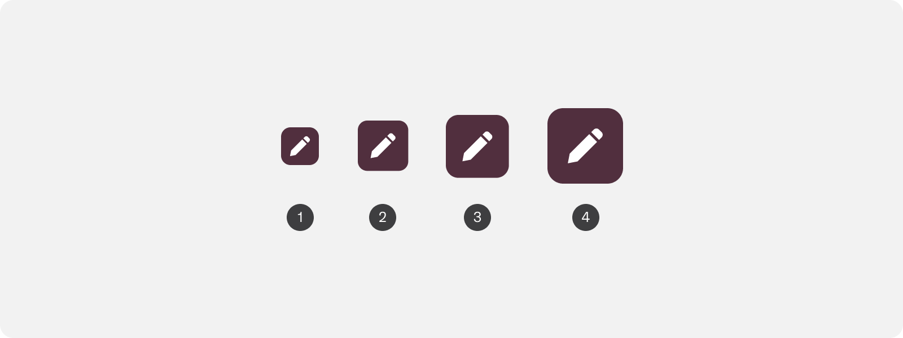
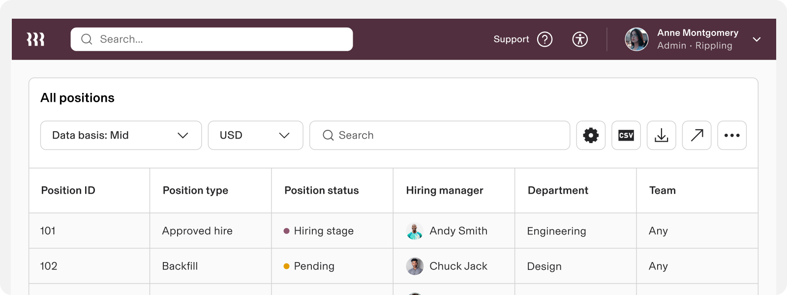
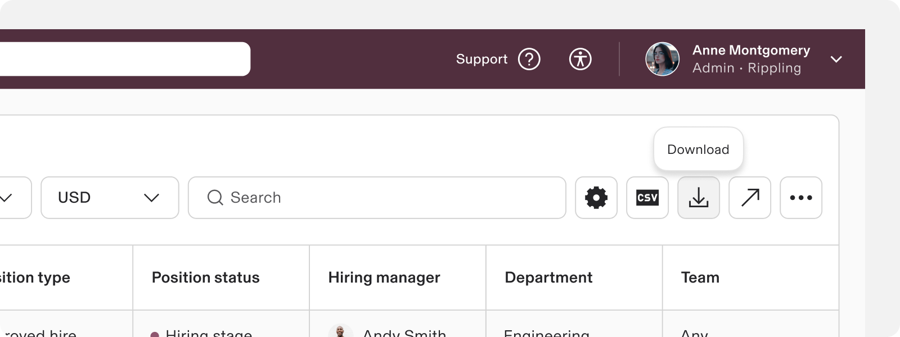
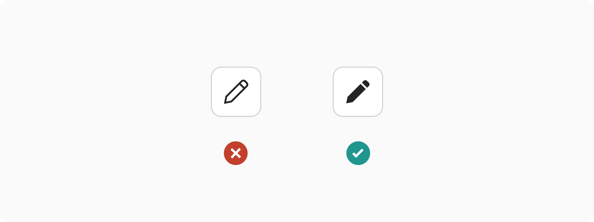

# Icon Button

**Source:** [View in Confluence](https://rippling.atlassian.net/wiki/spaces/RDS/pages/3957097697)  
**Last Synced:** 11/3/2025, 6:08:27 PM  
**Confluence Version:** 11

---

A simple interactive element for repeated, common, or persistent actions when screen real estate is limited.

---

# Overview

-   Exclusively for button applications that leverage an icon only
    
-   Ideal for direct access to common actions like search, refresh, or navigation
    
-   Identical sizing and appearance configurations of a typical button component
    

## Resources

**Type**

**Resource**

**Status**

Design

[Web Resources (Figma)](https://www.figma.com/file/ysWbTtfWqhVDHQd1Mg2LQ1/Component-Library-v2?type=design&node-id=1046-1210&mode=design)

AvailableGreen

Implementation

Web Component (Storybook)

PlannedYellow

---

# Specs

## Anatomy

1.  Container
    
2.  Icon
    

## Configuration

### Appearance

Button Appearancestrue

### Size

1.  Extra small (24px height)
    
2.  Small (32px height)
    
3.  Medium (40px height)
    
4.  Large (default) (48px height)
    

---

# Usage

### When to use

-   Ideal for common and standardized actions with well-known icons
    
-   Ideal for multiple equally important actions when space is limited or placement across the product experience is consistent
    

### When to use something else

-   If this action is critical or requires more context, consider using a regular button or a button with both text and an icon
    
-   Displaying icons that don't have actions associated with them. Use a display icon instead.
    

## Guidelines

Ensure that icon buttons come with tooltips that clearly explain their function, rather than describing the icon itself. This practice enhances the button's accessibility and clarity without sacrificing screen space or usability. Tooltips are effective in minimizing confusion and enhancing user accessibility at no extra expense.

### Use filled icons

Filled icons usually work better inside buttons especially in small sizes. If a button is small it’s harder to distinguish outlined icon compared to it’s filled counterpart.

---

# Accessibility

Users should be able to: 

-   Understand meaning of the icon and the action the button invokes
    
-   Navigate to and activate an icon button with assistive technology
    

### Labeling

The accessibility labels for icon buttons should describe the action that the button is executing. Icon buttons must include an aria-label.

### Keyboard Navigation

**Keys**

**Action**

Tab

Focus lands on (non-disabled) icon button

Space / Enter

Activates the (non-disabled) icon button
