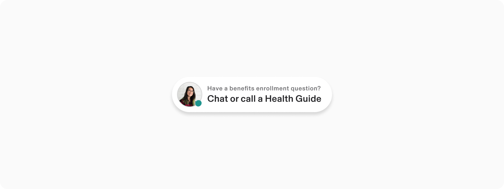
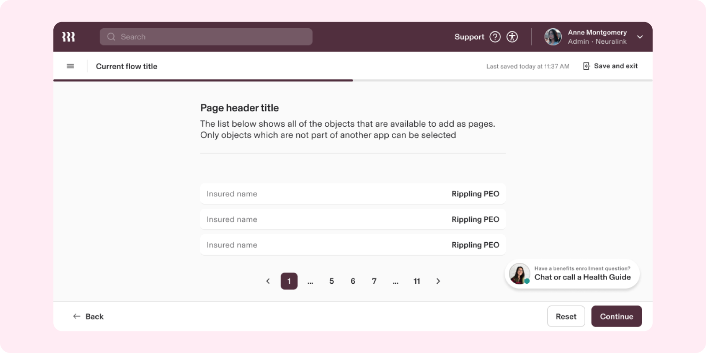
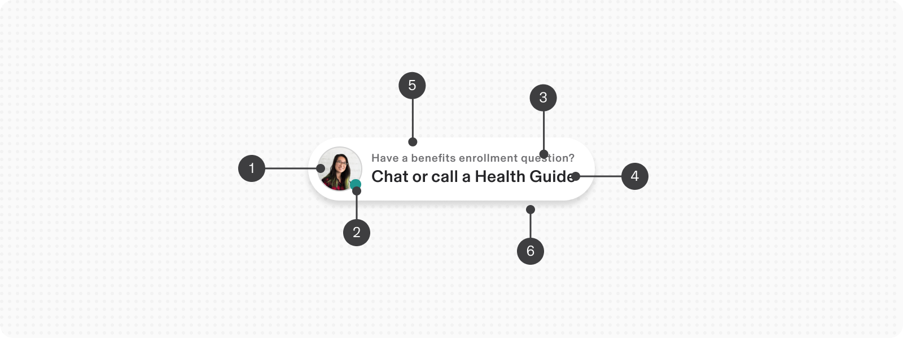
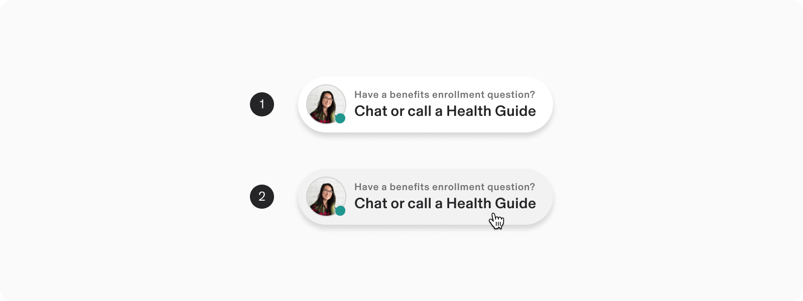
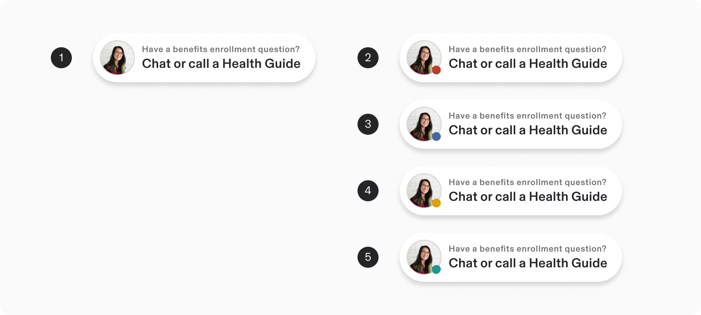
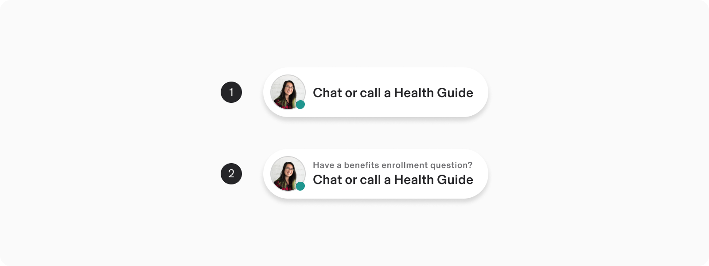
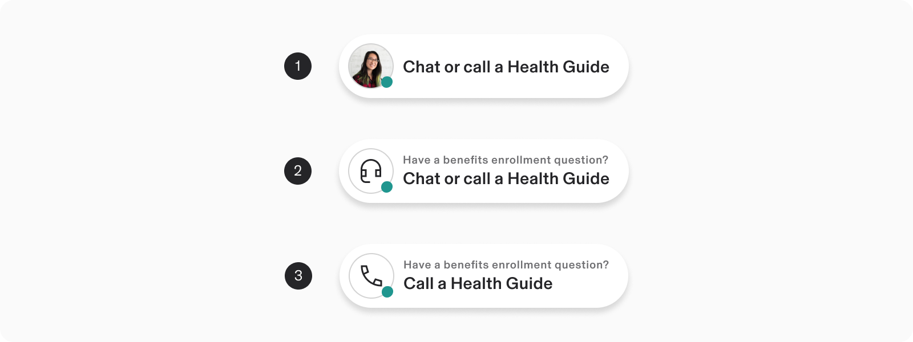
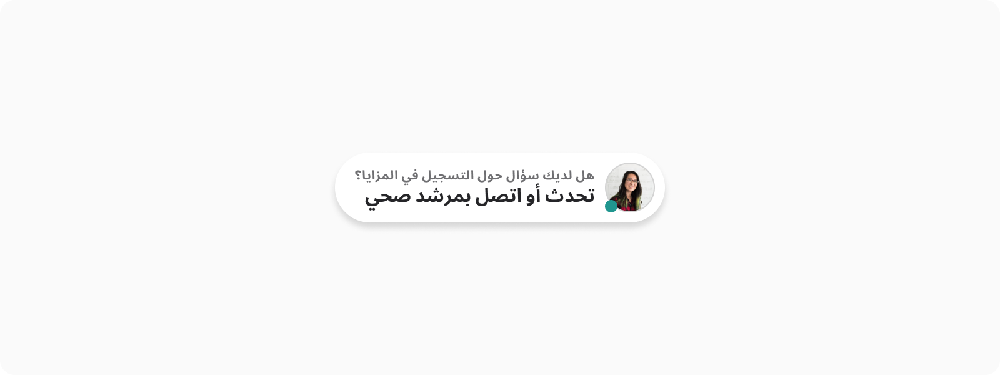

# Support button

**Source:** [View in Confluence](https://rippling.atlassian.net/wiki/spaces/RDS/pages/4819714115)  
**Last Synced:** 11/3/2025, 6:08:35 PM  
**Confluence Version:** 18

---

Support Button component is dedicated to be used for customer support on your product.

Support Button component is dedicated to be used for customer support on your product.

[Figma](https://www.figma.com/design/nhtRzieeGFf1tGVWnRxSK3/Web-Component-Library-\(v3\)?node-id=66676-180494&t=ikx0ODXeaQ2lxi5R-11) | [Storybook](https://pebble.ripplinginternal.com/?path=/docs/components-button-button-support--docs)

---

# Overview

-   The Support Button component is designed to facilitate customer support interactions within your product.
    
-   It serves as a direct link to assistance, ensuring users can easily access help when needed.
    

---

# Usage

### When to Use:

-   Utilize the Support Button to provide users with immediate access to customer support resources.
    
-   Ideal for applications where user guidance or chat/call with customer executive is frequently required.
    

### When to Use Something Else:

-   Consider using a regular button if the action is not specifically related to support but requires visibility.
    
-   Use a Floating Action Button for actions that must remain visible and accessible throughout the user journey.
    

---

# Specs

## Anatomy

1.  Graphic (Avatar / Icon)
    
2.  Status (indicator)
    
3.  Secondary text (optional)
    
4.  Body text
    
5.  Container
    
6.  Shadow
    

## Configuration

### States

1.  Default
    
2.  Hover
    

### Status indicator

1.  No Status
    
2.  Status - Error
    
3.  Status - Info
    
4.  Status - Warning
    
5.  Status - Success
    

### Text

1.  Body text (default)
    
2.  Secondary text (optional)
    

### Graphic

1.  Avatar
    
2.  Icon (default)
    
3.  Icon - customised
    

---

# Guidelines

### Alignment and placement

-   Position the Support Button prominently to ensure users can easily find it in moments of need.
    
-   Support button should ideally be aligned to bottom right edge of the screen.
    

## Content Guidelines

-   Ensure the button label clearly conveys its purpose, such as: “Call”, “Chat”, "Help" or "Support."
    
-   Use concise, action-oriented text that encourages users to seek support.
    
-   Ensure any icons used alongside text are intuitive and universally recognizable.
    

## Internationalisation

-   Adapt the button layout for RTL languages by aligning text and icons appropriately.
    
-   Localise all text to ensure clarity across different languages and regions.
    

---

# Accessibility

-   Provide ARIA labels to describe the button's function for users utilizing screen readers.
    
-   Ensure the button is navigable and operable using assistive technologies.
    

### Keyboard Navigation

**Keys**

**Action**

Tab

Focus lands on support button

Space / Enter

Activates the button and initiate support either of the interactions:

-   Open Modal
    
-   Trigger Pop up
