# Cards

**Source:** [View in Confluence](https://rippling.atlassian.net/wiki/spaces/RDS/pages/4742447931)  
**Last Synced:** 11/3/2025, 6:08:42 PM  
**Confluence Version:** 19

---

Cards visually organise related content effective page layouts.

---

### Variants

**Type**

**Use-case**

[Basic Card](https://rippling.atlassian.net/wiki/spaces/RDS/pages/edit-v2/4742447931#Overview)

Visually groups related information and components.

[Card Layout](https://rippling.atlassian.net/wiki/spaces/RDS/pages/edit-v2/4742447931#Card-Layout)

Standard container for creating card-based layouts on a page.

[Action Card](https://rippling.atlassian.net/wiki/spaces/RDS/pages/edit-v2/4742447931#Action-Card)

Placeholder for states like empty, success, error, and loading, featuring animations, icons, text, and buttons.

---

# Basic Card

Introduction

An interactive, compact element designed to represent entities, characteristics, or criteria clearly and user-friendly.

[Figma](https://www.figma.com/design/nhtRzieeGFf1tGVWnRxSK3/Web-Component-Library-\(v3\)?node-id=66809-105595&t=EmcqviXXqcUeZiYj-11) | [Storybook](https://pebble.ripplinginternal.com/?path=/docs/components-card-basiccard--docs)

---

# Overview

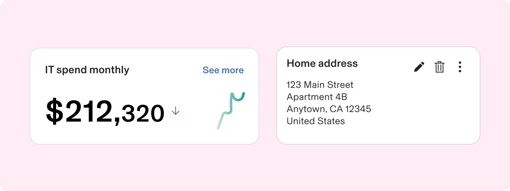

-   Cards are versatile components that can accommodate a variety of content, including images, headlines, supporting text, and buttons.
    
-   Cards can be utilized to summarize information, facilitate comparisons, and emphasize specific content.
    
-   They can also contain other components.
    
-   Cards feature flexible layouts and dimensions, allowing for diverse content combinations.
    
-   This enhances user experience by making content easier to digest.
    

---

# Usage

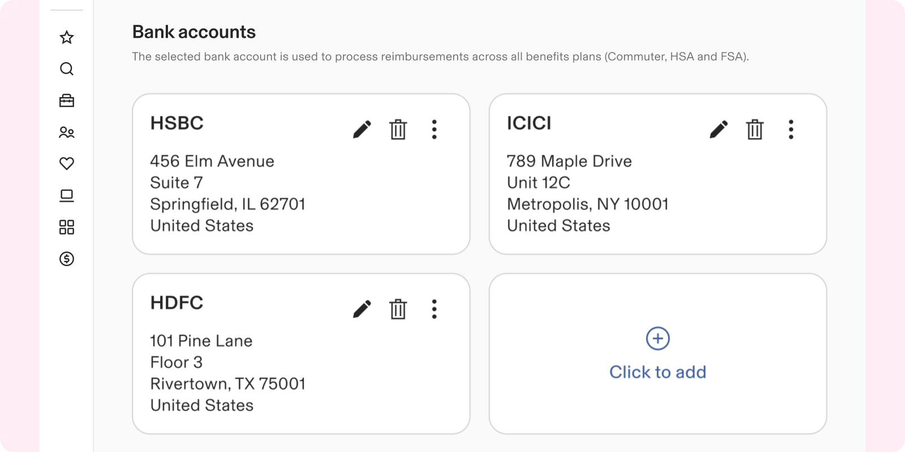

### When to use

-   Cards are flexible components for creating cards and modules, organizing related information in adjustable containers.
    
-   Here are typical situations where cards are advantageous:
    
    -   To group related information or actions
        
    -   To guide users towards specific actions or navigation
        
    -   To provide options for single or multiple selections
        
    -   To control the visibility of extensive content
        

### When to use something else

-   When a user needs to navigate to another page, section, or open a link in a new tab, using a **link** is preferable to a card.
    
-   When a group of related information is to be presented in a scannable format use a List instead of a card.
    
-   Use a table instead of a card, to presents intricate sets of information for the aim of reference, comparison, or selection.
    
-   For high-priority information that requires the user's immediate attention, it is recommended to use a Modal instead of cards.
    
-   Avoid using card containers for unrelated content or page layout. If content doesn't fit a segmented design or requires too much scrolling, consider other UI components.
    

---

# Specs

## Anatomy

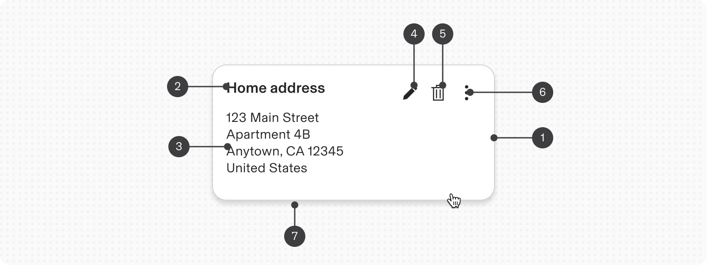

1.  Container
    
2.  Title
    
3.  Body text
    
4.  Primary Action
    
5.  Secondary Action
    
6.  Overflow Menu (Actions)
    
7.  Elevation / Shadow
    

## Configuration

### State

-   By default, a card features a visible border and background color to differentiate its contents from the surrounding interface.
    
-   Cards offer a visual boundary around the container, providing greater emphasis compared to other content on the page.
    
-   Cards also use ‘elevation’ which incorporate a drop shadow for enhanced separation from the background. to show change in state.
    

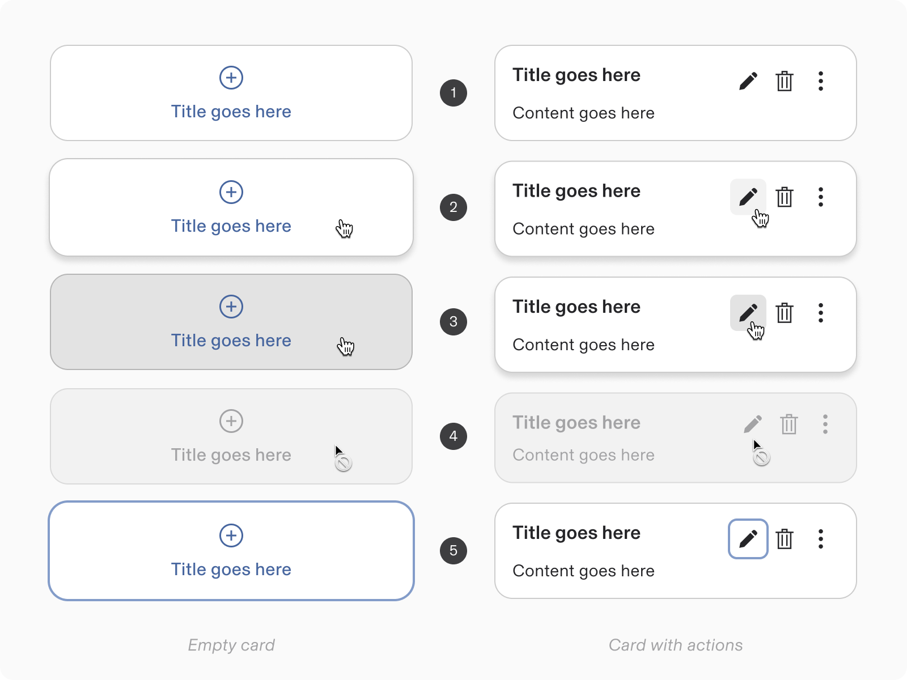

1.  Default
    
2.  Hover
    
3.  Pressed
    
4.  Disabled
    
5.  Focussed
    

### Content

Card has variants which may incorporate icons, or media to guide user with initiating an action.

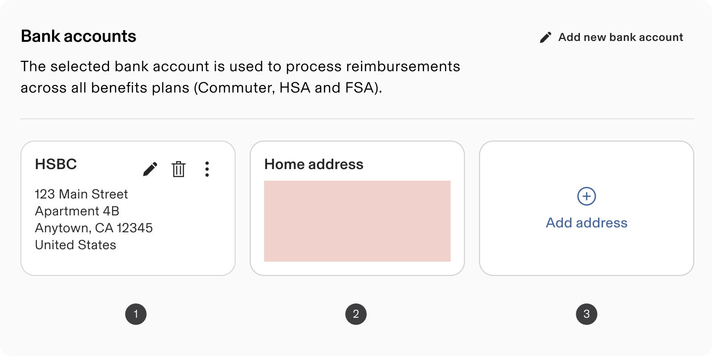

#### 1\. Card - with Actions

-   **Actions:** Cards can have icon buttons for actions like Edit or Delete, aligned to the upper right edge.
    
    -   Actions should not be placed if the entire card’s surface is clickable.
        
    -   The CTA should have its own click target.
        
-   **Overflow Menus:** Contains related actions and are typically in the upper-right corner of a card.
    

#### 2\. Card - with Custom JSX

The custom JSX can be configured appropriately based on the use case.

#### 3\. Card - Empty Card

-   When there is no clear primary action present, the entire card surface can act as a button.
    
    -   Entire card clickable
        
    -   When the whole card is interactive, for accessibility reasons, they should not include separate internal calls to action (CTAs).
        
-   Users can click the card to initiate a configured event.
    

### Title

1.  **With Title:** Cards must always feature a title.
    
2.  **Without Title:** However, cards can forgo a title if they contain only an image or are used for self-explanatory purposes.
    

### **Selection controls**

-   Cards support single or multi-selection modes.
    
-   Selectable cards can be selected by clicking anywhere in their container.
    
-   Actions (icon buttons) for single-select and multi-select cards are updated to radio buttons and checkboxes.
    

#### 1\. Single Select

Allows selection of 1 item.

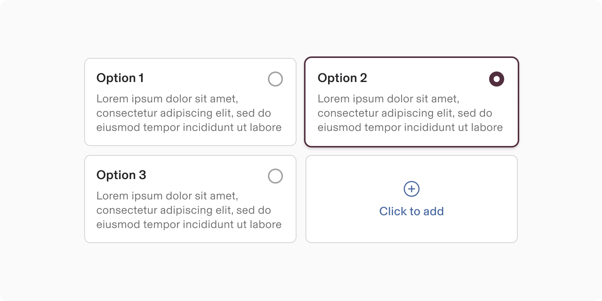

#### 2\. Multi Select

Allows multiple selections.

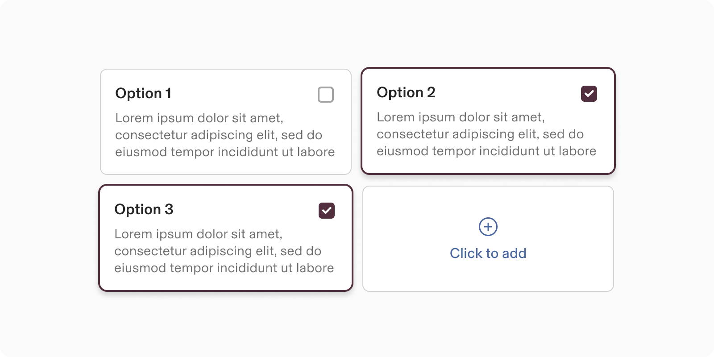

### Size

-   Overall, card sizes are flexible for diverse content needs.
    
    -   Card **width** is based on the layout grid and user’s discretion.
        
    -   Card **height** depends on the content with-in.
        
-   Elements are aligned left, except for 'empty cards' which center-aligned content content.
    

---

# Guidelines

### Layout

Cards can be displayed together in a grid, vertical list, or carousel.

## Content guidelines

-   Cards should present concise, actionable information.
    
-   Aim to encourage user engagement through direct actions or links for more details.
    
-   Content must be brief and focused on prompting action due to limited real estate.
    
-   Design cards for easy scanning.
    
-   Establish a clear hierarchy through the arrangement of text and images.
    

## Internationalisation

When the display changes to a right-to-left (RTL) language, the content reverses and aligns with the right side of the card.

---

# Accessibility

### Aria Attributes:

It is essential to include meaningful `aria-label`, `aria-describedby`, and `aria-labelledby` attributes whenever necessary, particularly for selectable cards.

### Focus order in cards

Cards manage focus in different ways to meet experience needs. Using the `focusMode` prop, you can set a card's focus behavior and its actions.

Value

Description

`off`

The actions in the card will be focusable but the card container won’t receive or manage focus

`no-tab`

The card will be focusable and trap focus inside it. Tab cycles through the card actions. ESC exits the card

`tab-exit`

The card will be focusable and trap focus inside it. Tab and ESC exit the card

`tab-only`

The card will be focusable but won’t trap focus

## Keyboard Navigation

Keys

Action

Tab

Move to the next actionable element

-   **Directly actionable cards:** Move to next card container
    
-   **Non-actionable cards with actionable elements:** Move to next actionable element
    

Space or Enter

Confirm action

---

# **Card Layout**

Card Layout is used as a consistent card container to create card-based layouts on a page.

Card Layout is used as a consistent card container to create card-based layouts on a page.

[Figma](https://www.figma.com/design/nhtRzieeGFf1tGVWnRxSK3/Web-Component-Library-\(v3\)?node-id=67080-75189&t=EmcqviXXqcUeZiYj-11) | [Storybook](https://pebble.ripplinginternal.com/?path=/docs/components-card-layout--docs)

---

# Overview

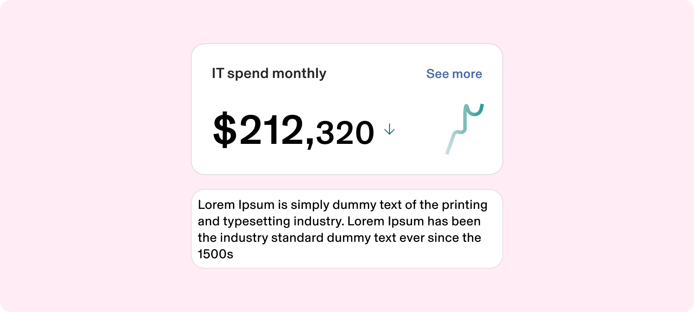

Card Layout is used as a consistent card container to create card-based layouts on a page.

Card Layout serves as a uniform card container for developing card-based designs on a page.

This component can be applied with adjustable padding, enabling modifications from 0 to 32px on all sides, offering versatility in spacing to accommodate various design requirements.

note

This section highlights the unique differences and changes related to this component.  
Most styling, behavior, and functionality come from the Card component.  
[Explore the Card Configuration](https://rippling.atlassian.net/wiki/spaces/RDS/pages/edit-v2/4742447931?draftShareId=df520c70-4c97-42e7-b106-a6731922cfd1#Configuration)

This section highlights the unique differences and changes related to this component.  
Most styling, behavior, and functionality come from the Card component.  
[Explore the Card Configuration](https://rippling.atlassian.net/wiki/spaces/RDS/pages/edit-v2/4742447931?draftShareId=df520c70-4c97-42e7-b106-a6731922cfd1#Configuration)

---

# Specs

## Anatomy

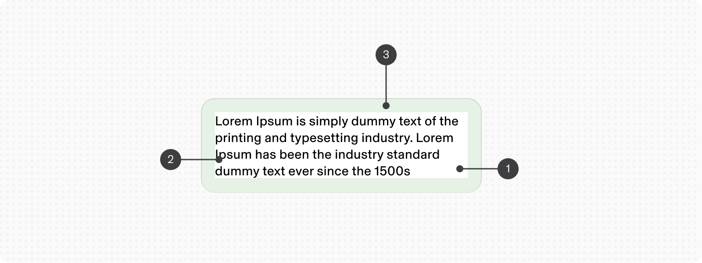

1.  Container
    
2.  Body text
    
3.  Padding
    

## Configuration

### Padding

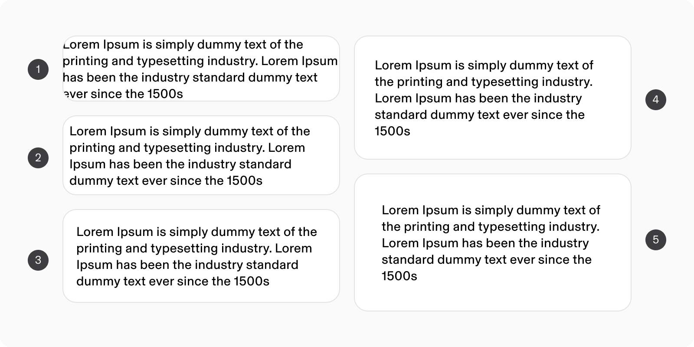

1.  padding - 0px
    
2.  padding - 8px
    
3.  padding - 16px
    
4.  padding - 24px
    
5.  padding - 32px
    

### Content

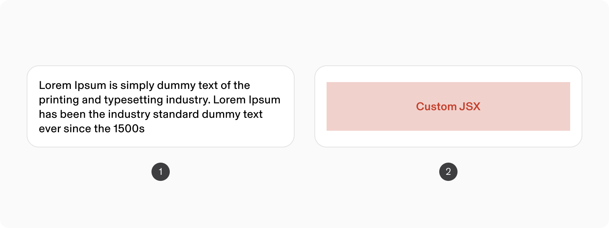

1.  Body text
    
2.  Custom JSX
    

---

# **Action Card**

ActionCard is usually used as a placeholder for empty, success, error and loading states. It can render animation or icon on top as well as text content and buttons at the bottom.

[Figma](https://www.figma.com/design/nhtRzieeGFf1tGVWnRxSK3/Web-Component-Library-\(v3\)?node-id=66809-104699&t=EmcqviXXqcUeZiYj-11) [|](https://pebble.ripplinginternal.com/?path=/docs/components-miscellaneous-notice--docs) [Storybook](https://pebble.ripplinginternal.com/?path=/docs/components-actioncard--docs)

---

# Overview

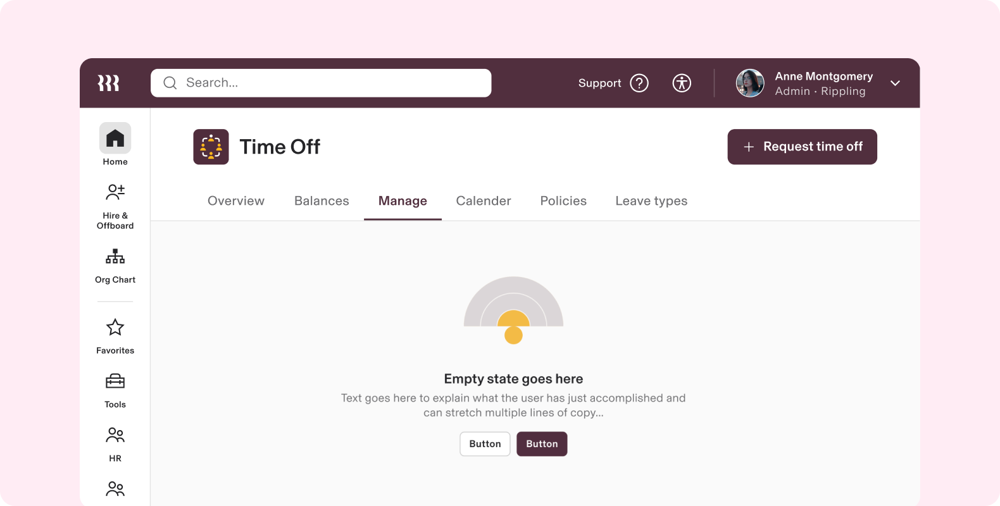

Action Card is usually used as a placeholder for empty, success, error and loading states. It can render animation or icon on top as well as text content and buttons at the bottom.

note

This section highlights the unique differences and changes related to this component.  
Most styling, behavior, and functionality come from the Card component.  
[Explore the Card Configuration](https://rippling.atlassian.net/wiki/spaces/RDS/pages/edit-v2/4742447931?draftShareId=df520c70-4c97-42e7-b106-a6731922cfd1#Configuration)

This section highlights the unique differences and changes related to this component.  
Most styling, behavior, and functionality come from the Card component.  
[Explore the Card Configuration](https://rippling.atlassian.net/wiki/spaces/RDS/pages/edit-v2/4742447931?draftShareId=df520c70-4c97-42e7-b106-a6731922cfd1#Configuration)

---

# Specs

## Anatomy

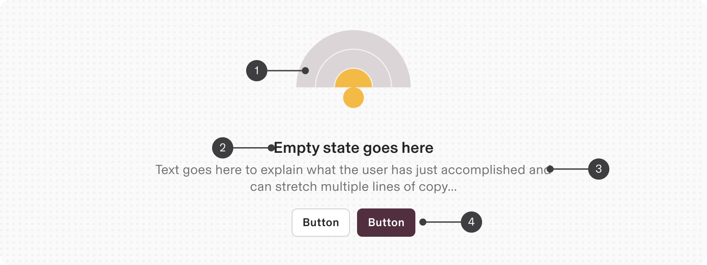

1.  Graphic Asset (Animation or Icon)
    
2.  Title
    
3.  Description
    
4.  Actions (optional)
    

## Configuration

### Alignment

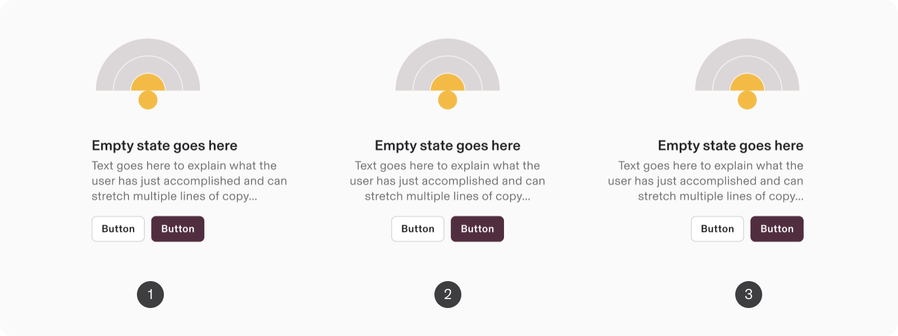

1.  Left
    
2.  Center
    
3.  Right
    

### Content Types

Only one of icon or animation should be supplied.

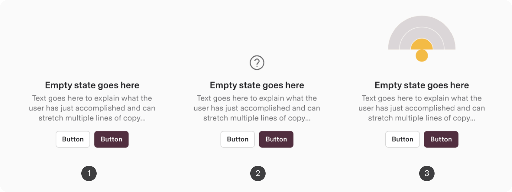

1.  No asset
    
2.  With Icon
    
3.  With Animation
    

### Actions

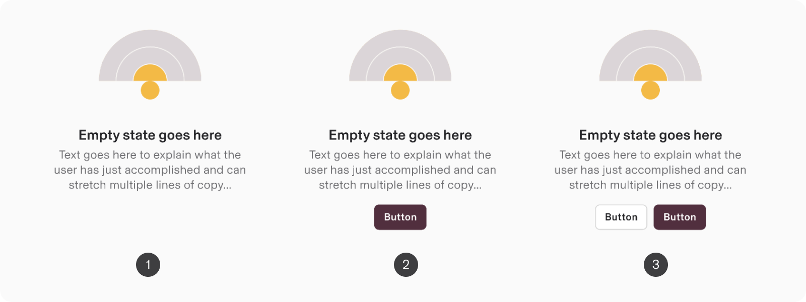

1.  No actions
    
2.  One Action (Either: primary or secondary)
    
3.  Two Actions (Both: primary & secondary)
