# Checklist component

**Source:** [View in Confluence](https://rippling.atlassian.net/wiki/spaces/RDS/pages/4759322864)  
**Last Synced:** 11/3/2025, 6:08:48 PM  
**Confluence Version:** 9

---

A nested list component with multi-select options

[Figma](https://www.figma.com/design/nhtRzieeGFf1tGVWnRxSK3/Web-Component-Library-\(v3\)?node-id=66583-300060) [Storybook](https://pebble.ripplinginternal.com/?path=/docs/components-list-checklist--docs)

---

# Overview

The Checklist component provides a flexible multi-select interface that seamlessly integrates nested lists. Users can efficiently toggle their selections using switches or checkboxes. Additionally, each level of the list can be expanded to reveal more checklist items.

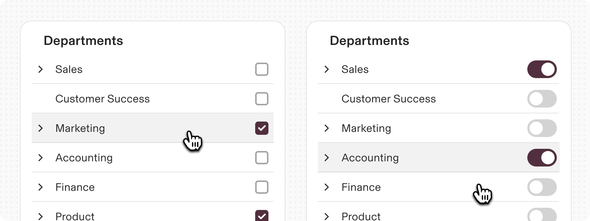

---

# Usage

## When to use

1.  **Multiple Selections:**
    
    1.  Use when users need to select more than one option from a list.
        
    2.  Ideal for settings where multiple configurations can be enabled simultaneously.
        
2.  **Hierarchical Options:**
    
    1.  Suitable for organizing complex options that have parent-child relationships.
        
    2.  Use ‘children’ to group related nested options for better clarity and organization.
        
3.  **Toggle Actions:** Use switches for actions that require an on/off state, such as enabling or disabling features.
    

## When not to use

1.  **Single Selection:** Avoid using if only one option can be chosen; consider using radio buttons or a dropdown instead.
    
2.  **Simple Lists:** If the list does not require multiple selections or nesting, simpler UI components might be more efficient.
    
3.  **Non-Interactive Lists:** Do not use if the list items do not require user interaction. Consider a simple list or text display.
    

## Interactions

-   **Expanding/Collapsing:** Clicking the arrow expands or collapses nested lists row.
    
-   **Toggle Feedback:** Immediate visual feedback upon toggling switches or checkboxes.
    

---

# Specs

## Anatomy

1.  **Title:** Positioned at the top, providing context for the list.
    
2.  **Expandable Arrows:** Indicate the presence of nested items.
    
3.  **List item title:** Shows the title content of the item
    
4.  **Switches/Checkboxes:** Placed to the right of list items for toggling.
    
5.  **Show more:** in case of multiple expandable rows
    

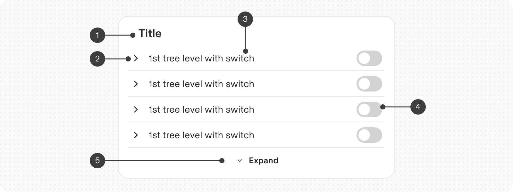

## States

**Type**

**Purpose**

**Visual representation**

Default

Shows the default state of a checklist item

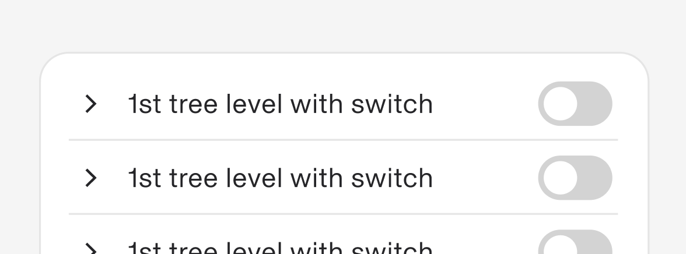

Hover

When a user’s mouse cursor is hovering over a checklist item

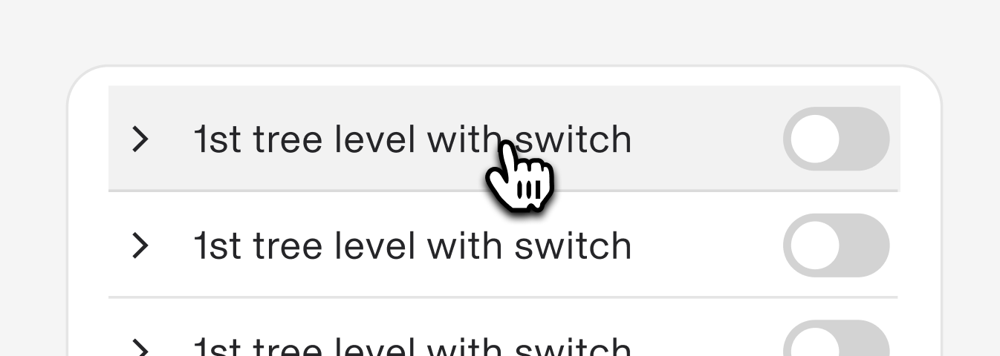

Focus

When a user intent is focused on the checklist item

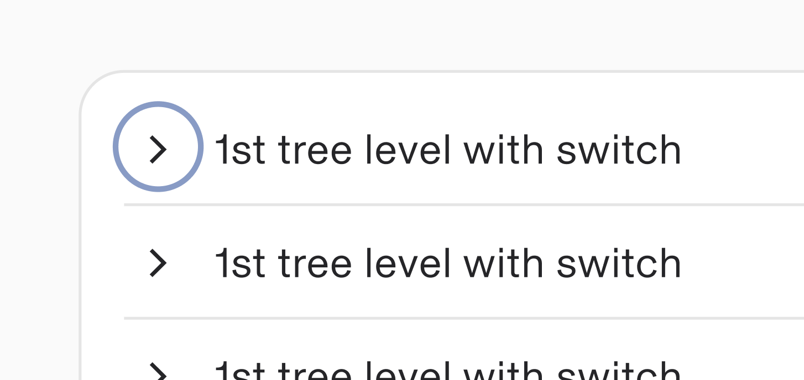

Expanded

When a user clicks on the checklist item, it expands to show the child content

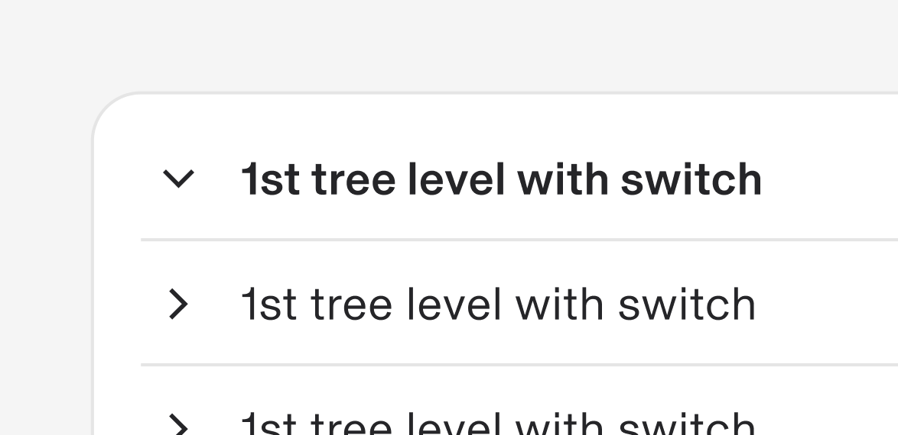

Disabled

When the checklist item is disabled from access

## Variants

**Type**

**Purpose**

**Visual representation**

Toggle

Use when toggle buttons are needed for your use-case where On/Off functionality is needed. for ex. to start showing information to a particular department or sub-department.

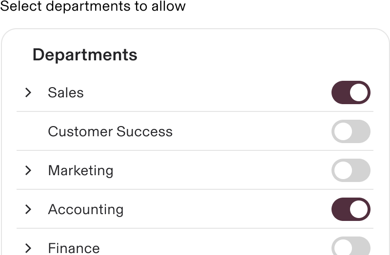

Checkbox

Use when checkboxes are needed for your use-case where multi-select functionality is needed. for ex. to select send a message to a 2-3 department members. May require a CTA to confirm final selection.

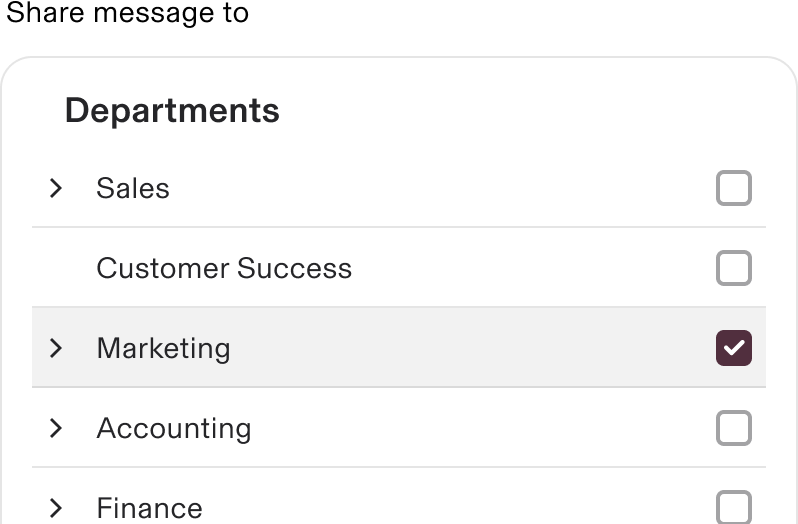

Not expandable (Default)

Use when the list items are not expandable

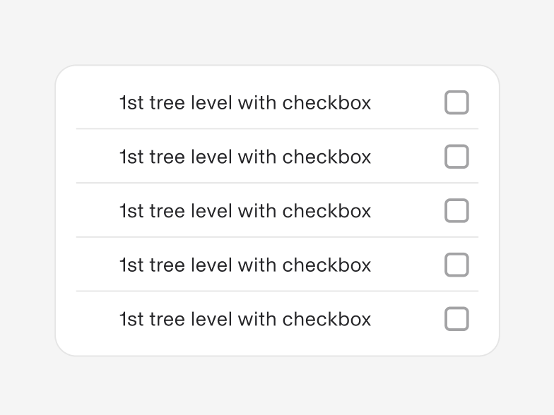

with Title

This component also comes with title to be used as a card section in dashboards

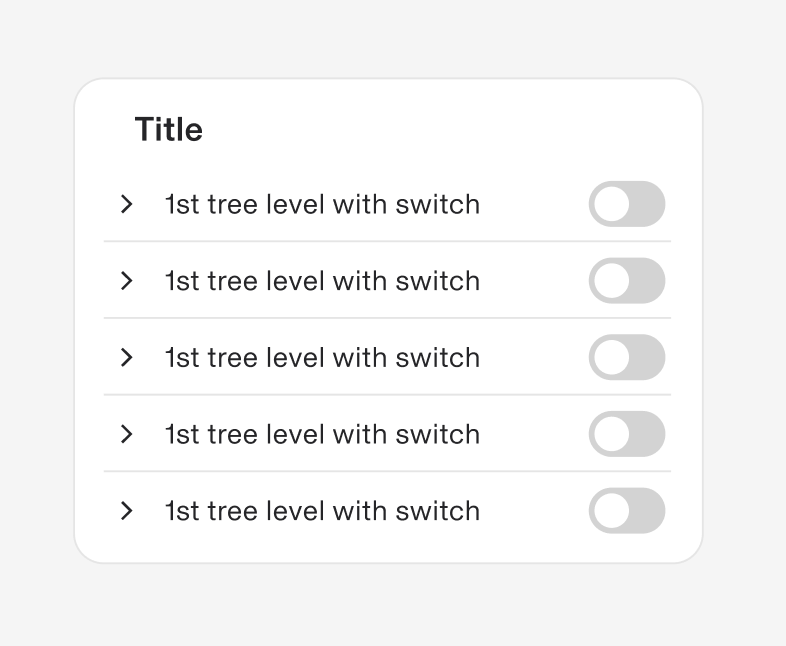

with ‘Expand/Show all’ button

If the content is more and the space to show it is less

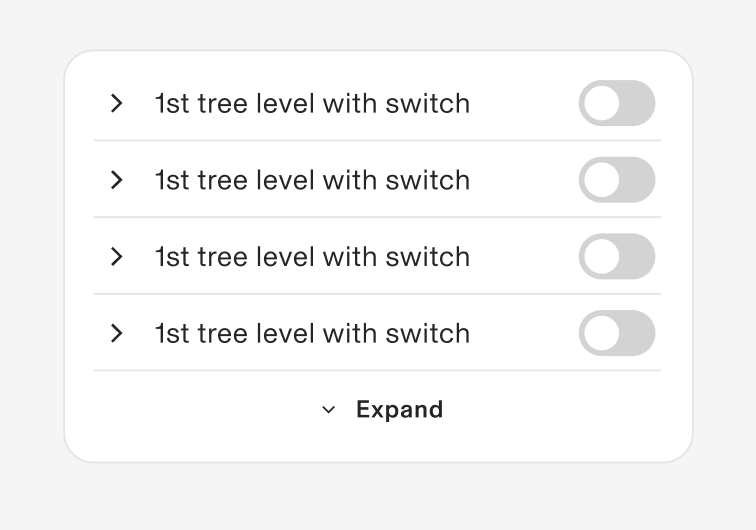

with children

Used to show nested list items

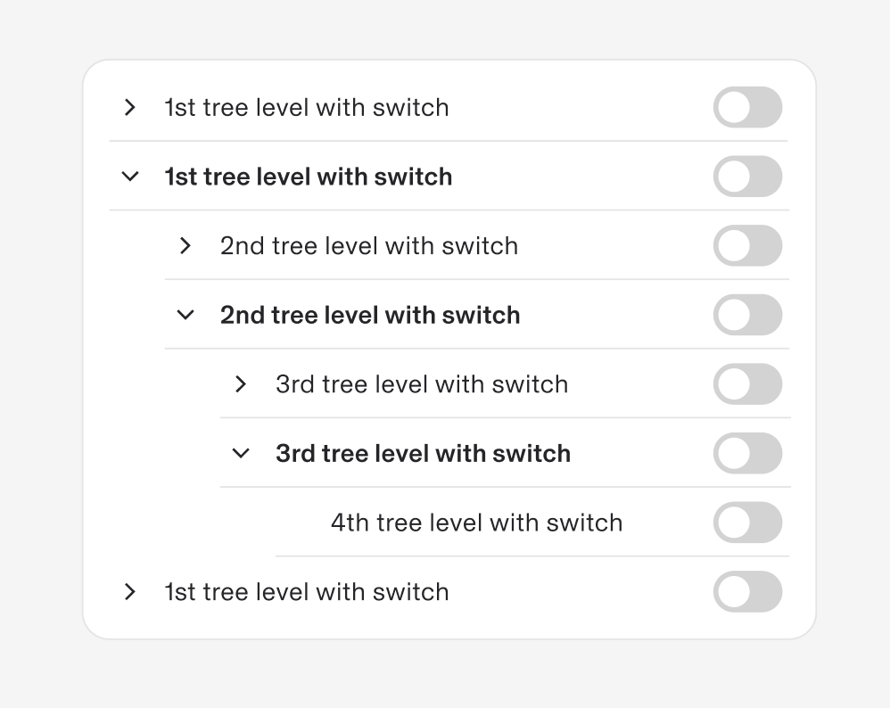

with ‘Select All’

Used to provide select all functionality for the list

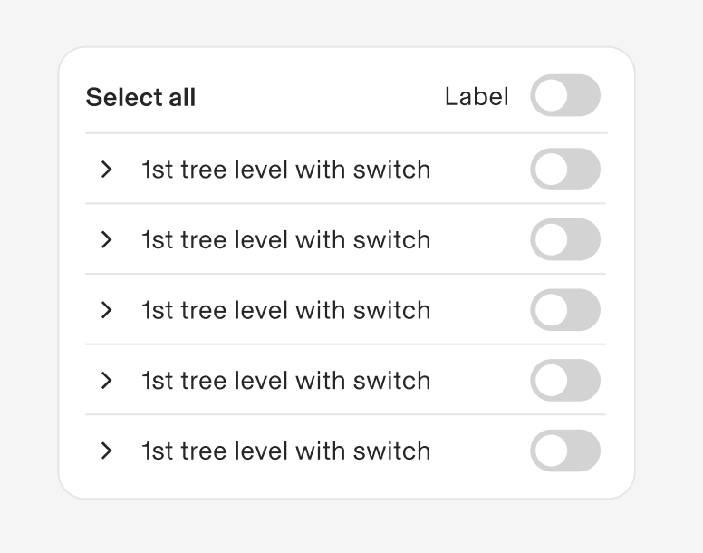

# Content guidelines

-   **Titles:** Keep them concise and descriptive.
    
-   **Item Labels:** Use clear, specific language to describe each option.
    
-   **Hierarchy:** Use indentation and alignment to reflect the relationship between parent and child items. Avoid over-nesting, which can complicate navigation and selection.
    

## Accessibility

This will follow expandable panel and checkbox accessibility rules.
