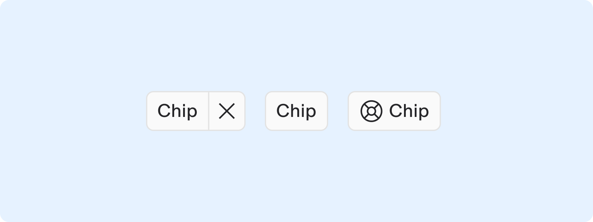
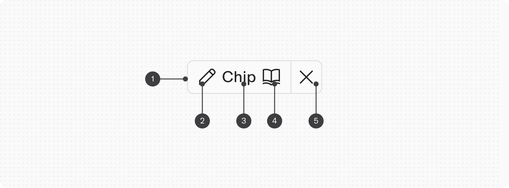
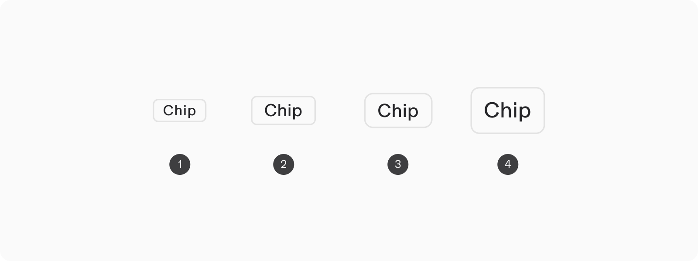
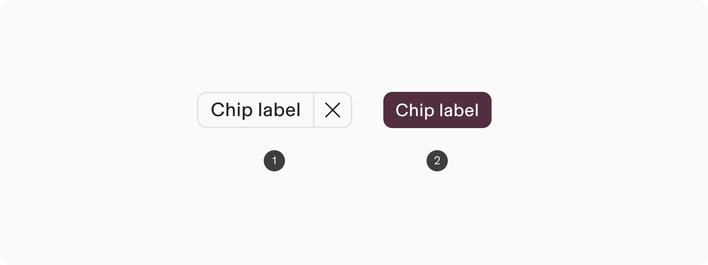
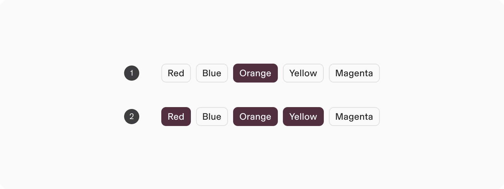
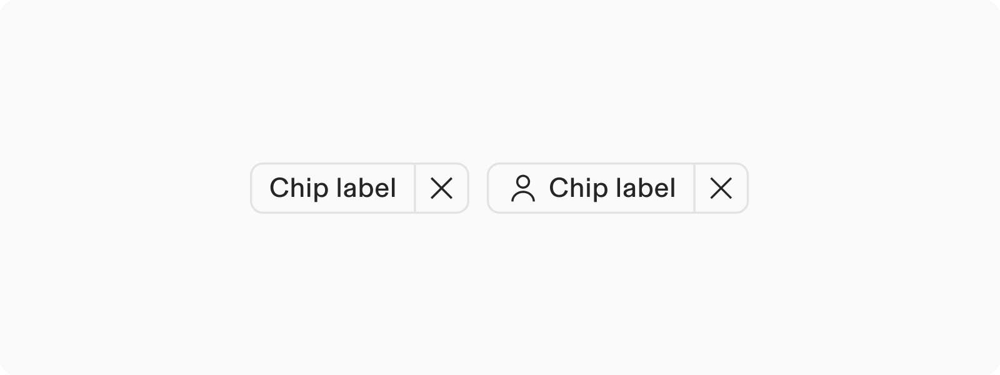
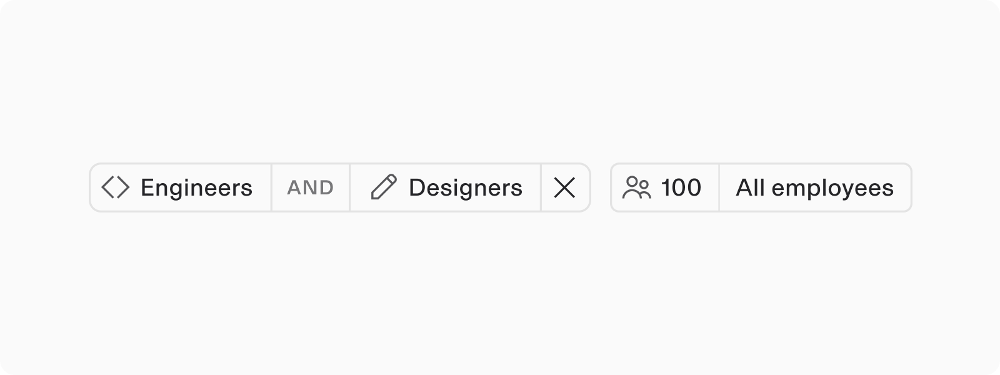
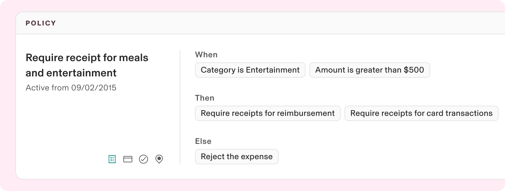
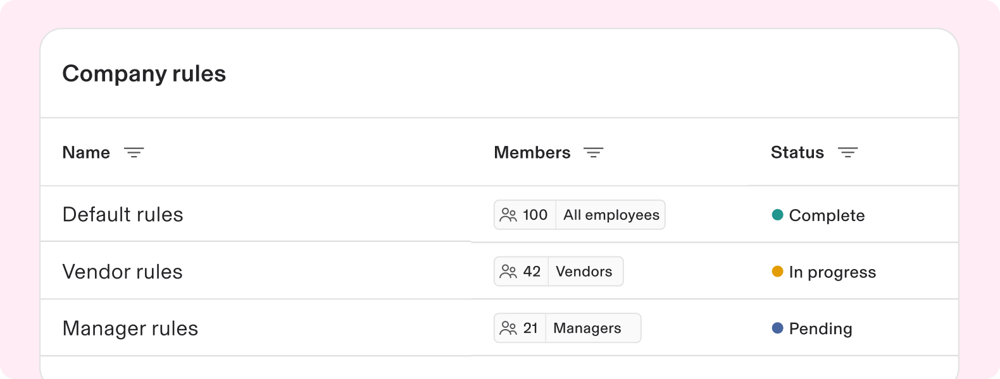
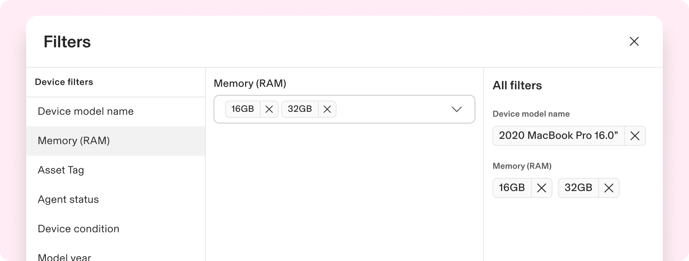

# Chip

**Source:** [View in Confluence](https://rippling.atlassian.net/wiki/spaces/RDS/pages/3901687525)  
**Last Synced:** 11/3/2025, 6:08:53 PM  
**Confluence Version:** 15

---

Introduction

A compact, interactive element designed to represent entities, characteristics, or complex criteria in a readable and user-friendly manner.

---

# Overview

-   Functioning similarly to tags, chips are more dynamic and facilitate the representation of complex data or entities such as people, places, or things
    
-   Chips are often interactive with options for dismissing or clicking for more details
    

## Resources

**Type**

**Resource**

**Status**

Design

[Web Component (Figma)](https://www.figma.com/file/ysWbTtfWqhVDHQd1Mg2LQ1/Component-Library-v2?type=design&node-id=991-873&mode=design)

AVAILABLEGreen

Implementation

[Web Component (Storybook)](https://uikit.ripplinginternal.com/?path=/docs/components-miscellaneous-chip--props)

AVAILABLEGreen

---

# Specs

## Anatomy

1.  Container
    
2.  Start icon (optional)
    
3.  Label
    
4.  End icon (optional)
    
5.  Dismiss action (optional)
    

## Configuration

### Size

1.  Small (16px height)
    
2.  Medium (20px height)
    
3.  Large (24px height)
    
4.  Extra Large (32px height)
    

### Type

1.  **Default:** Static by default but can optionally launch actions similar to a button and/or be dismissed
    
2.  **Selectable:** Can be toggled between a selected and unselected state, similar to a checkbox or radio but cannot launch actions
    

### Selectable

1.  **Single select**: Chips function similarly to a radio button group where only one option can be selected at a time. This mode is ideal for scenarios where a user must choose one, and only one, option from a set of mutually exclusive choices.
    
2.  **Multi-select**: Chips can be selected simultaneously, mirroring the behavior of a group of checkboxes. This suits scenarios where users need to make several choices without exclusivity.
    

### Dismissible

Dismissible chips provide an action affordance at the end of the container to remove it from view. This action is not available on selectable types of chips.

### Custom content

A default type of chip can contain custom content to facilitate use cases with more complex configurations or conditions into a grouped entity. These chips can also contain an action to be dismissed. Custom content is used most often in Supergroups.

---

# Usage

### When to use

-   To represent user-selected filters, tags, or conditions
    
-   To display compact information sets, such as attributes or policy conditions
    
-   To facilitate quick actions like removing properties or refining displayed data
    

### When to use something else

-   If the element is a call to action, use a Button. Chips represent entities and any associated actions should be to investigate detailed information related to it
    
-   Use a Label component to highlight notable properties of an item, like "New" or "Recommended," and to give properties or metadata semantic meaning through color, such as green for "New" or yellow for "Caution".
    

## Guidelines

### Chips are often interactive

Chips are useful for elements that are interactive or may become interactive, such as prompting a detailed view on click or offering a dismiss action. For static read-only information or when color is essential to convey meaning or association, consider a Label or Status component.

### Use chips for filtering

Chips are effective for representing filter properties because they provide a visual and interactive way to refine data or content based on specific criteria. When a user applies a filter, the chip represents the condition, narrowing down the displayed information to match the selected criterion.

---

# Accessibility

Users should be able to:

-   Use a chip to perform an action
    
-   Navigate to a chip with keyboard or switch input
    
-   Activate a chip with keyboard or switch input
    
-   Dismiss a chip with keyboard or switch input
    

## Keyboard Navigation

**Keys**

**Action (default)**

**Action (selectable)**

Tab

Places the focus on the next interactive element, which is either an interactive chip or a dismiss button.

Moves focus to next enabled chip

Space or Enter

If focus is on the dismiss button, dismisses the chip. If focus is on the chip, executes the chip action.

Select focused chip
