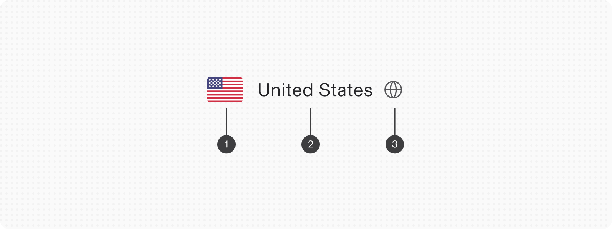
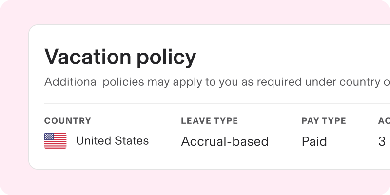
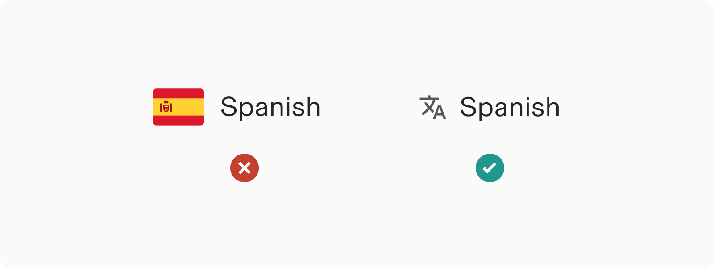
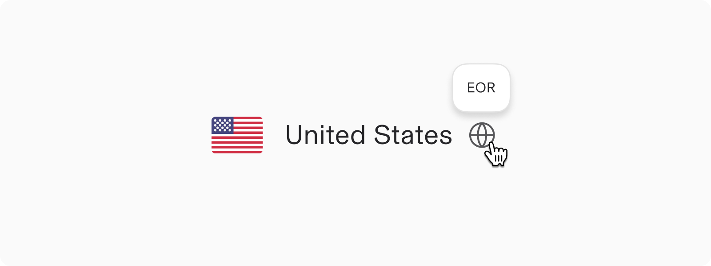

# Country

**Source:** [View in Confluence](https://rippling.atlassian.net/wiki/spaces/RDS/pages/3772318632)  
**Last Synced:** 11/3/2025, 6:08:57 PM  
**Confluence Version:** 53

---

Displays the name and flag of a country by its corresponding ISO code.

---

# Overview

-   Helpful when dynamically determining a flag and/or country name to display based on unknown condition(s)
    
-   Effective for finding a country based on a known flag graphic, where quick visual identification is a priority
    

## Resources

**Type**

**Resource**

**Status**

Design

[Web Component (Figma)](https://www.figma.com/file/ysWbTtfWqhVDHQd1Mg2LQ1/Component-Library-v2?type=design&node-id=929-44&mode=design)

AvailableGreen

Implementation

[Web Component (Storybook)](https://uikit.ripplinginternal.com/?path=/docs/components-atoms-country--props)

AvailableGreen

---

# Specs

## Anatomy

1.  Flag
    
2.  Country name
    
3.  Icon (optional)
    

## Configuration

### Fallback flag

Countries or regions without an applicable or associated flag will default to a worldwide flag as a generalized fallback

---

# Usage

### When to use

-   Ideal for displaying a user’s country in profiles or address books, where quick visual identification is beneficial.
    
-   Effective where users need to see their country for regional customization, such as currency, language, or time zone.
    

### When to use something else

-   In applications focused on a single country, where international identification is unnecessary, a simple text label might suffice.
    
-   In contexts where the display of a country’s flag might be culturally sensitive or potentially contentious, opt for a more neutral presentation.
    

## Guidelines

### Avoid mixing flags and languages

Flags symbolize countries, not languages, which can lead to confusion when a language is spoken in multiple countries or a country has multiple official languages. For instance, Spanish is not only spoken in Spain but is also the official language of 20 other countries across Latin America, each with its own distinct version of Spanish.

---

# Accessibility

✅ **Do**: If the icon communicates a hidden meaning, be sure to include a tooltip for assistive technologies and to reduce ambiguity

## Keyboard Navigation

**Keys**

**Action**

Tab

Moves focus to next eligible element with a tooltip
