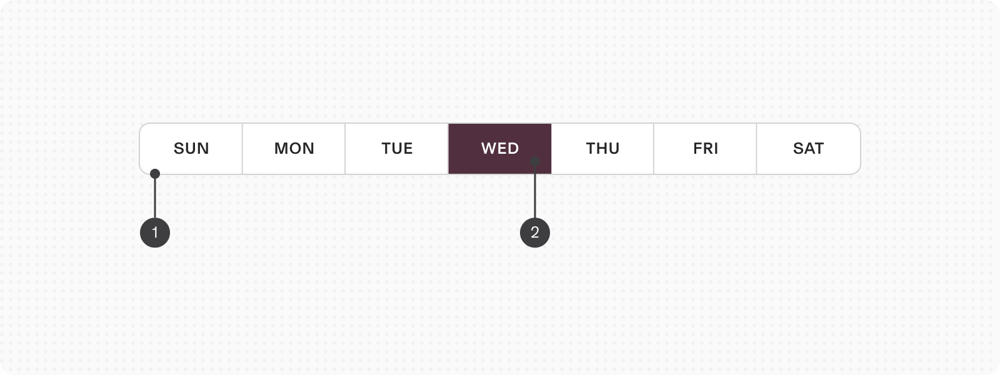
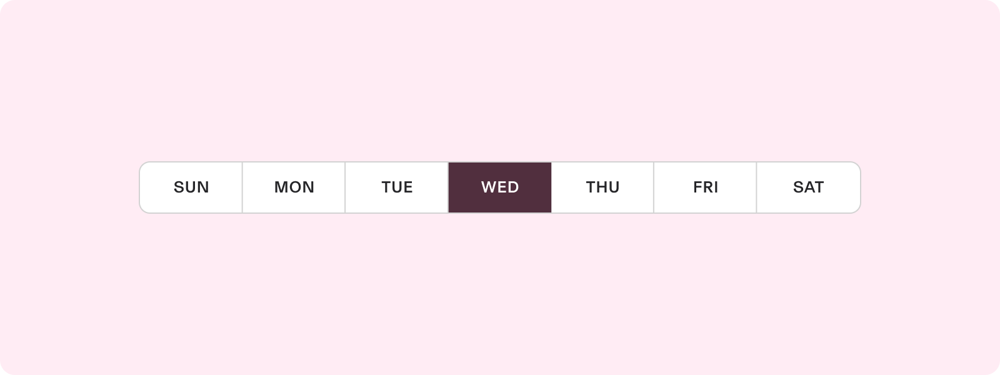
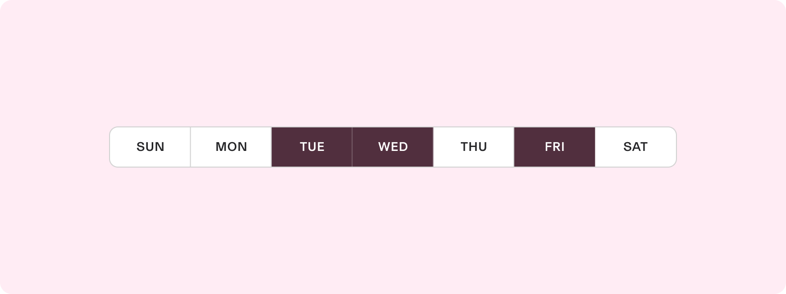

# Day Selector

**Source:** [View in Confluence](https://rippling.atlassian.net/wiki/spaces/RDS/pages/3886972997)  
**Last Synced:** 11/3/2025, 6:09:00 PM  
**Confluence Version:** 18

---

A button group representing days of the week, allowing users to select one or multiple days.

---

# Overview

-   Two types: single-select and multi-select
    
-   Useful for applications where users must select recurring events on specific days
    

## Resources

**Type**

**Resource**

**Status**

Design

[Web Resources (Figma)](https://www.figma.com/file/ysWbTtfWqhVDHQd1Mg2LQ1/Component-Library-v2?type=design&node-id=929-45&mode=design)

AvailableGreen

Implementation

[Web Component (Storybook)](https://uikit.ripplinginternal.com/?path=/docs/components-inputs-dayselector--props)

AvailableGreen

---

# Specs

## Anatomy

1.  Container
    
2.  Day selector button
    

## Configuration

### Single-select

Single-select segmented buttons behave like radio buttons: only one option can be selected at a time

### Multi-select

Multi-select buttons behave like checkboxes: more than one option can be selected

---

# Usage

### When to use

-   Ideal for applications where users must set recurring events on specific days, like in task management tools or calendar applications
    
-   Useful in dashboards or reports where users might want to filter data based on days of the week, such as sales data or user activity
    

### When to use something else

-   Avoid using it for scenarios where the user needs to pick a specific date. A date picker is more appropriate
    

## Guidelines

### Disabling days

In applications where business operations or services are not available on certain days (e.g., weekends or specific weekdays), disabling these days can prevent users from making selections that are not viable

---

# Accessibility

## Keyboard Navigation

**Keys**

**Action (single select)**

**Action (multi select)**

Tab

Moves focus to next enabled button

Moves focus to next enabled button

Space / Enter

Select focused button

Select and unselect focused button
