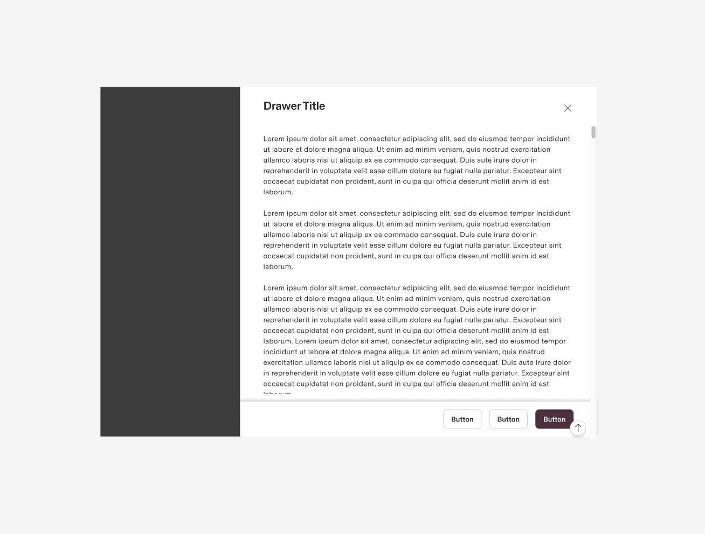
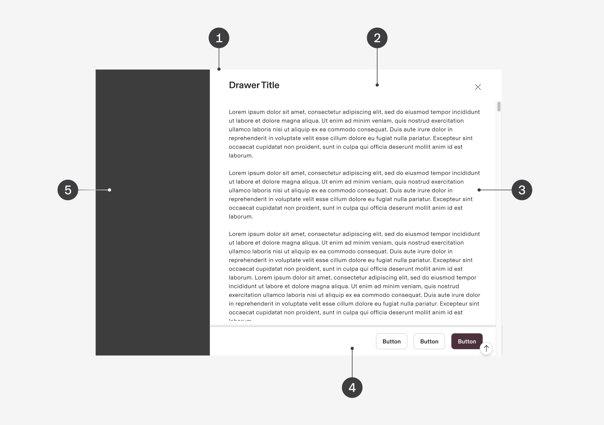
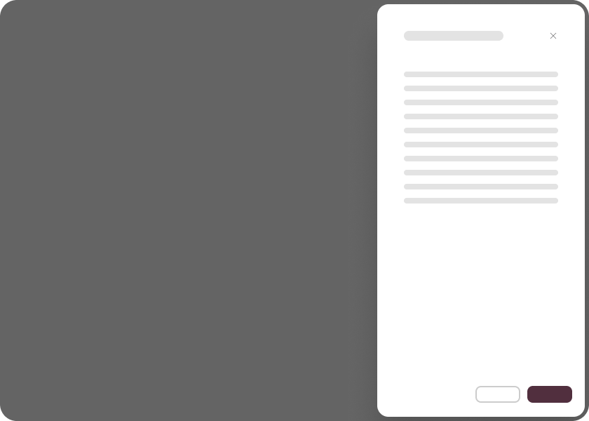
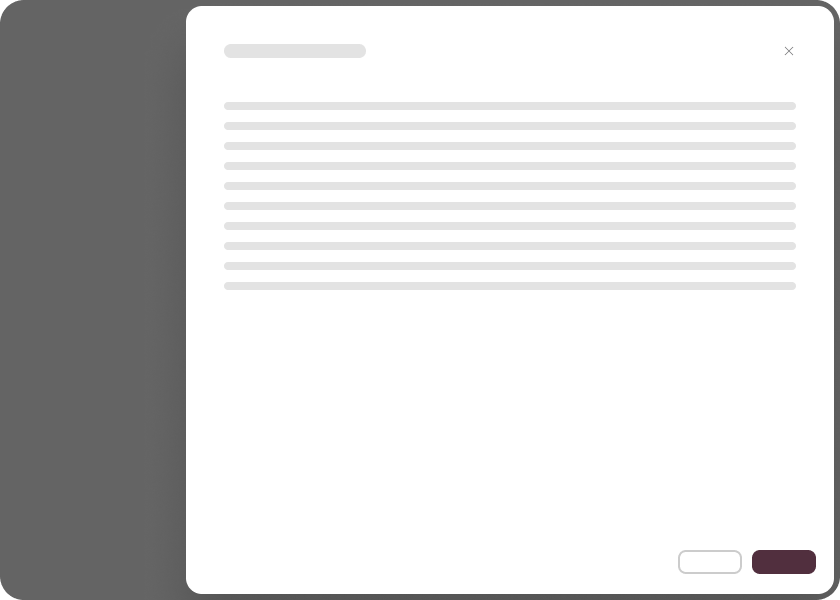
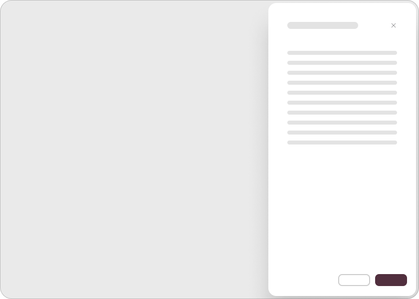

# Drawer

**Source:** [View in Confluence](https://rippling.atlassian.net/wiki/spaces/RDS/pages/4738024161)  
**Last Synced:** 11/3/2025, 6:09:03 PM  
**Confluence Version:** 5

---

A drawer is a UI feature that slides in from the left and allows users to access additional information without losing sight of the primary content.

[Figma](https://www.figma.com/design/nhtRzieeGFf1tGVWnRxSK3/Web-Component-Library-\(v3\)?node-id=66574-76960) [Storybook](https://pebble.ripplinginternal.com/?path=/docs/components-modal-drawer--docs)

---

# Overview

The drawer component serves as a unique modal dialog that slides in from the edge of the screen, allowing for various sizing options such as narrow, medium, wide, extended, or full width. It interrupts the user experience similarly to traditional modal dialogs to focus on the content inside the drawer. Drawers are particularly useful when users need to complete secondary tasks while keeping the context of their primary work, access additional information without losing their place, or perform quick actions within their main workflow.

# Usage

## When to use

-   Form management
    
-   Handling complex tasks that require context maintenance
    
-   Provide additional information or actions while preserving user’s context.
    

## Best practices

-   Sparing use for secondary tasks
    
-   Use drawers sparingly for secondary tasks
    
-   Prefer them over modal dialogs to keep user context
    

# Specs

## Anatomy

1.  **Container**
    
    -   A sliding panel serving as the drawer's main structure, overlaying or pushing existing content.
        
    -   Anchors to any screen edge (left or right) based on application needs.
        
    -   Offers adaptable width settings while balancing with the main interface.
        
    -   Uses solid or semi-transparent backgrounds for clear distinction from underlying content.
        
2.  **Header**
    
    -   Features concise headings that convey the drawer's purpose.
        
    -   Includes an accessible close button (typically 'X' icon) in the upper corner for touch interaction.
        
3.  **Content area**
    
    -   Allows smooth scrolling when content exceeds visible boundaries.
        
    -   Prioritizes readability through careful font selection and size hierarchy.
        
    -   Ensures optimal accessibility for all interactive components (buttons, links, form fields).
        
4.  **Footer:** Includes clearly differentiated primary and secondary action buttons with descriptive labels.
    
5.  **Overlay:** Implements a semi-transparent backdrop overlay that dims main content, directing attention to the active drawer.
    

## Configuration

### Width

**Type**

**Width**

**Visual representation**

Compact

384px

Non compact

1152px

### Interactions

Panels slide in from the right and remain pinned to the right of the screen.

### Modality

**Type**

**Purpose**

**Visual Representation**

with Overlay(Default)

-   Disables interaction with the base layer
    
-   Use when manipulating data that will update the base layer or when the content on the base layer is complex and distracting
    

without Overlay

-   Allow users to manipulate content on the base layer.
    
-   Use for content that is purely referential and doesn’t update data
    

### Dismiss drawer

For Drawer with overlays, users can't interact with the rest of the page until the drawer is closed. These are the three options that will dismiss a drawer:

-   Press the close/back control for the drawer
    
-   Press `Esc` on a keyboard
    
-   Click anywhere on the blanket
    

# Accessibility

-   When it comes to managing UI visibility with drawers, it's important to think it through so users don’t feel lost or have their workflow interrupted.
    
-   We suggest considering alternatives like dedicated pages or non-modal dialogs, unless the advantages of using drawer modals really stand out.
    
-   To keep things running smoothly, here are some best practices for focus management:
    
    -   Make sure to direct focus to the first element in the drawer as soon as it opens.
        
    -   When closing the drawer, return focus to the component that triggered it, ensuring a seamless navigation experience.
