# Dropdown Menu

**Source:** [View in Confluence](https://rippling.atlassian.net/wiki/spaces/RDS/pages/4719116796)  
**Last Synced:** 11/3/2025, 6:09:11 PM  
**Confluence Version:** 29

---

Introduction

Dropdown menu displays a list of actions or selectable options for a user.

[Figma](https://www.figma.com/design/nhtRzieeGFf1tGVWnRxSK3/Web-Component-Library-\(v3\)?node-id=66809-116223&t=2tK0LPu8dInQJYnH-11) | [Storybook](https://pebble.ripplinginternal.com/?path=/docs/components-dropdowns-dropdown--docs)

---

# Overview

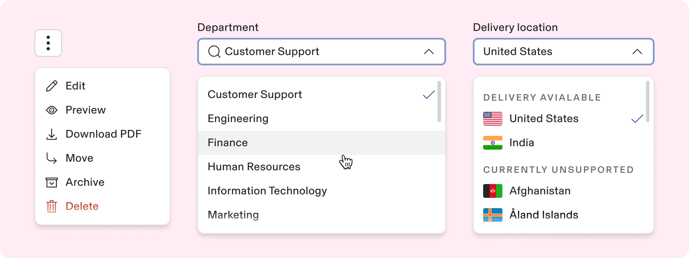

-   Dropdown menu displays selectable options allowing users to :
    
    -   perform actions,
        
    -   choose options,
        
    -   adjust settings, and more.
        
-   These options typically appear within a popover to create a dropdown menu.
    

---

# Usage

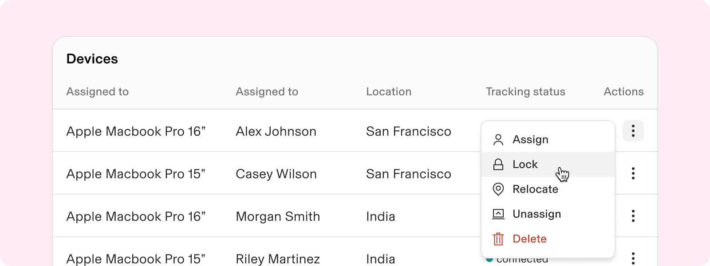

### When to use

-   Implement dropdown menus to present options that range from 3 to 15 choices, ensuring that the number of options exceeds three.
    
-   They are perfect for grouping related actions without cluttering the interface.
    
-   They can be implemented in forms, full pages, modals, or side panels.
    

### When to use something else

-   Scenarios with limited options (less than 3 items in the list), and there is space to display all options:
    
    -   Avoid dropdowns if fewer than 3 options are required.
        
    -   To allow multiple selections from a list of items, use checkboxes.
        
    -   To allow users to make a single selection from a short list, use radio buttons.
        
-   Don’t use a dropdown in a form as the visual appearance and interactions are modeled after a button versus an input. Use the input select component instead.
    
-   Mobile platform
    
    -   Consider using a bottom sheet if most of your experience is frequently used on mobile platforms.
        

---

# Specs

## Anatomy

1.  Menu Trigger (button)
    
2.  Dropdown Menu
    
3.  Dropdown - Sub menu
    
4.  Dropdown Menu - Cell
    
5.  Section Label
    
6.  Separator
    
7.  Nested Menu (isNested = true)
    
8.  Footer
    
9.  Menu - Search
    
10.  Scroll Bar
     
11.  Prefix - Icon
     
12.  Prefix - Avatar
     
13.  Prefix - Flag
     
14.  Suffix - Selected Item (isSelected = true)
     
15.  Suffix - Label Icon
     
16.  Suffix - Label
     
17.  Suffix - Tooltip
     
18.  Secondary text
     
19.  Tertiary text
     
20.  Quaternary text
     

## Configuration

### Layout

-   In desktop applications, dropdown menus are common.
    
-   On mobile devices, dropdown menus should be replaced with:
    
    -   Bottom sheets
        
    -   Full-screen modals
        

### Text

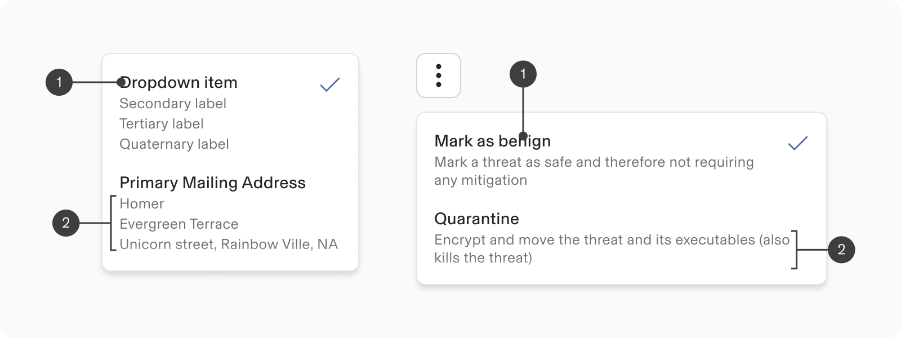

1.  **Title copy:** A menu option must consistently have a label that accurately conveys its action or choice.
    

2\. **Sub-text:**

-   Menu options can show extra descriptive text when needed.
    
-   Descriptions clarify menu items, especially when introducing new features to users.
    

Use descriptions sparingly; only when necessary.

### Prefix

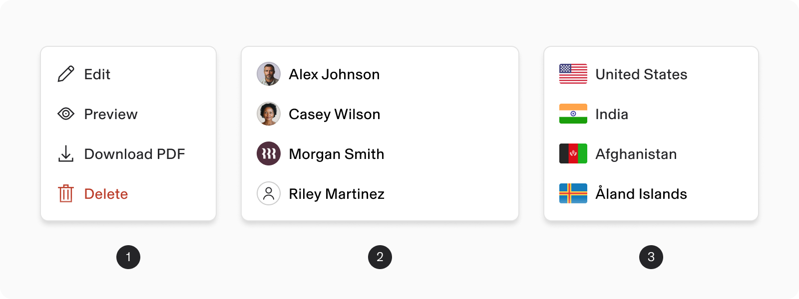

1.  **Prefix - Icon:** Menu option may feature an icon, but it should not be solely for decorative purposes.
    
2.  Prefix - Avatar
    
3.  Prefix - Country
    

note

Use an icon when it is essential and has a clear connection to the title copy (for instance, ‘edit’ in a toolbar).

Use an icon when it is essential and has a clear connection to the title copy (for instance, ‘edit’ in a toolbar).

### Suffix

Menu item can display a related content that clarifies the menu item, in the suffix area (right end).  
**Examples of suffix include:**

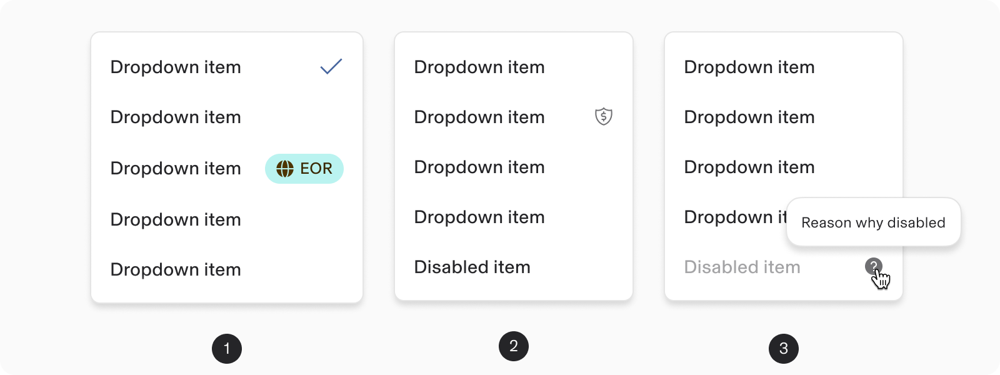

1.  Suffix
    
    1.  Selected item (Check icon)
        
    2.  Label
        
2.  Suffix Icon
    
3.  Tooltip
    

### Modifiers

#### Segmented menu

1.  **Separator:**
    
    -   Use the separator to establish sections within a menu.
        
    -   Organizing ‘dropdown menu items' into 'section’ is useful for grouping items with different functions or connections.
        
2.  **Section header:** A section header serves as a title for items that may be grouped according to a specific logic.  
    

#### Header & footer

1.  **Header:**
    
    1.  **Search:** Dropdown menu offers the choices of incorporating a search amongst the menu items.
        
    2.  **Select All:** Dropdown menu with multiple choice offers the choices of bulk selecting all the items at once using a ‘select all’ header section.
        

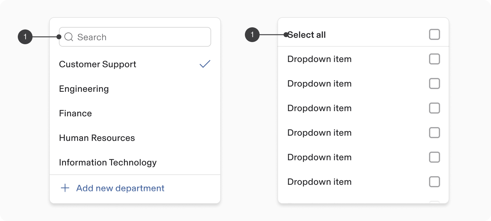

2.  **Footer :** Dropdown menu provides a footer section that’s sticky positioned at the bottom of the menu.
    

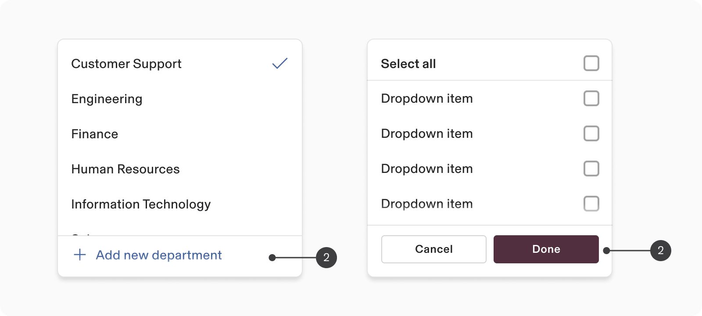

### Nested menu

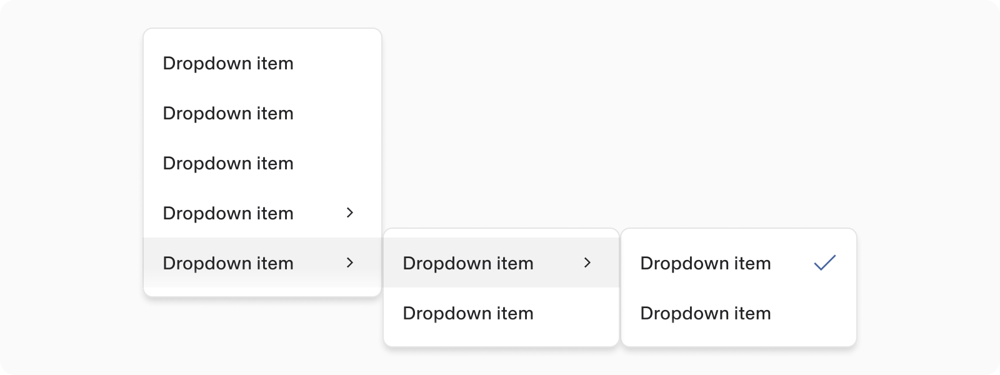

Dropdown menu can have one or multiple submenus inside with multiple levels of nesting.

note

When a menu item contains a submenu, a drill-in chevron will appear at the end of the menu item to show that a submenu is available.

When a menu item contains a submenu, a drill-in chevron will appear at the end of the menu item to show that a submenu is available.

### Size: Density

-   Dropdown menu provides two height options (default & compact).
    
-   The compact variant allows more options to fit in tighter interfaces, such as grids, tables, or smaller Select Input variants.
    

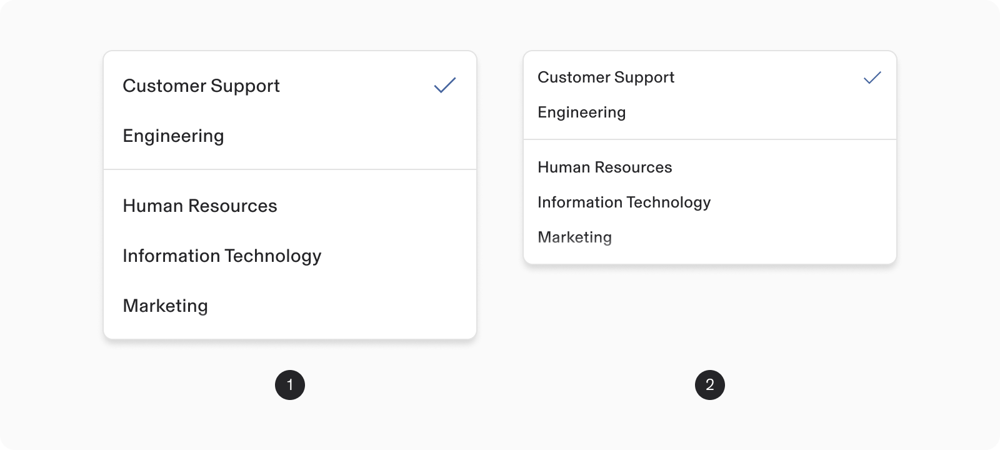

1.  Default
    
2.  Compact
    

### Selection

Dropdown menu offers the choices of single selection, multiple selection, or no selection at all.

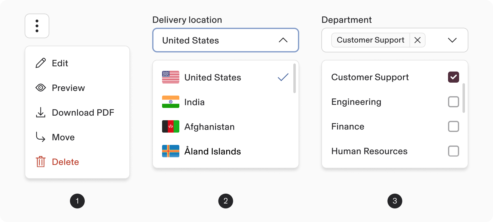

1.  **No selection (default):** By default, menu items are unselected and execute an action when pressed.
    
2.  **Single selection:** The selected item is indicated with a single checkmark icon in suffix (right edge).
    
3.  **Multiple selection:** Menu shows checkboxes next to every menu item.
    

Switches are more frequently utilised on mobile devices.

### State

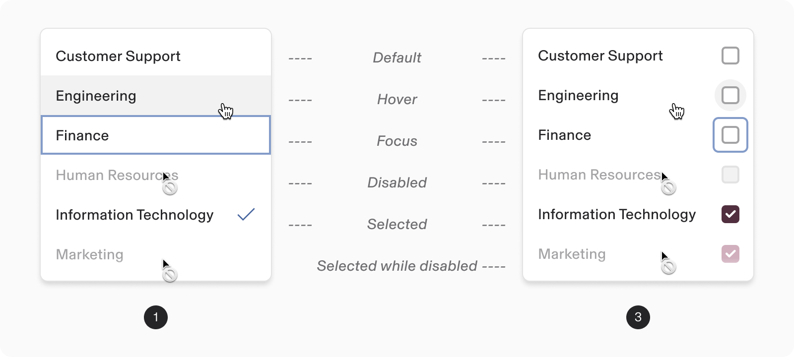

1.  No Selection or Single Selection
    
2.  Multiple Selection
    

### Appearance

Dropdown menu items can use color to alert users about **warning** or **destructive** action before selection.

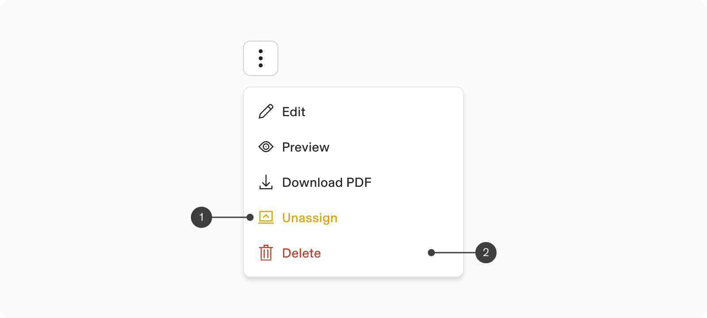

1.  Warning / Alert
    
2.  Destructive
    

---

# Guidelines

### Width

There are no strict limits on the max width of a dropdown; it can be adjusted to suit its specific context.

-   Max width should be set by consumer based on the needs of the UI.
    
-   Minimum width of the dropdown should be 192px.
    

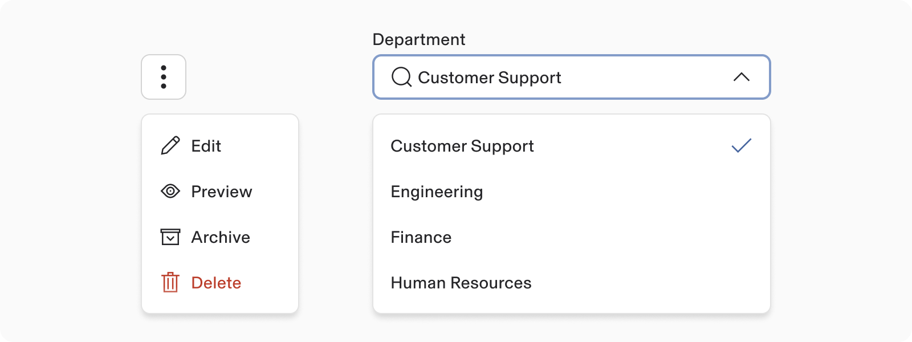

### Triggering a dropdown menu

Menus open when users interact with elements like icons, buttons, or input fields.

The appearance of buttons or icons should remain unchanged when they trigger a menu.

### Opening Direction

-   Dropdowns can open upward or downward depending on their position on the screen.
    
    -   By default, dropdowns are set to open downward.
        
-   If a dropdown is near the bottom edge, it should expand upward to avoid being cropped.
    

### Selection Behavior

#### 1\. Single select dropdowns

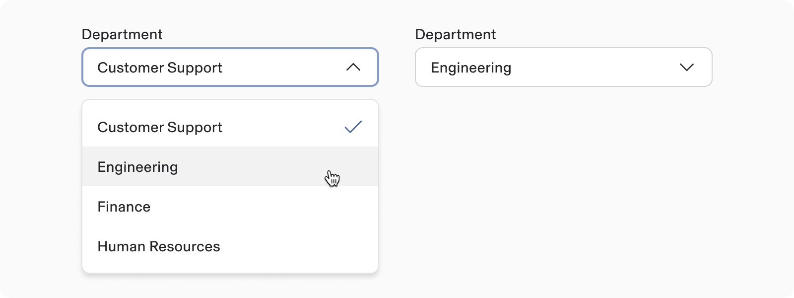

-   Clicking a closed dropdown opens the list of options.
    
-   Selecting an option closes the dropdown, and the chosen text replaces any placeholder text.
    

#### 2\. Multi-select dropdowns

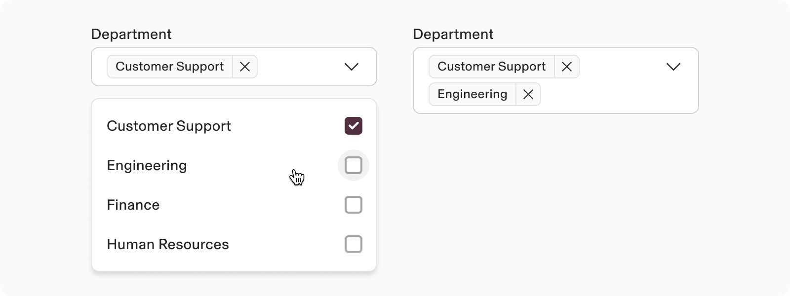

-   Each option includes a checkbox for selection.
    
-   The dropdown remains open until dismissed by clicking outside or pressing Esc.
    
-   Selected items are displayed as chips within the text field, effectively replacing the placeholder text.
    

### Scrolling behavior

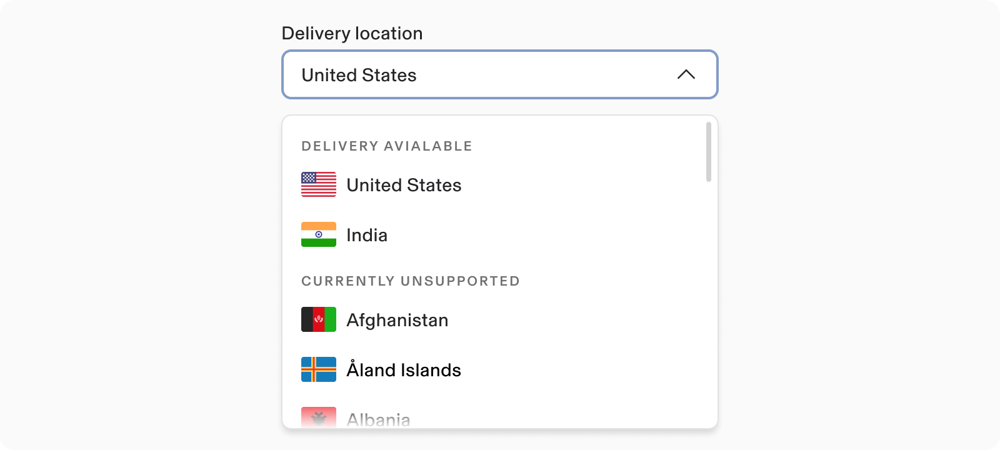

-   Once the number of options surpasses the maximum height of the dropdown menu, initiate scrolling and display scroll bar.
    
-   Scroll bars might not always be visible, so it's advisable to overlay a 50% fade at the bottom edge of the last item's container to signal that more options are available in the menu.
    

## Content Guidelines

### Menu Item - text

-   Ensure dropdown item text is concise and precise, avoiding unnecessary descriptions.
    
-   It's advisable to list options in alphabetical order for clarity / alphabetical order.
    
-   Avoid using decorative images or icons within dropdowns.
    

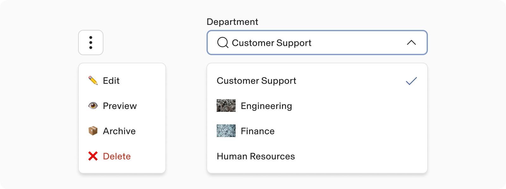

###   
Using Descriptions in Dropdown Menu Items:

Include descriptions only when they provide valuable information to help users choose an action.

### Overflow content

-   Keep dropdown text to a single line.
    
-   When the label or description of a menu item exceeds the available horizontal space, it wraps onto a new line.
    
-   If the text exceeds three lines even after wrapping, please use an ellipsis (…) to signify that there is more content that is not displayed.
    
-   Provide the full text via a tooltip for clarity. Use a tooltip for enhanced keyboard accessibility whenever possible.
    

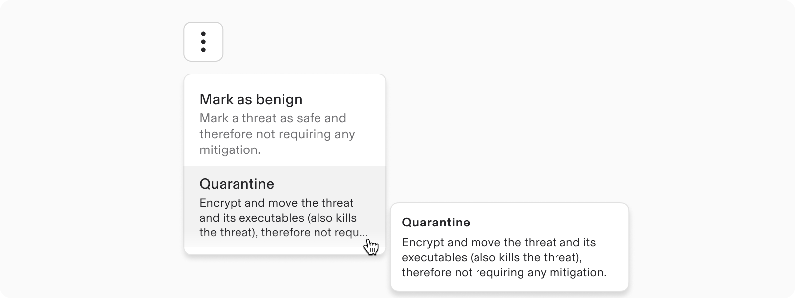

## Internationalisation

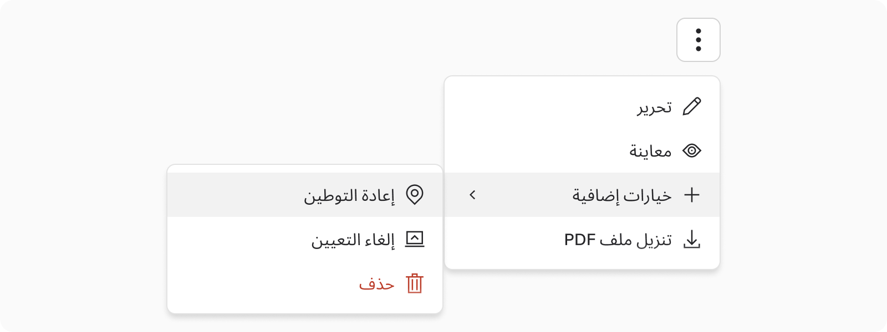

For right-to-left (RTL) languages, mirror the entire menu horizontally, including the direction of drill-in chevrons and the placement of submenus.

---

# Accessibility

-   Users should be able to:
    
    -   Access, open, and close a menu using assistive technology.
        
    -   Navigate through and select menu items with assistive technology.
        

## Keyboard Navigation

**Keys**

**Action**

Tab

Focus lands on menu

Space / Enter

-   For closed menus: Opens menu or submenu
    
-   For open menus: Selects list item 
    

Up / Down Arrows

-   For closed menus: Opens menu 
    
-   For open menus: Moves focus to the next item
    

Left / Right Arrows

Opens or closes a submenu 

Letters

Focus moves to the next list item starting with letter

Escape

Closes menu
