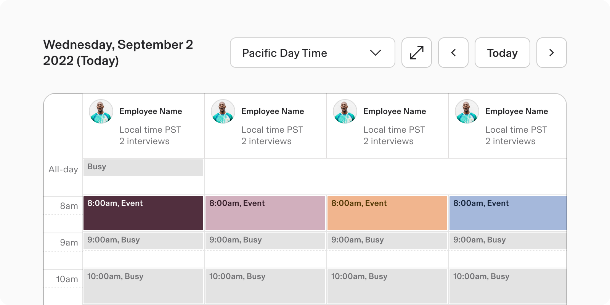
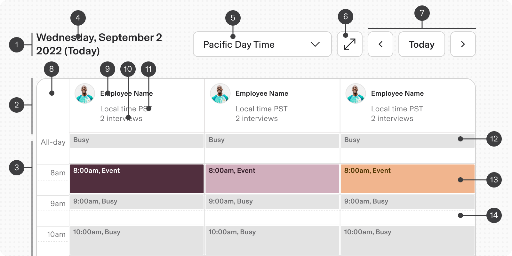
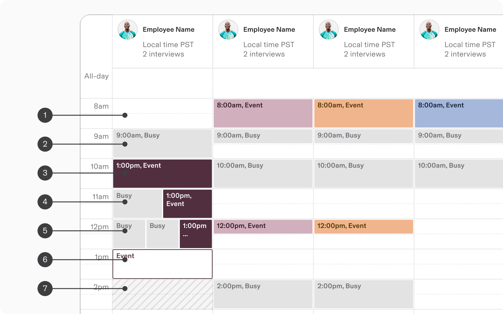
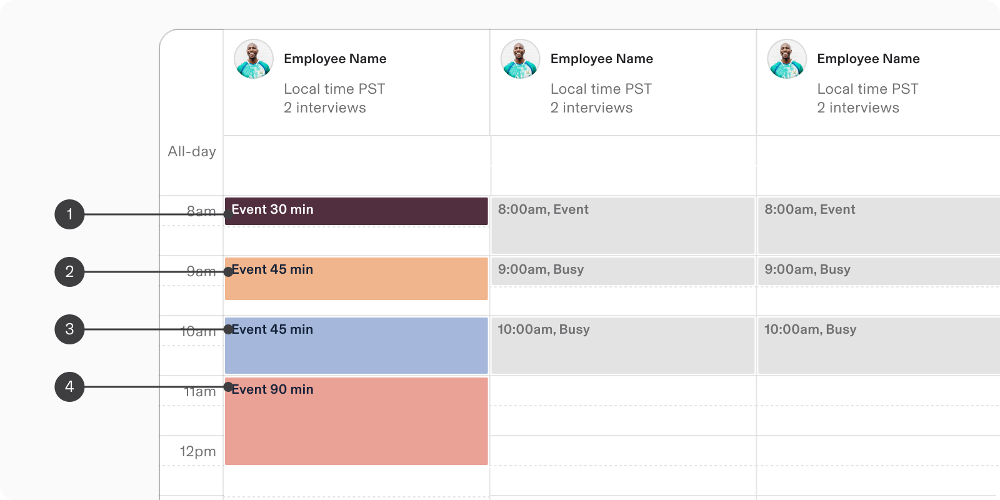
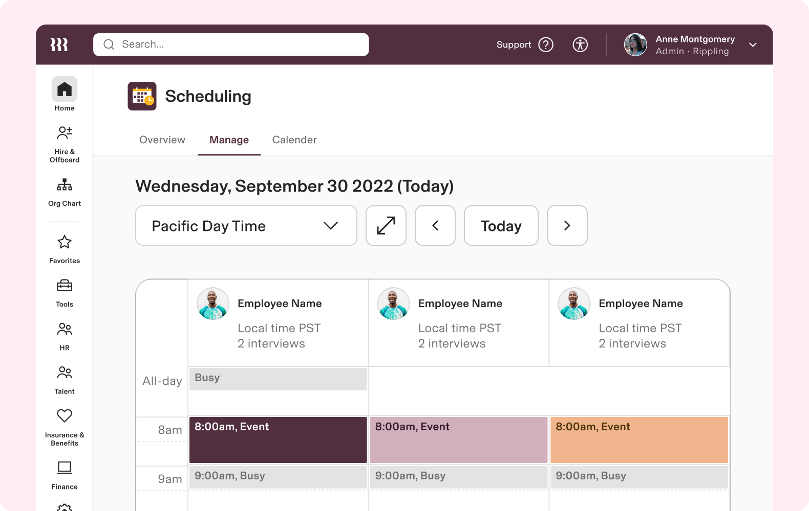
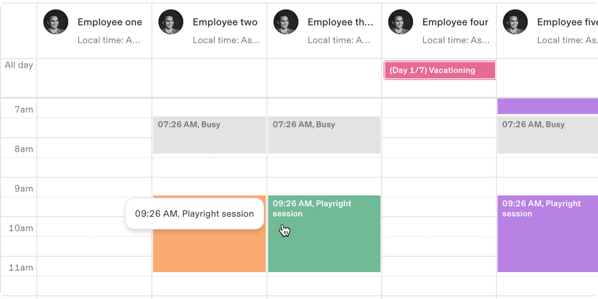
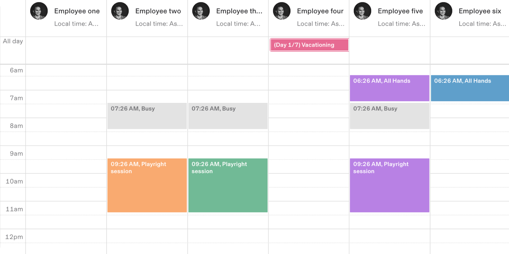

# Employee Day View

**Source:** [View in Confluence](https://rippling.atlassian.net/wiki/spaces/RDS/pages/4828725303)  
**Last Synced:** 11/3/2025, 6:09:14 PM  
**Confluence Version:** 10

---

A calendar based layout for a user’s work day.

A calendar based layout for a user’s work day.

[Figma](https://www.figma.com/design/nhtRzieeGFf1tGVWnRxSK3/Web-Component-Library-\(v3\)?node-id=66809-117919&t=tAVobSulBs1cTfSO-11) | [Storybook](https://pebble.ripplinginternal.com/?path=/docs/components-calendar-employeedayview--docs)

---

# Overview

-   The Employee Day View component offers a calendar-based interface for managing employee schedules.
    
-   It features a tabular format for easy viewing and allows users to book time slots based on availability.
    
-   Ideal for applications needing an overview of daily schedules, it highlights both commitments and free time.
    

---

# Spec

### Anatomy

1.  EDV - Header
    
2.  EDV Calendar - column header
    
3.  EDV Calendar - Schedule slots
    
4.  Day / date
    
5.  Timezone selection
    
6.  Expanded view
    
7.  Day jumper
    
8.  Column - time slots
    
9.  Overview - Employee details
    
10.  Overview - Local timezone
     
11.  Overview - Scheduled events
     
12.  Slot - All day (busy)
     
13.  Slot - Event (booked)
     
14.  Slot - Empty
     

## Configuration

### State

Customizable schedules offer visual cues for someone’s availability and let users take further action.

1.  Available
    
2.  Busy
    
3.  Scheduled
    
4.  Conflict - 2
    
5.  Conflict - 3
    
6.  Scheduling
    
7.  Off Hour
    

### Duration

Allows customisation of slot durations, with options ranging from 30 to 90 minutes to accommodate different scheduling needs.

1.  30 min (default)
    
2.  45 min
    
3.  60 min
    
4.  90 min
    

---

# Usage

### When to Use

-   Display employee daily schedules and any scheduling conflicts in a calendar view.
    
-   Schedule, block, or manage appointments and events using the Employee Day View, ensuring optimal time slot allocation based on availability.
    

### When to Use Something Else

For use-cases which don't require access to an employee's full daily or weekly schedule, use the following alternative to the Employee Day View:

-   Date Input: only need to select a date or date range without
    
-   Time Input: Opt for this if you only need to select a specific time slot.
    

## Guidelines

### Additional details

Use tooltips or modals to display additional information on hover or click, such as event details or conflicts.

### Event customisation

Events can utilize pre-defined color coding for scheduled blocks; it helps prevent user cognitive overload.

## Content Guidelines

Clearly label time slots and events, providing concise descriptions and relevant details.

---

# Accessibility

-   Provide screen reader support with descriptive labels for events, slots, and buttons.
    
-   Use high-contrast colors and patterns to differentiate events for users with colour vision deficiencies.
    

## Keyboard Navigation

Key

Actions

Arrow keys

Use arrow keys to navigate through days.

Tab

Navigate through interactive elements such as time slots, event details, and action buttons.
