# Expansion Panel

**Source:** [View in Confluence](https://rippling.atlassian.net/wiki/spaces/RDS/pages/4738089079)  
**Last Synced:** 11/3/2025, 6:09:22 PM  
**Confluence Version:** 27

---

Displays a list of top-level option that can expand or contract to reveal additional detailed information.

[Figma](https://www.figma.com/design/nhtRzieeGFf1tGVWnRxSK3/Web-Component-Library-\(v3\)?node-id=66809-118119&t=1K4K800rdFtLjY3G-11) | [Storybook](https://pebble.ripplinginternal.com/?path=/docs/components-expandable-expansionpanel--docs)

---

# Overview

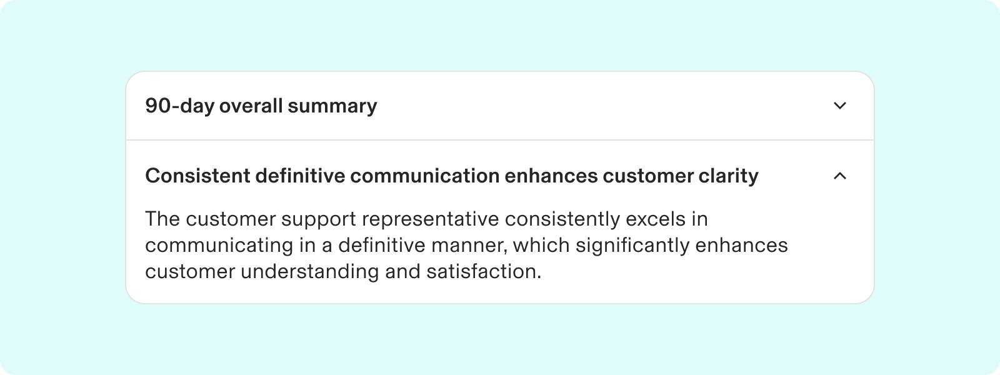

-   Grouping (toggle-able) panels can organise related information, making it easier for users to focus on one thing at a time. Example: FAQs or settings menu.
    
-   Toggle-able sections help save space by letting users click to show or hide content.
    
-   Arrows or plus/minus signs indicate if panels are open or closed.
    

---

# Usage

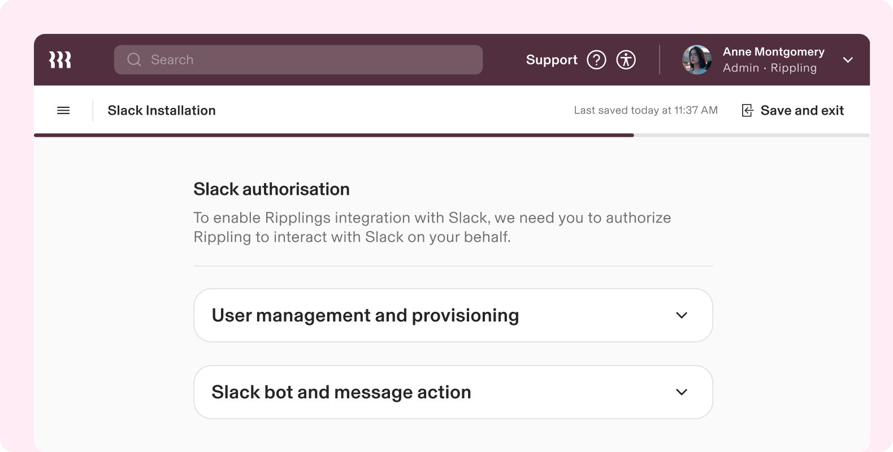

### When to use

-   Use Expansion Panels to provide access to extensive related content within a limited space, like a side panel.
    
-   Users can quickly scan panel headers for relevant information and expand only the sections they wish to read, offering a more efficient experience than navigating through long, scrolling pages.
    
-   Organize related information efficiently.
    
-   Shorten pages and minimize scrolling for non-essential content.
    
-   Use when space is limited, such as on mobile interfaces or in side panels, where lengthy content can't be displayed all at once.
    

### When to use something else

-   Avoid using an Expansion Panel for critical information that needs immediate visibility.
    
-   If users are likely to read all the content, use a full scrolling page with headers instead to avoid unnecessary clicks.
    
-   Choose cards for summarizing data and enabling access to details; Expansion Panels are better for collapsing data of interest.
    
-   Use Expansion Panels for compactly presenting grouped content, while [nested list](https://rippling.atlassian.net/wiki/spaces/RDS/pages/edit-v2/4819617065#Nested-Lists) views are better for navigating hierarchical data.
    

---

# Specs

## Anatomy

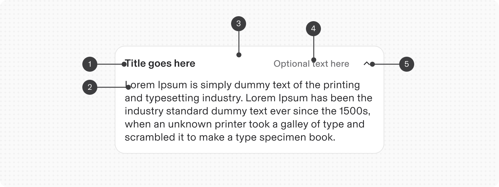

1.  **Title**: A collapsible section's identifying label; it also controls the section's visibility.
    
2.  **Body text / Content**: Configurable as a text string or custom JSX, it can be displayed or hidden as needed.
    
3.  **Container:** Slot for related content displayed when an accordion item is expanded
    
4.  **Optional text (optional):** Sub-label that displays supplemental information about the item; can be shown or hidden.
    
5.  **Chevron**
    

## Configuration

### States

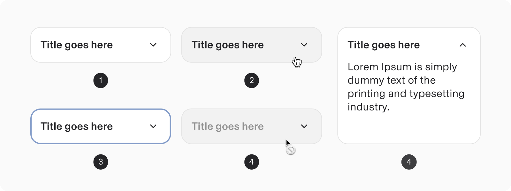

1.  Enabled (collapsed)
    
2.  Hover
    
3.  Focused
    
4.  Disabled
    
5.  Active (Expanded)
    

### Grouping:

#### 1\. Grouped with Dividers

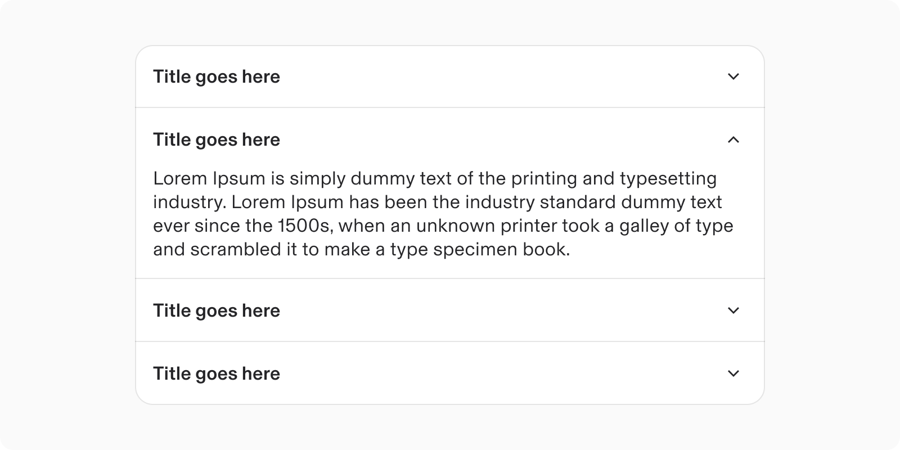

#### 2\. Grouped as Lists

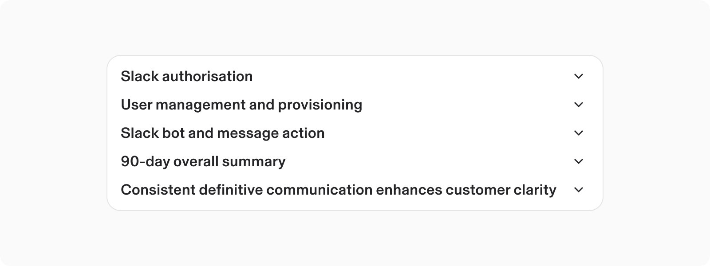

### Appearance modifiers

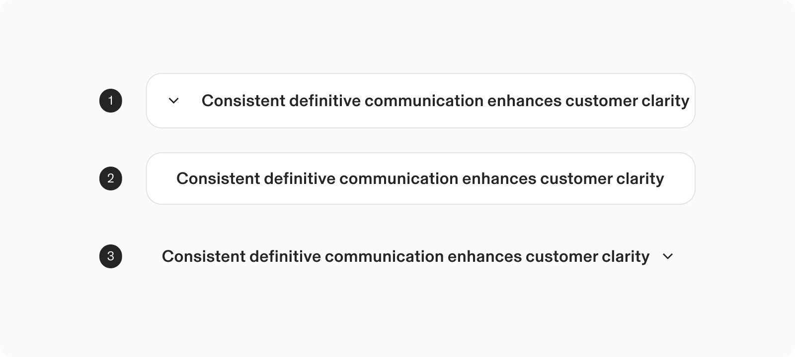

1.  Reversed
    
2.  No Toggle
    
3.  No background and No padding
    

### **Size**

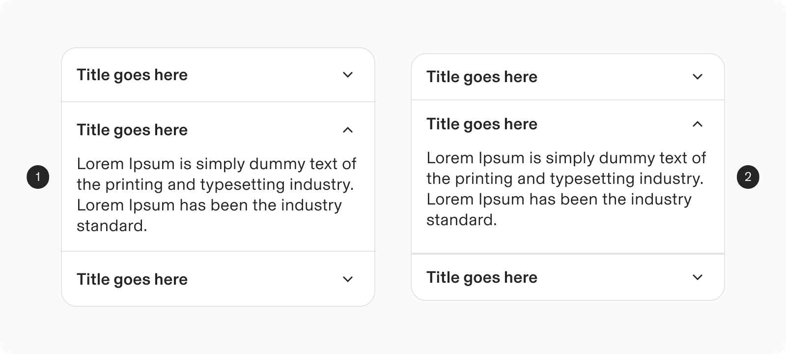

1.  Default
    
2.  Compact
    

### Modifiers: with optional text (on right)

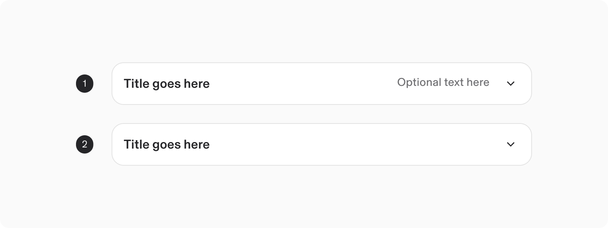

1.  Default (without optional text)
    
2.  With Optional text (right side)
    

### Content

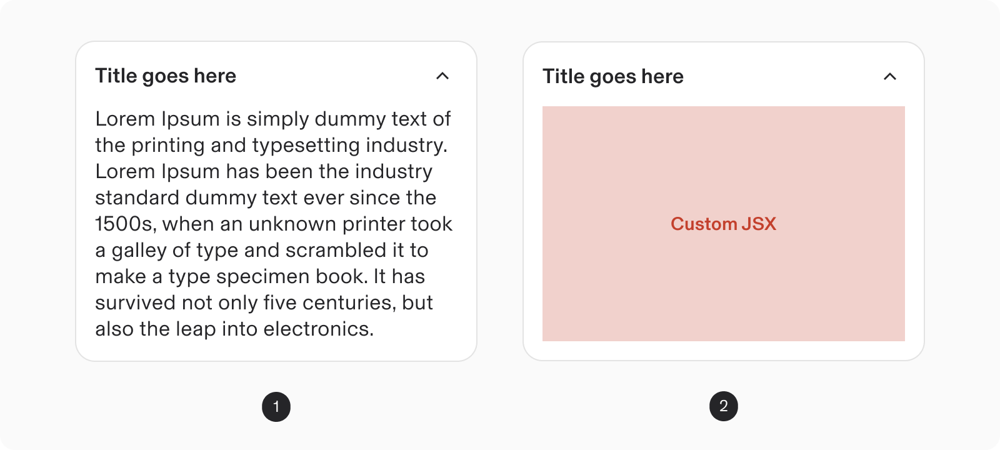

1.  Text
    
2.  Custom JSX
    

---

# Guidelines

### Expand & Collapse view

#### 1\. Single Panel Options: Open by default

By default, all expansion panel items are closed and first-one should be open.

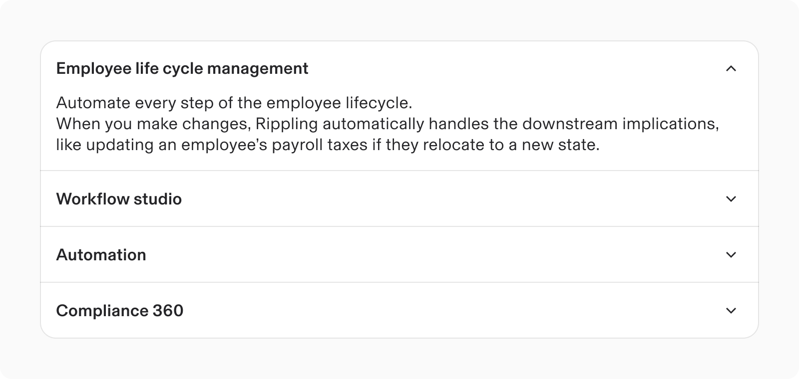

#### 2\. Multiple open items

Users can independently expand each section of the Expansion Panel, allowing multiple sections to be open simultaneously.

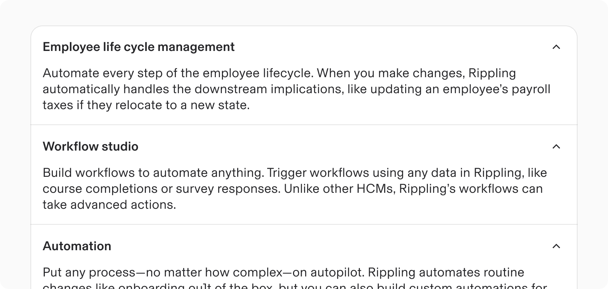

Do

Use clear labels on expansion panels and keep most panels collapsed (by default).

Don’t

Using too many expanded panels, causes excessive scrolling.

### Interactions

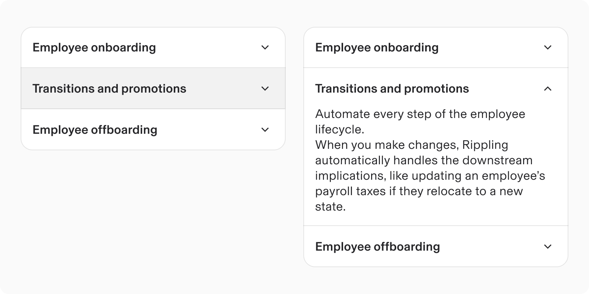

-   Users can expand or collapse content by interacting with the header, using either the trigger icon or the label.
    
-   Upon expansion, the previously hidden content appears below the header.
    
-   To hide the content again, users can select the trigger icon or label once more.
    

### Alignment and positioning

-   Multiple Expansion Panels are always stacked vertically.
    
-   They can be integrated with the main page content or placed within containers, such as side panels or tiles.
    
-   **Responsive behaviours:** The accordion element automatically resizes to fit the width of its container.
    

Placed on main page content

Constricted inside a panel / drawer

Placed inside a Card

## Content Guidelines

#### Title

-   The header of an Expansion Panel should clearly indicate the content within.
    
-   Keep titles brief yet clear and descriptive.
    
-   Keep headers concise, as excessive text can reduce scannability, especially when wrapped on narrower screens.
    

#### Body content

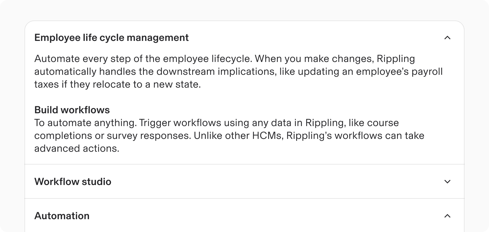

Content within a section can be divided into paragraphs and may feature sub-headers if necessary.

### Overflow

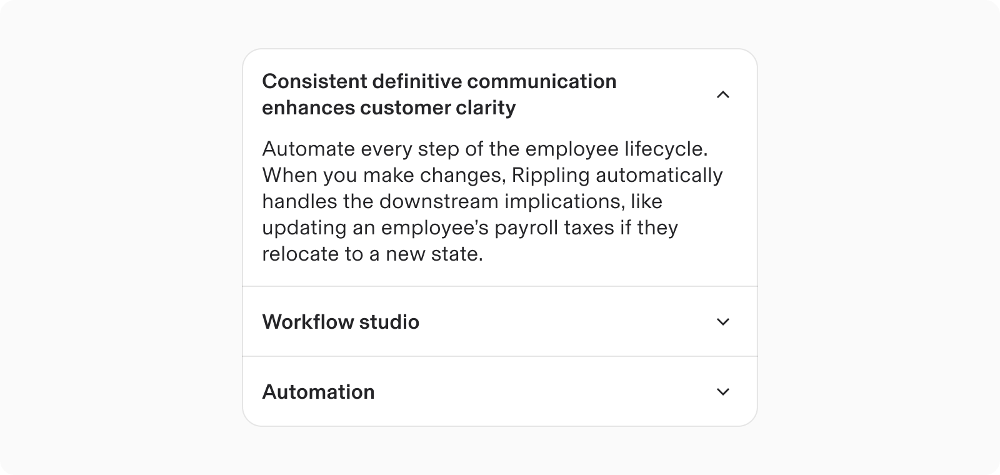

The title wraps when it exceeds the boundaries of the parent container.

### Scrolling content

If the content within an expansion panel exceeds the viewport length, the entire panel should scroll vertically.

Avoid scrolling within individual sections and ensure content never scrolls horizontally.

## Internationalisation

In right-to-left (RTL) languages, the label and content within the expanded container align to the right. The trigger icon can be positioned on either side of the label.

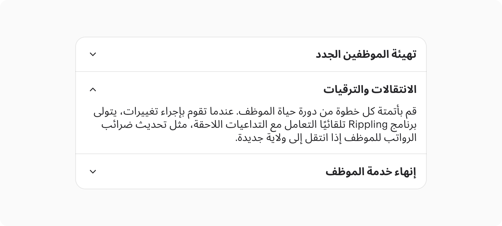

---

# Accessibility

Avoid placing clickable or focusable elements inside the panel.

## Keyboard Navigation

**Keys**

**Action**

Space or Enter

When the focus is on a collapsed panel item, expands the content panel.

Tab

Moves focus to the next focusable element in an panel’s item.

Shift + Tab

Moves focus to the previous focusable element in a panel’s item.

Arrow down

-   When focus is on an panel header, moves focus to the next panel’s header.
    
-   If focus is on the last panel header, moves focus to the first panel header.
    

Arrow up

-   When focus is on an panel header, moves focus to the previous panel header.
    
-   If focus is on the first panel header, moves focus to the last panel header.
