# Form

**Source:** [View in Confluence](https://rippling.atlassian.net/wiki/spaces/RDS/pages/4837834830)  
**Last Synced:** 11/3/2025, 6:10:54 PM  
**Confluence Version:** 4

---

A form is a group of related input controls that allows users to provide and validate input data efficiently

[Figma](https://www.figma.com/design/nhtRzieeGFf1tGVWnRxSK3/Web-Component-Library-\(v3\)?node-id=66574-100858) | [Storybook](https://pebble.ripplinginternal.com/?path=/docs/components-expandable-paginate--docs)

---

# Overview

The form component is designed to be flexible, making it easy to adapt for all sorts of use cases and layouts. It focuses on simplicity right from the start, allowing users to customize it to fit their unique needs. Forms are essential for collecting information and helping users with ease. Crafting effective forms requires careful thought about elements like structure, sequence, interface components, field labels, assistance, and feedback.

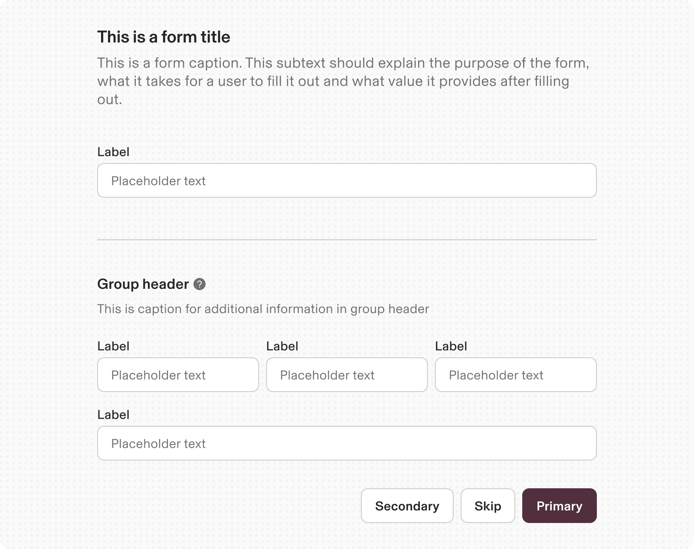

---

# Usage

## When to use

-   To collect user data for processing, such as account creation, feedback, or settings changes.
    
-   When multiple inputs are required to complete a task.
    

## When not to use

-   For single, simple actions (use buttons or toggles instead).
    
-   When you just need a textbox or a single component to accomplish the job.
    

## Responsiveness

By default, the form is fluid in width and expands to a maximum width of 576px. Below 576px, the form follows the mobile layout.

1.  576px width
    
2.  Less than 576px width triggers responsiveness and wraps components
    

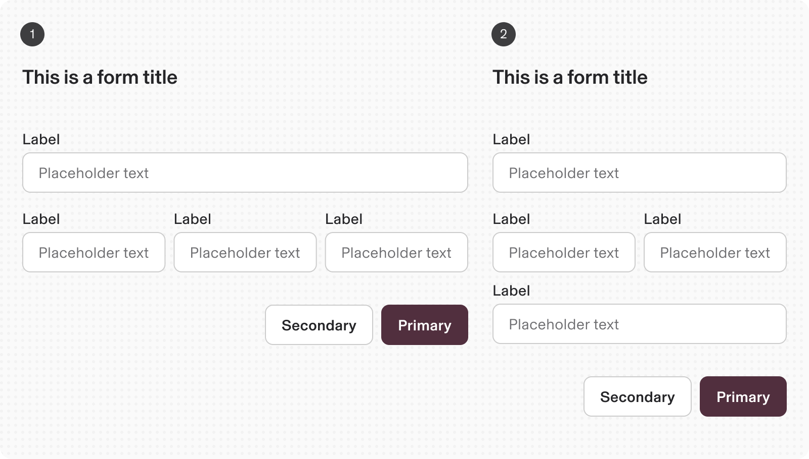

---

# Specs

## Anatomy

1.  **Title:** Title text establishes what the form is about.
    
2.  **Description:** Provides additional context and instructions around the form
    
3.  **Form body:** Area where users provide information. Information can be entered through various input fields, including text fields, checkboxes, and many other types. Input components contain labels and helper text that the user submits correct data.
    
4.  **Footer:** Provides actions that allow users to submit or cancel the data entered in the form.
    

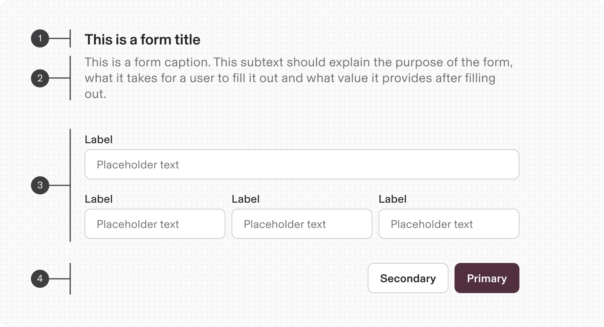

## Variants

1.  Default(without padding)
    

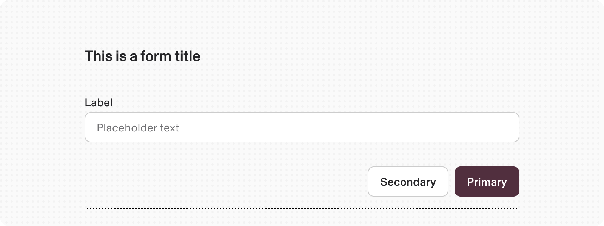

2.  with Padding
    

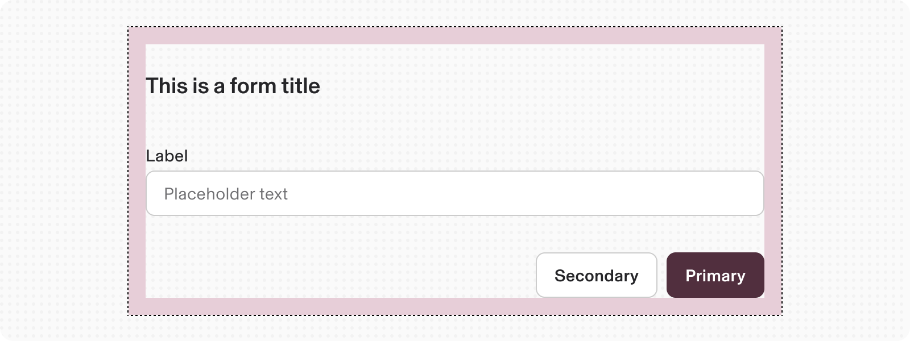

## Properties

**Type**

**Purpose**

**Visual representation**

with Description

Used when additional context is required with the Title

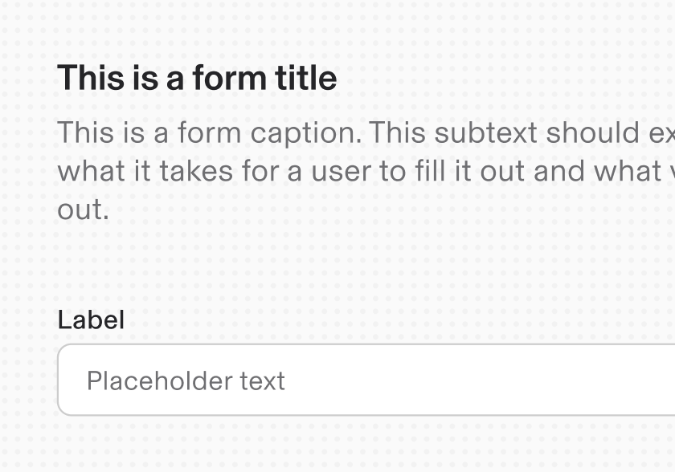

with Skip button

Allows user to skip the current form block in view

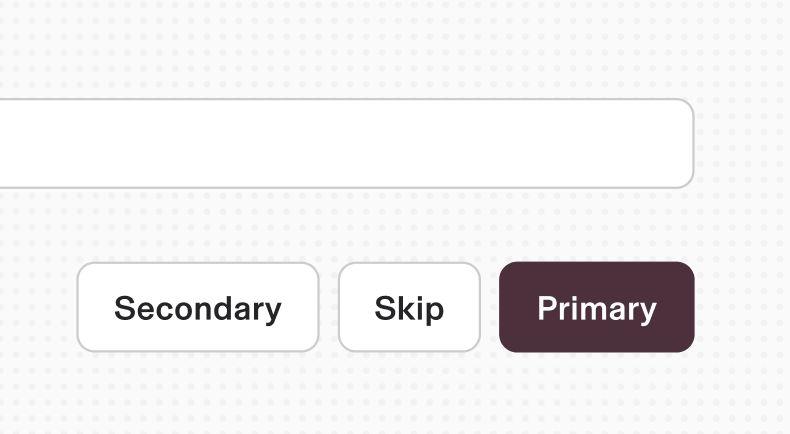

with Group header

Helps divide groups of a form through a header text to describe the group

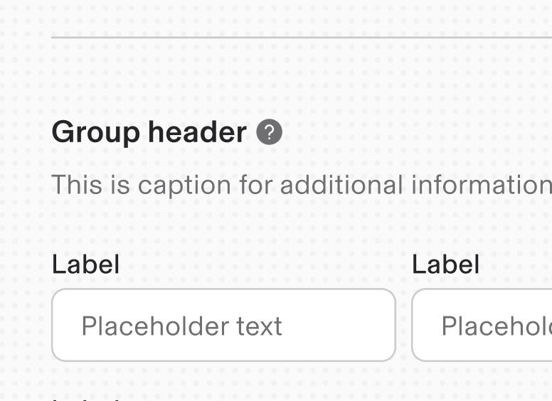

with inline group

Allows users to fit multiple inputs in the same line

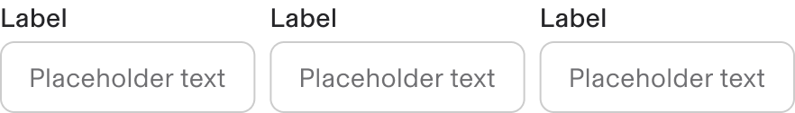

with custom child width

Allows users to fit multiple inputs in the same line with custom width

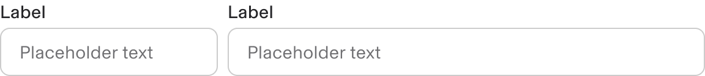

with custom JSX

Allows to add any other components in the JSX block.

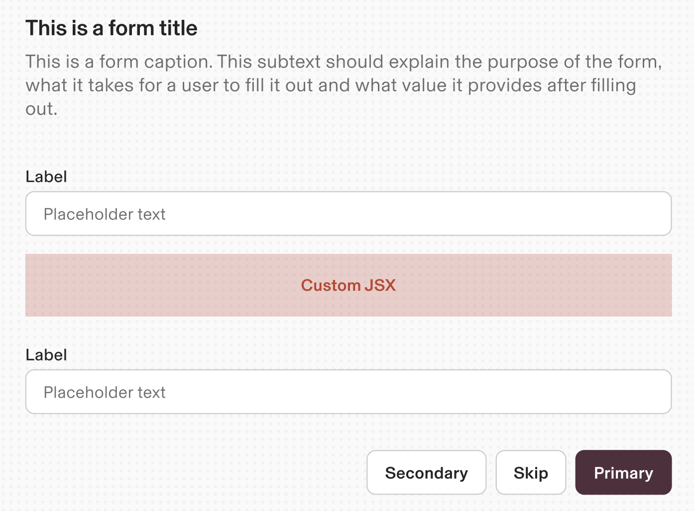

---

# Content guidelines

### Labels

-   Always use a label on input components
    
-   Sentence case
    
-   A descriptive noun or noun phrase, _not_ instructions. Ex: Country, not Select a country
    
-   Don’t use a colon after the label
    

### Default Values

-   Provide programmatic assistance by pre-filling inputs when possible.
    
-   Implement type-ahead suggestions if values cannot be determined.
    
-   Use sentence-case for default values and auto-completion text.
    

### Helper Text

-   Optional text aids users in completing fields accurately.
    
-   Should be visible when the input is focused and explain data format.
    
-   Replace persistent helper text with error messages upon state changes.
    

### Tooltip Help

-   Tooltips provide additional non-essential information inline with labels.
    
-   Can include links to further information or references.
    
-   Essential information should be presented as helper text beneath the field.
    

### Placeholder Text

-   Optional text appears inside input fields as hints or examples.
    
-   Should not replace persistent labels or convey essential information.
    
-   Use sentence-style capitalization and avoid punctuation in most cases.
    

---

# Accessibility

Keyboard Navigation:

-   Ensure all fields and buttons are focusable and navigable using the Tab key.
    

Screen Reader Support:

-   Use `aria-labels` for components to provide context.
    
-   Announce validation messages and form submission status.
    
-   Focus Indicators:
    
-   Clear visual cues for focused elements to assist users with keyboard navigation.
