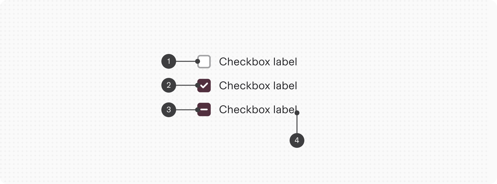
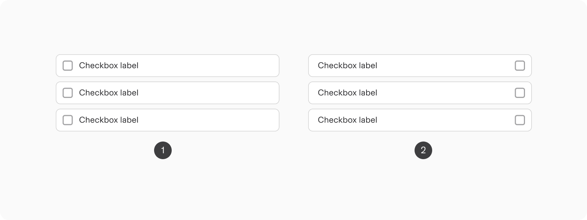
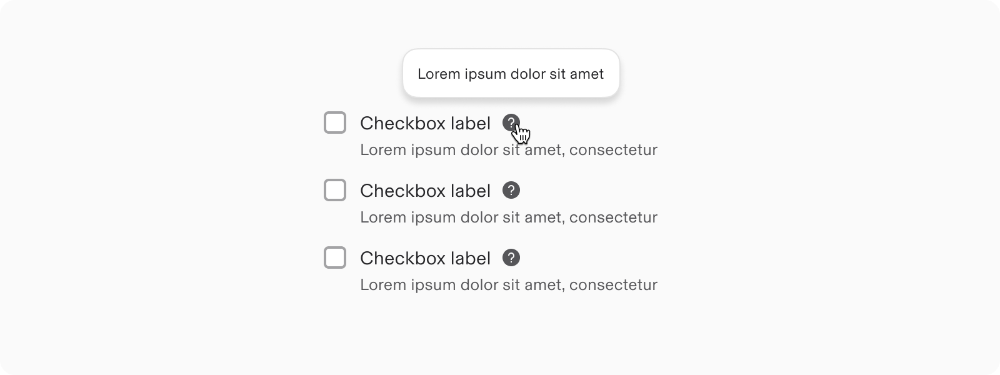
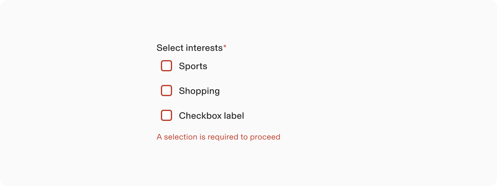
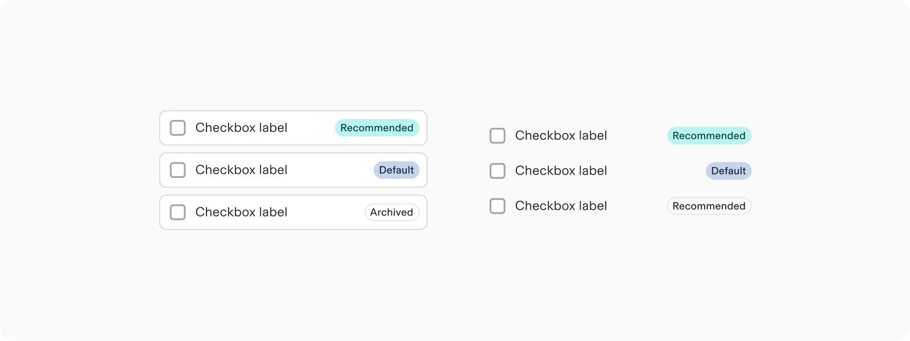
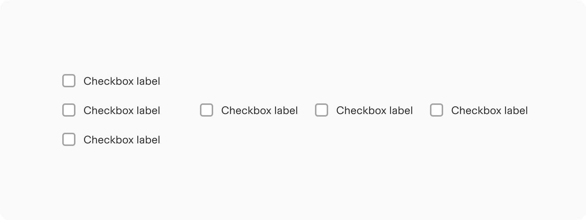
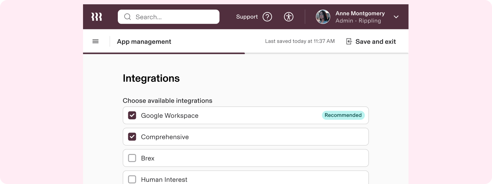
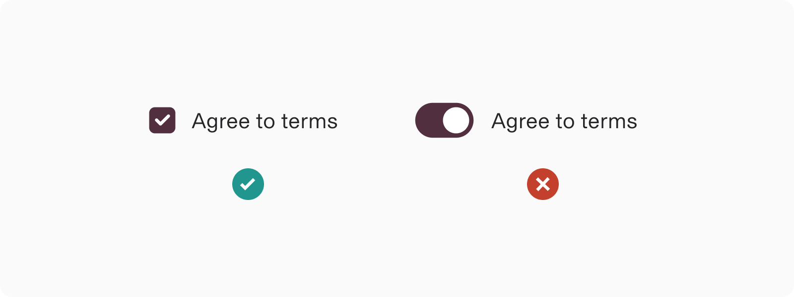
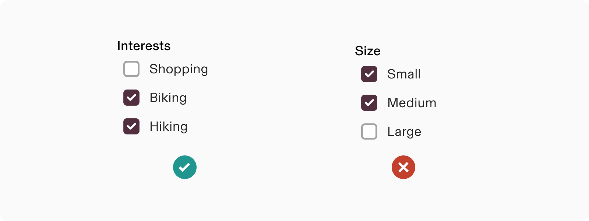

# Checkbox

**Source:** [View in Confluence](https://rippling.atlassian.net/wiki/spaces/RDS/pages/4046651447)  
**Last Synced:** 11/3/2025, 7:16:26 PM  
**Confluence Version:** 12

---

Introduction

A Checkbox lets users select and unselect options from a list.

---

# Overview

-   Select one or more options from a list
    

## Resources

**Type**

**Resource**

**Status**

Design

[Web Component (Figma)](https://www.figma.com/file/ysWbTtfWqhVDHQd1Mg2LQ1/v2-Component-Library?type=design&node-id=1701-9720&mode=design)

AVAILABLEGreen

Implementation

[Web Component (Storybook)](https://uikit.ripplinginternal.com/?path=/docs/components-inputs-checkbox-single--props)

AVAILABLEGreen

---

# Specs

## Anatomy

1.  Not selected
    
2.  Selected
    
3.  Indeterminate
    
4.  Label
    

## Configuration

### Appearance

1.  List
    
2.  Basic
    
3.  Box
    
4.  Card
    

### Position

1.  Default
    
2.  Reverse
    

Changing position is not available for the card checkbox type.

### Help

Supplementary context can be added to checkbox through the help text. For even more context, a help icon with a tooltip can be added to the end of the label.

### Error

Checkboxes can be marked as having an error to show that a selection that was made is invalid. For example, in a form that requires a user to acknowledge legal terms before proceeding, the checkbox would show an unchecked error to communicate that it needs to be selected.

### Tags

Certain options can be highlighted with relevant metadata.

### Orientation

Checkbox groups can be arranged horizontally or vertically, with the default orientation being vertical. When vertical space is constrained, opt for a horizontal layout.

Orientation is only available in the basic type of checkboxes.

---

# Usage

### When to use

-   To let users compare options from a list and select all, any, or none of those items
    
-   To turn a single option on or off
    

### When to use something else

-   To give the user a mutually exclusive choice, use the Radio component instead
    
-   To let users activate an option that takes effect immediately, use a Toggle instead
    

## Guidelines

### Checkbox or Toggle

Checkboxes are best used for communicating selection (like multiple table rows at once) while switches are best used for communicating activation (e.g., on/off states). A good mnemonic is toggles are often used when the change takes effect immediately whereas checkboxes are saved as a group.

### Checkbox or Radio

Checkboxes and radio buttons serve different purposes. Use checkboxes when multiple options can be selected, including the possibility of none. Radio buttons, on the other hand, are suitable when only one option from a set of mutually exclusive choices should be selected.

## Content standards

### Using the word “Select” in labels

Use the verb “Select” to describe the action we want people to take when interacting with checkboxes. If multiple selections can be made, be sure to say something like “Select all that apply” in either the heading or the body copy. For example, you could write something like “Select all the days you’re available.”

# Accessibility

Users should be able to:

-   Navigate to a checkbox with assistive technology
    
-   Toggle the checkbox on and off
    

## Keyboard Navigation

**Key**

**Action**

Tab

Moves focus to next checkbox

Space

Toggles a focused checkbox between selected and unselected
