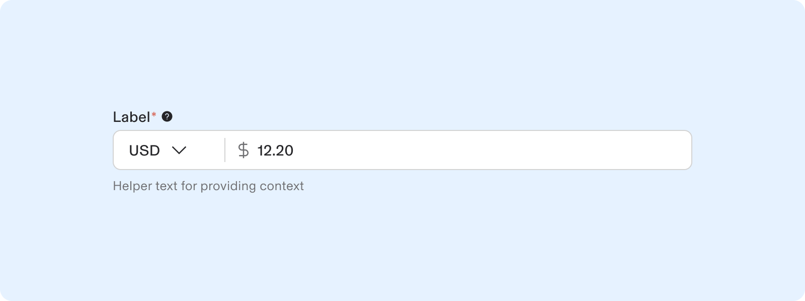
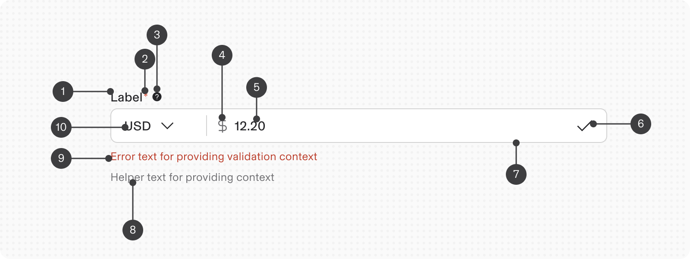
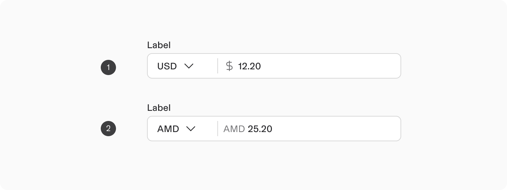
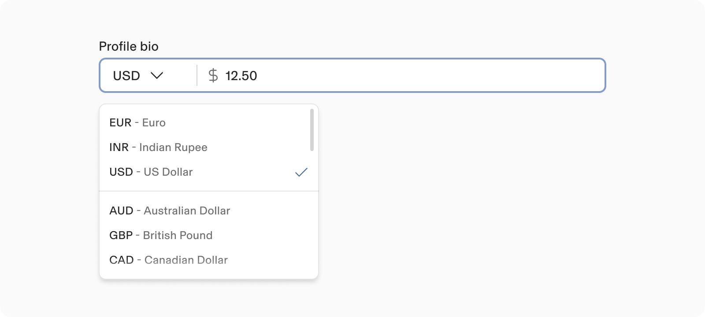
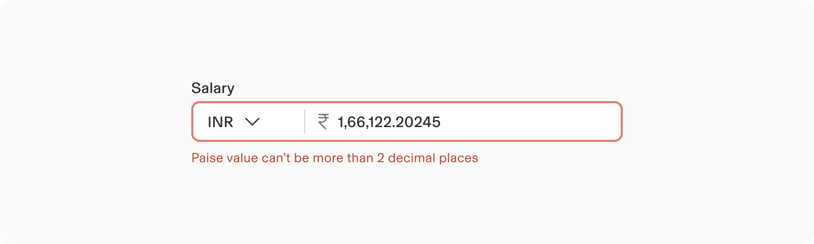
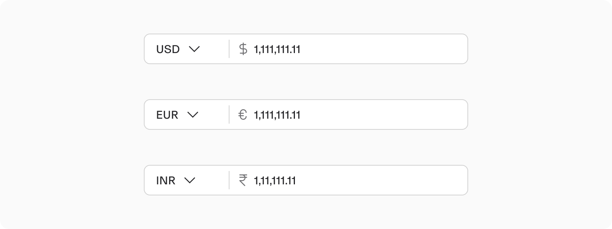

# Currency

**Source:** [View in Confluence](https://rippling.atlassian.net/wiki/spaces/RDS/pages/4745889036)  
**Last Synced:** 11/3/2025, 7:16:30 PM  
**Confluence Version:** 12

---

The Input currency component lets users add amount in a particular currency.

The Input currency component lets users add amount in a particular currency.

[Figma](https://www.figma.com/design/nhtRzieeGFf1tGVWnRxSK3/Web-Component-Library-\(v3\)?node-id=66677-231407&t=kjhhcYDemxDvw1mr-11) | [Storybook](https://pebble.ripplinginternal.com/?path=/docs/components-inputs-textarea--docs)

---

# Overview

Input Currency is a numerical entry with a dropdown for selecting a currency.  
It employs prefixes featuring a variety of currency symbols and icons to ensure accurate currency input.

note

This section highlights the unique differences and changes related to this component.  
Most styling, behavior, and functionality come from the Input Text component.  
[Explore the Input Text Documentation](https://rippling.atlassian.net/wiki/pages/resumedraft.action?draftId=4745888772&draftShareId=ff495fc7-0a49-47a5-804b-ca2980db7ea7)

This section highlights the unique differences and changes related to this component.  
Most styling, behavior, and functionality come from the Input Text component.  
[Explore the Input Text Documentation](https://rippling.atlassian.net/wiki/pages/resumedraft.action?draftId=4745888772&draftShareId=ff495fc7-0a49-47a5-804b-ca2980db7ea7)

---

# Usage

### When to use

-   Use the Input Currency component for entering monetary values to ensure standardised formatting.
    
-   Allow users to select their preferred currency for a seamless global experience.
    

### When to use something else

-   If the input consists solely of numerical values not related to currency—such as quantities, percentages, or measurements—a standard Number Input component is recommended.
    
-   For accepting user input that is not specifically related to currency, utilize text input or other variations depending on the scenarios outlined [here](https://rippling.atlassian.net/wiki/spaces/RDS/pages/4742381773/Text+Input#Variants).
    

---

# Spec

## Anatomy

1.  Label
    
2.  Required vs Optional Indicator
    
3.  Tooltip
    
4.  Prefix
    
5.  Value (currency text)
    
6.  Suffix
    
7.  Text Field
    
8.  Help text
    
9.  Error text
    
10.  Country Currency - Selector
     

## Appearance

### Prefix

#### 1\. Icon:

It is advisable to place a prefix before currency symbols such as “$”, “¥”, and “£” for clarity and consistency.

#### 2\. Text

When a currency code has no icon, it is repeated as a fallback, keeping the same style and position as a standard "prefix" item.

### Modifier

#### Currency code - Select

-   The Input Currency feature allows users to select a specific currency code from an easily accessible dropdown menu.
    
-   By default, the currencies are organized alphabetically by their codes.
    
-   Each currency name is displayed in singular form and adheres to title case syntax, which may necessitate custom adjustments for each currency code in English.
    

---

# Guideline

### Validation Guidelines

1.  **Input Restrictions**:
    
    -   The currency field **does not accept letters or spaces**.
        
    -   Only **numbers** are allowed.
        
2.  **Decimal Point Limit**:
    
    -   The input must be a **numeric value** with a maximum of **two decimal places**.
        
3.  **Validation Outcome**:
    
    -   If the input meets these criteria, it is considered **valid**.
        
    -   If not, it is considered **invalid**.
        

## Content Guideline

### Currency Formatting Guidelines

1.  **Currency Code:** Use the selected currency code to determine formatting.
    
2.  **Separators:**
    
    -   USD: 2 digit Decimal for cents, 3 digit comma for thousands (e.g., 1,231,234.56).
        
    -   INR: 2 digit Decimal for paise, 2 digit comma for thousands (e.g., 12,12,234.56).
        
    -   Other countries may use commas for cents and decimals for thousands (e.g., 1.234,56).
        
3.  **Regional Variations:** Adjust for differences, like using decimals in English Canada and commas in French Canada.
    
4.  **Dynamic Placeholder:** Update the placeholder to match the selected currency's format.
    

