# Date

**Source:** [View in Confluence](https://rippling.atlassian.net/wiki/spaces/RDS/pages/4797497345)  
**Last Synced:** 11/3/2025, 7:16:35 PM  
**Confluence Version:** 4

---

Introduction

A Date input component lets users select a date, navigate through months, and view date-related information.

[Figma](https://www.figma.com/design/nhtRzieeGFf1tGVWnRxSK3/Web-Component-Library-\(v3\)?node-id=66583-249796) [Storybook](https://pebble.ripplinginternal.com/?path=/docs/components-inputs-dates-single--docs)

---

# Overview

Date pickers allow users to select past, present, or future dates. The kind of date you are requesting from the user will determine which date picker (simple or calendar) is best to use.

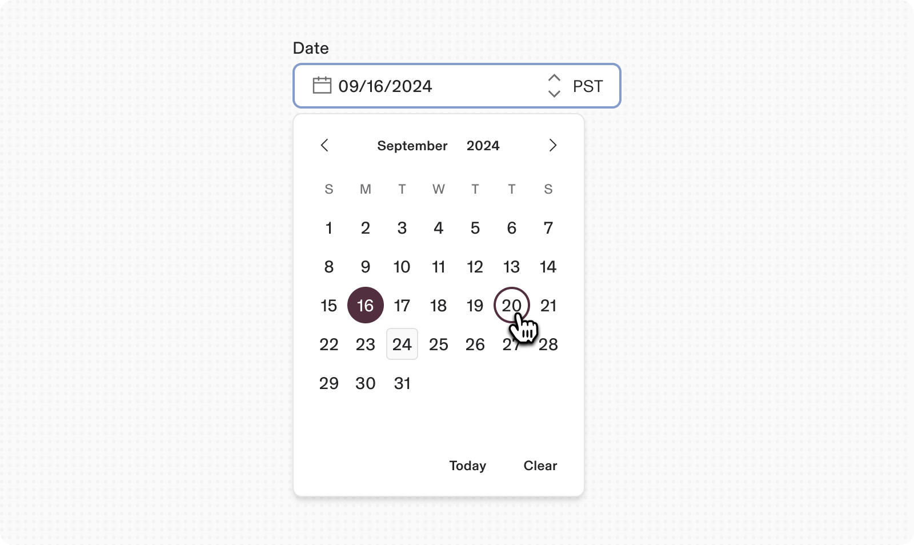

# Usage

-   When asking the user for an exact, approximate, or memorable date or time.
    
-   For scheduling tasks.
    

## Validations

-   When using labels other than "Date" and "Time" for pickers, ensure assistive technologies announce these labels along with the field component's label.
    
-   Allow multiple modes of data entry (e.g., typing and selection) to accommodate different user preferences, especially for keyboard users.
    
-   Provide accurate validation and error messaging for disabled dates, such as "Please enter a future date and time.”
    

---

# Specs

## Anatomy

1.  **Label:** Labels should indicate what information the field requires. The label is left-aligned above the input area.
    
2.  **Date input field:** Selecting this field opens the calendar component. Users can also type dates into the field. Once a date is selected, the option will be shown in the text input. This example shows date formatted in ‘MM/DD/YYYY’ but this can also be changed based on the region/locale standards to show other formats(ex. DD/MM/YYYY).
    
3.  **Calendar:** Contains the list of all dates and months. Selecting the previous or next arrows moves the calendar through months. Clicking the month shows the month picker while clicking on the Year shows the year picker.
    

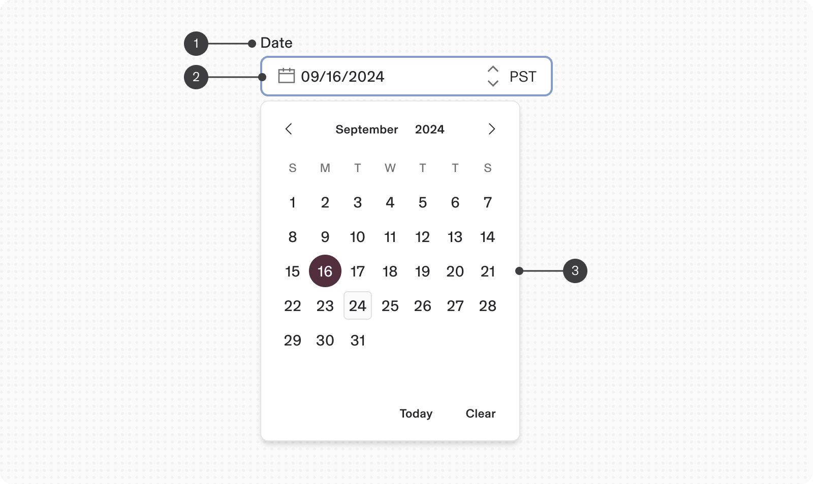

## Size

Follows the regular size types for inputs fields:

1.  Extra Small - 24px height
    
2.  Small - 32px height
    
3.  Medium (Default) - 40px height
    
4.  Large - 48px height
    

Calendar comes in the following two sizes:

1.  Small(Default)
    
2.  Large
    

## Variants

**Type**

**Purpose**

**Visual Representation**

Single

Used to select a single date in a form

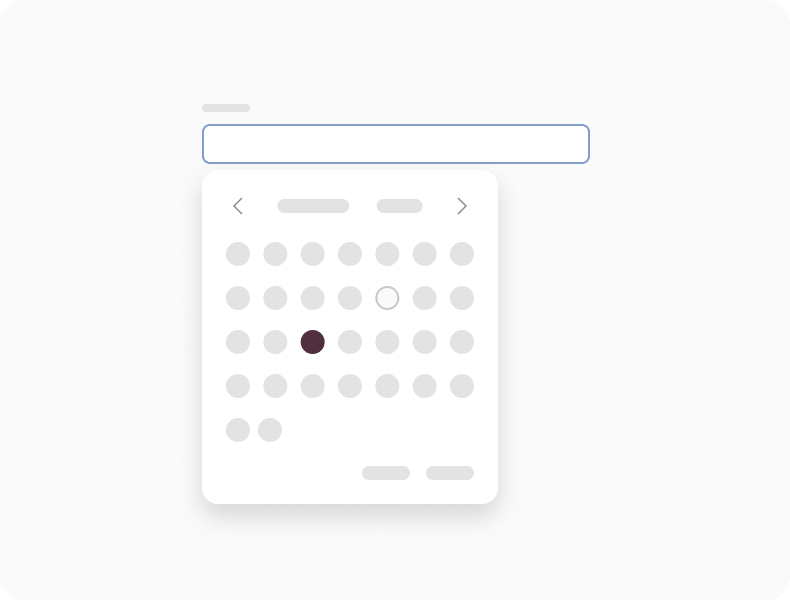

Range

Used to select a date range with start date and end date. For ex. In a travel websites, a round trip can be selected by selecting start date and a return date.

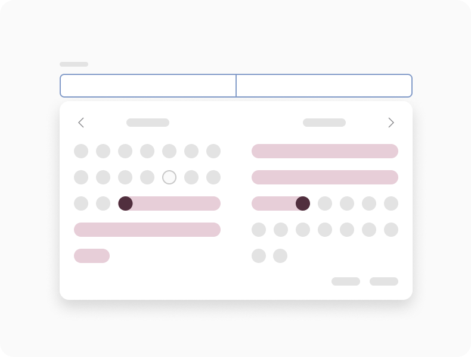

Inline multi-select

This feature allows users to select multiple dates without requiring an input field to initiate the process.

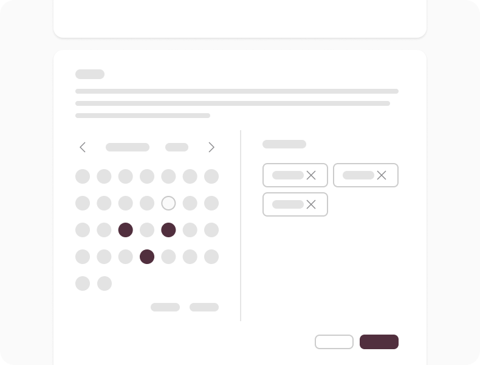

## Properties

**Type**

**Purpose**

**Visual Representation**

with help text

Use help text under a date picker to add supporting text for additional guidance on how to use the date-picker

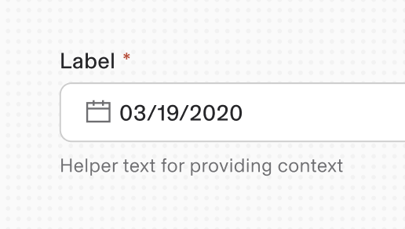

with Clear button

Used to clear out the filled date or range selection

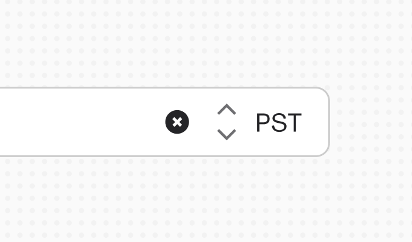

Display date and time

Use when a precise time of day is needed, usually for specific events

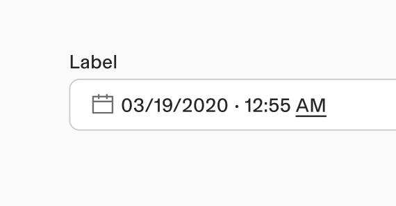

with Timezone selector _(not supported in range inputs)_

Allows user to pick a time zone from a list of timezones in the world

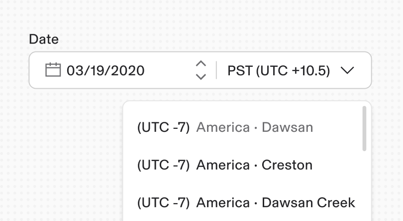

## Responsiveness

#### Single

1.  By default the input width is fluid and expands to fill up the available space.
    
2.  After 360px(upto 288px) breakpoint the content should hide the calendar icon and arrows. Also shorten the timezone text to the UTC version.
    

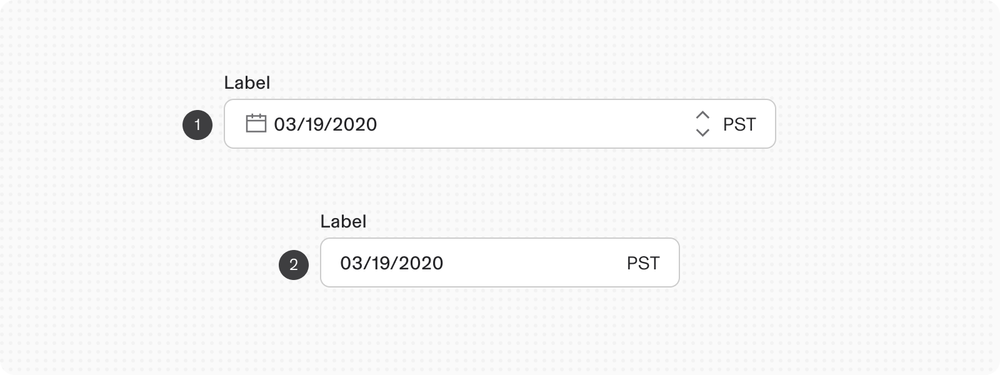

#### Range

The Range date input field behaves the same as the Single date input. Responsiveness only impacts the alignment of the two fields.

1.  Horizontally aligned for larger widths
    
2.  Vertically aligned for smaller widths
    

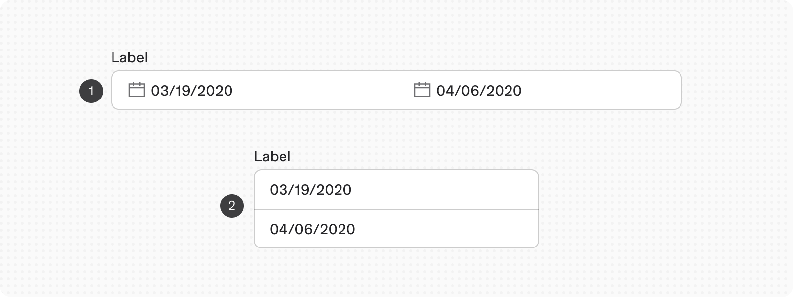

# Content

### Labels

-   Date and time pickers must have clear and descriptive labels.
    
-   Range inputs should be labeled with distinct start and end labels.
    

### Date Format

#### For simple date inputs:

-   Include the date format in parentheses inline with the label or as helper text below the label.
    

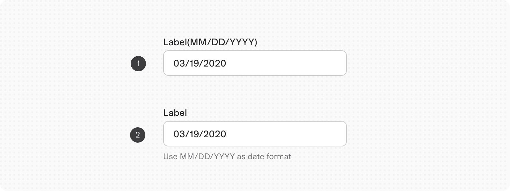

-   Avoid using only placeholder text for the date format, as it disappears when users start typing.
    

#### For calendar pickers:

The date format is automated when users select a date from the calendar menu.

### Localization

-   Date formats vary by location
    
-   Some use month/day/year; others use year-month-day.
    
-   Different separators (slashes vs. dashes) may be used.
    
-   The date picker supports customization of date format and language.
    

# Accessibility

-   Assistive technologies will announce these along with the label from the field component when activated.
    
-   Allow multiple modes of data entry. Some users prefer entering date and time information by typing instead of selection, especially keyboard users.
    
-   If some dates are disabled, provide accurate validation and error messaging for keyboard users, like: “Please enter a future time”
