# Email

**Source:** [View in Confluence](https://rippling.atlassian.net/wiki/spaces/RDS/pages/4742447204)  
**Last Synced:** 11/3/2025, 7:16:40 PM  
**Confluence Version:** 4

---

Introduction

An Email input field is a form element for entering email addresses

[Figma](https://www.figma.com/design/nhtRzieeGFf1tGVWnRxSK3/Web-Component-Library-\(v3\)?node-id=66583-250792) [Storybook](https://pebble.ripplinginternal.com/?path=/docs/components-inputs-email--docs)

---

# Overview

The Email input field is a handy tool designed for email validation, making sure that users enter their email addresses correctly with the help of built-in browser checks. It automatically checks the data against standard email formats, provides visual cues for any invalid entries, and shows clear error messages when needed.

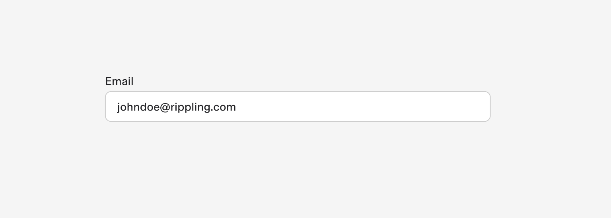

---

# Usage

### When to use

-   **Collection and Implementation:** Incorporate email fields during registration, login, and subscriptions for reliable communication.
    
-   **Format Validation:** Use automated verification for email formats to reduce errors.
    
-   **Communication Channel:** Use email for account notifications, newsletters, system updates, and user engagement.
    
-   **Security Measures:** Enhance security with email verification, identity confirmation, two-factor authentication, and secure password recovery.
    

### When not to use

-   Let's steer clear of using email fields for anything that isn't an email address (like phone numbers or usernames).
    
-   If you're not communicating digitally, there's no need to collect emails; just pick the right contact methods.
    
-   Remember, collecting emails in unsecured environments is a no-go; user data security should always come first.
    
-   If an email is already in the system or not necessary, let's cut out those extra email requests and keep our forms user-friendly.
    

## Validations

#### Invalid

When invalid data is entered or a required field remains unfilled, the system activates an error state that employs three distinct visual indicators:

1.  A prominent red border
    
2.  A descriptive error message
    

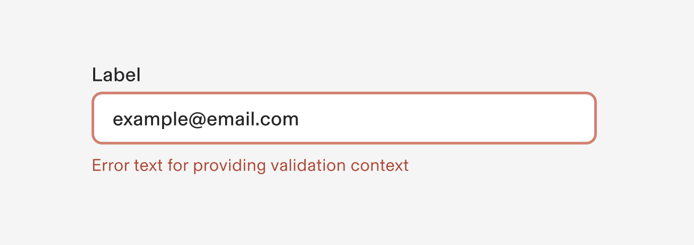

---

# Specs

## Anatomy

1.  **Label**
    
    -   Describes the input field's purpose
        
    -   Mandatory unless exempted for accessibility
        
    -   Guides users on expected input
        
    -   Shows red ‘Asterix’ if this field is required
        
2.  **Email value**
    
    -   Needed in the correct email address format(ex. johndoe@rippling.com)
        
3.  **Helper Text**
    
    -   Provides context and guidance
        
    -   Includes format requirements
        
    -   Enhances understanding of the field's purpose
        
4.  **Help icon**
    
    1.  Shows help text in a tooltip on hover
        
5.  **Input Field**
    
    -   Container to accept email data entry
        

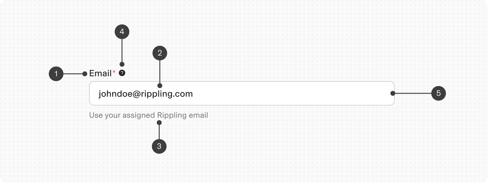

## States

**Type**

**Purpose**

**Visual representation**

Default

-   Default state is input not yet interacted with by the user.
    
-   For an optimal user experience, this component should show a preset default value.
    

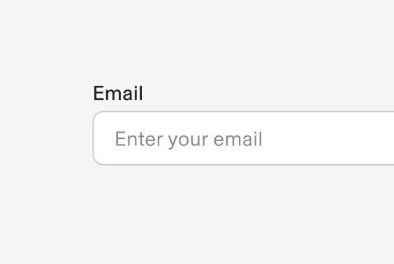

Hover

When a user’s mouse cursor is hovering over the field

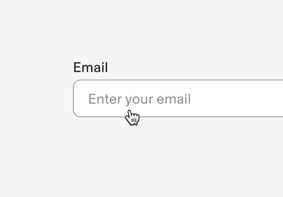

Filled

When a user types in an email after clicking/tabbing on it

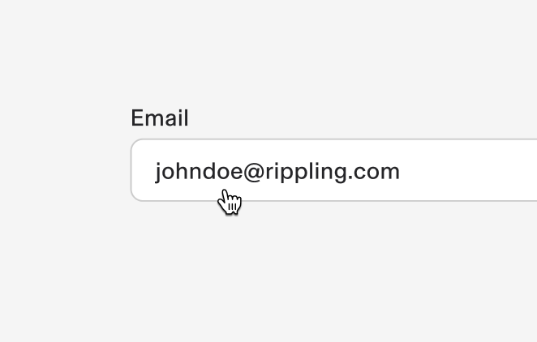

Focus

When a user tabs to or clicks on the email input, the field or controls become focused, indicating the user has successfully navigated to the component

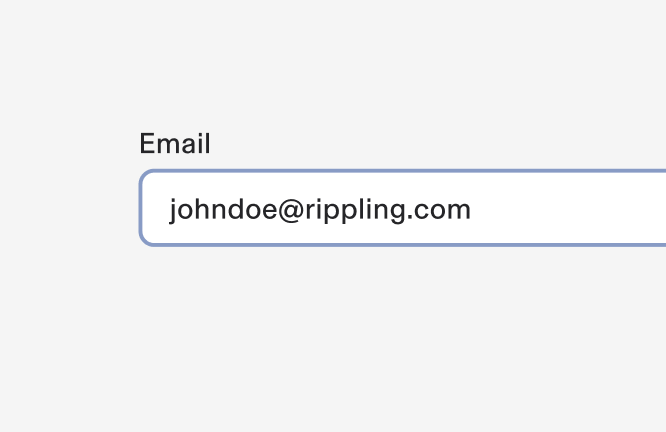

Invalid

When the filled email value is invalid. It can also be triggered due to a system error. This state requires a user response before data can be submitted or saved.

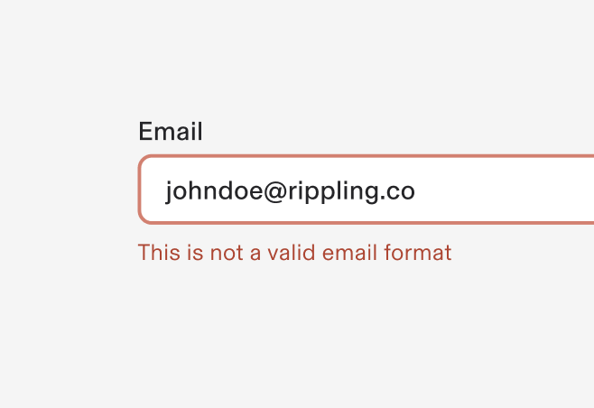

Disabled

When the user cannot interact with a component and all interactive functions have been removed. Unlike read-only states, disabled states are not focusable, are not read by screen readers, and do not need to pass visual contrast, making them inaccessible if they need to be interpreted.

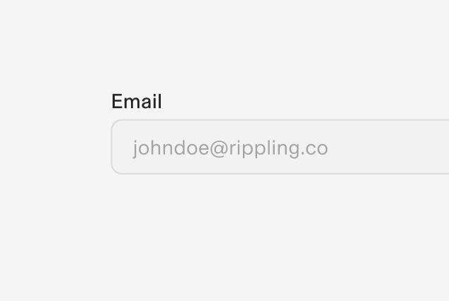

## Properties

**Type**

**Purpose**

**Visual representation**

with Prefix

-   Includes a prefix symbol or text before the email.
    
-   Usually used to show @ or mail icon
    

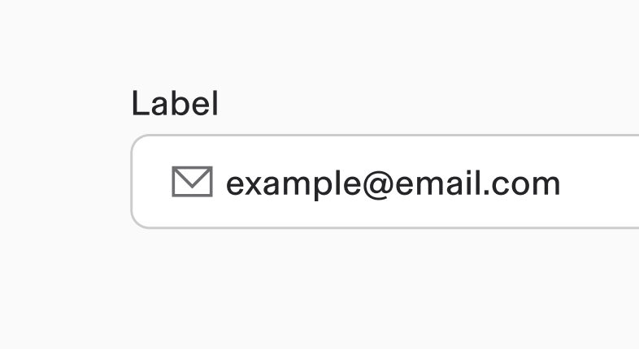

with Suffix

-   Includes a suffix symbol or text after the email.
    
-   Useful for showing validation icons
    

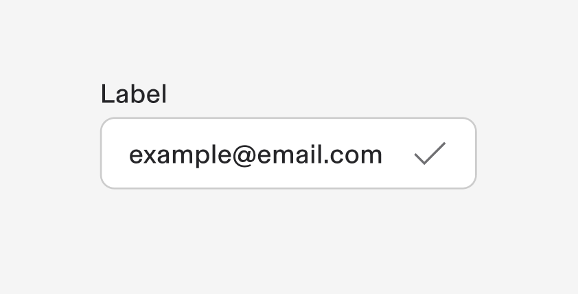

## Size

1.  Extra small - 24px height
    
2.  Small - 32px height
    
3.  Medium (Default) - 40px height
    
4.  Large - 48px height
    

## Interactions

#### Mouse

The email input field allows value entry by directly typing in the input cotainer.

#### Keyboard

For accessibility, users can navigate to the input field with the `Tab` key

---

# Content

#### Label

-   Include clear, descriptive labels to guide users
    
-   Craft concise, meaningful labels
    
-   Apply sentence-style capitalization (capitalize first word only)
    

#### Helper Text

-   Specify input constraints -
    
-   Optional feature that transforms into warning/error messages when necessary
    

#### Content Length Guidelines

Keep all elements concise. Each element should not exceed two lines to maintain clarity and usability.

# Accessibility

The standard email input component in our design system incorporates accessibility.
