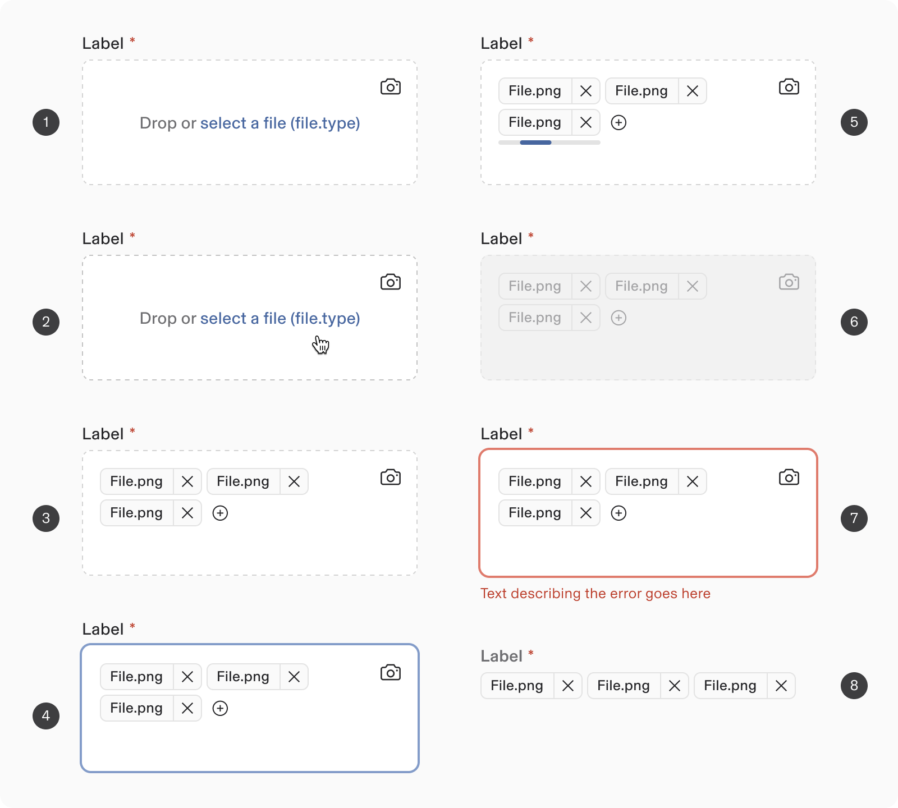
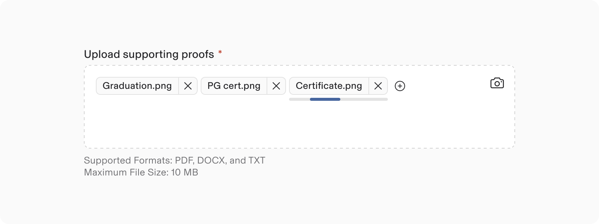
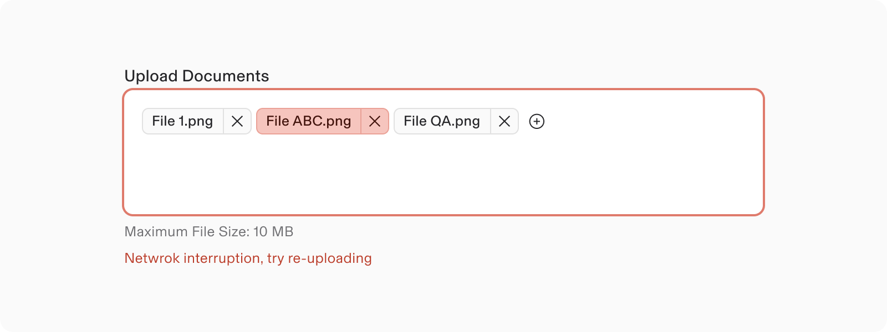
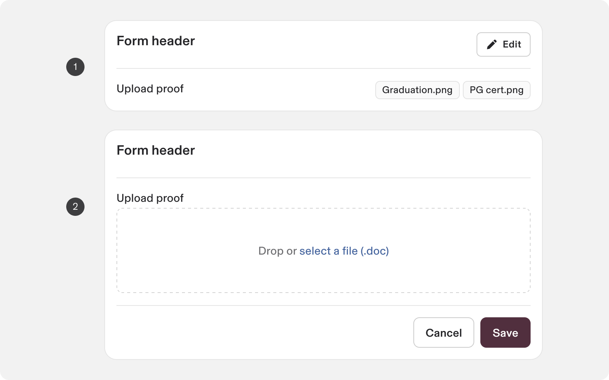
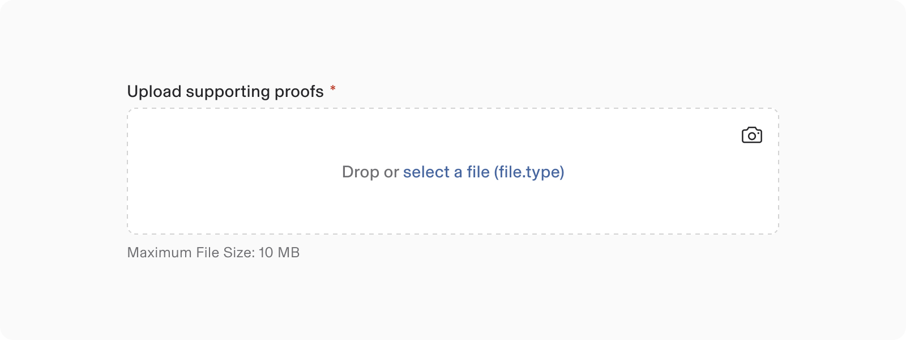
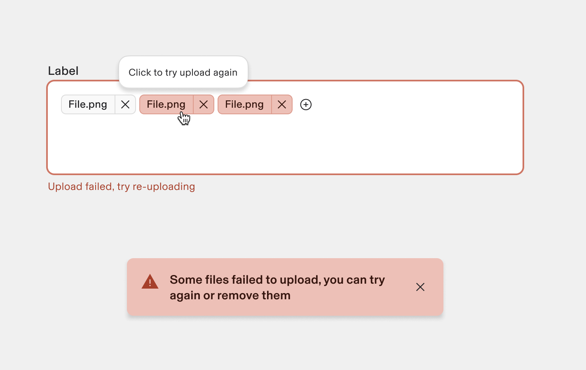

# File Drop

**Source:** [View in Confluence](https://rippling.atlassian.net/wiki/spaces/RDS/pages/4745889681)  
**Last Synced:** 11/3/2025, 7:16:44 PM  
**Confluence Version:** 12

---

Input File Drop component allows user to either drag and drop the file into the input area or upload from computer.

Input File Drop component allows user to either drag and drop the file into the input area or upload from computer.

[Figma](https://www.figma.com/design/nhtRzieeGFf1tGVWnRxSK3/Web-Component-Library-\(v3\)?node-id=66677-184890&t=5tjVRS5TzpbCK6OY-11) | [Storybook](https://rippling.design/pebble?path=/docs/components-inputs-filedrop--docs)

---

# Overview

-   Input file drops enable users to choose and upload multiple files to a specified location.
    
-   They are frequently utilised in forms but can also operate as independent components.
    

note

This section highlights the unique differences and changes related to this component.  
Most styling, behavior, and functionality come from the Input Text component.  
[Explore the Input Text Documentation](https://rippling.atlassian.net/wiki/pages/resumedraft.action?draftId=4745888772&draftShareId=ff495fc7-0a49-47a5-804b-ca2980db7ea7)

This section highlights the unique differences and changes related to this component.  
Most styling, behavior, and functionality come from the Input Text component.  
[Explore the Input Text Documentation](https://rippling.atlassian.net/wiki/pages/resumedraft.action?draftId=4745888772&draftShareId=ff495fc7-0a49-47a5-804b-ca2980db7ea7)

---

# Usage

### When to use

-   Uploading one or more files by dragging and dropping.
    
-   Showing the process of uploading.
    

### When to use something else

-   Avoid using the file upload feature in a modal for multiple files. When you do this, the uploaded files will be displayed in a vertical list, which can be difficult to manage.
    

---

# Specs

## Anatomy

1.  Label: Text to describe the upload section.
    
2.  Required indicator
    
3.  Tooltip
    
4.  Description & Actionable link: Text to help the user with the action to select a file to upload.
    
5.  Camera Button: Open camera to click and upload.
    
6.  Help text
    
7.  Upload field outline
    
8.  Drop zone
    
9.  Uploaded file - Chip: A file that has successfully been uploaded and option to remove it.
    
10.  Action - Remove uploaded file
     
11.  Loading - Uploading state
     
12.  Action - Icon button: To add more files
     

## Configuration

### State

1.  Default
    
2.  Hover
    
3.  Filled
    
4.  Focused
    
5.  Loading
    
6.  Disabled
    
7.  Invalid
    
8.  Read Only
    

### Loading state

Loading state indicates the ongoing upload process (to prevent further user interactions until the upload is complete).

### Appearance: Invalid

-   An error state is triggered when a file upload fails, providing users with clear guidance to help them resolve the issue effectively.
    
-   User's error message can wrap (if its multi-line) for providing detailed information.
    
-   If the error relates to the Input file drop as a whole instead of an individual file, you can use an error text.
    

### Appearance: Form Usage

1.  Read only
    
2.  Editable
    

---

# Guidelines

### Behavior

#### Upload single/multiple files

Input file drops allow users to upload files by dragging them into a drop zone or using a clickable link.

note

This component supports multiple file uploads by default, with an option to restrict to a single file.

This component supports multiple file uploads by default, with an option to restrict to a single file.

#### Upload using camera

The camera button in the Input file drop feature enables seamless access to the device's camera, managing permissions and providing options for file dropping or capturing images directly.

### Failed Upload - Error State Resolution

-   An upload failure triggers an error state in the Input file drop.
    
-   The failed file chip displays the file name with an error.
    
-   Users can still upload files despite the error.
    
-   **Error Notification**
    
    -   Failed files show a **negative appearance state on the chip**.
        
        -   The **help text** under the invalid field offers guidance.
            
        -   **Snackbar Update:** _“Some files failed to upload. You can try again or remove them.”_
            
-   **Error Resolution**
    
    -   Hovering over the failed file chip reveals a **tooltip**: ‘**clicking on the chip will initiate a re-upload**’.
        

## Content guidelines

### Label

-   Label follows the same [guidelines](https://rippling.atlassian.net/wiki/spaces/RDS/pages/4742381773/Text+Input#Label.1) as other Input fields.
    

#### Actionable links - label

-   Actionable link labels should be brief and indicate the action.
    
-   “Drop or select a file (file.type)” is the default label for the uploader.
    
-   The drop zone label should inform users they can drag and drop a file or click to upload.
    

#### Uploaded file chip

-   The uploaded file's name.
    
-   Truncate the name as per the chip’s max allowed width guidelines.
    

#### Help Text

-   Informing users about file limitations in advance helps avoid issues like incompatible file types or large files.
    
-   Clearly outline each limitation positively in separate sentences.
    
-   We recommend the following phrasing:
    

Use case

Examples

File type

You can upload \[x\], \[x\] and \[x\] file formats.

File size

Files can be up to \[file limit\].

Number of files

You can upload up to \[max #\] files.

### Error text

-   Possible reasons for the failure may include:
    
    -   Invalid file type
        
    -   Exceeding the file size limit
        
-   We recommend the following phrasing:
    

Status

Recommended phrasing

Invalid file type

This file is not an accepted format. You can upload \[x\], \[x\] and \[x\] file formats.

Exceeds file size limit

This file size is too big. You can upload files up to \[file limit\].

Network errors (internet connection dropped while uploading, request timeout, service is down)

Something went wrong with the network. Check your internet connection, then try again.

Too many uploads in a certain amount of time

We couldn’t upload so many files so quickly. Try uploading files more slowly, or try again later.

Generic (encountered an internal error)

Something went wrong. Try again.

---

# Accessibility

## Keyboard Navigation

**Keys**

**Action**

Tab

Places the focus on the next interactive element, which is either a button or a close button

Space / Enter

-   Dismissible: If focus is on the close button, dismisses the notice.
    
-   If focus is on the button, executes the button action/ launch the link
