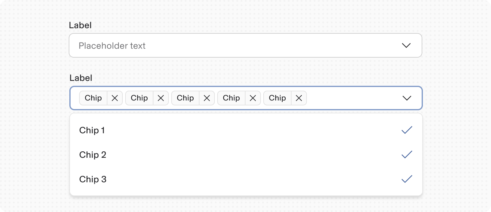
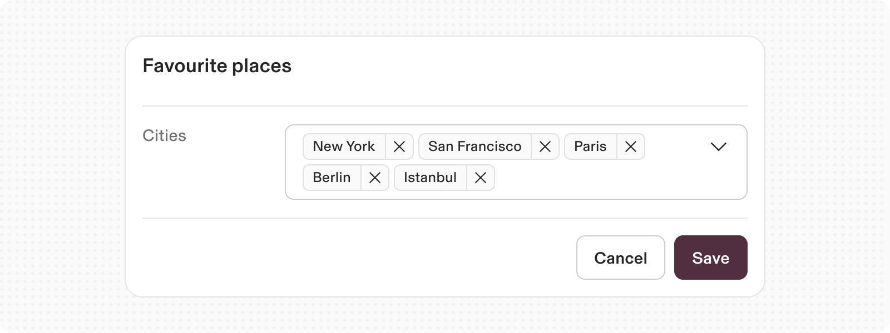
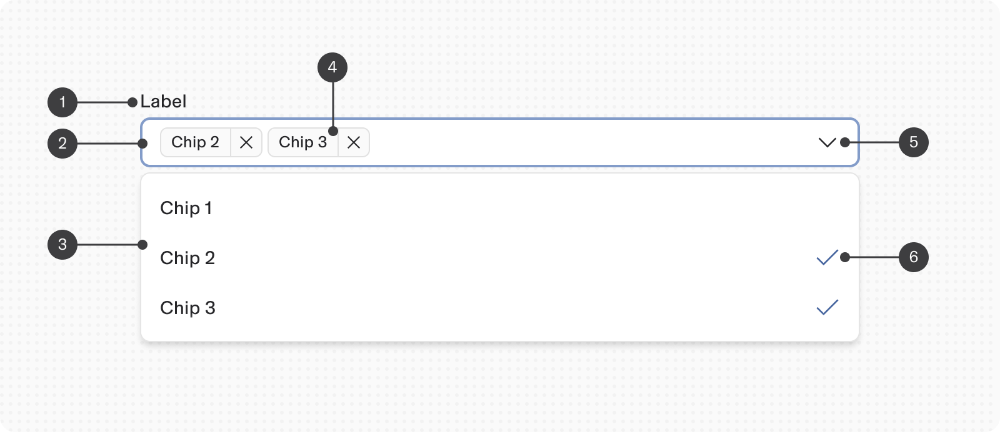
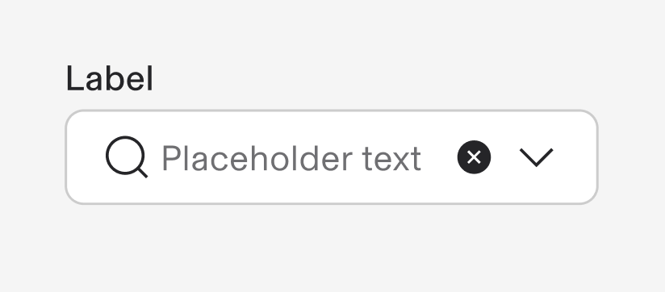
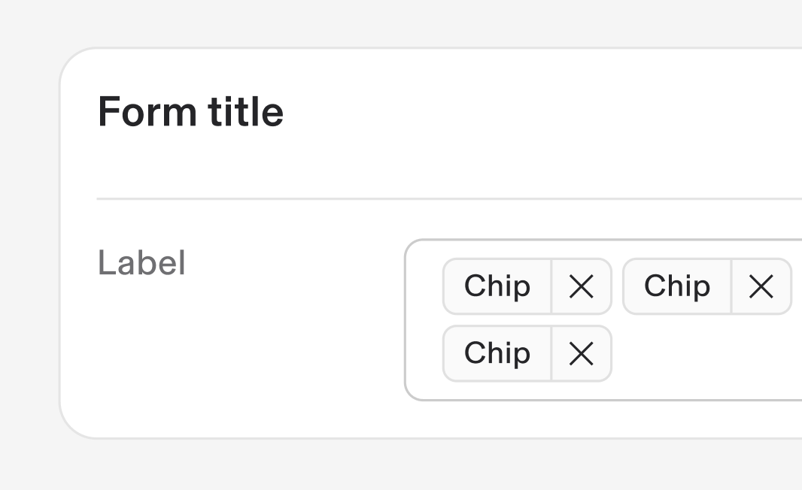
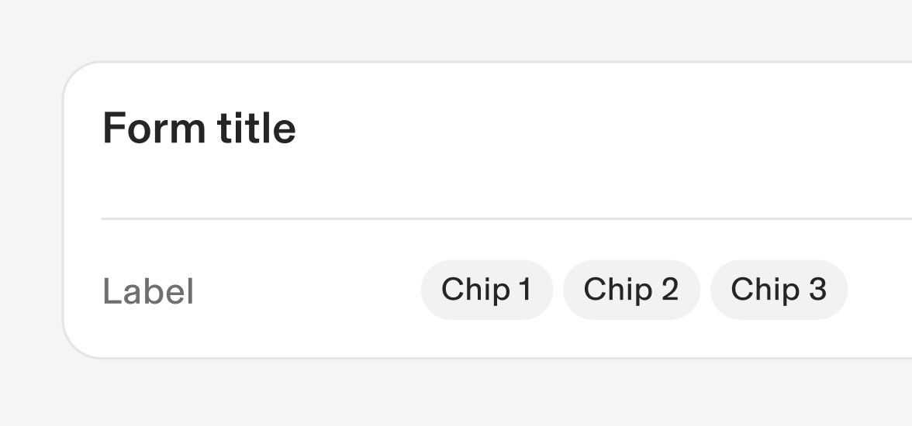
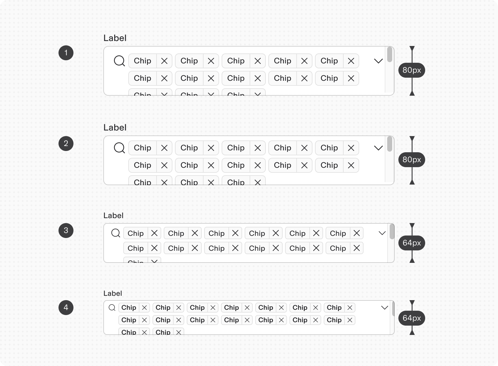

# Multi-select

**Source:** [View in Confluence](https://rippling.atlassian.net/wiki/spaces/RDS/pages/4832657447)  
**Last Synced:** 11/3/2025, 7:17:54 PM  
**Confluence Version:** 2

---

Select component lets users select one option form a dropdown menu.

Input Multi-select component lets users select multiple options from a dropdown menu.

[Figma](https://www.figma.com/design/nhtRzieeGFf1tGVWnRxSK3/Web-Component-Library-\(v3\)?node-id=66583-254021) | [Storybook](https://pebble.ripplinginternal.com/?path=/docs/components-inputs-select--docs#list-as-function-for-multi-select)

---

# Overview

The Multi-Select component allows users to select multiple options from a dropdown list. It is useful for forms and filters where users need to choose more than one item from a set of options.

---

# Usage

### When to use

-   When users need to select multiple options from a list.
    
-   In filters or settings where multiple criteria can be applied.
    

### **When to use something else**

-   For single selection scenarios (use a standard dropdown instead).
    
-   When the list of options is extremely long and needs a different UI pattern like a search or filter.
    

---

# Specs

## Anatomy

1.  **Label:** Text guiding users on dropdown options.
    
2.  **Input Field:** Displays selected items as chips and includes a dropdown icon.
    
3.  **Dropdown Menu:** Contains a list of selectable items.
    
4.  **Chips:** Represent selected items within the input field, each with a removable action.
    
5.  **Dropdown Icon:** Indicates the ability to expand or collapse the dropdown menu.
    
6.  **Is Selected:** Shows tick icon to indicate selected option in the dropdown
    

## States

This follows all the states similar to **Input Select** component.

## Variant

**Type**

**Purpose**

**Visual Representation**

with Prefix

Search icon is used to indicate search functionality to select from multiple option

Can Clear

Once filled, the input field can be cleared with the Clear icon

in Form

When using this in a Form pattern

Read only

When the options are not interactive

## Responsive

The input field wraps the Chips to the next line until the max-height is reached. Once the chips start overflowing, the input field becomes scrollable.

Max-height options for different Multi-select size are as follows:

1.  Large - 80px
    
2.  Medium(Default) - 80px
    
3.  Small - 64px
    
4.  Extra-small - 56px
    

You can configure a custom max-height as well depending on the scenario.

---

# Accessibility

-   Keyboard Navigation: Tab to focus on the input field, Enter or Space to open dropdown, Arrow keys to navigate, Enter or Space to select/deselect items, and Backspace to remove chips.
    
-   Screen Reader Support: Announce the number of selected items, and provide clear labels for all interactive elements.
    
-   Focus Indicators: Ensure clear focus outlines for all interactive parts of the component.
