# Number

**Source:** [View in Confluence](https://rippling.atlassian.net/wiki/spaces/RDS/pages/4742578217)  
**Last Synced:** 11/3/2025, 7:16:50 PM  
**Confluence Version:** 7

---

Introduction

A number input field is an input that allows a user to write or edit numbers

[Figma](https://www.figma.com/design/nhtRzieeGFf1tGVWnRxSK3/Web-Component-Library-\(v3\)?node-id=66583-250956) [Storybook](https://pebble.ripplinginternal.com/?path=/docs/components-inputs-number--docs)

---

# Overview

Number inputs are a handy tool designed specifically for entering numeric values. Unlike your regular text inputs, these controls come with a user-friendly two-segment interface that lets users easily tweak values up or down. This thoughtful design really helps cut down the effort needed for making those precise numerical adjustments, particularly when you're dealing with smaller values.

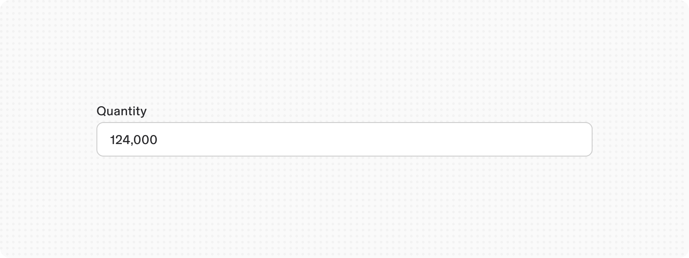

---

# Usage

### When to use

-   The user needs to input a numeric value
    
-   Adjusting small values when increasing or decreasing them requires `Up` and `Down` arrows
    
-   When users may not know exact values and only want to change the values that are relative to its current state
    

### When not to use

It is also best to avoid number input for continuous variables such as prices, distances, lengths, or human heights. When the exact value is important to specify within a wide range, use text input instead.

## Validations

#### Invalid

When invalid data is entered or a required field remains unfilled, the system activates an error state that employs three distinct visual indicators:

1.  A prominent red border
    
2.  A descriptive error message
    

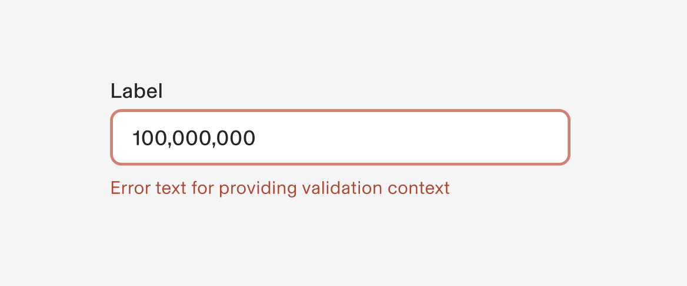

### Default values

Numeric input should contain default values based on the context of the input such as Number of adults while hotel booking or defining dependents. The default will usually be ‘1’. Sometimes, you will have input value defaulted to ‘0’. For example, when booking a hotel room, it may set the default number of adults as ‘1’ and the default number of children as ‘0’. In cases like entering a salary, you may leave out default values.

---

# Specs

## Anatomy

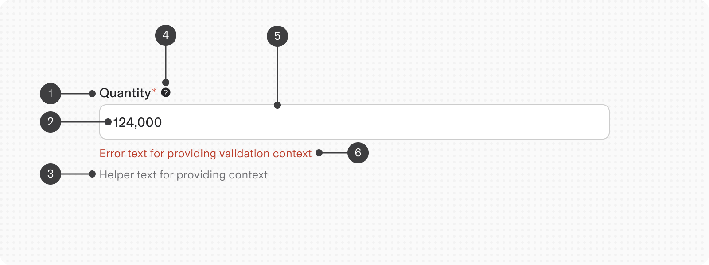

1.  **Label**
    
    -   Describes the input field's purpose
        
    -   Mandatory unless exempted for accessibility
        
    -   Guides users on expected input
        
    -   Shows red ‘Asterix’ if this field is required
        
2.  **Numeric Value**
    
    -   Updates based on user input and controls
        
3.  **Helper Text**
    
    -   Provides context and guidance
        
    -   Includes format requirements
        
    -   Enhances understanding of the field's purpose
        
4.  **Help icon**
    
    1.  Shows help text in a tooltip on hover
        
5.  **Input Field**
    
    -   Container for user data entry
        
    -   Accepts numeric input directly
        
6.  **Error/Warning Text:**
    
    -   Replaces helper text when issues occur
        
    -   Aids users in correcting entries
        

## States

**Type**

**Purpose**

**Visual representation**

Default

-   Default state is when it is active but not yet interacted with by the user.
    
-   For an optimal user experience, this component should show a placeholder text value.
    

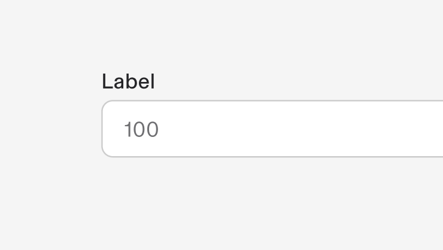

Hover

When a user’s mouse cursor is hovering over the field

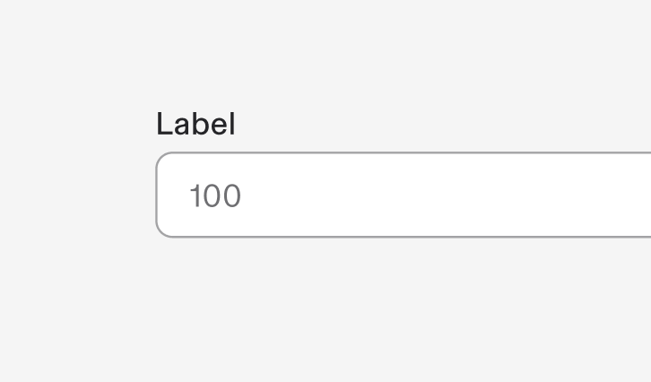

Focus

When a user tabs to or clicks on the number input, the field or controls become focused, indicating the user has successfully navigated to the component

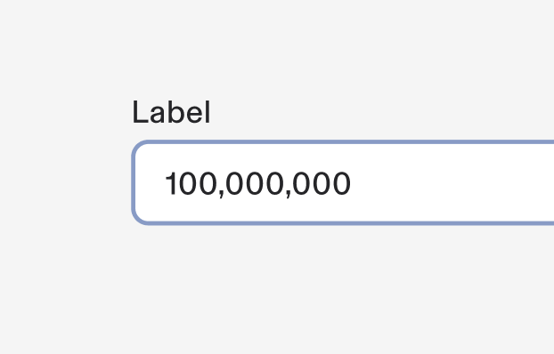

Invalid

When the required number input has not been filled in. It can also be triggered due to a system error. This state requires a user response before data can be submitted or saved.

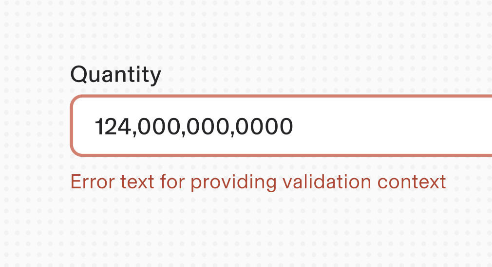

Disabled

When the user cannot interact with a component and all interactive functions have been removed. Unlike read-only states, disabled states are not focusable, are not read by screen readers, and do not need to pass visual contrast, making them inaccessible if they need to be interpreted.

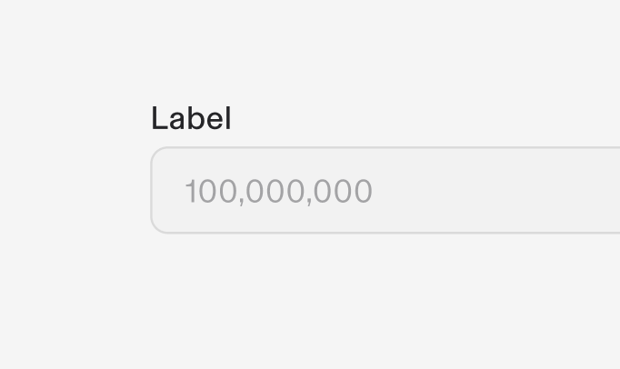

## Properties

**Type**

**Purpose**

**Visual representation**

with Prefix

-   Includes a prefix symbol or text before the number.
    
-   Ideal for any context where a symbol or unit precedes the number.
    
-   Clearly indicate the unit or symbol that applies to the number, ensuring user clarity.
    

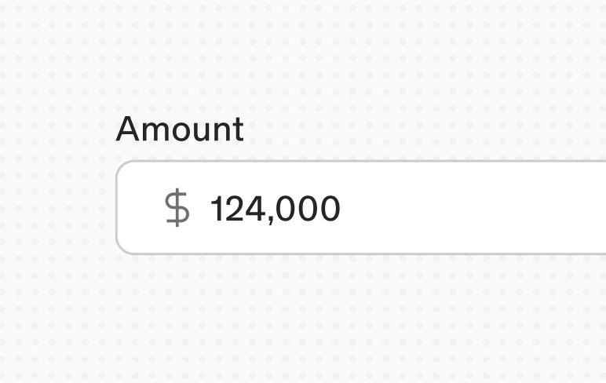

with Suffix

-   Includes a suffix icon or text after the number.
    
-   Useful for measurements or units that follow the number.
    
-   Place the relevant unit or symbol after the number to avoid confusion.
    

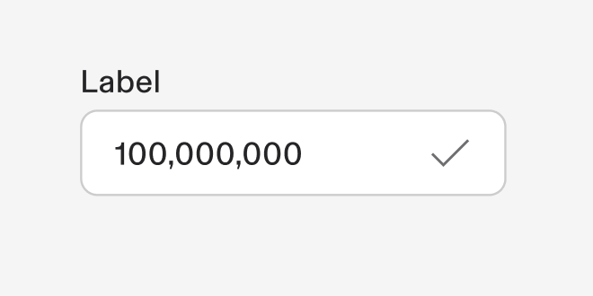

supports Decimals

-   Allows precise input with decimal points.
    
-   Suitable for financial entries, scientific data, or any input requiring precision (e.g., "1.12").
    
-   Ensure users can input and see enough decimal places for their needs.
    

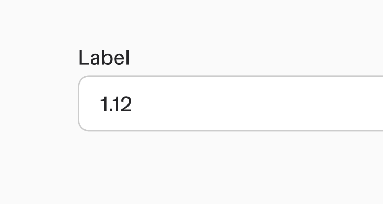

supports Calculations

-   Accepts and shows calculations.
    
-   Useful for fields where users enter expressions rather than single values (e.g., "1 x 2").
    
-   Allow users to input basic arithmetic operations, displaying the result dynamically if possible.
    

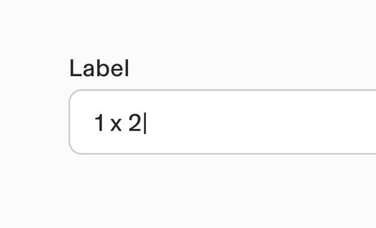

## Size

1.  Extra small - 24px height
    
2.  Small - 32px height
    
3.  Medium (Default) - 40px height
    
4.  Large - 48px height
    

## Interactions

#### Mouse

The number input field allows value modification by typing or using increment/decrement controls. Users can:

-   Type a value directly
    

#### Keyboard

For accessibility, users can:

-   Navigate to the input field with the `Tab` key
    
-   Adjust values using arrow keys:
    
    -   Press `Up arrow` to increase
        
    -   Press `Down arrow` to decrease
        

## Default values

Numeric input should always have a default. You will have input value defaulted to ‘0’. For example, when booking a hotel room, it may set the default number of adults as ‘1’ and the default number of children as ‘0’.

---

# Content

#### Label

-   Include clear, descriptive labels to guide users
    
-   Craft concise, meaningful labels
    
-   Apply sentence-style capitalization (capitalize first word only)
    

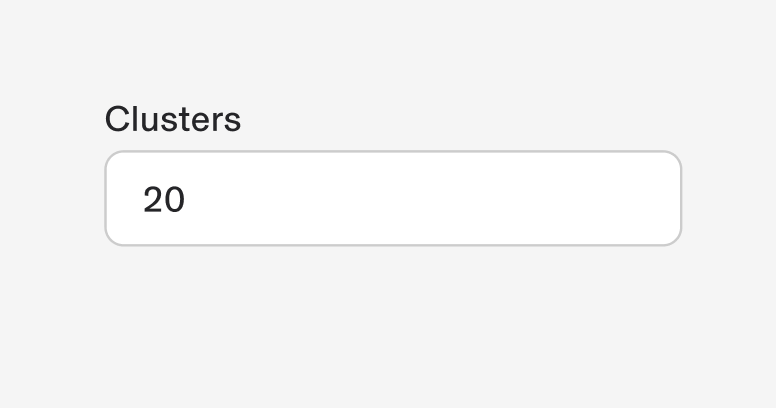

**Do**

Example of proper label implementation

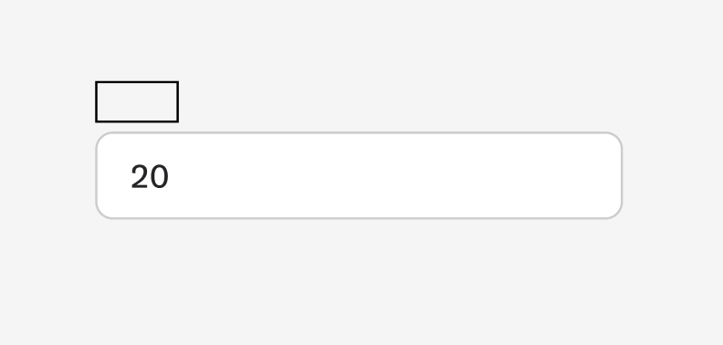

**Don’t**

Never hide labels - they provide essential context for number inputs

#### Helper Text

-   Specify input constraints (minimum/maximum values)
    
-   Optional feature that transforms into warning/error messages when necessary
    

#### Content Length Guidelines

Keep all elements concise. Each element should not exceed two lines to maintain clarity and usability.

# Accessibility

Follow the usual input component accessibility guidance in our design system
