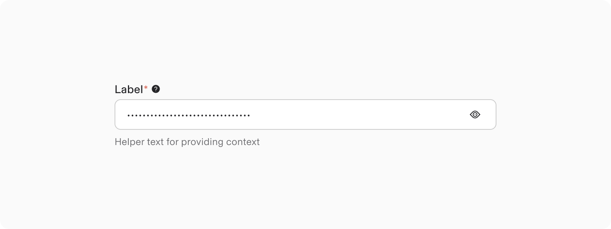
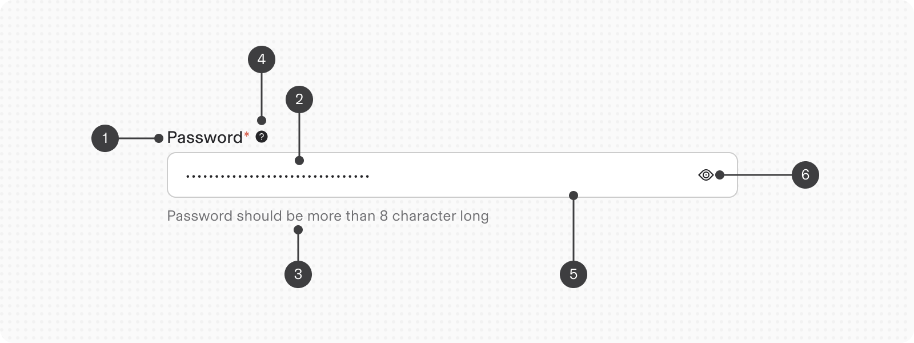
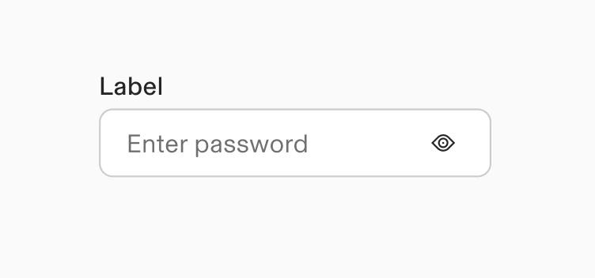
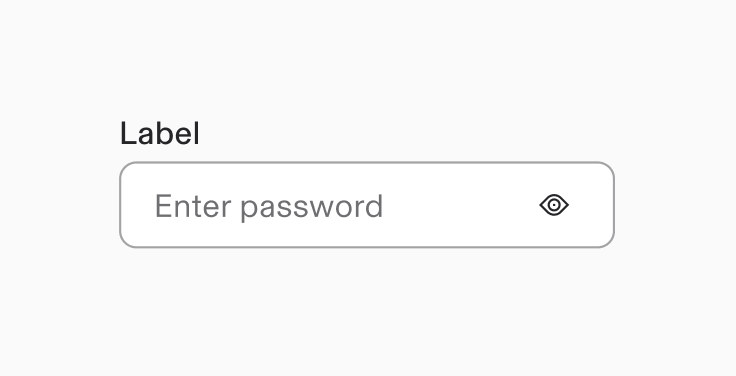
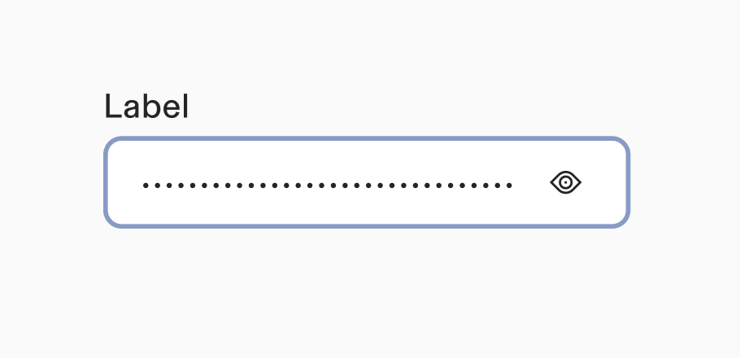
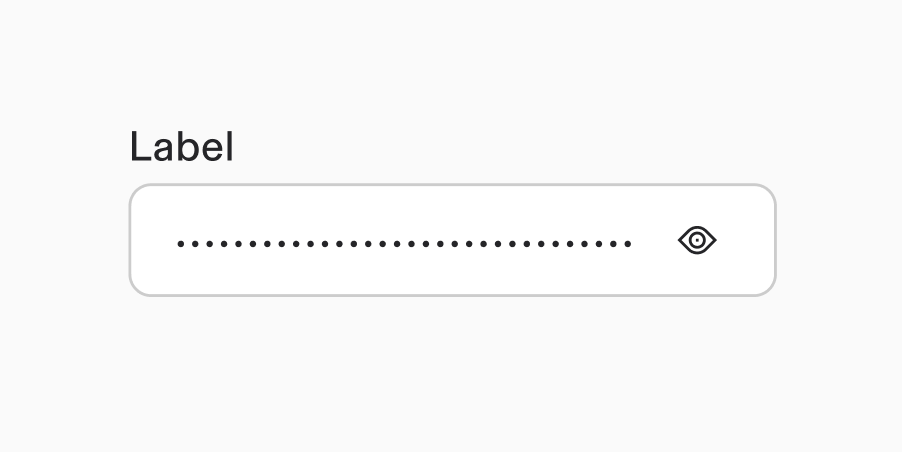
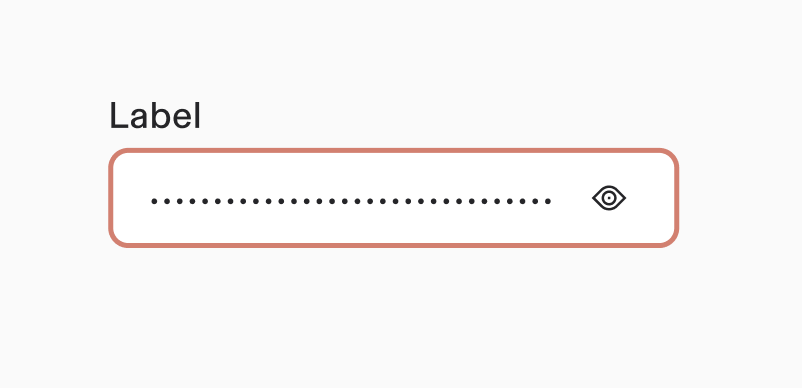
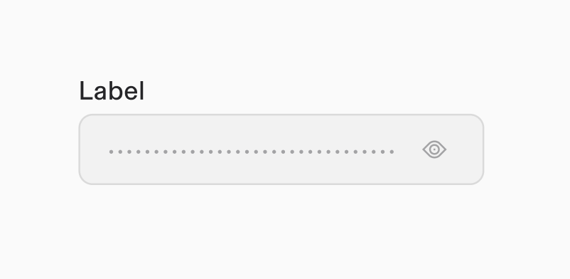

# Password

**Source:** [View in Confluence](https://rippling.atlassian.net/wiki/spaces/RDS/pages/4742578862)  
**Last Synced:** 11/3/2025, 7:16:54 PM  
**Confluence Version:** 6

---

Introduction

A Password input field is an input that allows a user to write or edit passwords

[Figma](https://www.figma.com/design/nhtRzieeGFf1tGVWnRxSK3/Web-Component-Library-\(v3\)?node-id=66583-248794) [Storybook](https://pebble.ripplinginternal.com/?path=/docs/components-inputs-password--docs)

---

# Overview

The password input field is all about boosting security while keeping things user-friendly. It automatically masks characters and includes a handy visibility toggle button, so users can securely enter their passwords and check their input before hitting submit. To make the experience even better, it’s a good idea to provide clear helper text on password requirements and formatting guidelines, along with visible password strength indicators. This thoughtful approach not only builds confidence when handling sensitive information but also ensures we stick to security protocols.

# Usage

### When to use

The user needs to input existing or create a new password usually in a login/signup page or a verification stage in the product.

## Validations

#### Invalid

When invalid data is entered or a required field remains unfilled, the system activates an error state that employs three distinct visual indicators:

1.  A prominent red border
    
2.  A descriptive error message
    

### Default values

Numeric input should not have a default value. Only a placeholder text is enough.

# Specs

## Anatomy

1.  **Label**: Clearly identifies the field's purpose; required for accessibility compliance (unless specifically exempted); provides clear input guidance; features a red asterisk (\*) to indicate mandatory fields.
    
2.  **Password Value**: Dynamically updates based on user interaction and control inputs.
    
3.  **Helper Text**: Offers contextual information and guidance; Should specify required format and validation rules w.r.t. passwords allowed; clarifies the field's intended purpose and usage.
    
4.  **Help Icon**: Displays detailed assistance via tooltip on mouse hover.
    
5.  **Input Field**: Serves as the primary data entry container; specifically designed for password input validation.
    
6.  **Show-hide icon**: Visual icons reflecting the current field state of showing or hiding the password text.
    

## States

**Type**

**Purpose**

**Visual representation**

Default

Default state is when it is active but not yet interacted with by the user.

Hover

When a user’s mouse cursor is hovering over the field

Focus

When a user tabs to or clicks on the password, the field or controls become focused, indicating the user has successfully navigated to the component

Filled

When a user types in a password after clicking/tabbing on it

Invalid

When the required password has not been filled in. It can also be triggered due to a system error. This state requires a user response before data can be submitted or saved.

Disabled

When the user cannot interact with a component and all interactive functions have been removed. Unlike read-only states, disabled states are not focusable, are not read by screen readers, and do not need to pass visual contrast, making them inaccessible if they need to be interpreted.

## Size

1.  Extra small - 24px height
    
2.  Small - 32px height
    
3.  Medium (Default) - 40px height
    
4.  Large - 48px height
    

## Interactions

#### Mouse

The password field allows value modification by typing in the field directly(unless disabled)

#### Keyboard

For accessibility, users can:

-   Navigate to the input field with the `Tab` key
    
-   Once the password is typed, press the `Tab` key again with `Enter` to show/hide the filled value
    

---

# Content

-   Label should always remain visible
    

-   Helper text should clearly define password requirements and display error states as needed
    
-   Helper text should never be more than 2 lines
    

# Accessibility

The standard password input component in our design system incorporates accessibility.
