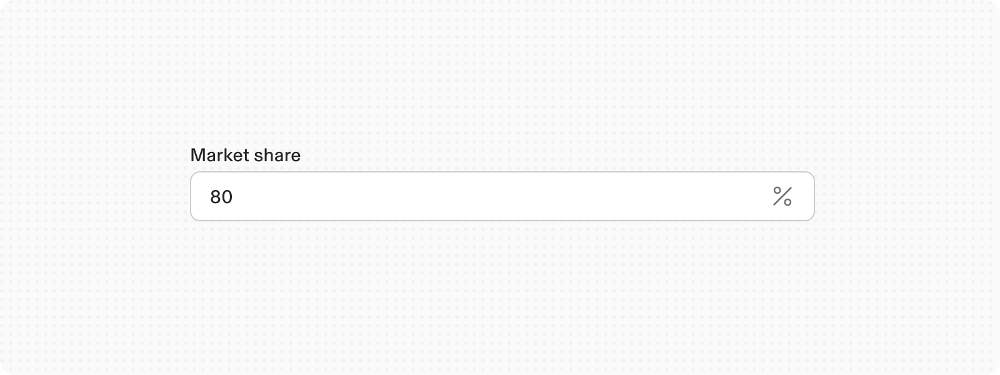
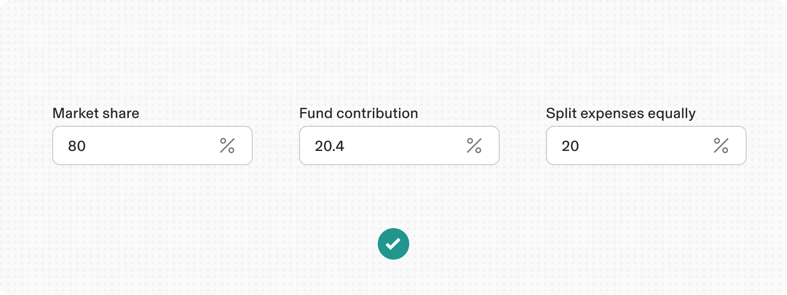
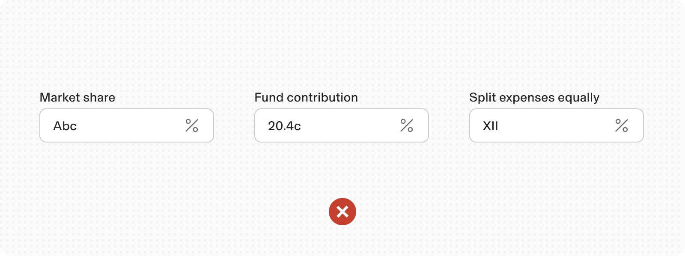
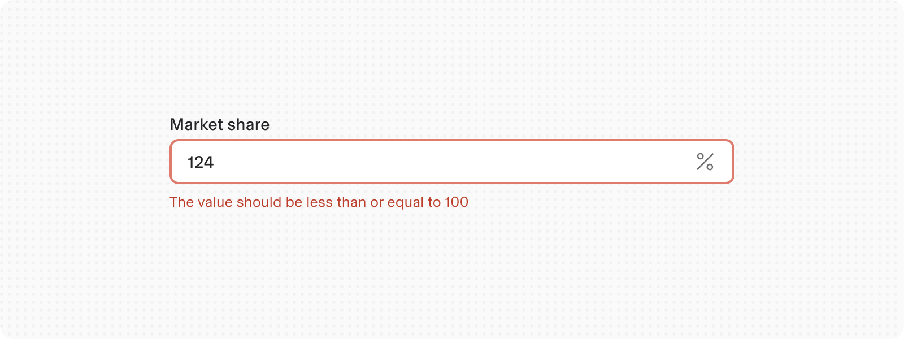
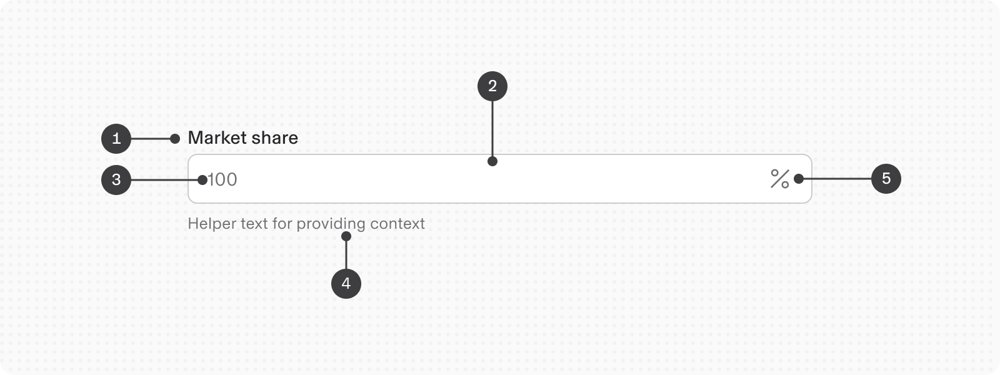
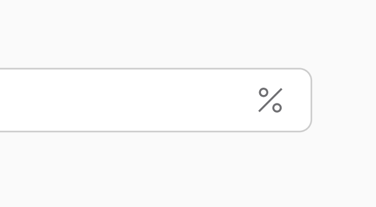
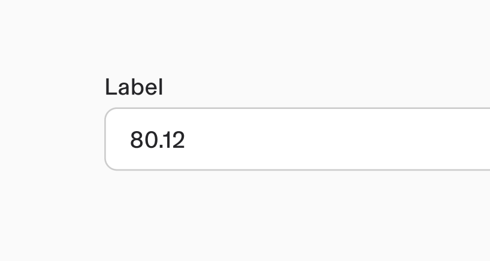
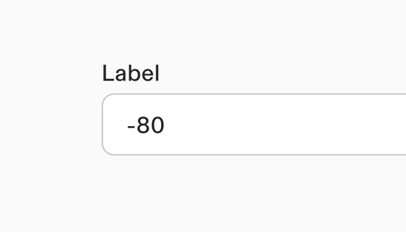

# Percentage

**Source:** [View in Confluence](https://rippling.atlassian.net/wiki/spaces/RDS/pages/4751885144)  
**Last Synced:** 11/3/2025, 7:16:58 PM  
**Confluence Version:** 4

---

Introduction

A Percentage input field is an input that allows a user to write or edit percentages

[Figma](https://www.figma.com/design/nhtRzieeGFf1tGVWnRxSK3/Web-Component-Library-\(v3\)?node-id=66583-250893) [Storybook](https://pebble.ripplinginternal.com/?path=/docs/components-inputs-percentage--docs)

---

# Overview

The Percentage Input component allows users to enter and edit values as percentages out of 100. It is designed to handle numeric input, automatically appending a percentage symbol (%), and providing validation and feedback mechanisms.

---

# Usage

### When to Use

Use the Percentage Input component for any form or process requiring percentage values, such as financial calculations, progress indicators, or statistical entries.

### When not to Use

When inputing non-numeric data such as Alphabets or special characters. Decimal points are allowed with numeric inputs.

### Best Practices

Ensure users understand the context of the percentage input.

Provide examples or tooltips if needed to clarify expected input.

Ensure consistent behavior across different contexts where percentage input is used.

## Validations

#### Invalid

When invalid data is entered or a required field remains unfilled, the system activates an error state that employs three distinct visual indicators:

1.  A prominent red border
    
2.  An error icon indicator
    
3.  A descriptive error message
    

---

# Specs

## Anatomy

1.  **Label:** Description of the input
    
2.  **Input Field**: A text input field where users can enter numeric values.
    
3.  **Placeholder Text**: Indicate expected input format, such as "e.g., 50".
    
4.  **Helper text**: Add help text to the input field
    
5.  **Suffix**: A percentage symbol (%) automatically appended to the value entered.
    

## States

Same as all the other input fields

## Properties

**Type**

**Purpose**

**Visual representation**

with Suffix

-   Includes a suffix symbol for percentage(%)
    
-   Allows value out of 100
    

supports Decimals

-   Allows precise input with decimal points.
    
-   Suitable for percentages with decimal values, or any input requiring precision upto to 2 decimal points (e.g., "48.12%").
    

supports Negative value

-   Percentage input field supports negative values as well wherever necessary
    

## Size

1.  Extra small - 24px height
    
2.  Small - 32px height
    
3.  Medium (Default) - 40px height
    
4.  Large - 48px height
    

## Interactions

#### Mouse

The number input field allows value modification by typing a value directly into the input container

#### Keyboard

For accessibility, users can:

-   Navigate to the input field with the `Tab` key
    
-   Adjust values using arrow keys:
    
    -   Press `Up arrow` to increase
        
    -   Press `Down arrow` to decrease
        

# Accessibility

The standard number input component in our design system incorporates accessibility.
