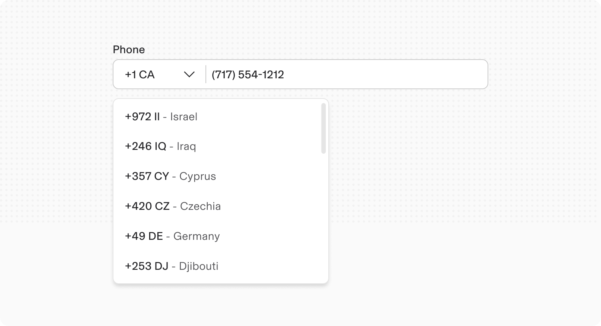
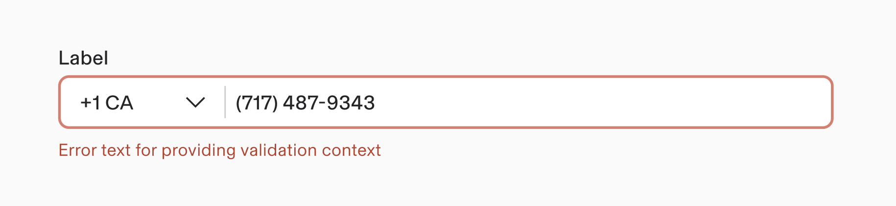
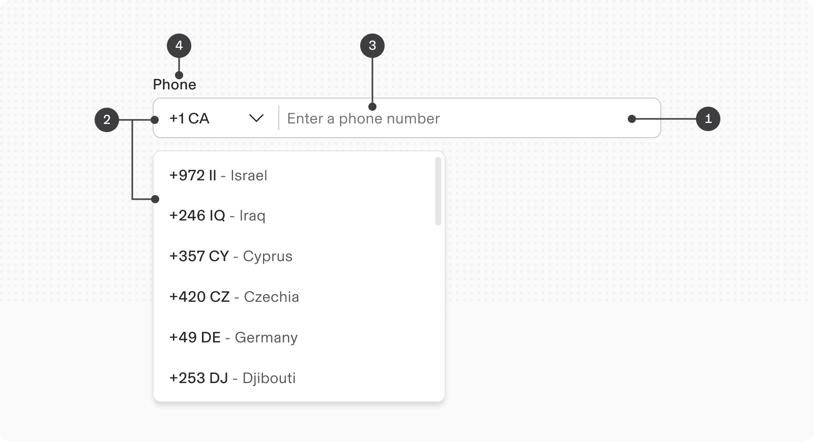
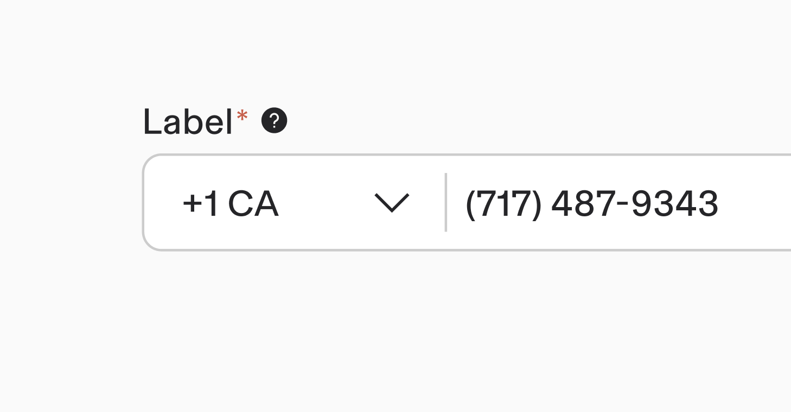
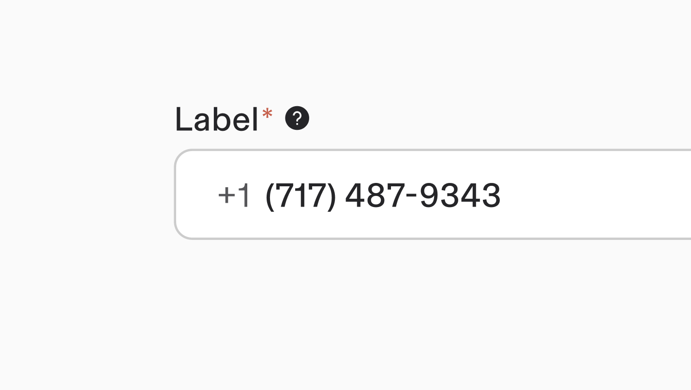
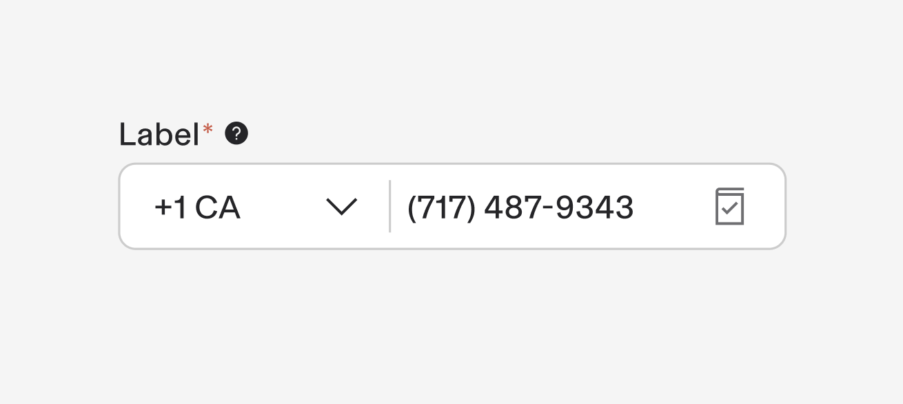
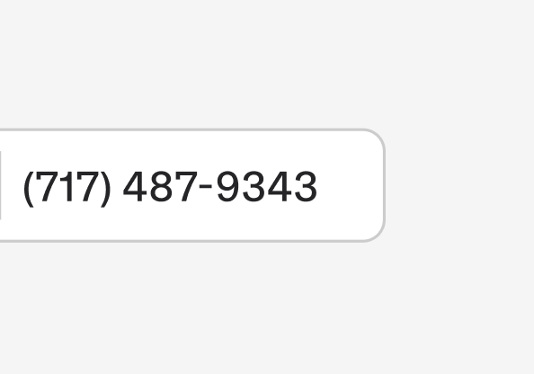

# Phone Number

**Source:** [View in Confluence](https://rippling.atlassian.net/wiki/spaces/RDS/pages/4751884457)  
**Last Synced:** 11/3/2025, 7:17:01 PM  
**Confluence Version:** 5

---

Introduction

The Phone Number Input field is crafted to allow users to efficiently enter or modify phone numbers.

[Figma](https://www.figma.com/design/nhtRzieeGFf1tGVWnRxSK3/Web-Component-Library-\(v3\)?node-id=66583-251012) [Storybook](https://pebble.ripplinginternal.com/?path=/docs/components-inputs-phone--docs)

---

# Overview

The Phone Number Input component offers a standardized and user-friendly interface for entering and editing phone numbers. It supports international formats and includes features for formatting, validation, and user feedback.

# Usage

### When to Use

Employ the Phone Number Input component in any form or process that requires users to provide their phone numbers.

### Best Practices

-   Request a phone number only when it is essential for the process.
    
-   Clearly mark mandatory fields with an asterisk or other indicators.
    

### Do’s and Don’ts

**Do**: Provide clear instructions and examples of valid phone numbers.

**Do**: Ensure the input accommodates international numbers when applicable.

**Don’t**: Overcomplicate the input with excessive interactive elements.

## Validations

#### Invalid

When invalid data is entered or a required field is left unfilled, the system triggers an error state with three distinct visual indicators:

1.  A prominent red border
    
2.  A descriptive error message
    

# Specs

## Anatomy

1.  **Input Field**: A text input area where users can type their phone number.
    
2.  **Country Code Selector**: A dropdown menu for selecting the country code, typically displayed alongside a flag (e.g., +1 for the United States).
    
3.  **Placeholder Text**: Indicates the expected format, such as "(123) 456-7890"
    
4.  **Label:** Label of the phone number input field describes what the input is for.
    

## Properties

**Type**

**Purpose**

**Visual Representation**

With Prefix Dropdown

Includes a dropdown for selecting a country code

With Prefix Text

Displays a prefix text indicating the country code; this variant does not allow for country code selection.

With Suffix

Adds a suffix symbol after the phone number, useful for measurements or units that follow the number. Place the relevant unit or symbol after the number to avoid confusion.

Phone Number Format

Enhances visual clarity

## Size

1.  Extra Small - 24px height
    
2.  Small - 32px height
    
3.  Medium (Default) - 40px height
    
4.  Large - 48px height
    

## Interactions

#### Mouse

Users can type their phone number directly into the input field, while the necessary country code can be selected using the prefix dropdown attached to the field.

#### Keyboard

For accessibility, users can:

-   Navigate to the input field using the `Tab` key.
    
-   Press `ENTER` on the country code dropdown to adjust values:
    
    -   Use the `Up arrow` and `Down arrow` keys to navigate through the list of country codes.
        
-   Press the `Tab` key to focus on the input container and begin typing the phone number.
    

---

# Accessibility

The standard Phone Number Input component in our design system is designed with accessibility in mind.
