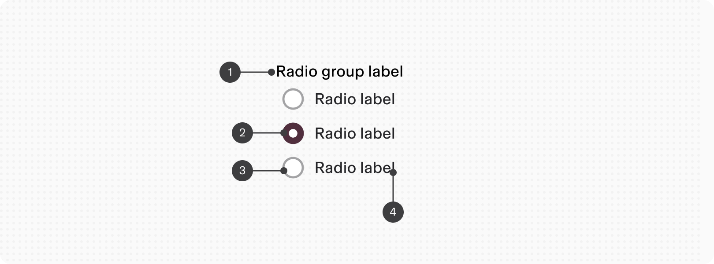
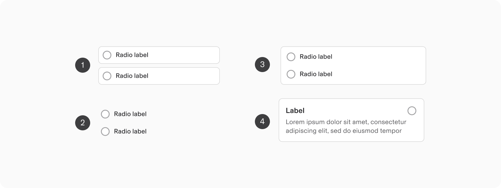
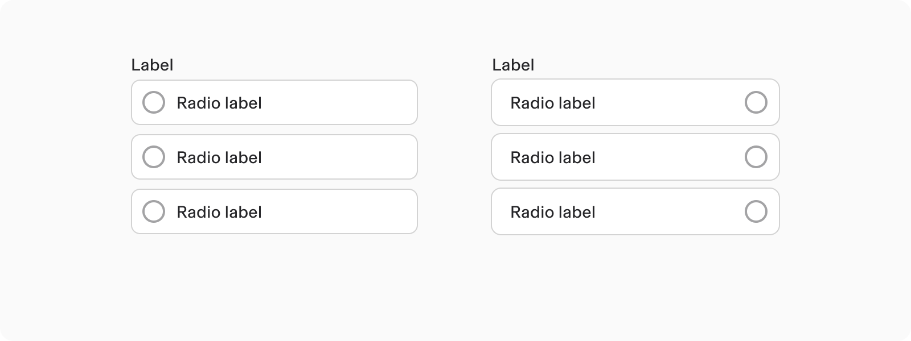
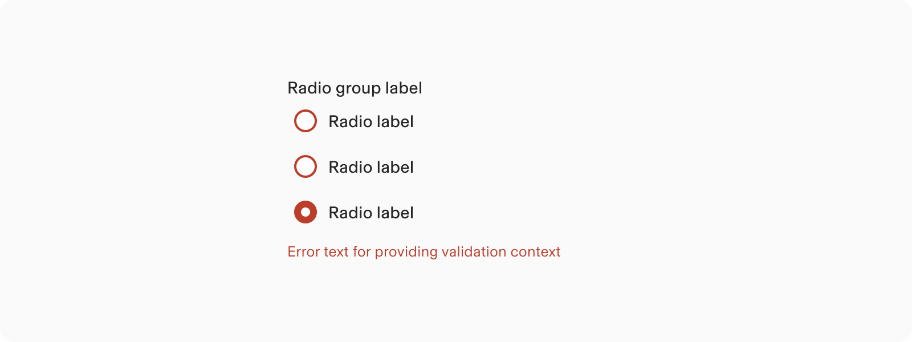
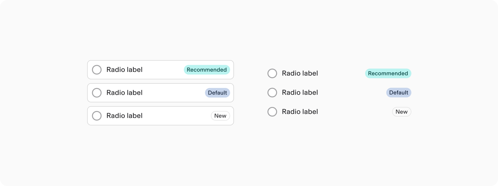
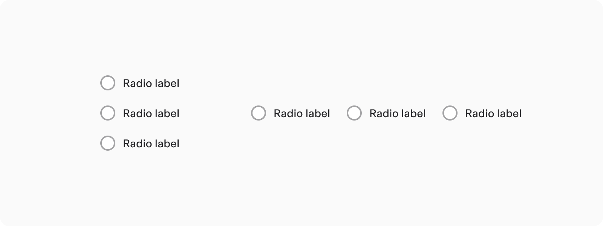
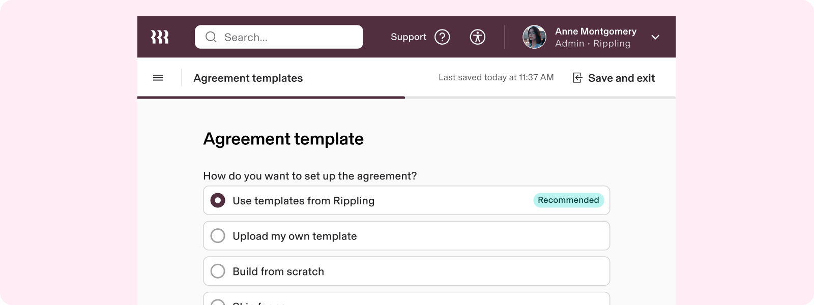
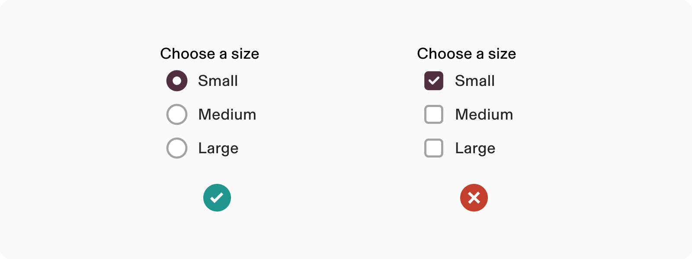
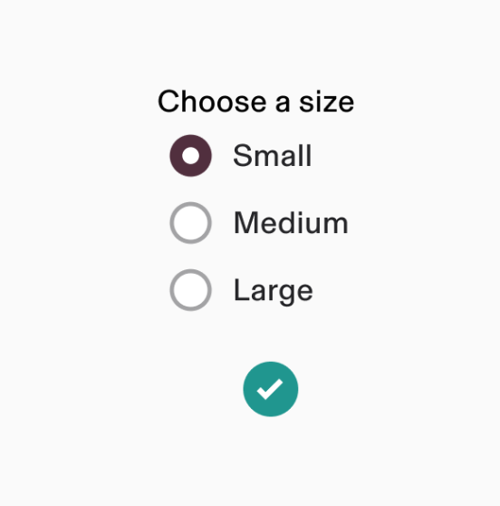

# Radio

**Source:** [View in Confluence](https://rippling.atlassian.net/wiki/spaces/RDS/pages/4050550789)  
**Last Synced:** 11/3/2025, 7:17:07 PM  
**Confluence Version:** 7

---

Introduction

Radio buttons let users choose a single option from two or more mutually exclusive options.

---

# Overview

-   The recommended way to let users make a single selection from a list of options
    
-   Only one radio button can be selected at a time
    

## Resources

**Type**

**Resource**

**Status**

Design

[Web Component (Figma)](https://www.figma.com/file/ysWbTtfWqhVDHQd1Mg2LQ1/v2-Component-Library?type=design&node-id=1791-5702&mode=design)

AVAILABLEGreen

Implementation

[Web Component (Storybook)](https://uikit.ripplinginternal.com/?path=/docs/components-inputs-radio--props)

AVAILABLEGreen

---

# Specs

## Anatomy

1.  Radio group label
    
2.  Selected
    
3.  Not selected
    
4.  Label
    

## Configuration

### Appearance

1.  List
    
2.  Default
    
3.  Box
    
4.  Card
    

### Position

1.  Default
    
2.  Reverse
    

Changing position is not available for the card radio type.

### Help

Supplementary context can be added to a radio through the help text. For even more context, a help icon with a tooltip can be added to the end of the label. This applies to both the radio button and the radio group.

### Error

Radio buttons can be marked as having an error to show that a selection that was made is invalid. For example, in a form that requires a user to acknowledge legal terms before proceeding, the radio button would show an unchecked error to communicate that it needs to be selected.

### Tags

Certain options can be highlighted with relevant metadata.

### Orientation

Radio groups can be arranged horizontally or vertically, with the default orientation being vertical. Opt for a horizontal layout when vertical space is constrained.

Orientation is only available in the basic type of radio groups.

---

# Usage

### When to use

-   Use radio buttons when only one item can be selected from a list of options
    

### When to use something else

-   If the user can choose more than one option at one time, use a Checkbox instead
    
-   To select from a long list of options, use Dropdown instead
    

## Guidelines

### Checkbox or Radio

Checkboxes and radio buttons serve different purposes. Use checkboxes when multiple options can be selected, including the possibility of none. Radio buttons, on the other hand, are suitable when only one option from a set of mutually exclusive choices should be selected.  
  
**Radio buttons should always have one option pre-selected**

## Content standards

### Using the word “Select” in labels

Use the verb “Select” to describe the action we want people to take when interacting with radio buttons.

# Accessibility

Users should be able to:

-   Navigate to a radio button with assistive technology
    
-   Select a given radio option
    

## Keyboard Navigation

**Key**

**Action**

Tab

Moves focus to next radio

Space

Selects a focused radio button
