# Segmented Control

**Source:** [View in Confluence](https://rippling.atlassian.net/wiki/spaces/RDS/pages/4600823820)  
**Last Synced:** 11/3/2025, 7:17:17 PM  
**Confluence Version:** 1

---

Introduction

An Input Segmented Control is a linear set of buttons for toggling between related choices and instantly applying a selection.

---

# Overview

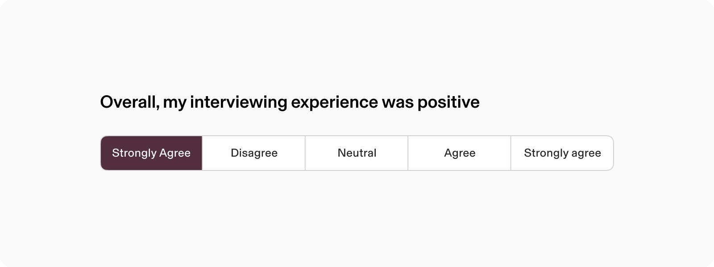

-   **Purpose:** Segmented controls are ideal for presenting closely related options, enabling users to toggle efficiently or select multiple options when needed.
    
-   **Selection Modes:** Supports single-selection (one active option at a time) and range-selection or multiple-selection, allowing users to select more than one option.
    
-   **Feedback:** Results are displayed immediately upon selection, providing instant visual or content updates.
    

## Resources

**Type**

**Resource**

**Status**

Design

[Web Component (Figma)](https://www.figma.com/design/nhtRzieeGFf1tGVWnRxSK3/Web-Component-Library-\(v3\)?node-id=74815-6717&node-type=frame&t=bU2JejVXrWjJY8V4-11)

AVAILABLEGreen

Implementation

[Web Component (Storybook)](https://pebble.ripplinginternal.com/?path=/docs/components-inputs-segmentedcontrol--docs)

AVAILABLEGreen

---

# Specs

## Anatomy

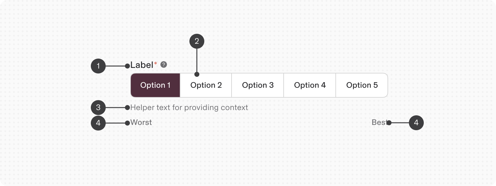

1.  Label
    
2.  Controls
    
3.  Help text / Error text
    
4.  Survey Label
    

## Configuration

### States

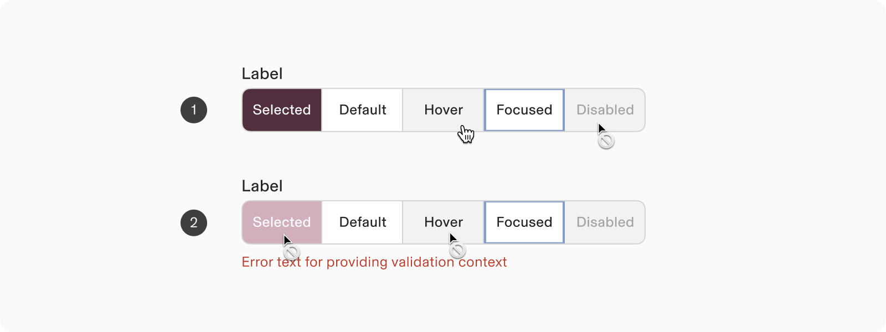

1.  **State : Default**
    
    1.  Selected
        
    2.  Default
        
    3.  Hover
        
    4.  Focused
        
    5.  Disabled
        
2.  **State : Invalid**
    
    1.  Selected - Disabled
        

### State : Selection types

.png)

1.  **Single Selection:** Allows selection of one mutually exclusive option at a time (default).
    
2.  **Multi Selection:** Enables selection of multiple independent options simultaneously.
    
3.  **Range Selection:** Facilitates selection of a continuous range between two points.
    

### State: Disabled

Use a disabled segmented control to show that single or all option aren’t interactive.

note

If it's conditional on another action, explain with help text inserted in the tooltip.

If it's conditional on another action, explain with help text inserted in the tooltip.

.png)

1\. Single Segment Disabled - 2. Entire Segment Disabled

### State: Read Only

Segmented controls can be set to read-only, allowing content review and copying without allowing any interaction.  
Unlike disabled segmented controls, they remain focusable and accessible to screen readers.

When segmented control is ‘read only’, it only displays the value and not the control input.

.png).png)

### Orientation

Segmented Controls comes in 2 variant of orientations.

Survey labels are not supported on vertical layout.

1.  Horizontal
    
2.  Vertical
    

### Size

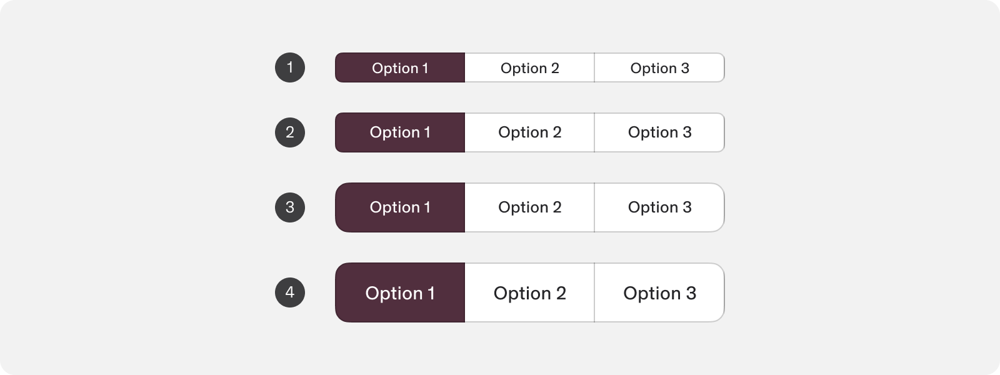

1.  Extra small (24px height)
    
2.  Small (32px height)
    
3.  Medium (40px height)
    
4.  Large (default) (48px height)
    

### Appearances

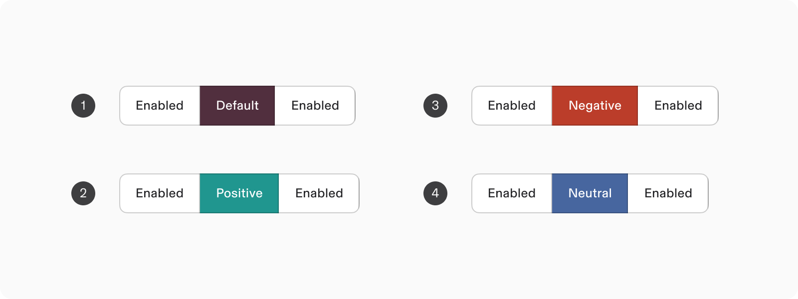

1.  **Default**: Uses primary color for controls with usual outcomes.
    
2.  **Positive**: Indicates controls expected to yield positive outcomes.
    
3.  **Negative**: For actions that are irreversible and damaging.
    
4.  **Neutral**: For neutral and informative reasons that do not carry significant urgency.
    

Use ‘negative appearance’ sparingly : Its red color should be used sparingly as it’s stressful to the user.

### Appearance: Content

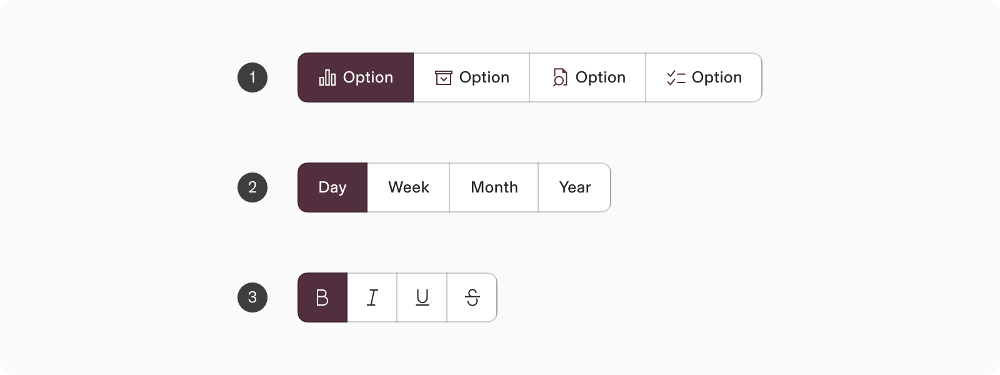

1.  Text with Icon
    
2.  Text (only)
    
3.  Icon (only)
    

Utilize the icon-only variant in situations where space is constrained, or when the icons are intuitive and easily comprehensible.

---

# Usage

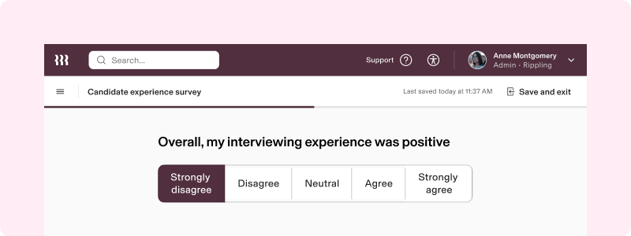

### When to use

-   Utilize segmented controls to facilitate immediate input based on the selection of closely related choices.
    
-   Implement a segmented control that enables users to select from a maximum of 5 choices (selection can be: single option, multiple options, or a range )
    
-   Usage Example: to choose from related sets of options, for survey or to capture ratings.
    

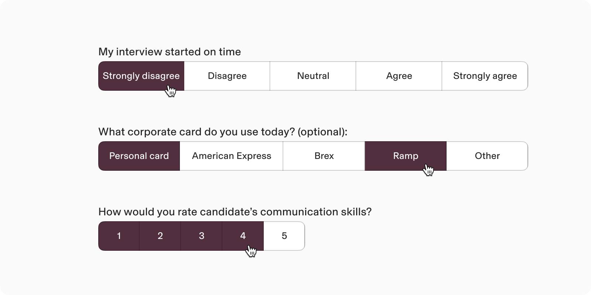

### When to use something else

#### Navigating between content segments

When navigating through different content areas like subpages, prefer using tabs instead of segmented controls.

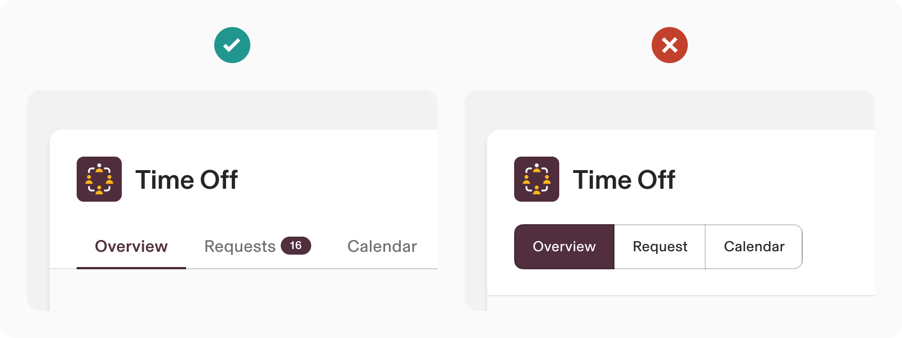

#### Binary actions

For binary decisions like “yes/no” or “on/off,” use a toggle button instead of segmented controls (segmented controls are unsuitable for binary inputs).

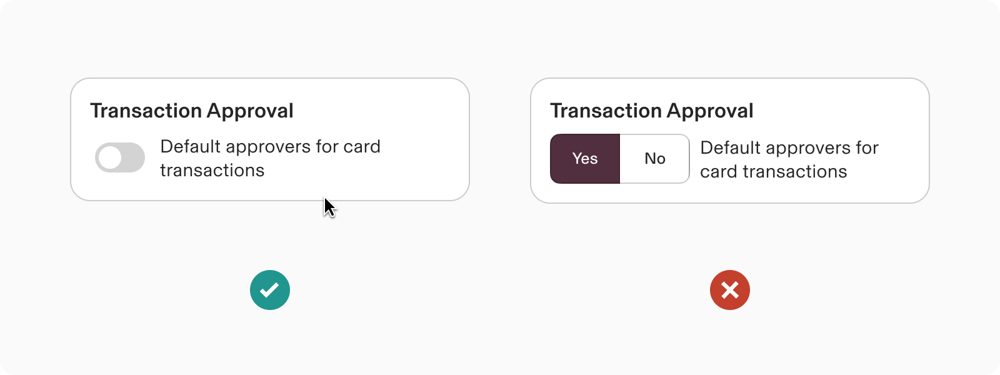

**Radio Button**

For choices that consist of several words or longer phrases, utilize a radio button.  
Segmented control is most effective with options limited to a maximum of couple of words.

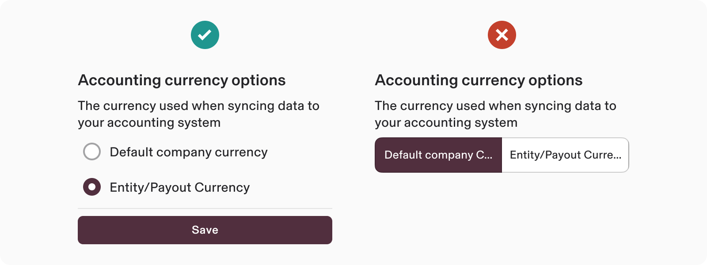

## Guidelines

### Icon-only segmented control

Use icons in segmented controls when there is limited space or when they can clearly represent the segments.

Prefer to use either text or icons in a segmented control, but not both. Combining text and icons may lead to confusion within the interface.

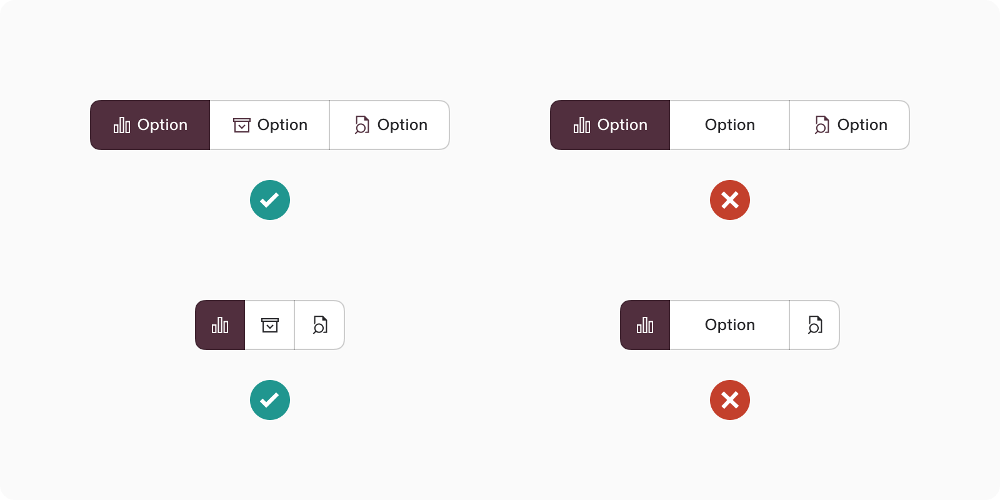

## Responsive

note

Segmented controls with only icons can be a responsive option when space is limited.

Segmented controls with only icons can be a responsive option when space is limited.

### Width: By default the segments are fluid.

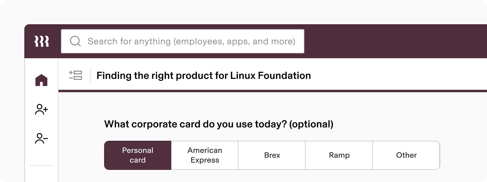

### Height :

1.  **If the Segmented Control surpasses the maximum height of container:** an Input\_\_Select should be displayed instead.
    

The same height constraints applies to the vertical layout of segmented control.  
In this scenario, the survey labels can appear as helper text.

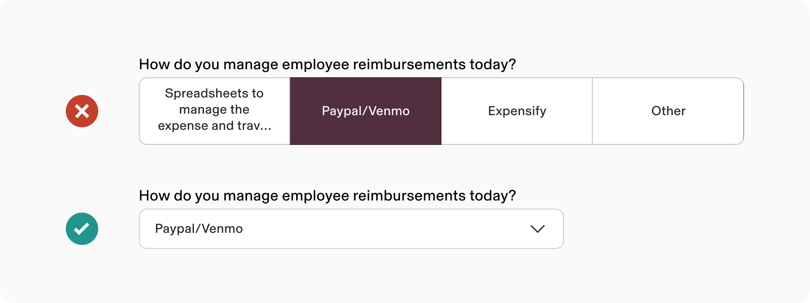

2.  **If the Segmented Control’s number of options exceeds 5:** Input\_\_Select should be displayed instead.
    

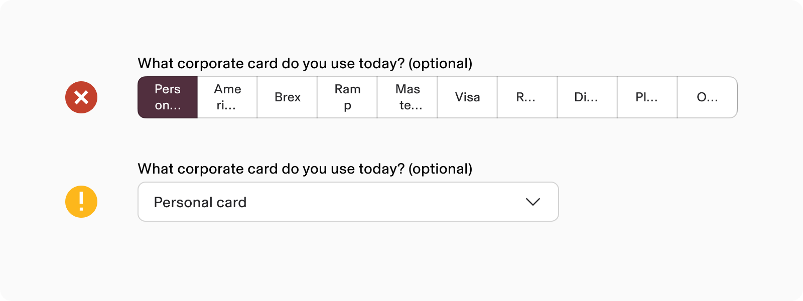

# Content standards

### **Label Content**

-   Use nouns or noun phrases for segment labels maintaining title-style capitalization.
    
-   Use similar-sized content in each segment.
    
    -   Refrain from labelling text with actions or lengthy phrases that may resemble action buttons.
        

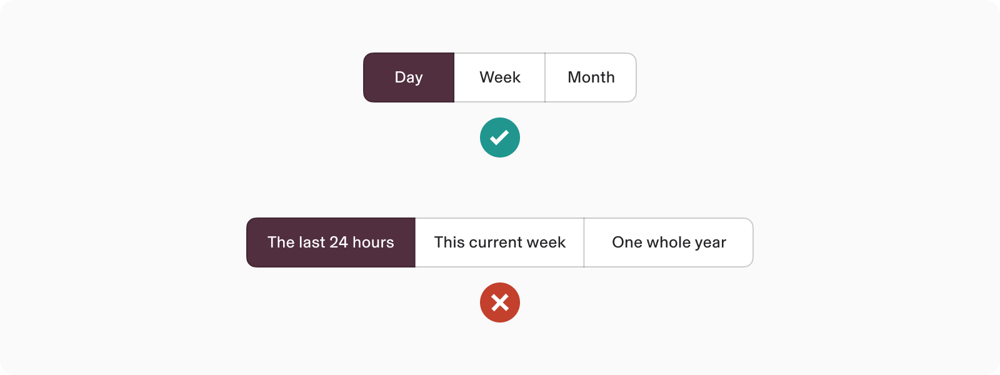

### Overflow content

If a label's text is too long in a segment control, add an ellipsis and use a tooltip to show the full text.

Utilize the tooltip to offer further context for a segment.

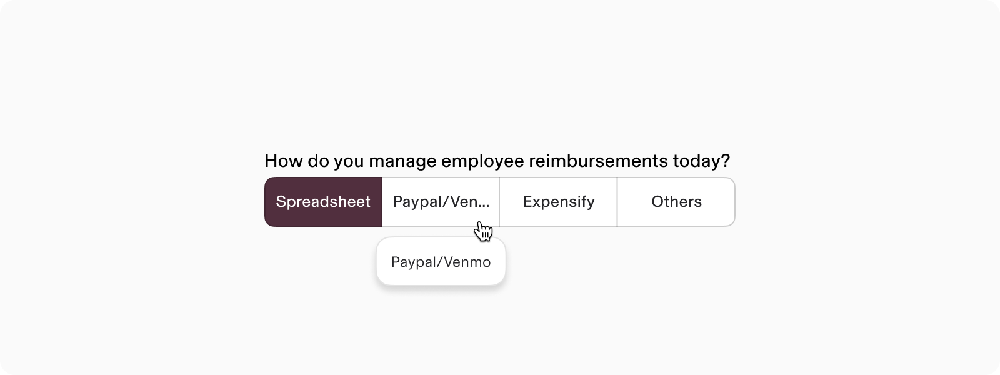

# Accessibility

-   Each button within the Segmented Control should feature a focus indicator that stands out clearly against both the background and the unfocused state.
    
-   Accessible label for the group that explains the function of the Segmented Control.
    
-   When using the Icon Only variant, it's crucial to provide an accessible name for each Icon Button in the Segmented Control.
    

## Keyboard Navigation

**Key**

**Action**

Tab

Focus each button element

Enter or Space

Activate focused button element
