# Select

**Source:** [View in Confluence](https://rippling.atlassian.net/wiki/spaces/RDS/pages/4746282196)  
**Last Synced:** 11/3/2025, 7:17:25 PM  
**Confluence Version:** 16

---

Select component lets users select one option form a dropdown menu.

Input Select component lets users select one option from a dropdown menu.

[Figma](https://www.figma.com/design/nhtRzieeGFf1tGVWnRxSK3/Web-Component-Library-\(v3\)?node-id=66677-232498&t=yXOTs71Lu4JuasJu-11) | [Storybook](https://pebble.ripplinginternal.com/?path=/docs/components-inputs-select--docs)

---

note

This section highlights the unique differences and changes related to this component.  
Most styling, behavior, and functionality come from the Input Text component.  
[Explore the Input Text Documentation](https://rippling.atlassian.net/wiki/pages/resumedraft.action?draftId=4745888772&draftShareId=ff495fc7-0a49-47a5-804b-ca2980db7ea7)

This section highlights the unique differences and changes related to this component.  
Most styling, behavior, and functionality come from the Input Text component.  
[Explore the Input Text Documentation](https://rippling.atlassian.net/wiki/pages/resumedraft.action?draftId=4745888772&draftShareId=ff495fc7-0a49-47a5-804b-ca2980db7ea7)

# Overview

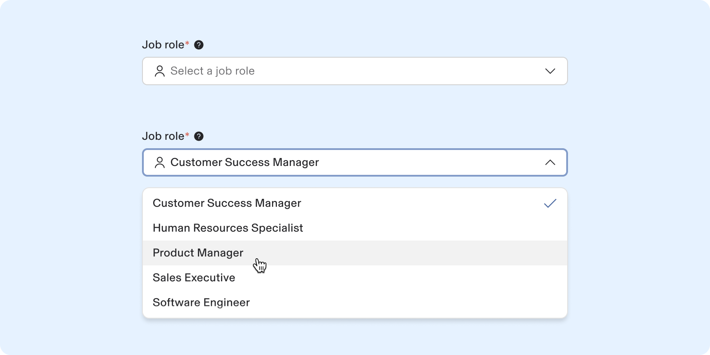

-   The Select component allows users to choose a single option from a predefined list.
    
-   It gathers input by presenting options, commonly used in forms for data submission.
    

---

# **Specs**

## **Anatomy**

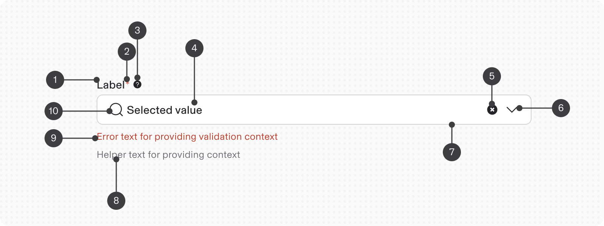

1.  Labels: Text guiding users on dropdown options.
    
2.  Required or optional - indicator
    
3.  Tooltip
    
4.  Default option: A placeholder selected by default.
    
5.  Action - Clear all
    
6.  Suffix - Validation icon
    
7.  Field: Visible whether dropdown is open or closed.
    
8.  Helper text (optional, except in error/warning): Supportive text aiding correct selection, displayed in a tooltip for a smooth experience.
    
9.  Error or Warning text: Replaces helper text when an error or warning occurs.
    
10.  Prefix: Icon
     

### **States**

The input Text and text area have multiple interactive states: **enabled**, **active**, **focus**, **error**, **warning** and **disabled**.

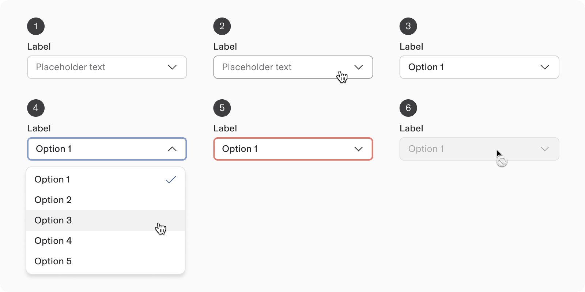

1.  **Default**: active but not interacted with, may show placeholder text.
    
2.  **Hover**: mouse pointer over the field.
    
3.  **Filled**: user selects an option from the list.
    
4.  **Focus/ Active**: user clicks or tabs to the input, indicating access and displaying the list.
    
5.  **Invalid**: value fails validation criteria.
    
6.  **Disabled**: input cannot receive input or gain focus.
    

###   
State: Empty

**Warning**: Selects should only show the empty state when the user has completed a search and there are in fact zero results. The initial state of a dropdown should always have the content the user can search across displayed in the dropdown. E.g. if the select is intended to allow the user to select from a group of people, the list of people the user can select from should be present when the user focuses (clicks into) the select. **Do not show the empty state when the user fist clicks into a select.**

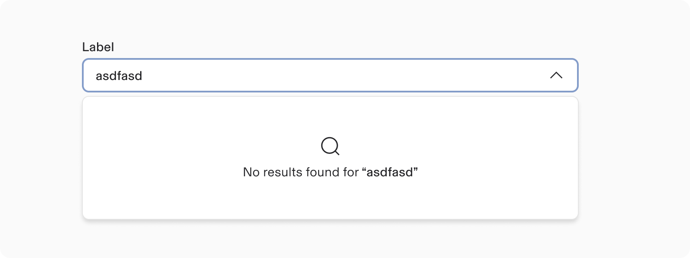

####   
State: Loading

While loading options, render a loading animation spinner instead of the “Loading” text.

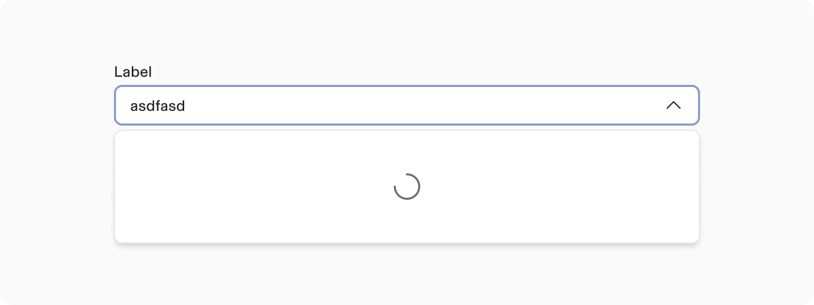

### Layout

#### Label position

Labels can be positioned at the top or on the side.

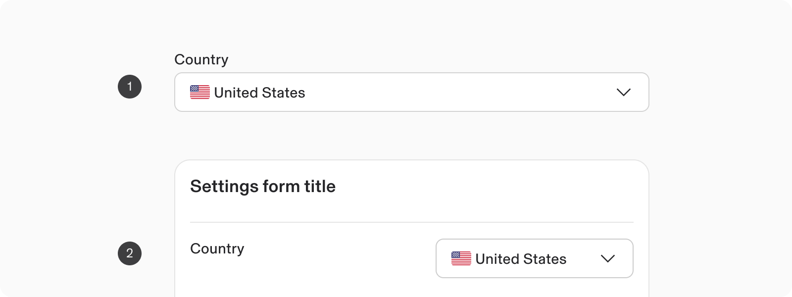

1.  **Top labels** are the default choice and recommended for:
    
    -   Longer text
        
    -   Localisation
        
    -   Responsive designs
        
2.  **Side labels** are beneficial when there is limited vertical space.
    

### Heights

In the Input select’s (text filed), there are 4 height variants.

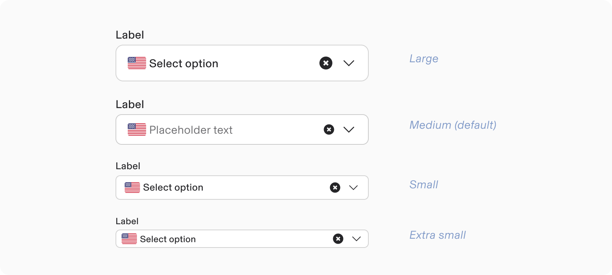

-   Use the input sizes judiciously; they should be used to create a hierarchy of importance within the page.
    
-   Example use-cases:
    
    -   Extra small or Small: Use in constrained spaces, like table cells.
        
    -   Medium: The standard and most common option; choose this when in doubt.
        
    -   Large: Use for excessive space, typically in simple forms or standalone text inputs.
        

For Small and Extra small sizes the dropdown should be rendered in compact mode.

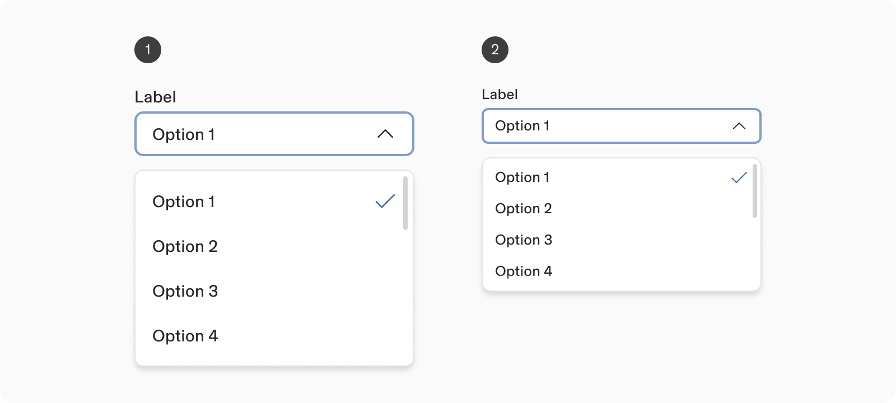

1.  Input Select ( Size: Medium / Large) - Default height (Dropdown menu)
    
2.  Input Select ( Size: Small / Extra small) - Compact height (Dropdown menu)
    

### Width

A select element does not have a defined minimum or maximum width.  
Its width can be tailored to fit the specific context in which it is used.

When feasible, the width of the field button should be sufficiently broad to ensure that all selected menu items are fully visible.

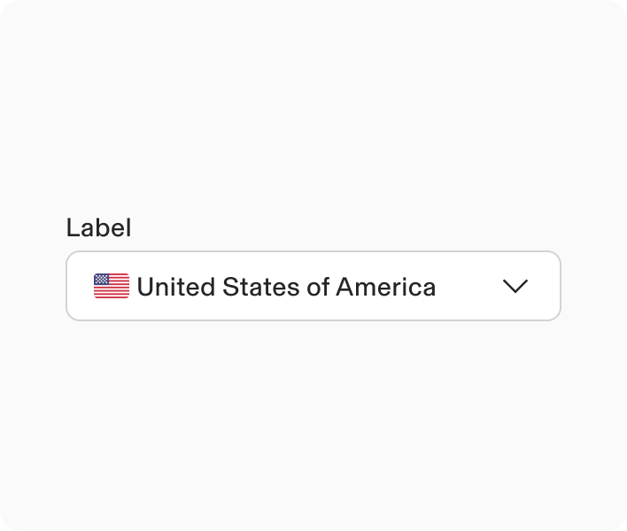

**Do**

Choose a input text field - width that matches the optimal length of the menu option's text.

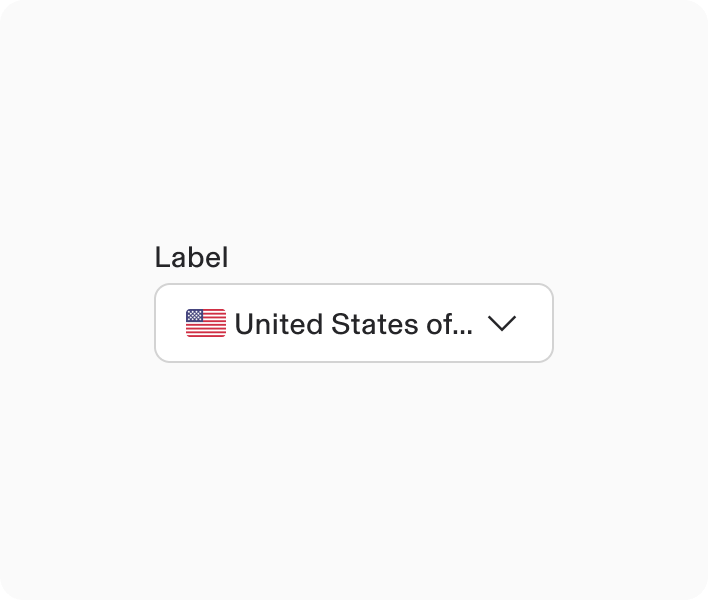

**Don’t**

Avoid text values to be truncated due to insufficient field width.

---

# Usage

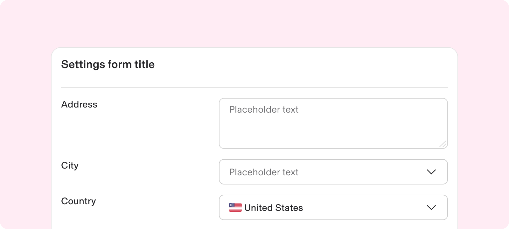

### When to use

**Select or** [**Input Multi-select**](https://rippling.atlassian.net/wiki/pages/resumedraft.action?draftId=4832657447&draftShareId=fce1a2fa-7d23-4f79-b012-2c09b87bad88)

**Radio card** **or** **checkbox card**

There are many options. E.g.

-   A list of all employees in a company
    
-   A list of countries
    
-   A dynamic list of operating systems
    

There are a limited set of options. E.g.

-   shipping options with detailed information
    
-   a short list of people including avatar, name, photo
    
-   plan options
    

The list needs to be searchable

It’s important to display a rich set of information in the selected state

The space is constrained

It’s a key part of a flow and warrants more visibility and control

The selection has little value in the flow

The selection is a key part of a flow

**Examples**

**Do**

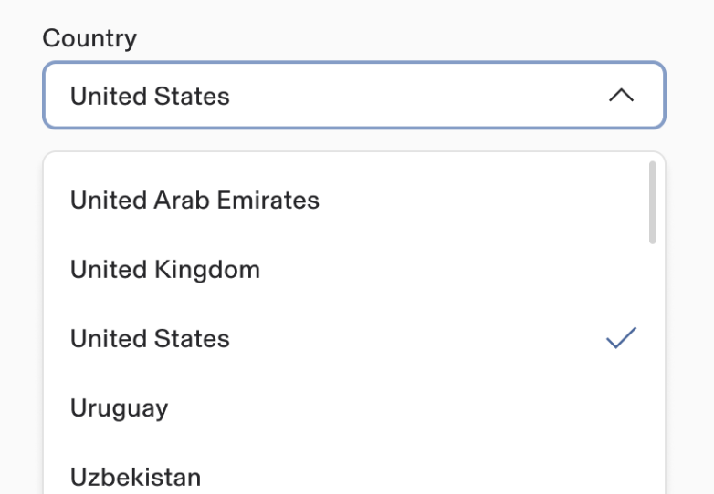

**Don’t**

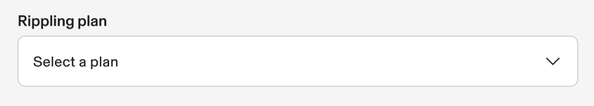

**Examples**

**Do**

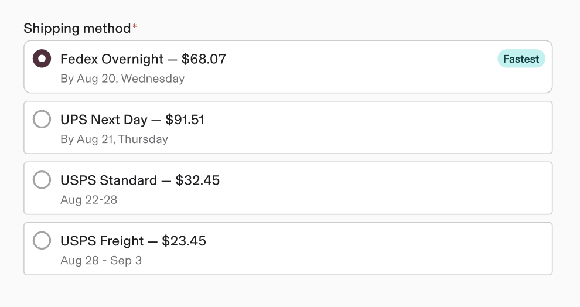

**Don’t**

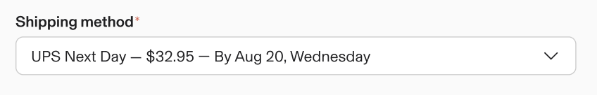

## **Guidelines**

### Menu height

The Input select menu can be adjusted to any height required optimum within the available space.

-   While there is no strict upper limit on the height of a menu, excessively long lists of options can overwhelm users.
    
-   To enhance usability, limit the list to 12 items. This simplifies scanning and minimises excessive scrolling.
    

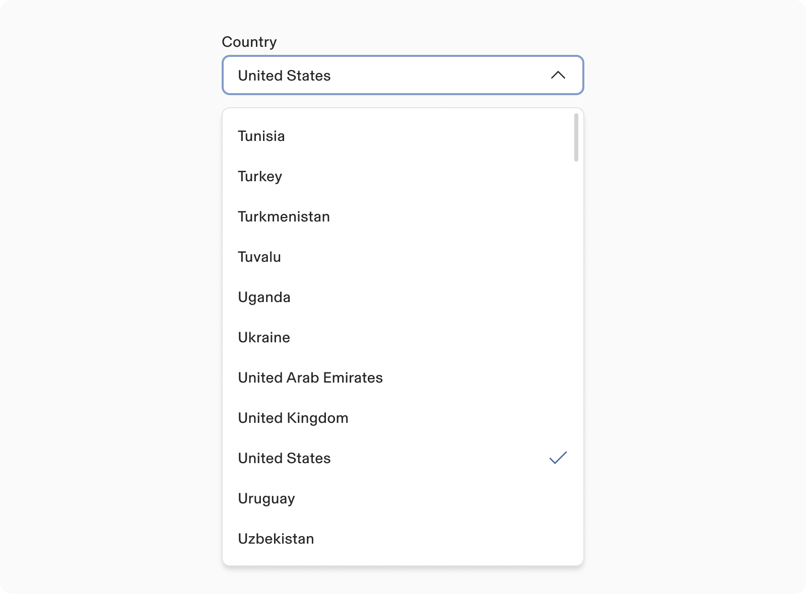

### Behavior

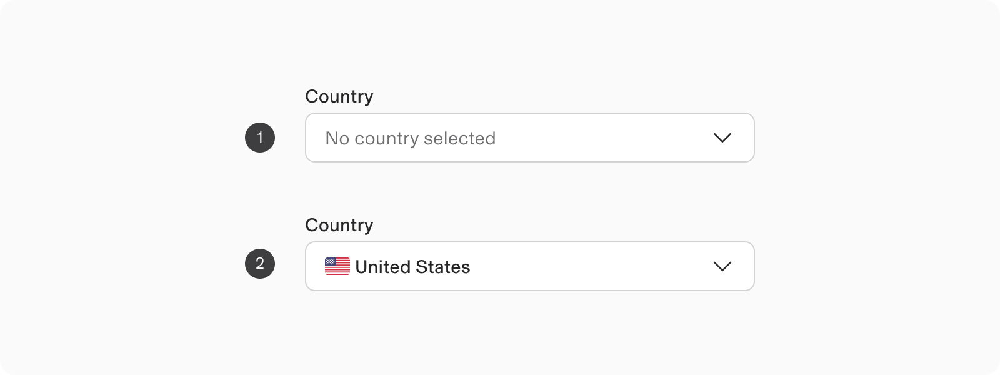

1.  **Placeholder:** In the absence of a user selection, placeholder text may be shown.
    
2.  **Default selection:**
    

-   By default, the first option in the menu is displayed as the selected choice when the page initially loads.
    
-   However, you have the flexibility to modify the default selection value as needed.
    

### Single select

Single select lists enable users to choose one option from a set of mutually exclusive choices.

Once a user makes a selection from the list, the chosen option is displayed in the text field.

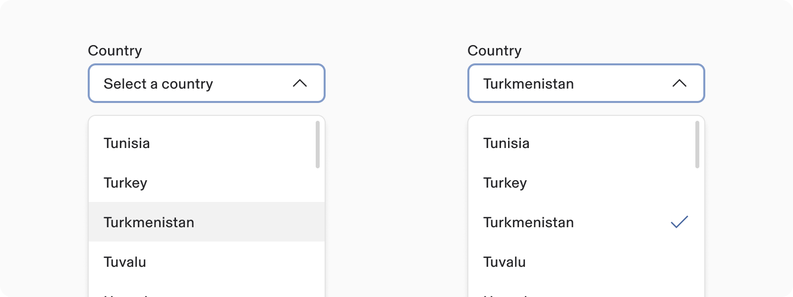

## **Content guidelines**

#### Label

-   Concise labels are essential for guiding users.
    
-   They inform users about expected information.
    
-   Labels should not serve as helper text.
    
-   Ideally, labels should be one to three words long.
    

#### Helper text

-   Helper text aids users in making choices from the selection list.
    
-   It is optional but replaced with warnings or errors when necessary.
    

#### Menu item’s order

If applicable, the list should be organized alphabetically or by relevance.

If neither applies, order by frequency of use.

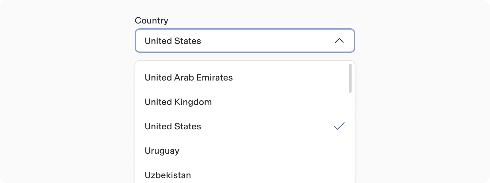

### Text Overflow

When the field label and menu text exceed horizontal space, they will wrap to a new line.

-   The field text will be truncated with ellipses.
    
-   Menu item’s text is text remains completely visible.
    

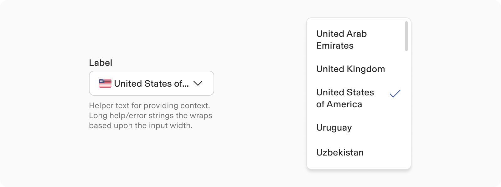

### Internationalisation

-   The layout of the picker for RTL (right-to-left) languages is mirrored.
    
-   Text and the checkmark are right-aligned.
    
-   The chevron is left-aligned.
    

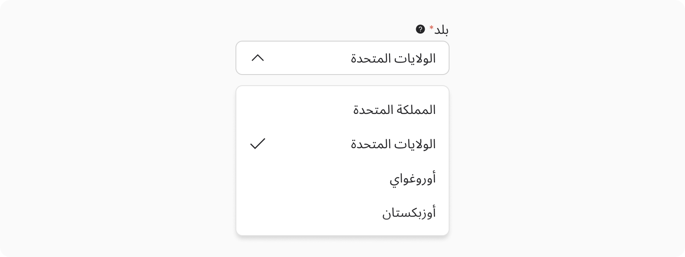

---

# Accessibility

Placeholders should be used judiciously and cannot replace labels, as they do not convey essential information.

Additionally, select options should avoid being prefixed with emojis, as this can interfere with typeahead functionality.

## **Keyboard Navigation**

When the menu is closed:

**Keys**

**Action**

Space or Down Arrow

Opens the popover menu.

The focus is set on the menu item selected.

When the menu is open:

**Keys**

**Action**

Space or Down Arrow

Selects the menu item in focus, closes the popover menu and moves focus to the field button.

Up or Down Arrow

Moves focus to previous or next menu item in the popover. Does not loop when the last or first menu item is reached.

Esc

Closes the popover menu and moves focus to the field button.
