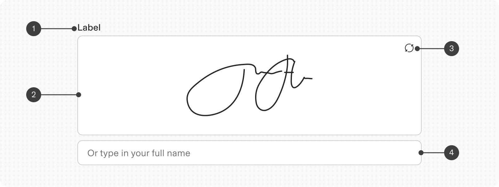
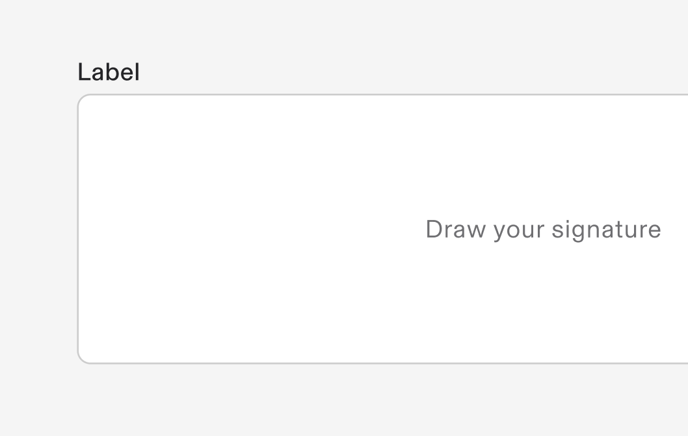
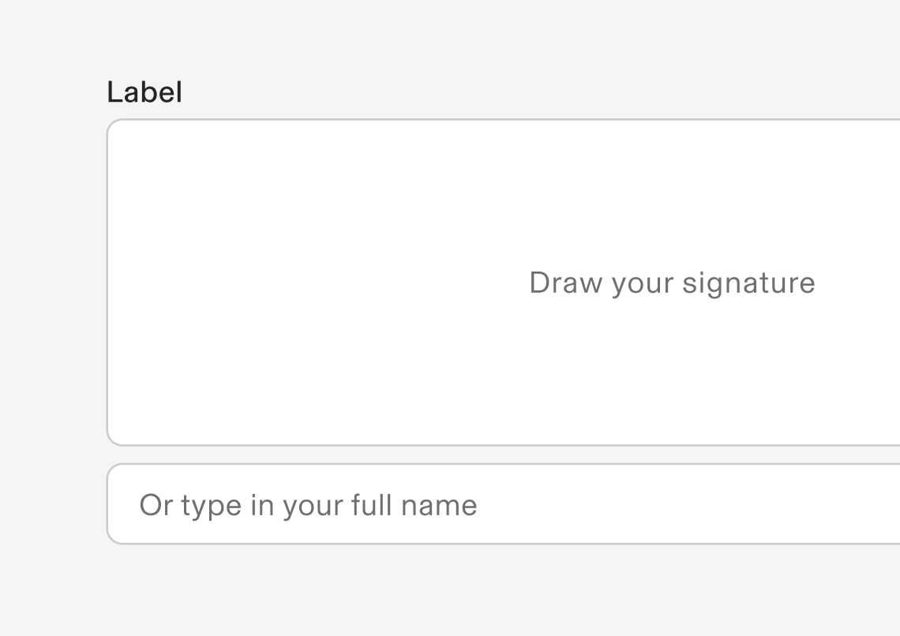
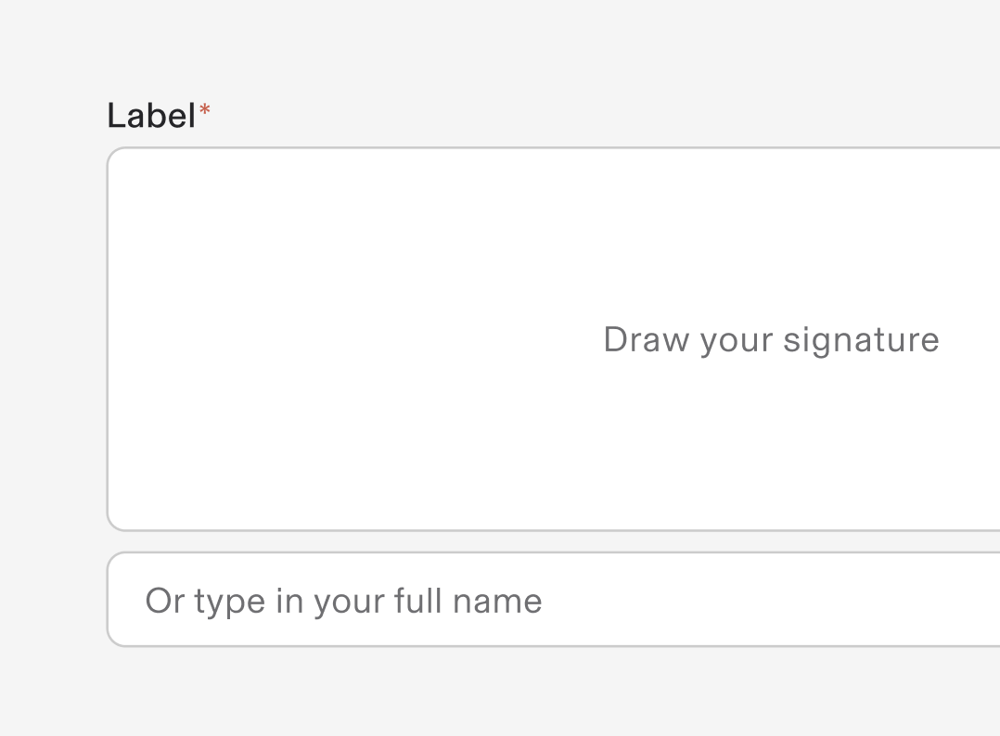
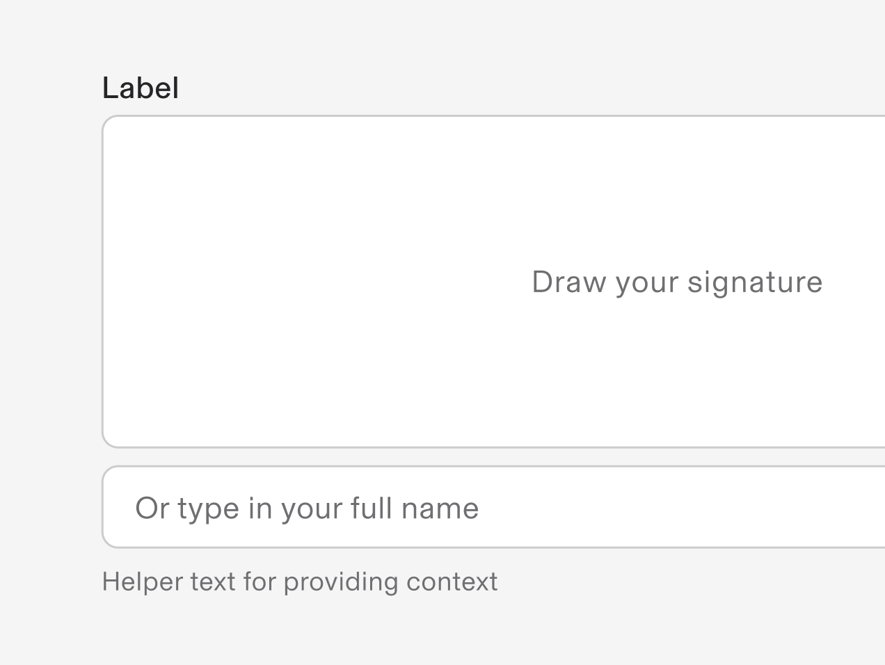
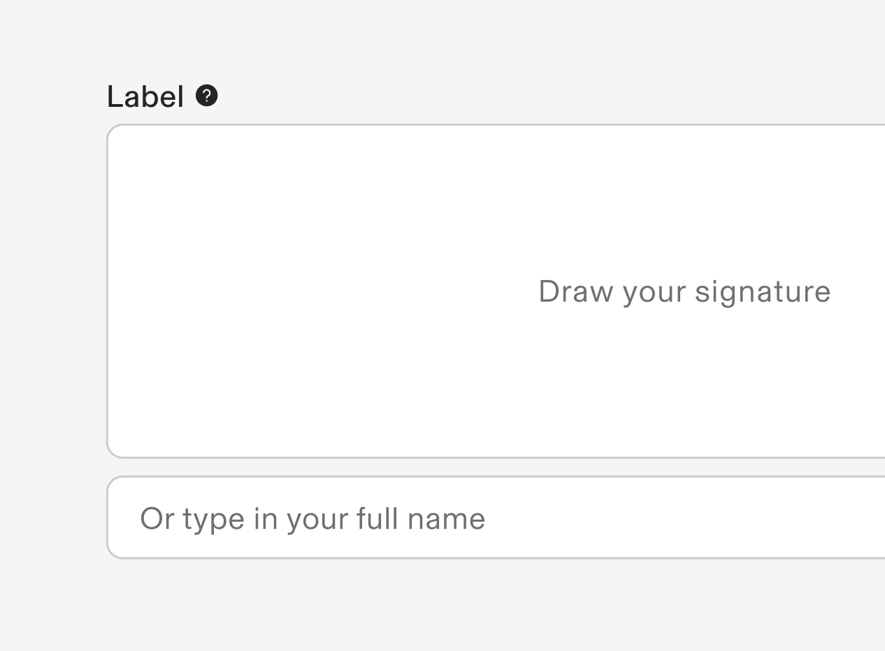

# Signature

**Source:** [View in Confluence](https://rippling.atlassian.net/wiki/spaces/RDS/pages/4797563007)  
**Last Synced:** 11/3/2025, 7:17:28 PM  
**Confluence Version:** 2

---

Input Signature component allows to either draw a signature in the drawing area or type in the signature into the text input below.

[Figma](https://www.figma.com/design/nhtRzieeGFf1tGVWnRxSK3/Web-Component-Library-\(v3\)?node-id=66574-83495) [Storybook](https://pebble.ripplinginternal.com/?path=/docs/components-inputs-signature--docs)

---

# Overview

The Signature component allows users to input their handwritten signature digitally on documents within the Rippling platform. This component is crucial for processes requiring user authorization or agreement.

---

# Usage

### **When to use**

-   When a user’s digital signature is required for document approval or consent.
    
-   In forms that require a formal acknowledgment of information..
    

### **When to use something else**

-   For capturing typed names or initials (use a text input instead).
    
-   When a digital signature is not legally valid or necessary.
    

## Interactions

-   Drawing: Users can draw their signature using a mouse, stylus, or touch input.
    
-   Clearing: Clicking the "Clear" button removes all strokes from the canvas.
    
-   Undo/Redo: If enabled, users can undo/redo strokes to adjust their signature.
    

---

# Specs

## Anatomy

1.  **‌Label:** A label to describe the signature field
    
2.  **Signature container:** A drawable area where users can sign using a mouse, stylus, or touch input.
    
3.  **Refresh:** Clear the signature field to add a new one
    
4.  **Input container:** An input field to add name as a signature alternative
    

## Variants

**Type**

**Purpose**

**Visual Representation**

Only signature

When the input only allows signature field without text typing field

Signature and text

When the input shows both signature and text typing field

Required

When the field is mandatorily required before proceeding

with Helper text

Supported by a helper text for more information

with Tip

Supported by a tooltip icon for showing more information

# **Accessibility**

-   Keyboard Accessibility: Ensure all buttons are focusable and operable via keyboard (e.g., Tab to navigate and Enter to activate).
    
-   Screen Reader Support: Provide descriptive aria-labels for all buttons (e.g., "Clear signature").
    
-   Announce changes to the canvas using ARIA live regions (e.g., "Signature cleared").
    
-   Touch Accessibility: Ensure buttons and canvas provide adequate touch targets, with a minimum size of 40x40 pixels. Placeholder text must be linked to an `aria-label` for better accessibility with assistive technologies.
