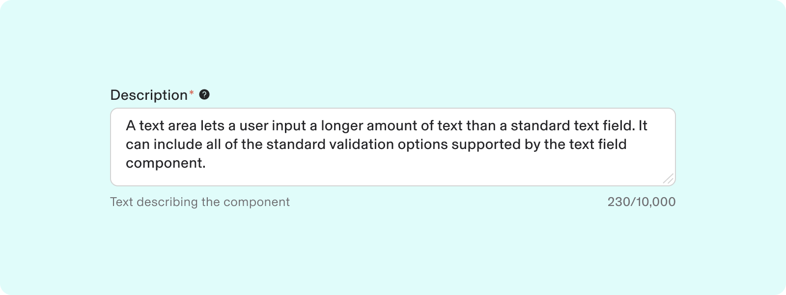
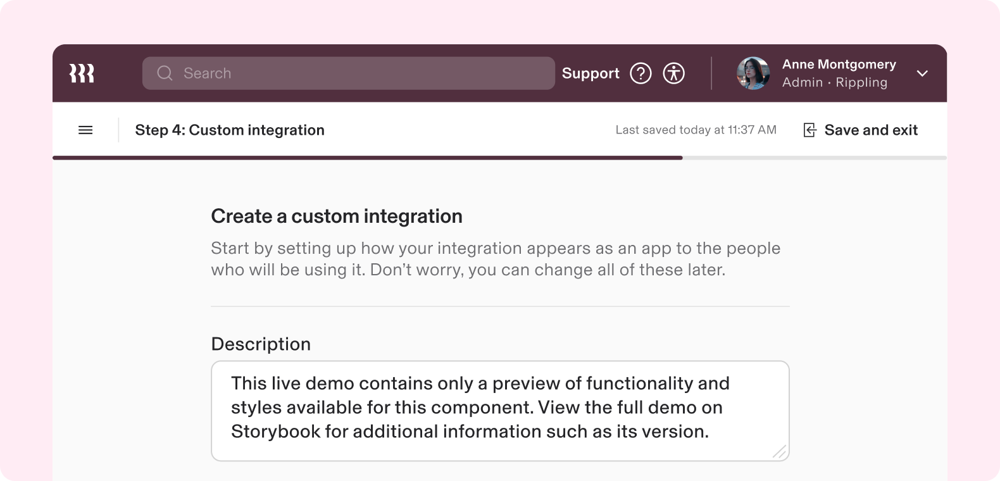
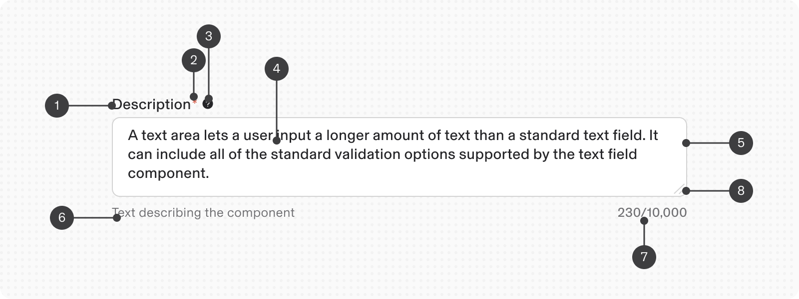
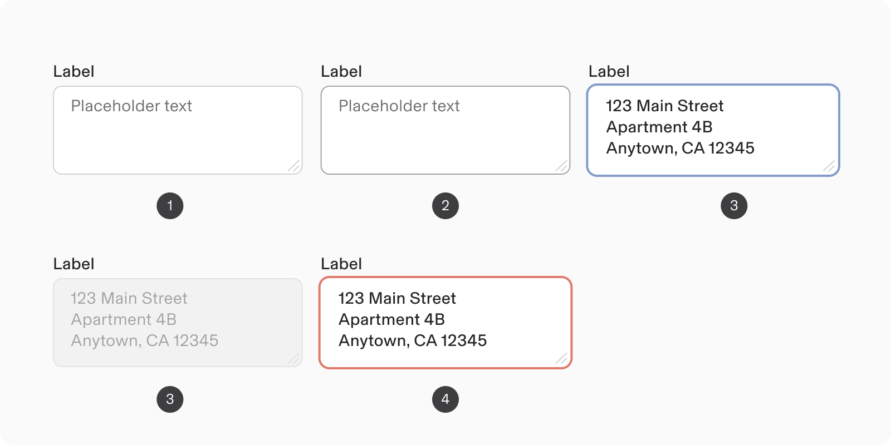
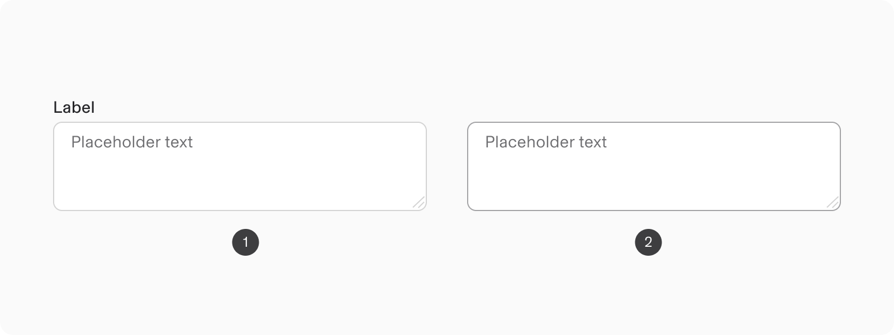
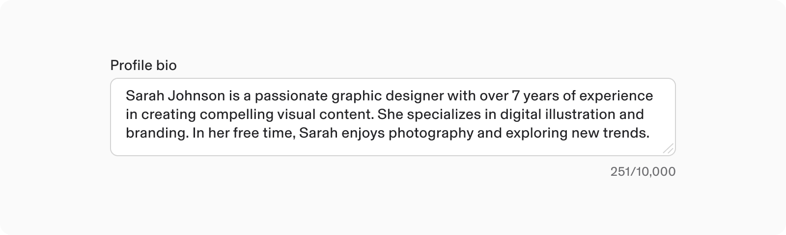
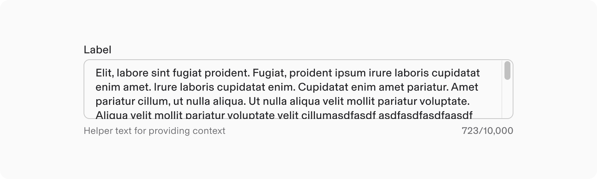
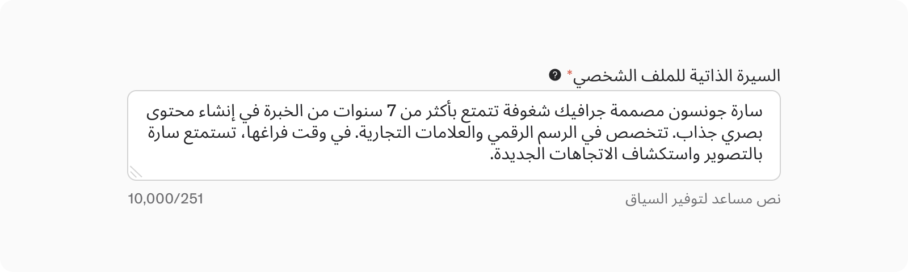

# Text Area

**Source:** [View in Confluence](https://rippling.atlassian.net/wiki/spaces/RDS/pages/4745888772)  
**Last Synced:** 11/3/2025, 7:17:42 PM  
**Confluence Version:** 10

---

The Input text component lets users add a multi-line text.Type or paste something here to turn it into an excerpt.

[Figma](https://www.figma.com/design/nhtRzieeGFf1tGVWnRxSK3/Web-Component-Library-\(v3\)?node-id=66677-231849&t=Hu2IPjBuFuzLvMqn-11) | [Storybook](https://pebble.ripplinginternal.com/?path=/docs/components-inputs-textarea--docs)

---

# Overview

-   An Input text area is an input component for entering and editing multiple lines of text, ideal for longer inputs like comments or descriptions.
    
-   Features include:
    
    -   A resize handle for size adjustment.
        
    -   A character counter to monitor / limit character usage.
        
-   Supports all states and functionalities similar to [Input Text](https://rippling.atlassian.net/wiki/pages/resumedraft.action?draftId=4742381773&draftShareId=fd4da4c5-77b3-460d-83df-f2cf7da632f6), except password functionality.
    

note

This section highlights the unique differences and changes related to this component.  
Most styling, behavior, and functionality come from the Input Text component.  
[Explore the Input Text Documentation](https://rippling.atlassian.net/wiki/pages/resumedraft.action?draftId=4745888772&draftShareId=ff495fc7-0a49-47a5-804b-ca2980db7ea7)

This section highlights the unique differences and changes related to this component.  
Most styling, behavior, and functionality come from the Input Text component.  
[Explore the Input Text Documentation](https://rippling.atlassian.net/wiki/pages/resumedraft.action?draftId=4745888772&draftShareId=ff495fc7-0a49-47a5-804b-ca2980db7ea7)

---

# **Usage**

### **When to use**

-   An Input text area is a versatile component for multi-line text input, allowing free-form text entry.
    
-   It's ideal for longer entries like paragraphs or comments, promoting comprehensive input.
    
-   This component keeps all text visible, enhancing user interaction.
    

### **When to use something else**

-   Avoid using a Input text area for short text entries, as it may lead to user confusion. Use [Input Text](https://rippling.atlassian.net/wiki/pages/resumedraft.action?draftId=4742381773&draftShareId=fd4da4c5-77b3-460d-83df-f2cf7da632f6) instead.
    
-   When specific formats are required, such as for dates or emails, utilize a Input Date or Input Email.
    

---

# **Specs**

## **Anatomy**

1.  **Label**: Guides the user on the information to provide; mandatory unless exempted for accessibility.
    
2.  **Optional versus required indicator** (optional): Indicates if the field is optional or required.
    
3.  **Tooltip**
    
4.  **Content**: User's input in the field.
    
5.  **Container**: Area for capturing user’s data input.
    
6.  **Help or Error text**
    
7.  **Counter** (optional): Character counter: Shows entered characters and max permitted.
    
8.  **Resize handle**: Allows users to adjust the field's height.
    

## **Configuration**

### States

1.  Default
    
2.  Hover
    
3.  Focused
    
4.  Disabled
    
5.  Invalid
    

### Optional Elements

The Input text area must include key elements to create a field that helps users complete it effectively:

-   **Label** — Each form field must have a label indicating the required information.
    

note

Labels can align to the left of the Input text area for more compact content.

Labels can align to the left of the Input text area for more compact content.

### Modifier: Character counter

-   A character counter can be added to a Input text area, showing the current count and total limit.
    
-   It restricts input when the maximum count is reached and informs users if they exceed it.
    
-   This feature enhances user experience by providing real-time feedback on character usage.
    

The default max character count is 10,000.

A character limit can be configured with hasCharsLimit prop.

Do

If you impose a limit on text input, include a character counter and a help text explaining the reason for the restriction.

Don’t

Don't impose a character limit without explaining why the user's text entry is restricted.Input text area with add-ons (prefix/suffix text or icons).

---

# **Guidelines**

### Height

-   The Input text area features an adjustable height, beginning at a minimum of 80px with no upper limit.
    
-   Generally, it accommodates up to 3 lines of text but can be adjusted to fit any desired input length.
    
-   Users can easily change the height by dragging the handle located at the bottom right corner.
    
-   **Resizing:** A Input text area’s resizing can be restricted to:
    
    -   Fixed height (no resizing)
        
    -   Vertical resizing allowed
        

A text area with a fixed height allows for vertical scrolling within the container if the content exceeds the height of the input text area.

## **Internationalisation**

-   In RTL languages, labels align right.
    
-   Modifiers and options in the input field are on the left of the label.
    
-   The resizer control is in the lower left corner.
    

---

# **Accessibility**

-   It is crucial to avoid using placeholder text in critical information areas.
    
-   If placeholder text is used, it should have a clear label.
    
-   When users focus on the input field, the placeholder disappears, which can be challenging for individuals with cognitive impairments.
    
-   Placeholder text must be linked to an `aria-label` for better accessibility with assistive technologies.
    

## **Keyboard Navigation**

**Keys**

**Action**

Tab or Shift + Tab:

Shifts between the interactive elements in the Textarea field in the standard tab order

When the focus is in the Textarea input field:

**Keys**

**Action**

Arrow right/left:

Moves the text entry caret across available text

Arrow up/down:

Moves the text entry caret through rows of available text (if applicable)

Control/Command + Shift:

Selects text

Shift + Arrow right/left:

Selects one character at a time.
