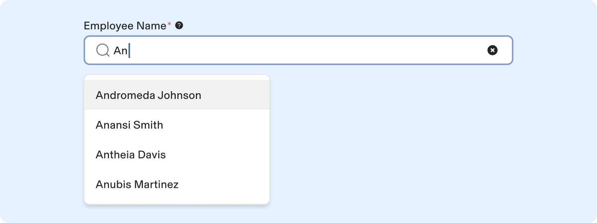
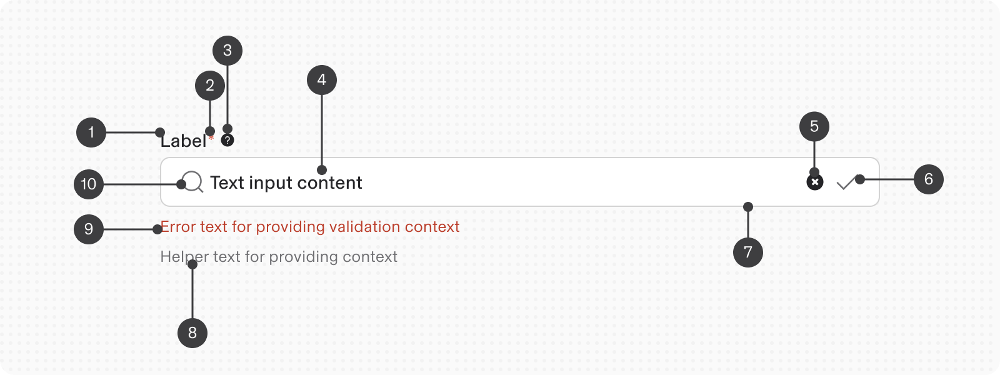
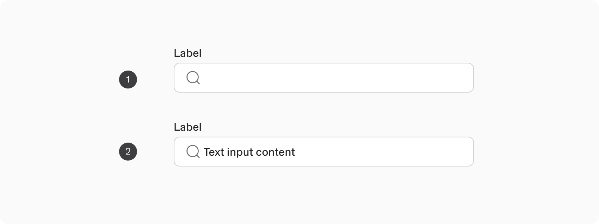
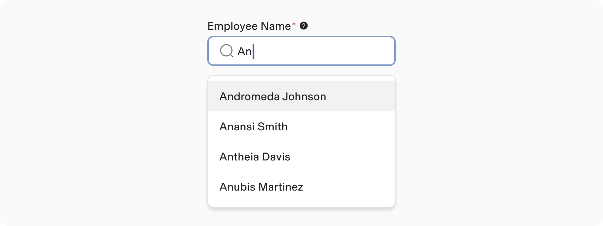
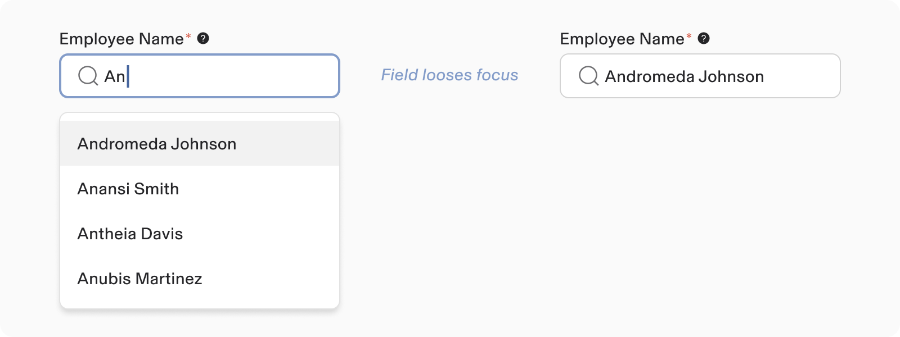
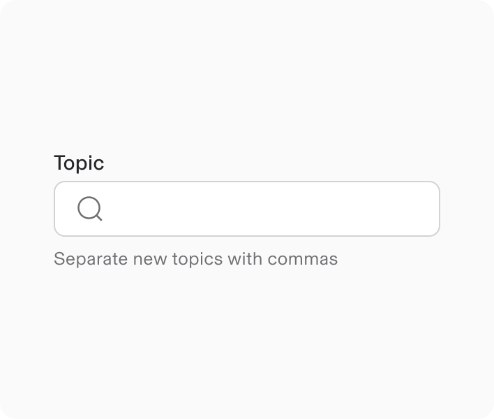
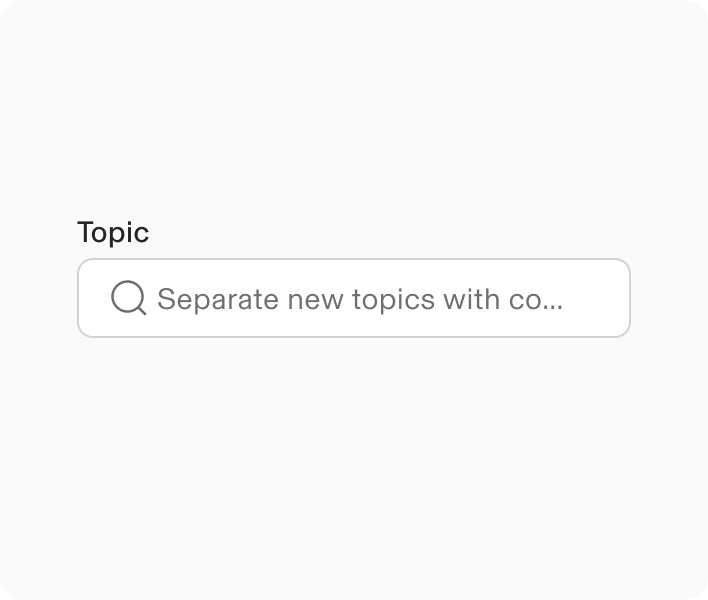
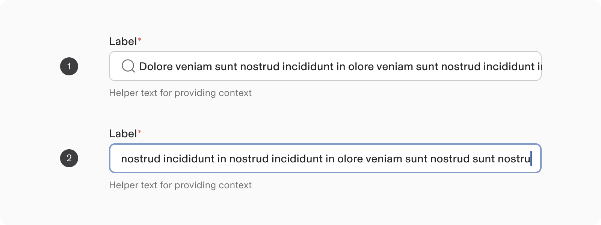
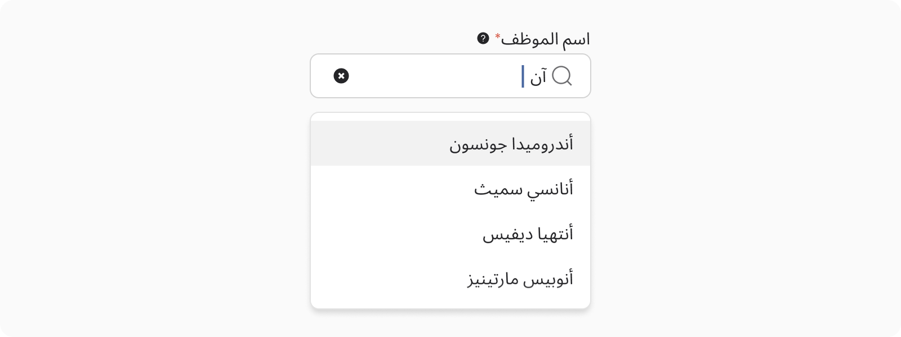

# Text Auto Suggest

**Source:** [View in Confluence](https://rippling.atlassian.net/wiki/spaces/RDS/pages/4751298610)  
**Last Synced:** 11/3/2025, 7:17:46 PM  
**Confluence Version:** 10

---

Text Auto Suggest is an autocomplete feature that enhances user input by offering text suggestions in a dropdown menu.

Input Text Auto Suggest is an autocomplete feature that enhances user input by offering text suggestions in a dropdown menu.

[Figma](https://www.figma.com/design/nhtRzieeGFf1tGVWnRxSK3/Web-Component-Library-\(v3\)?node-id=66677-192455&t=jbotzk78FbGKVNGJ-11) | [Storybook](https://pebble.ripplinginternal.com/?path=/docs/components-inputs-textautosuggest--docs)

---

note

This section highlights the unique differences and changes related to this component.  
Most styling, behavior, and functionality come from the Input Text component.  
[Explore the Input Text Documentation](https://rippling.atlassian.net/wiki/pages/resumedraft.action?draftId=4745888772&draftShareId=ff495fc7-0a49-47a5-804b-ca2980db7ea7)

This section highlights the unique differences and changes related to this component.  
Most styling, behavior, and functionality come from the Input Text component.  
[Explore the Input Text Documentation](https://rippling.atlassian.net/wiki/pages/resumedraft.action?draftId=4745888772&draftShareId=ff495fc7-0a49-47a5-804b-ca2980db7ea7)

# Overview

-   The Text Auto Suggest features an enhanced input text by streamlining the selection process from a vast array of options.
    
-   It enables users to swiftly search and pick from vast arrays of options.
    
-   The options list appears when a user clicks on the input field.
    
-   **How is it different from Input.Select ?**
    
    -   Input Select: Only selection from dropdown is considered valid.
        
    -   Input Text Auto Suggest: You can either manually type text or select from suggestions list. onChange is triggered and value is saved for both scenarios.
        

---

# **Specs**

## **Anatomy**

1.  Label
    
2.  Required vs Optional Indicator
    
3.  Tooltip
    
4.  Value (placeholder/entered text)
    
5.  Action - (Clear all)
    
6.  Suffix - (Validation icon)
    
7.  Text Field
    
8.  Help text
    
9.  Error text
    
10.  Prefix (search icon)
     

## **Configuration**

### **Appearance: Text Input**

Text auto suggest input maintains all design features of a standard text input, including size options, width, visuals, trailing actions, and states.

When a single item is selected, it appears in the input as regular text.

1\. Empty field  
2\. Typed Value

### Appearance: Menu

The menu presents a selection of choices for the field's value. It is displayed as a list in a non-modal dialog, allowing the user to choose one value.

The menu employs Dropdown designs for its size, layout, and interaction.

#### Menu item rendering

By default, menu items display as a single line.

The menu list uses the [Dropdown](https://rippling.atlassian.net/wiki/pages/resumedraft.action?draftId=4719116796&draftShareId=b6aacfb1-de35-46d2-8f6b-6bd9d2ee50a8) component, enabling menu items to have the same options as dropdowns.

---

# Usage

### When to use

-   Use manual typing and searching for predefined lists.
    
-   **Autocomplete Features:** Help users quickly find options like location names or product SKUs.
    
-   **Improve Data Entry:** Use autocomplete to speed up data entry and reduce errors by suggesting valid entries.
    

### **When to use something else**

-   For an input field without suggested options, use the [Input text](https://rippling.atlassian.net/wiki/pages/resumedraft.action?draftId=4742381773&draftShareId=fd4da4c5-77b3-460d-83df-f2cf7da632f6) component.
    
-   For a list of selectable options not linked to an input field:
    
    -   Use radio buttons for single selection.
        
    -   Use checkbox for multiple selection.
        

## **Guidelines**

### Behavior

#### Showing suggestions

1.  Suggestions appear only if `shouldShowMenuOnFocus` is true.
    
2.  Users can type without seeing a long options list.
    
3.  Suggestions launch in a popover when the user has enter some text or it changes.
    
4.  If the input is cleared, all suggestions will display.
    

#### Saving Suggestion

-   Suggestions remain selected when focus leaves the field, preventing loss when users navigate to another component.
    
-   This ensures changes are committed and suggestions are not unintentionally erased.
    

#### Sorting

-   Items should be ordered to facilitate easy user access to specific values.
    
-   Ordering methods can include:
    
    -   Ranking by likelihood of selection (e.g., based on usage frequency in a repository).
        
    -   Alphabetical order.
        
-   The Input select menu height can be adjusted to display as many options as needed within the available space.
    

#### Filtering

-   Menu items are filtered by default based on text input values.
    
-   The default filter is case-insensitive.
    
-   Custom filtering logic can be implemented if the default behavior is unsuitable.
    
-   Disabling filtering entirely is strongly discouraged.
    

## **Content guidelines**

### Don’t use placeholder text

-   Placeholder text is not accessible once a value is entered, making it invisible to users.
    
-   Automatic form fillers cannot access information in placeholder text.
    
-   Use help text descriptions to convey requirements and provide formatting examples for better user understanding.
    
-   Having both placeholder text and help text can be redundant and distracting if they communicate the same information.
    

**Do**

Use help text descriptions to convey requirements and provide formatting examples.

**Don’t**

Avoid putting requirements in placeholders to prevent truncation or unintended overrides.

### Truncation

Choose an appropriate width for text fields to fit most text values.

1.  Upon deselection of a text field, truncate the selected entry with ellipsis to prevent it from colliding with the chevron button.
    
2.  When a text field is focused, if the input exceeds the field width, the leftmost text should be pushed out of sight.
    
    -   Allow text to continue being entered towards the chevron when the text field is in focus.
        

### Internationalisation

-   For RTL (Right-to-Left) languages, the arrangement of the component is reversed.
    
-   The text and prefix ixon are right-aligned.
    
-   The 'suffix-clear all' is left-aligned.
    

---

# Accessibility

## **Keyboard Navigation**

When the menu is closed:

**Keys**

**Action**

While user is typing

Initiates autocomplete or popover (unless suppressed).

When the menu is open:

**Keys**

**Action**

Down Arrow

If the popover is unsuppressed and not already open, the down arrow opens the popover menu.

Up or Down Arrow

Move through selection of options in popover or autocomplete.

Esc

If the popover is open, close the popover.
