# Text Input

**Source:** [View in Confluence](https://rippling.atlassian.net/wiki/spaces/RDS/pages/4742381773)  
**Last Synced:** 11/3/2025, 7:17:38 PM  
**Confluence Version:** 24

---

The Input text component enables users to enter a single line of text.

[Figma](https://www.figma.com/design/nhtRzieeGFf1tGVWnRxSK3/Web-Component-Library-\(v3\)?node-id=66677-192315&t=GT7bjPSXqT8pDwJ4-11) | [Storybook](https://pebble.ripplinginternal.com/?path=/docs/components-inputs-text--docs)

---

# Overview

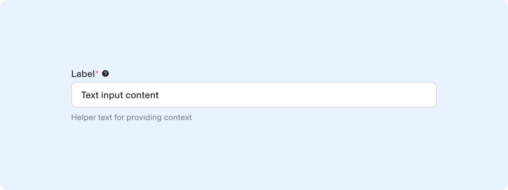

-   Input Texts enable users to submit free-form text. Text fields are common in forms and dialogs.
    
-   Standard Input text is for brief, single-line responses.
    
-   Ensure text fields look interactive and text field states (empty, filled, error) should be easily identifiable.
    

---

# Variants

**Type**

**Use-case**

Input Text

When the user input is one line of text.

[Input Text Area](https://rippling.atlassian.net/wiki/pages/resumedraft.action?draftId=4745888772&draftShareId=ff495fc7-0a49-47a5-804b-ca2980db7ea7)

When user input exceeds a few words and spans multiple lines.

[Input Text Auto Suggest](https://rippling.atlassian.net/wiki/pages/resumedraft.action?draftId=4751298610&draftShareId=f6aa052d-c76a-4839-8249-4f6c3be4f996)

Text Auto Suggest is an autocomplete feature that allows users to enter text or select from a dropdown of suggestions, streamlining input.

[Input Currency](https://rippling.atlassian.net/wiki/pages/resumedraft.action?draftId=4745889036&draftShareId=133a1bbc-ca94-4dd2-be7f-f00dc6268b5a)

The Input currency component lets users add amount in a particular currency.

[Input File Upload](https://rippling.atlassian.net/wiki/pages/resumedraft.action?draftId=4745889681&draftShareId=fd138c69-1e59-4c13-9f25-4d1fc380c7b3)

Input File Drop component allows user to either drag and drop the file into the input area or upload from computer.

[Input Select](https://rippling.atlassian.net/wiki/pages/resumedraft.action?draftId=4746282196&draftShareId=994aaee4-5f4e-450f-b7a6-38667263ad75)

Select component lets users select one option form a dropdown menu.

---

# Usage

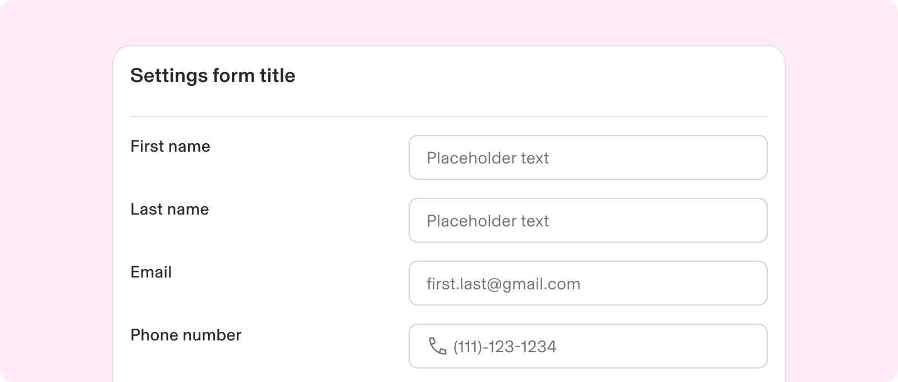

Use a text input for single-line user entries. They have a fixed height and allow simple free-form data with letters, numbers, or symbols.

### When to use

-   Input fields allow users to provide unique information that may not fit predefined options.
    
-   They are beneficial for users needing to quickly enter memorable data in a free-text format.
    
-   Input fields facilitate the collection of unstructured text from users.
    
-   Common uses include gathering names, usernames, or brief descriptions within forms.
    

### **When to use something else**

-   Avoid using free-form text input if users can only select from a predefined list; opt for selection controls like [dropdowns](https://rippling.atlassian.net/wiki/pages/resumedraft.action?draftId=4719116796&draftShareId=b6aacfb1-de35-46d2-8f6b-6bd9d2ee50a8), Input selects, or radio buttons.
    
-   Input field Types:
    
    -   Input Text: Use when expecting a single line of text.
        
    -   Input Text Area: Use when expecting input that spans multiple lines.
        
-   Avoid input fields for complex data entry that needs more structure or guidance, use table instead.
    

---

# **Specs**

## **Anatomy**

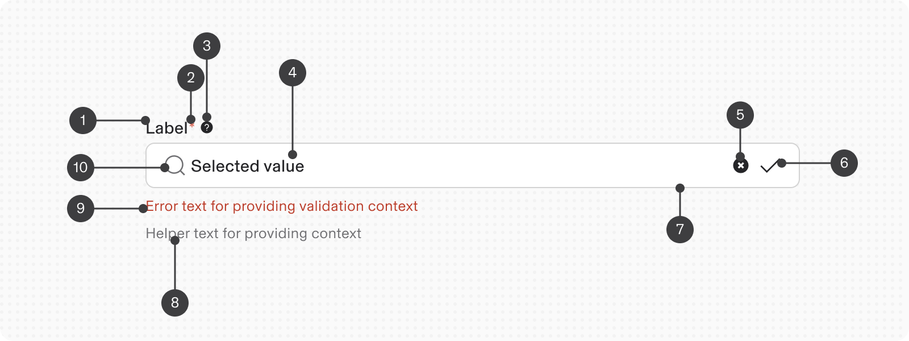

1.  **Label (mandatory):** The title should be brief and express the input's purpose, essential for assistive technologies like screen readers.
    
2.  **Required indicator:** Signifies a mandatory value must be provided, displayed for any required field.
    
3.  Tooltip
    
4.  **Input (mandatory):** Accepts free-form text from the user.
    
5.  **Clear All action:** An action influencing the input, often a button that clears it.
    
6.  **Suffix icon:** Similar to prefix, but positioned after the input value.
    
7.  Text field container
    
8.  **Help text:** Additional information to assist users in entering correct data, as concise as possible.
    
9.  **Error text:** A validation message providing guidance for users to correct invalid values.
    
10.  **Prefix text/icon:** An icon or brief text that emphasizes the input's purpose, appearing before the entered value.
     

## **Configuration**

### **Size**

Four text input height sizes are available:

1.  Large size (48px)
    
2.  Medium size (40px)
    
3.  Small size (32px)
    
4.  Extra Small size (24px)
    

note

Maintaining a consistent field height is important when pairing form components on the same page.

Maintaining a consistent field height is important when pairing form components on the same page.

### **States**

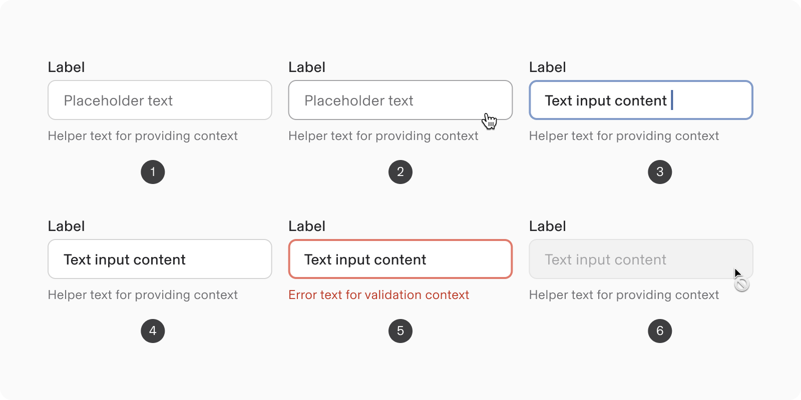

1.  **Default**: when live but unengaged, possibly showing placeholder text.
    
2.  **Hover:** when the cursor is over the field.
    
3.  **Focus:** when a user clicks or tabs to the input, indicating access.
    
4.  **Filled:** when a user is typing in the field.
    
5.  **Invalid:** the value fails validation requirements.
    
6.  **Disabled:** the input cannot accept input or gain focus.
    

### State: Disabled

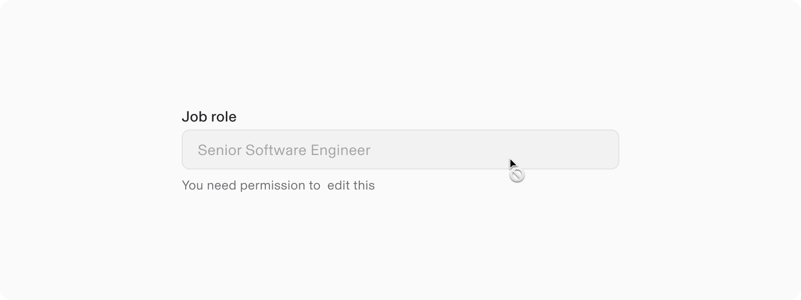

-   A disabled state in UI design indicates a non-interactive component with removed functions.
    
-   Unlike read-only states, disabled components are not focusable, unreadable by screen readers, and lack visual contrast, making them inaccessible.
    
-   For non-editable information, use a read-only form field.
    
-   While the component appears disabled, the label and helper or validation text remain enabled for accessibility.
    

### State: Read-only

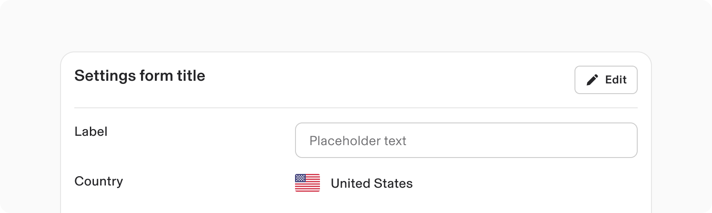

-   Read-only state lets users review content without modifying it.
    
-   Ideal for viewing or copying values without changes.
    
-   Improves user experience by enabling interaction without modification.
    
-   Maintains accessibility: focusable, screen reader compatible, and ensures visual contrast.
    

### State: Invalid

An error state is triggered when there is invalid data or when fields are incomplete.

This is indicated by visual signals: a red border and an error message.

Change a form field to an error state and utilize Help Text for inline error messages if the validation criteria are not met.

#### Error Text

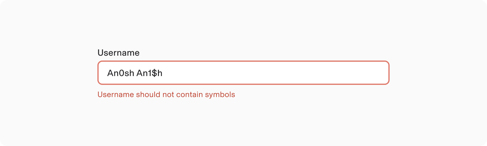

-   The error message informs the user on how to resolve the issue by reiterating the input criteria or outlining the required actions.
    
-   If only one type of error is possible, provide specific guidance to prevent that error.
    
-   In cases of multiple potential errors, focus on preventing the most common error.
    

### State: Required versus optional

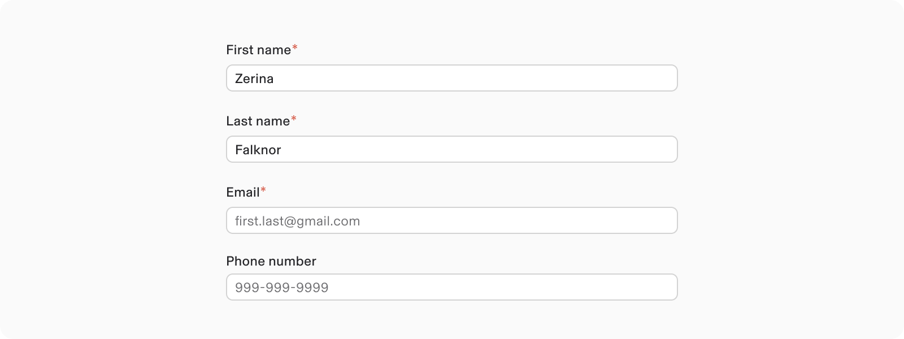

-   Text inputs can be categorised as optional or required based on context.
    
-   Required fields are marked with a red asterisk (\*) for screen reader accessibility and to prevent blank submissions.
    

note

For forms with all mandatory fields, provide a general instruction at the beginning.

For forms with all mandatory fields, provide a general instruction at the beginning.

## Modifiers

### Help Text

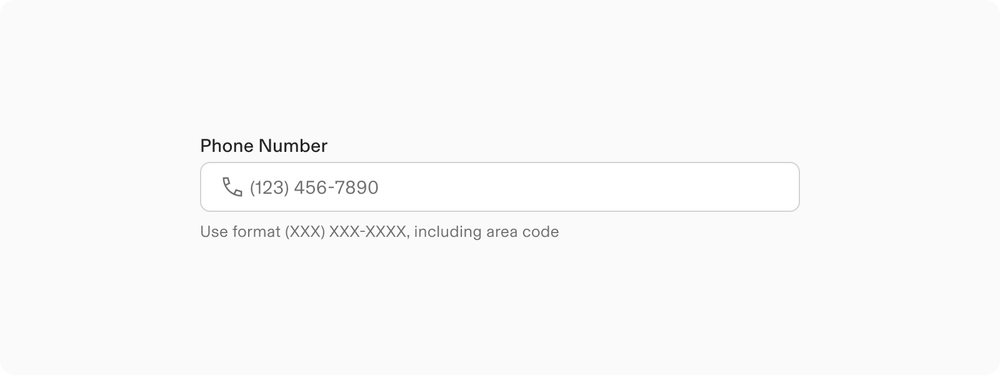

-   The purpose of help text in form fields is to guide users and prevent errors.
    
-   Help text should provide additional guidance (e.g., "Find the registration code on the back of your SIM card").
    
-   Helper text should be displayed persistently when configured.
    

### Label

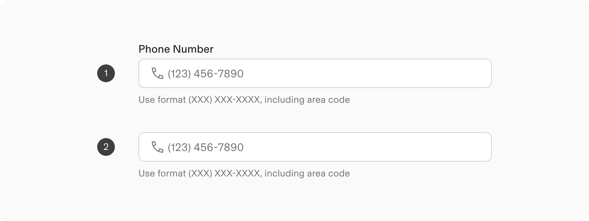

1.  **With Label:** Labels are crucial for text fields to ensure users understand the required information.
    
2.  **Without Label:** In rare cases where context is clear, a label may be hidden but should still include an aria-label in HTML.
    

Labels can be placed either at the top or on the side. [Check examples here.](https://rippling.atlassian.net/wiki/spaces/RDS/pages/edit-v2/4742381773#Layout)

#### Label with Tooltip icon

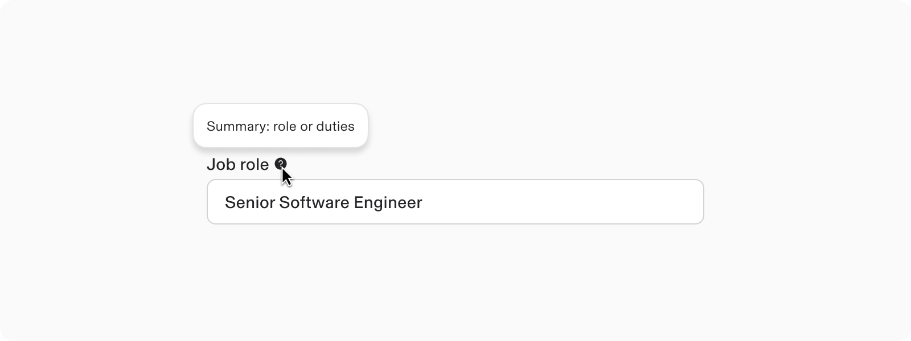

A tooltip icon can be integrated into a label to offer supplementary context, which appears when the user hovers over the icon.  

### Prefix

Adding static text or symbols as prefixes can clarify expected input (particularly for specific values like currency).

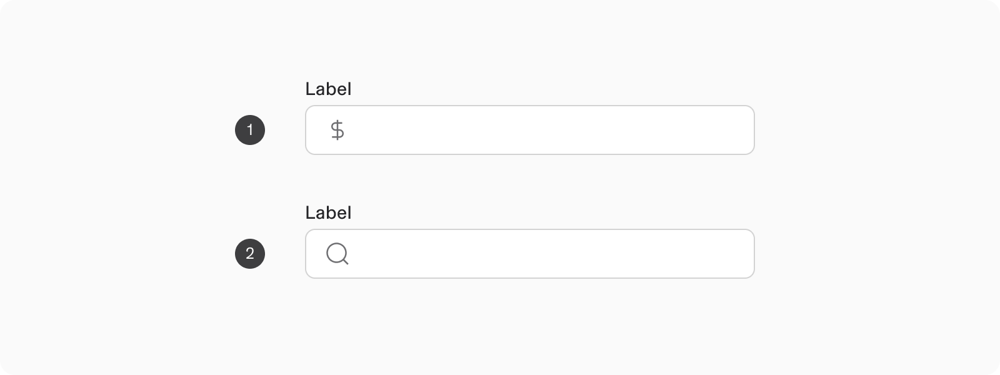

1.  Prefix - Text: Text may be used to show a unit such as "minutes", "$", or "%".
    
2.  Prefix - Icon: Utilize icons to signify the necessary input types (such as a search icon).
    

### Suffix

Static text or symbols can be appended to the input, clarifying expected input and eliminating the need for manual entry.

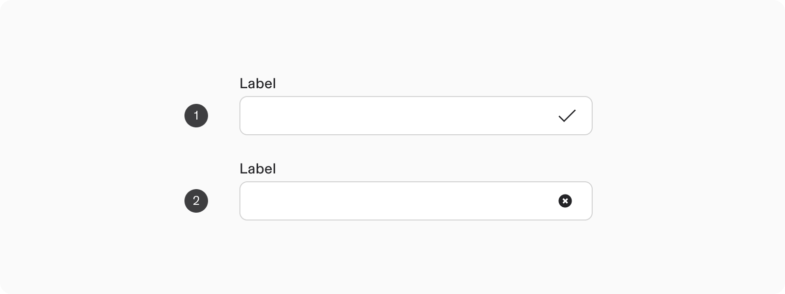

1.  **Suffix: Icon**
    
    -   Iconography clarifies valid and invalid inputs for colorblind users.
        
2.  **Clear button**
    
    -   A trailing action can affect the input, often as a clear button.
        
    -   Clear icons allow users to erase all content in an input field, appearing only when text is entered.
        

### Appearance: No box theme

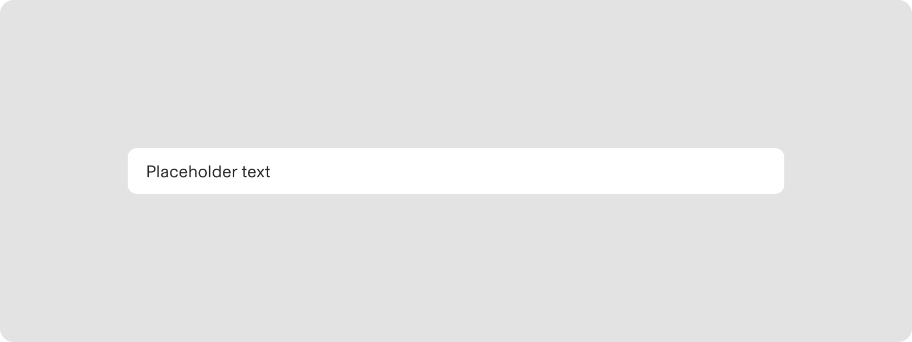

The no-box theme works well on darker surfaces, but can clash with vivid background colors, especially on dim surfaces, informational containers, or colored backgrounds.

### Appearance: Italic theme

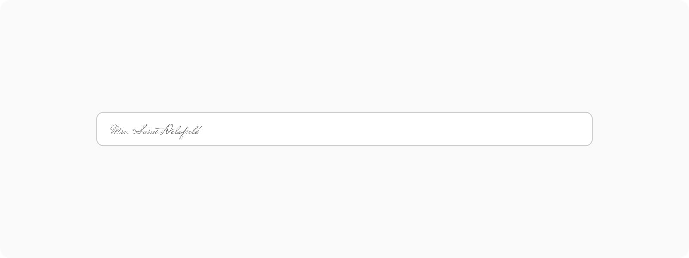

### Layout

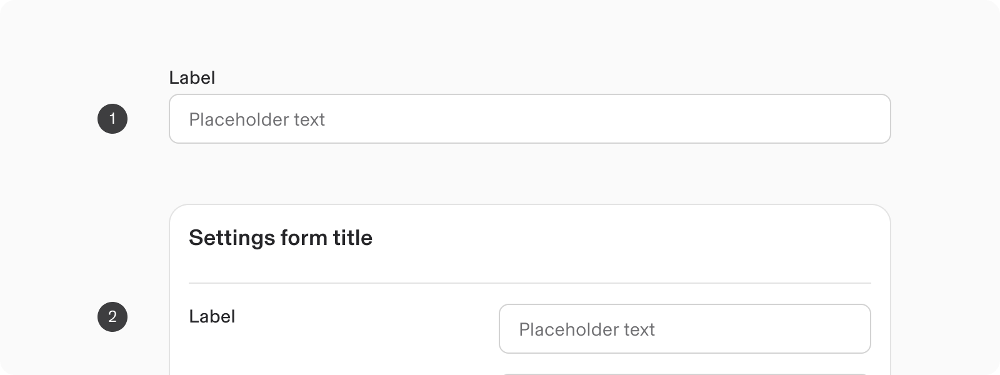

1.  **Vertical Alignment**
    
    -   Default positioning of labels for fields is at the top of the form component.
        
    -   Top alignment is best for quickly reviewing a page and entering data.
        
2.  **Horizontal Alignment**
    
    -   Labels can be left-aligned if space is limited and fields are uniform.
        
    -   However, caution is advised as left-alignment may reduce readability.
        

---

# **Guidelines**

## Width

Text fields should not extend across the entire width of a large screen.

There are two styles of text input, default and fluid, which share the same functionality but look visually different.

As text fields in fluid layouts expand, avoid fixed margins and typography settings to prevent excessively long text fields.

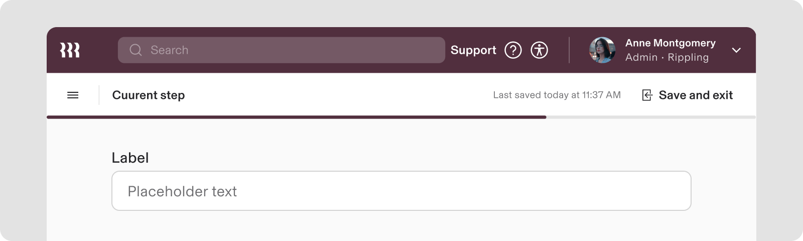

Do

Text field should be visually balanced with adherence to layout margins.

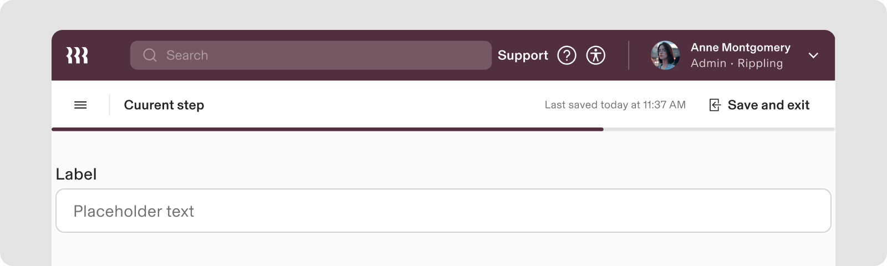

Don’t

Prevent excessively long text fields, spanning across the entire width of screens.

## **Content guidelines**

#### Label

-   Effective labeling helps users understand required information for text inputs.
    
-   Every text field should have a label, except in rare cases where context makes a visible label unnecessary.
    
-   Use label-less design sparingly.
    
-   Use sentence-style capitalization for all labels, except for product names and proper nouns.
    
-   Keep labels short and concise.
    
-   Avoid using colons after label names.
    

#### Helper text

-   Optional helper text aids users in completing a field by explaining the required data format.
    
-   This text is located beneath the field to guide users in filling it out correctly.
    
-   It details accepted values or formats for the field.
    
-   Advised to omit the period in helper text.
    

#### Placeholder text

-   Optional placeholder text provides suggestions or examples for user input, It vanishes when the user begins typing
    
-   Placeholder text should not substitute a permanent label.
    
-   Placeholder text must not include essential information because its overridden once user starts typing.
    
-   Use sentence-style capitalization and frame it as a direct statement without punctuation.
    
-   Placeholder text is not required and remains hidden by default in text fields.
    

### Error text

-   Write user-friendly error messages that guide users to solutions.
    
-   Understand that users may not see system errors as issues.
    
-   Keep messages concise, using 1-2 complete sentences.
    
-   Use clear language, ending with a period.
    
-   Maintain a helpful tone, especially for in-line validation errors.
    
-   For instance, if a required field is missing, suggest: “Enter your email address.”
    

## Overflow content

Users can enter content that may exceed the width of a text input field, allowing for horizontal scrolling.

note

To avoid overflow issues in text fields, using a Text Area is recommended for longer entries (if the entries need to be visible).

To avoid overflow issues in text fields, using a [Text Area](/wiki/spaces/RDS/pages/4745888772/Text+Area) is recommended for longer entries (if the entries need to be visible).

1.  Upon losing focus, the content scrolls back (left horizontally), but refocusing returns the cursor to the end.
    
2.  The text field's values overflow to the left and right, keeping the cursor visible while focused.
    

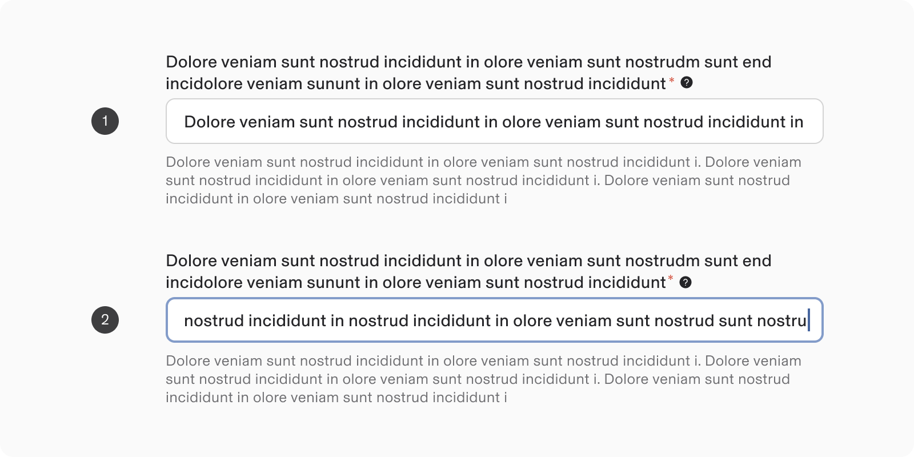

**Long label:** The label wraps based upon the input width.  
The tooltip and the required symbol trail the last word.

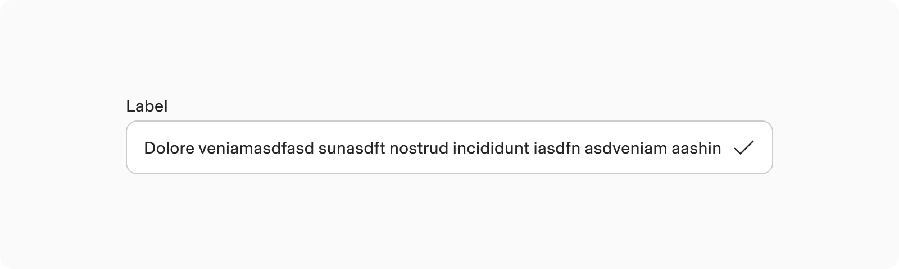

**Long string suffix :**The text overflows behind the suffix  

## **Internationalisation**

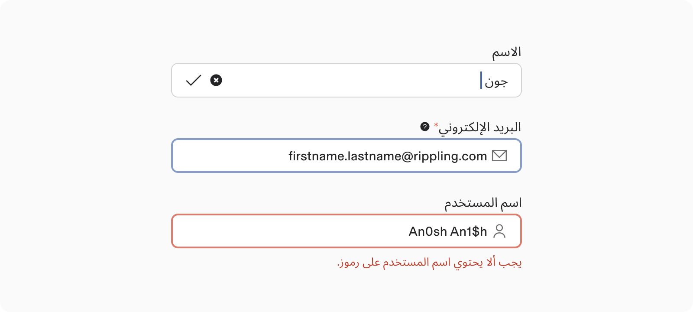

Some portions of the text field component remain untranslated (e.g., email or username).

-   For RTL languages, the text field arrangement is reversed: the label aligns right, suffix (like character count, validation marker, and error icon) align left.
    
-   Certain content types (like email addresses) remain untranslated.
    

---

# Accessibility

-   Avoid using placeholder text alone in input fields. Placeholder text should be paired with a label.
    
-   Remove placeholder text when the field is selected to prevent confusion, especially for those with cognitive challenges.
    
-   Associate placeholder text with an `aria-label` for improved accessibility.
    
-   Users should navigate and interact with text fields using assistive technologies.
    
-   This allows users to input information and understand supporting text and error messages.
    

## **Keyboard Navigation**

**Keys**

**Action**

Tab

Tabbing into a text field selects the existing text.
