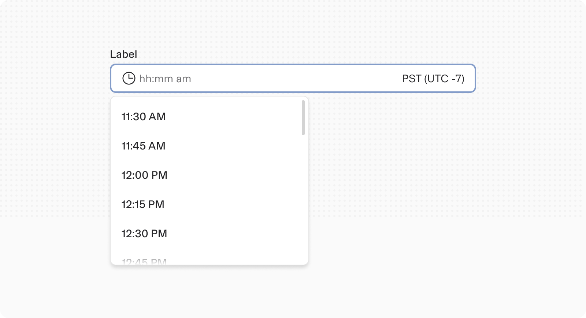
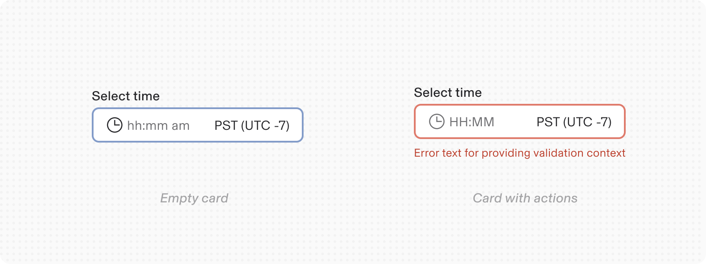

# Time

**Source:** [View in Confluence](https://rippling.atlassian.net/wiki/spaces/RDS/pages/4750377032)  
**Last Synced:** 11/3/2025, 7:17:48 PM  
**Confluence Version:** 4

---

Introduction

A Time input component helps users select a time value

[Figma](https://www.figma.com/design/nhtRzieeGFf1tGVWnRxSK3/Web-Component-Library-\(v3\)?node-id=66583-248850) [Storybook](https://pebble.ripplinginternal.com/?path=/docs/components-inputs-time-single--docs)

---

# Overview

The Time Picker component serves as an interactive UI element that allows users to select a specific time. Time input is a variant of input fields.

# Usage

-   Use time pickers to help users select a time in forms.
    
-   Use them with timezones when multiple timezones are involves such as in Calendar, setting a meeting with people from different requires timezone selection.
    

## Validations

-   Validation displays an error message related to the restrictions of the time picker.
    
-   When a user selects the time picker area, the focus color changes to blue.
    
-   For example, helper text becomes an error message when the input content doesn't meet the criteria. Error and warning messages disappear when the criteria is met.
    
-   Keep helper text as short as possible. For complex information, provide a link to more information in a new browser tab.
    

# Specs

## Anatomy

1.  **Label:** Labels should indicate what information the field requires. The label is left-aligned above the input area.
    
2.  **Time input field:** Selecting this field opens the select menu showing available times on the selected date. Once a time is selected, the option will be shown in the text input.
    
3.  **Time dropdown:** Contains the list of all selectable times.
    
4.  **Timezone select:** Contains a dropdown list of all selectable timezones.
    

## Size

Follows the regular size types for inputs fields

1.  Extra Small - 24px height
    
2.  Small - 32px height
    
3.  Medium (Default) - 40px height
    
4.  Large - 48px height
    

## Interactions

#### Mouse

The time input field allows value entry by directly typing in the input container.

#### Keyboard

For accessibility, users can navigate to the input field with the `Tab` key. Once the focus on the input is highlighted, the user can type the time in the input and toggle between `AM` and `PM` by typing `A` and `P` respectively. For example, to add 11:45 PM, the user types 1145 P or 11:45 PM, and press enter. The time is then added to the input.

# Content

-   Ensure that locale is appropriately set so that users see times in a familiar format.
    
-   Use a concise label to indicate what the time selection refers to such as ‘Select start time', 'Set alarm time’, etc.
    

# Accessibility

-   Assistive technologies will announce these along with the label from the field component when activated.
    
-   Allow multiple modes of data entry. Some users prefer entering date and time information by typing instead of selection, especially keyboard users.
    
-   If some dates are disabled, provide accurate validation and error messaging for keyboard users, like: `Please enter a future time`
