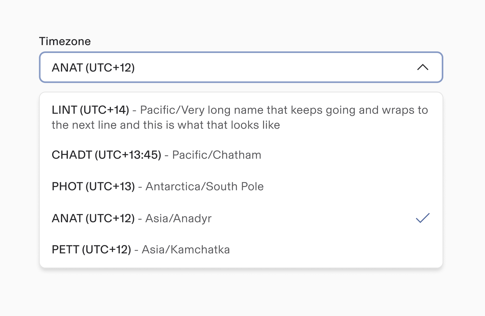
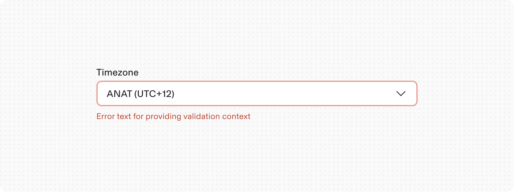
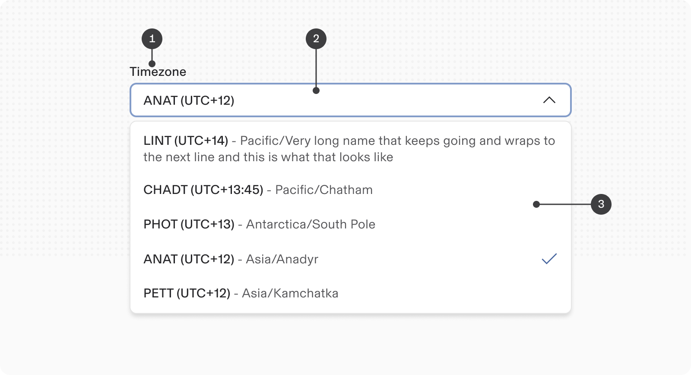

# Timezone

**Source:** [View in Confluence](https://rippling.atlassian.net/wiki/spaces/RDS/pages/4751589377)  
**Last Synced:** 11/3/2025, 7:17:50 PM  
**Confluence Version:** 7

---

Introduction

A Timezone input component helps users select a timezone

[Figma](https://www.figma.com/design/nhtRzieeGFf1tGVWnRxSK3/Web-Component-Library-\(v3\)?node-id=66583-248906) [Storybook](https://pebble.ripplinginternal.com/?path=/docs/components-inputs-timezone--docs)

---

# Overview

The Timezone component serves as an interactive UI element that allows users to select a specific timezone in a form. This is technically a select component with a list of timezones. When you need to also select a time with timezone such as Setting up a meeting in a different timezone, use **Time** component with timezone.

---

# Usage

Timezone picker help users navigate specific timezones and are commonly used in forms.

## Validations

-   Validation displays an error message related to the restrictions of the timezone picker.
    
-   When a user selects the timezone picker area, the focus color changes to blue.
    
-   Helper text becomes an error message when the input content doesn't meet the criteria. Error and warning messages disappear when the criteria is met.
    
-   Keep helper text as short as possible. For complex information, provide a link to more information in a new browser tab.
    

---

# Specs

## Anatomy

1.  **Label:** Labels should indicate what information the field requires. The label is left-aligned above the input area.
    
2.  **Timezone select field:** Selecting this field opens the select menu showing available timezones. Once a timezone is selected, the option will be shown in the text input.
    
3.  **Timezone dropdown:** Contains the list of all selectable timezones.
    

## Size

Follows the regular size types for inputs fields

## Interactions

#### Mouse

The timezone input field allows value entry by directly typing in the input container.

#### Keyboard

For accessibility, users can navigate to the input field with the `Tab` key. Once the focus on the input is highlighted, the user can press arrow keys to navigate between timezone(or type to Search) and press `ENTER` to make a selection from the dropdown list.

---

# Content

-   Ensure that locale is appropriately set so that users see times in a familiar format.
    
-   Use a concise label to indicate what the time selection refers to.
    

# Accessibility

-   Allow multiple modes of data entry. Some users prefer entering timezone information by typing instead of selection, especially keyboard users.
