# Tree

**Source:** [View in Confluence](https://rippling.atlassian.net/wiki/spaces/RDS/pages/4832591892)  
**Last Synced:** 11/3/2025, 7:18:00 PM  
**Confluence Version:** 4

---

Select component lets users select one option form a dropdown menu.

Input tree component provides users options to select from a tree-based view..

[Figma](https://www.figma.com/design/nhtRzieeGFf1tGVWnRxSK3/Web-Component-Library-\(v3\)?node-id=66574-82560) | [Storybook](https://pebble.ripplinginternal.com/?path=/docs/components-inputs-tree--docs)

---

# Overview

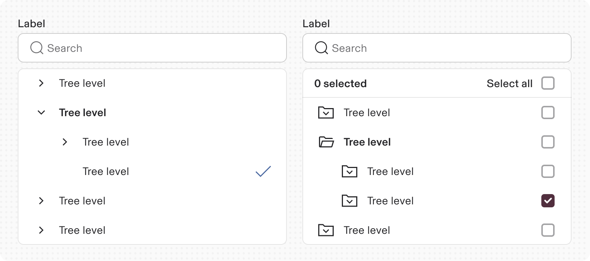

A Input tree component allows users to select from a hierarchically organized list showing parent-child relationships. It allows users to expand or collapse parent items, managing child item visibility. This structure improves navigation through extensive information by creating a clear content hierarchy. The tree view includes branch nodes, which reveal or conceal child nodes, and leaf nodes, terminal nodes without children, existing at any hierarchy level.

---

# Specs

## Anatomy

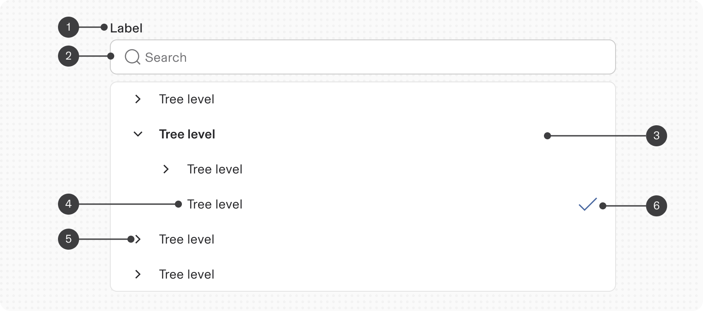

1.  **Label:** Text description of the tree
    
2.  **Search input field:** Allows user to search through the tree. This also shows all the selections made in the form of chips
    
3.  **Branch node:** A node that has one or more child nodes. Can be expanded or collapsed to reveal or hide child nodes.
    
4.  **Leaf node:** A node that has no child nodes and can appear at any level of the tree view hierarchy. A leaf node may be referred to as a child node when it is nested underneath a branch node.
    
5.  **Expand/collapse icon:** An icon to expand or collapse a branch node.
    
6.  **'Check' Suffix icon:** A check icon to indicate selection of a single node
    

## Variants

**Type**

**Purpose**

**Visual Representation**

Single select

Allows single selection from a set of options

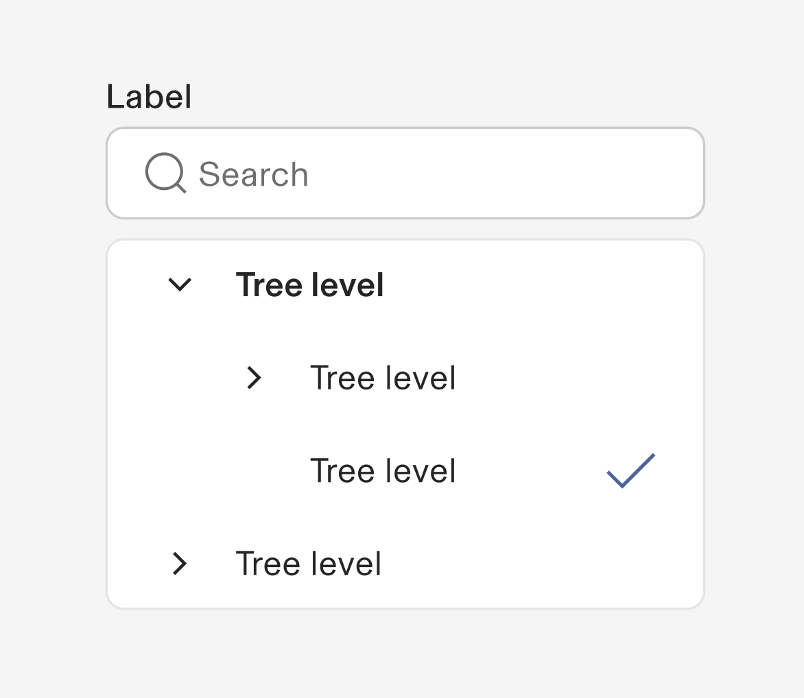

Multiselect

Allows multiple selection from a set of options

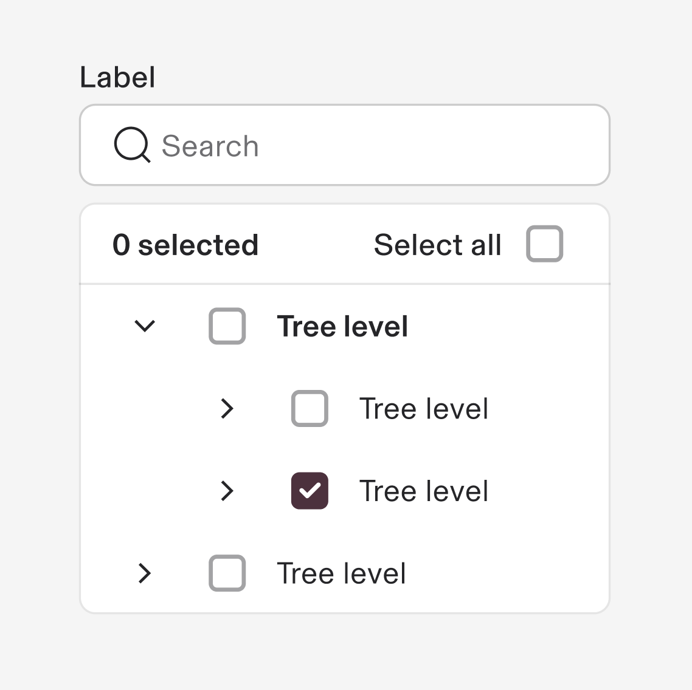

No box background

No container. Can be used on a surface of your choice.

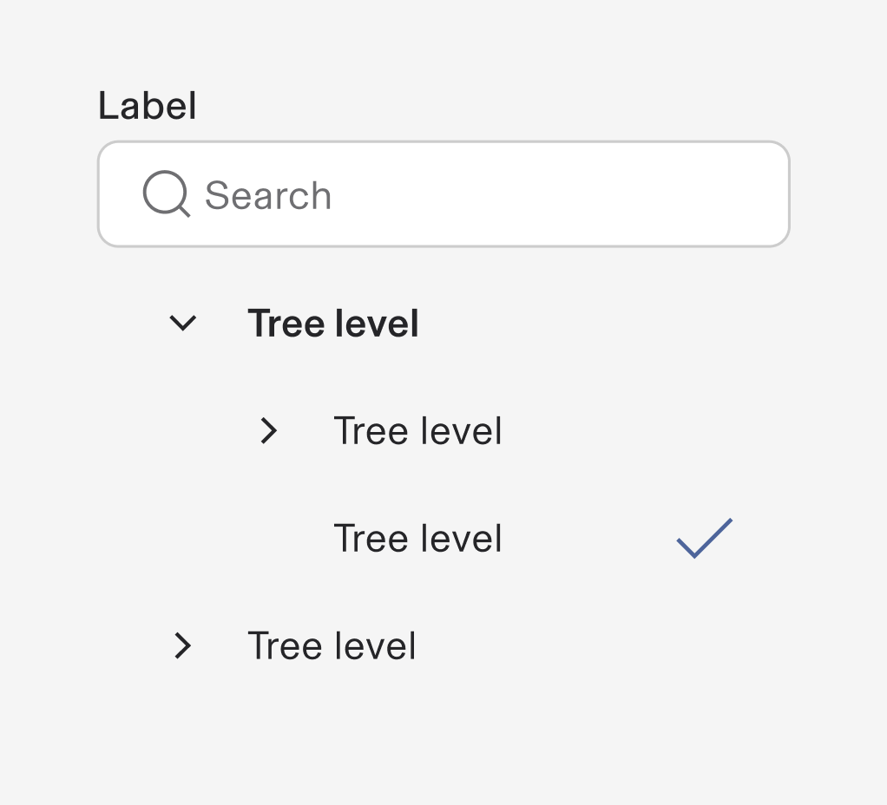

## Properties

**Type**

**Purpose**

**Visual Representation**

with Secondary text

Added secondary text for more supporting information

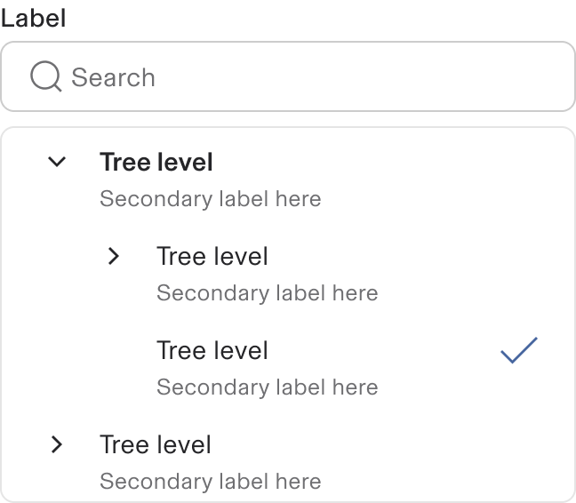

with Label

Used for labelling an option. Default label type is _Success_ and can be changed based on the requirement

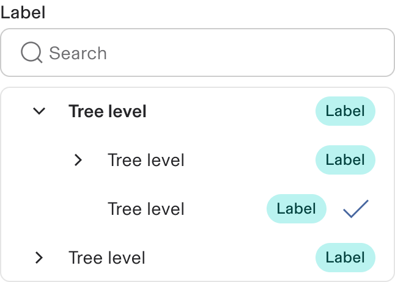

Folder structure

Used to replicate the folder tree structure.

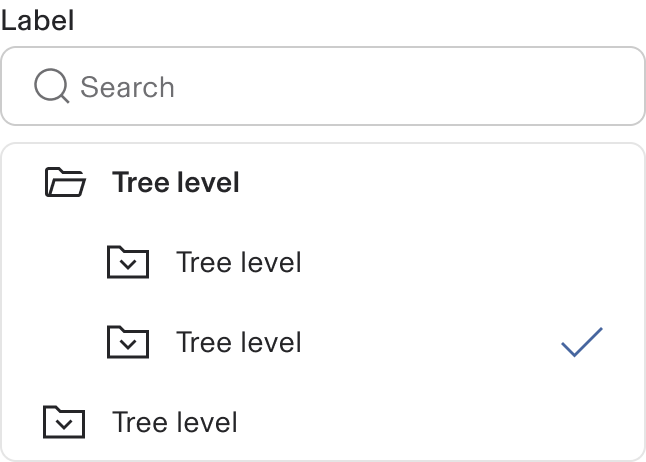

Reverse checkbox in Multiselect tree

Showing multiselect checboxes at the right end of the tree nodes

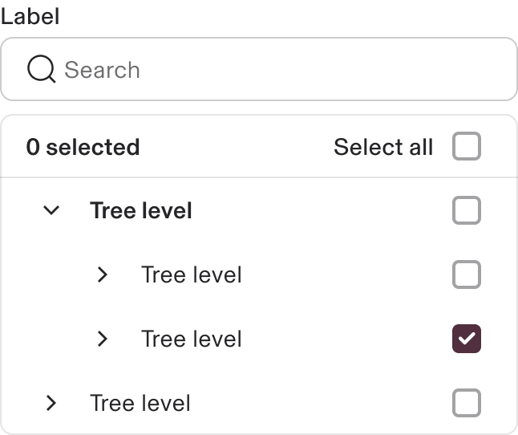

with Footer

Shows a sticky footer with actions

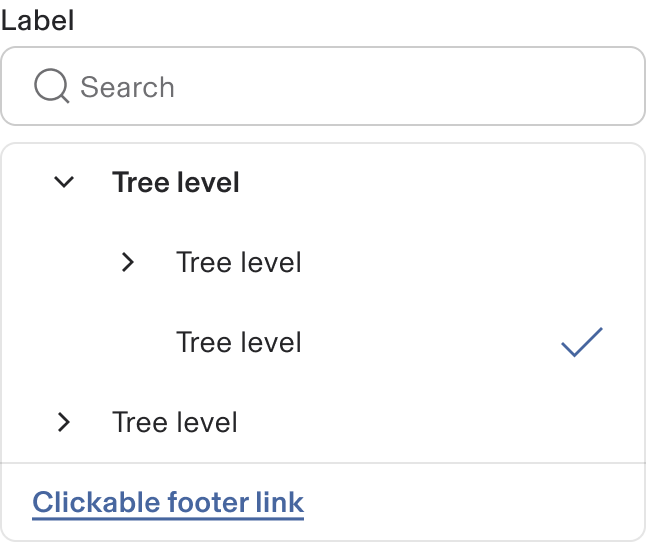

## Sizes

Follow the same format of size as all other inputs, namely:

1.  Large
    
2.  Medium(Default)
    
3.  Small
    
4.  Extra small
    

## Tree Select

Tree Select is a type of select component with a tree structure. Tree Select does not show the tree structure upfront as Input Tree and is exposed as a dropdown panel when clicked on.

1.  Tree select input field - Collapsed
    
2.  Tree select input field with select dropdown - Expanded
    
    1.  Select input field has chips for selected options
        

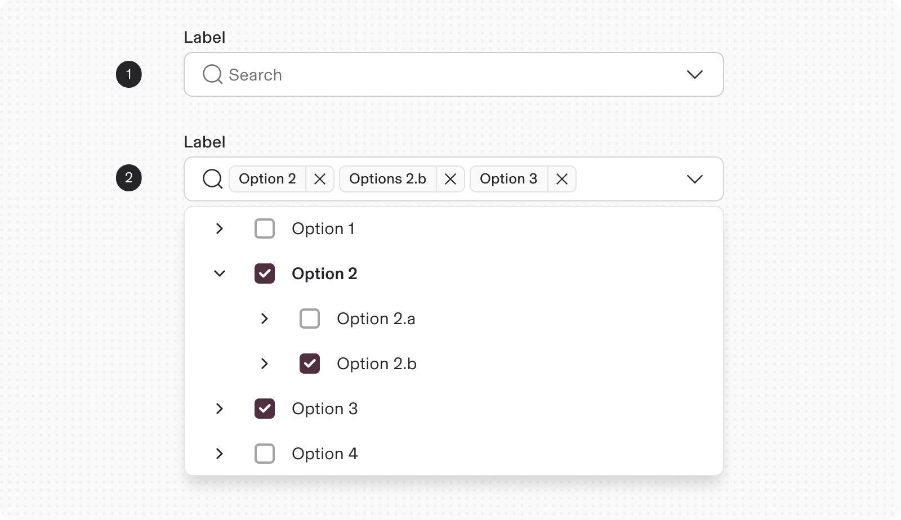

## Interaction

When typing a query in the search box, the tree auto filters the relevant results to show the value matching the query.

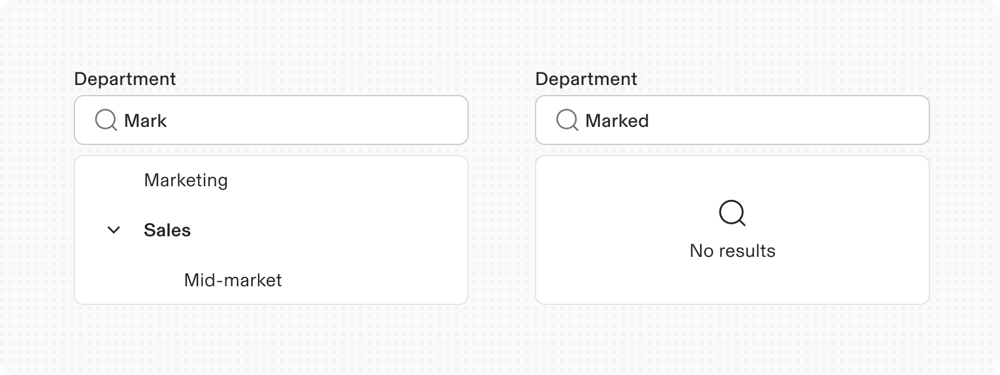

---

# Usage

## When to use

-   A tree structure represents various entities like directories, hierarchies, classifications, and countries.
    
-   The Tree component illustrates hierarchical relationships, allowing users to expand, collapse, and select nodes.
    
-   It aids in navigating file systems with folders and documents.
    
-   Essential for organizing extensive nested information.
    

## When not to use

-   Use accordions or data tables for read-only information that users don’t need to select from.
    
-   Leverage the UI Shell's left panel and breadcrumb for primary navigation.
    

## Responsiveness

The input and the tree container can shrink upto a min-width of 360px and wrap the content inside to a multi-line treatment.

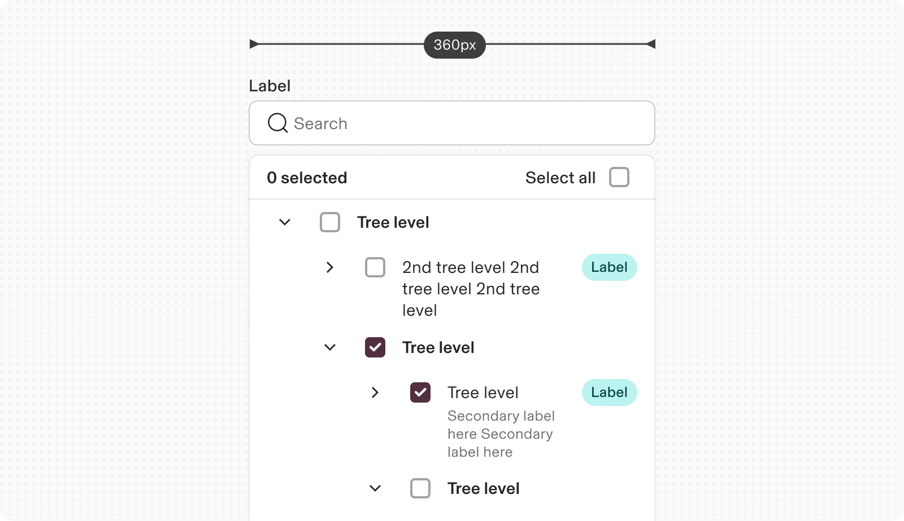

---

# Content guidelines

### Branch Node Label

Provide a concise yet informative summary of the types of child nodes contained within the branch node.

### Leaf Node Label

Offer a brief and clear description of the information held within the leaf node.

---

# Accessibility

-   The Input Tree functions like a file explorer, allowing hierarchical navigation and interaction.
    
-   This interaction differs from standard website navigation, which has distinct mental models and usability standards.
    

## Keyboard

-   Click `Tab 1` to focus on the search input field
    
-   Press `Tab 2` to focus on tree container
    
-   Press `Tab 3` to focus on first branch node
    
-   Press `Enter` to select a node
    
-   Press `→` to expand a parent node to reveal all children nodes
    
-   Press `←` to collapse a parent node to hide all children nodes
