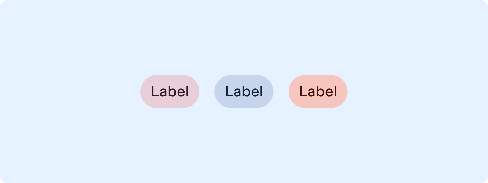
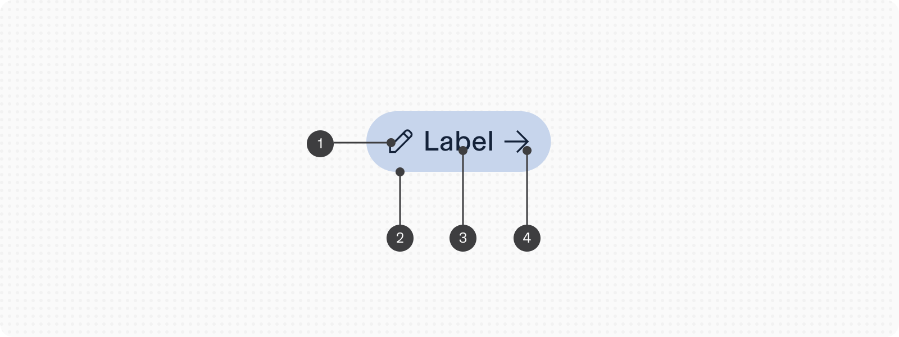
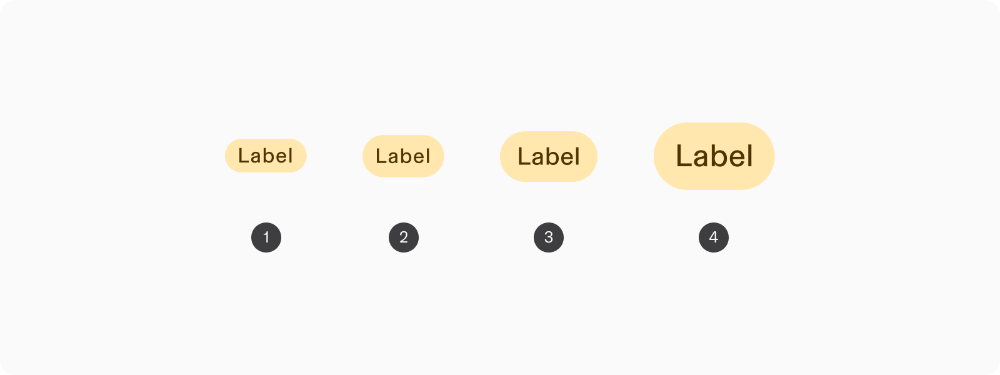
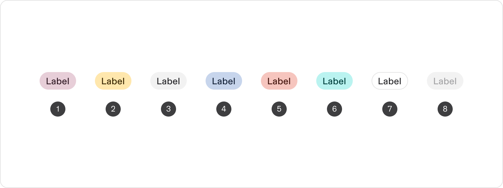
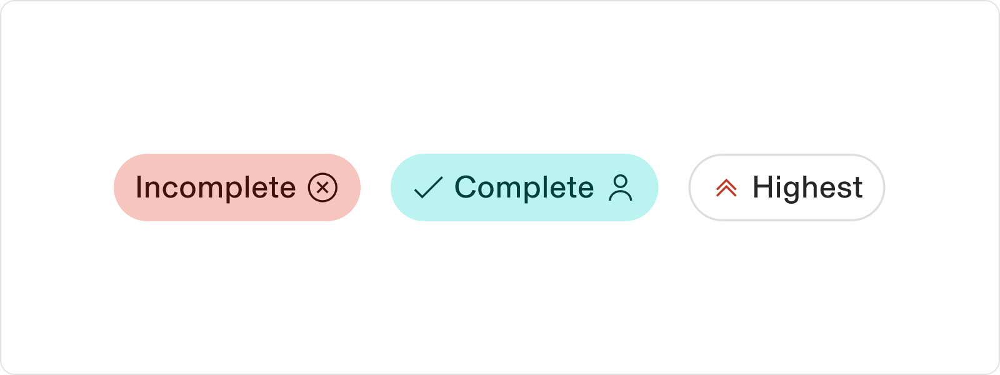
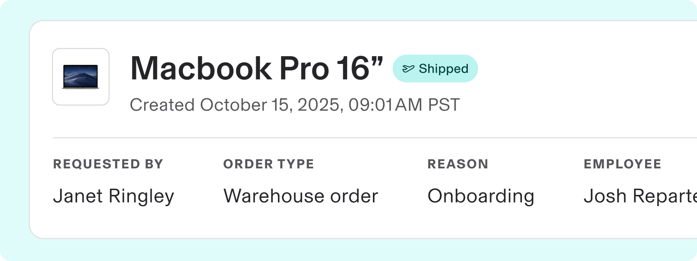
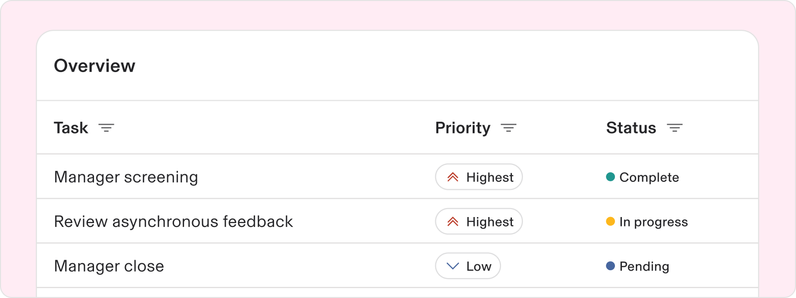

# Label

**Source:** [View in Confluence](https://rippling.atlassian.net/wiki/spaces/RDS/pages/3893657610)  
**Last Synced:** 11/3/2025, 6:09:31 PM  
**Confluence Version:** 36

---

A static identifier representing a status, property, or other highlighted metadata about an item.

---

# Overview

-   Useful for categorizing, organizing, or labeling items using keywords that describe them
    
-   Effective at providing users with quick, high-value information at a glance
    

## Resources

**Type**

**Resource**

**Status**

Design

[Web Component (Figma)](https://www.figma.com/file/ysWbTtfWqhVDHQd1Mg2LQ1/Component-Library-v2?type=design&node-id=953-114&mode=design)

AvailableGreen

Implementation

Web Component (Storybook)

PlannedYellow

---

# Specs

## Anatomy

1.  Start icon (optional)
    
2.  Container
    
3.  Text label
    
4.  End icon (optional)
    

## Configuration

### Size

1.  Small
    
2.  Medium
    
3.  Large
    
4.  Extra Large
    

### Color

1.  Primary
    
2.  Warning
    
3.  Neutral (default)
    
4.  Tertiary
    
5.  Error
    
6.  Success
    
7.  Transparent
    
8.  Disabled
    

### Icons

The color of icons can be customized with primary color roles (primary, secondary, tertiary) in the “Transparent” color of a Label only.

Icons may be displayed at the beginning, the end, or a mix of both positions.

---

# Usage

### When to use

-   Utilize Labels to highlight key properties of items, such as "New," "Recommended," or "Relevant." This is particularly useful in inventory systems or rating applications to provide quick insights into item attributes
    
-   Apply Labels to represent metadata that categorizes or provides _notable_ information about an item. Labels help in bucketing related content based on shared characteristics
    

### When to use something else

-   If you need interactivity, or to represent more complex relationships, use Chips.
    
-   Labels are meant for short, concise metadata. If you need to display longer descriptions or content, use a Tooltip for additional context.
    
-   If the content changes frequently (e.g., live status updates), consider using a Status component, as Labels are best suited for relatively static information
    
-   If the element requires user interaction, such as triggering a modal, opening a link, or performing an action, use a Button instead
    

## Guidelines

### Limit an overwhelming amount of color

To reduce visual clutter on a page with numerous Labels or extensive color usage, opt for Transparent variant of the Label and color the icon. This approach minimizes overwhelm by adjusting the icon's color instead of the Label's background color.

---

# Accessibility

Users should be able to:

-   Understand the dynamic information conveyed in the text content, such as priority or status
