# Lists

**Source:** [View in Confluence](https://rippling.atlassian.net/wiki/spaces/RDS/pages/4819617065)  
**Last Synced:** 11/3/2025, 6:09:46 PM  
**Confluence Version:** 52

---

Lists visually organise related information, facilitating grouping and customisation.

---

### Variants

**Type**

**Use-case**

[Lists basic (List items)](https://rippling.atlassian.net/wiki/spaces/RDS/pages/edit-v2/4819617065#List-Item)

List item components when grouped, create pre-defined customisable, vertically aligned, interactive lists.

[Draggable list](https://rippling.atlassian.net/wiki/spaces/RDS/pages/edit-v2/4819617065#Draggable-Lists)

Draggable, reorder-able lists offer flexible vertical/horizontal arrangement.

[Nested list](https://rippling.atlassian.net/wiki/spaces/RDS/pages/edit-v2/4819617065#Nested-Lists)

A hierarchical nested list with up to four levels.

Checklist

A nested options list, enabling single or multiple selections.

---

# List Item

List item components is used to create a basic list of entities.

[Figma](https://www.figma.com/design/nhtRzieeGFf1tGVWnRxSK3/Web-Component-Library-\(v3\)?node-id=66677-234041&t=IUAeQeIsW1hlPchb-11) | [Storybook](https://pebble.ripplinginternal.com/?path=/docs/components-list-listitem--docs)

---

# Overview

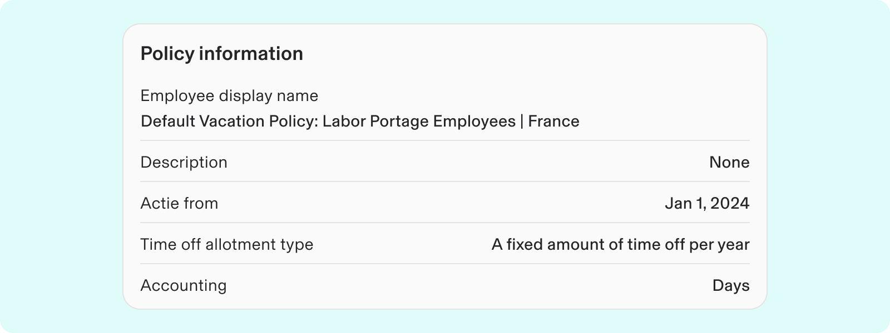

The List component is designed to create a structured grouping of related entities, arranged vertically.

-   **Structured Grouping:** Displays related entities in a vertical arrangement for easy scanning.
    
-   **Visibility:** Best for exposing all items upfront for immediate viewing.
    
-   **Customisation:** Supports prefixes and suffixes for tailored content.
    
-   **Actionable:** Allows actions like selection, data entry, or deletion on list items.
    
-   **Contextual Grouping:** Can be organised within a Card component with a Title for added context.
    

---

# Usage

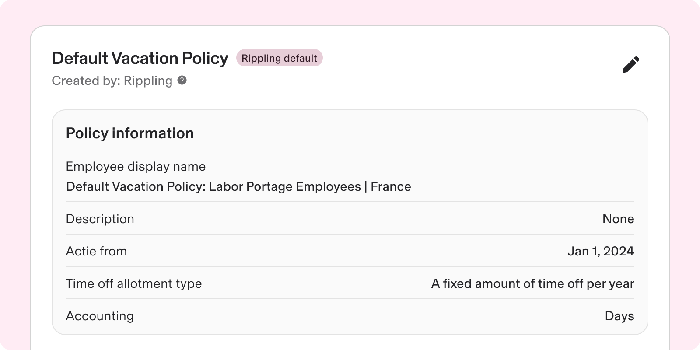

### When to Use

-   Use the List component to break up chunks of related content for easier readability.
    
-   Lists showcase all items upfront and may have interaction attached to each individual list item.
    

### When to Use Something Else

-   Consider using a Dropdown Menu instead of a Lists when:
    
    -   Dropdown Menu: Ideal for selecting from predefined options. It keeps the list hidden until needed and supports single or multiple selections.
        
    -   List: Best for displaying all/multiple items upfront for easy reading and individual actions.
        
-   Lists are best for conveying simple information. For complex data sets, consider using table.
    
-   Use typographic styles, not lists, for static content:
    
    -   [Numbered lists](https://pebble.ripplinginternal.com/?path=/docs/components-typography-list--docs#ordered) – ideal when conveying a sequence or priority.
        
    -   [Bulleted lists](https://pebble.ripplinginternal.com/?path=/docs/components-typography-list--docs#ordered)– best for related items without a specific order.
        

---

# Specs

## Anatomy

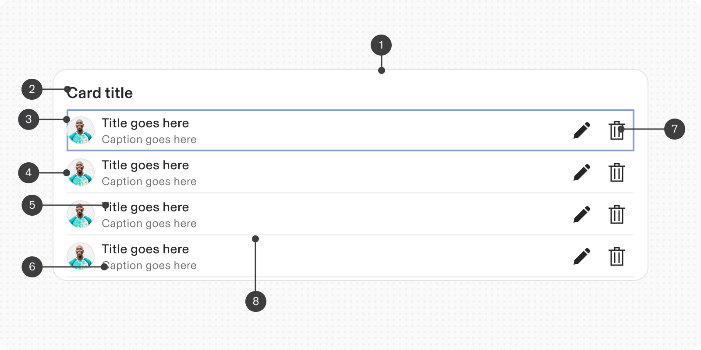

1.  Card
    
2.  Card title
    
3.  List item
    
4.  Prefix (icon/avatar)
    
5.  Text
    
6.  Description
    
7.  Suffix (text/ button/ input field / label)
    
8.  Divider
    

## Configuration

### Card title

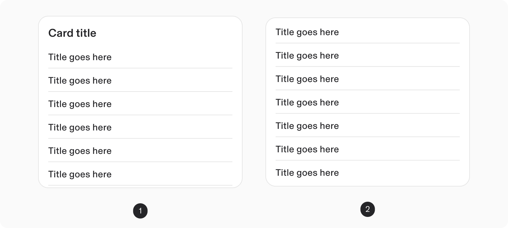

1.  With card title (default)
    
2.  Without title
    

### Variant - Text contents

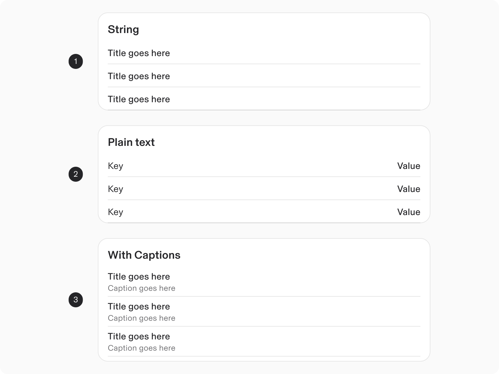

1.  String
    
2.  Plain text (with text suffix)
    
3.  With captions
    

### Variant - with Left Icons

1.  Left Icon
    
2.  Left icon and right icons
    

-   Consumers can configure the number of icons, with a maximum limit of three.
    
-   For more than three actions, a kebab menu should be used.
    
-   Clickable icons should be replaced with the Icon Button component.
    

### Variant - with Avatar

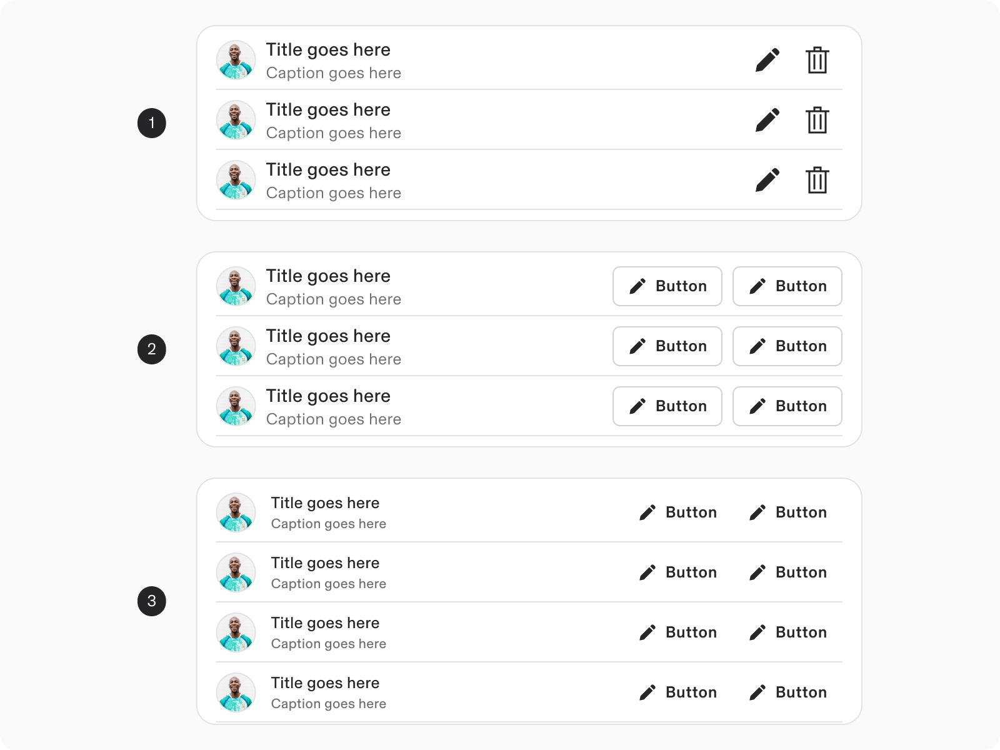

1.  Avatar and icon button
    
2.  Avatar and outlined buttons
    
3.  Avatar and text buttons
    

### Variant - with Radio button

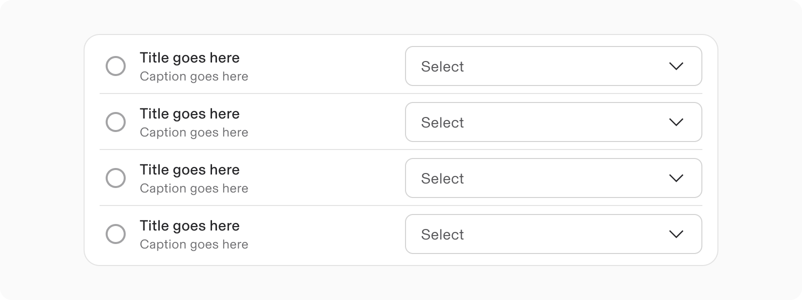

Lists with Radio button (and select input)

### Variant - with Checkbox

1.  Checkbox and select input
    
2.  Checkbox and text input
    
3.  Checkbox and date input
    
4.  Checkbox and labels
    
5.  Checkbox and dropdown actions
    

### Variant - with custom JSX

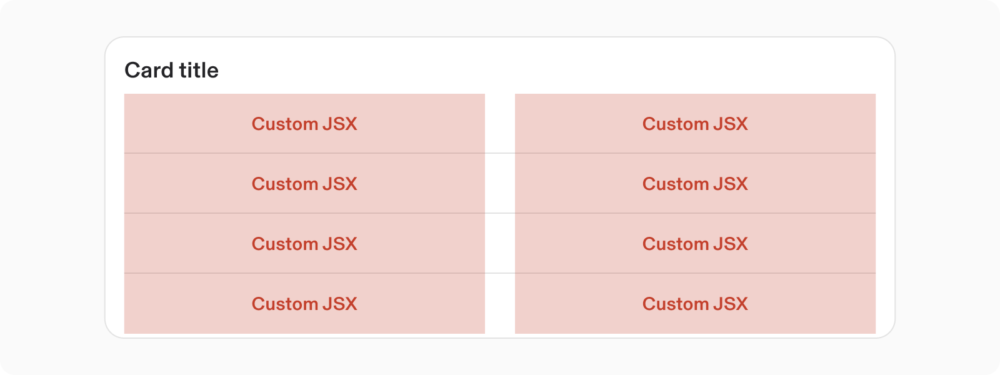

User can configure custom content using the JSX.

---

# Guidelines

### Structuring Content

-   Arrange items logically, whether by importance, frequency, or another meaningful criterion.
    
-   Ensure visual consistency by applying uniform prefixes/suffixes to similar list items.
    

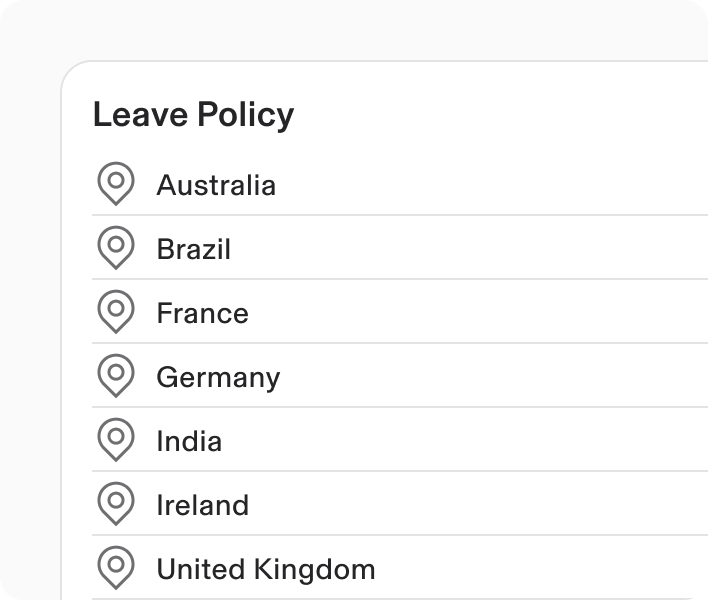

Do

1.  Content organised alphabetically.
    
2.  Ensure all list items maintain consistent prefixes/suffixes.
    

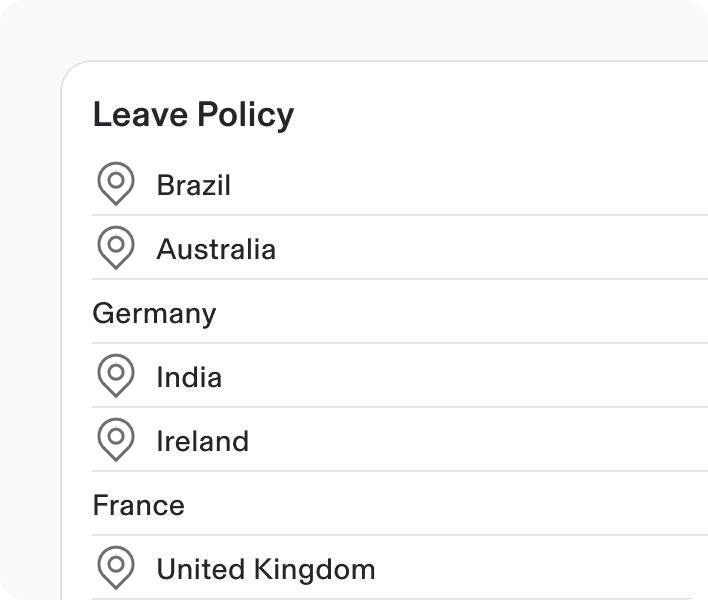

Don’t

1.  Maintain a logical flow of information to prevent reader confusion.
    
2.  Use consistent prefix/suffix for all list items.
    

### Responsive width

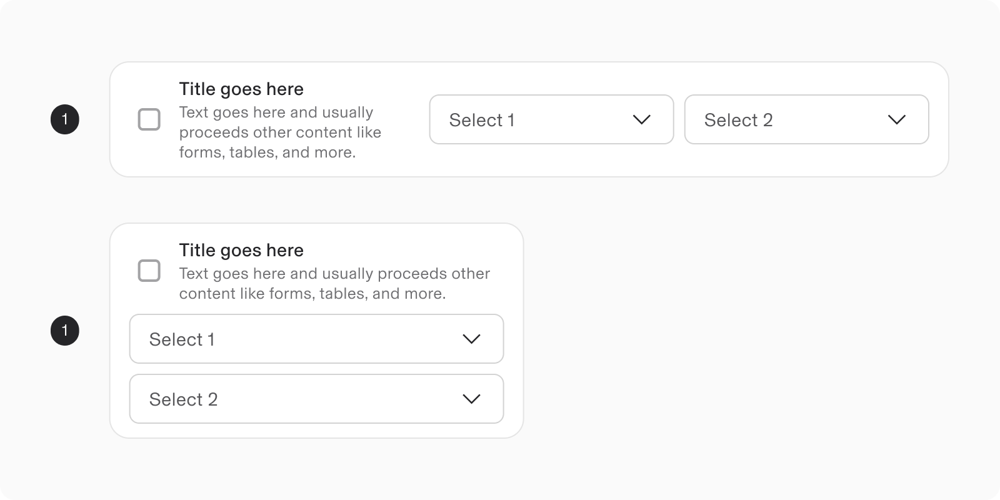

This fluid component wraps (text and elements) to the next line if insufficient space exists for inline content.

Default left side content minimum width is 176px.

### Text overflow - expandable behavior

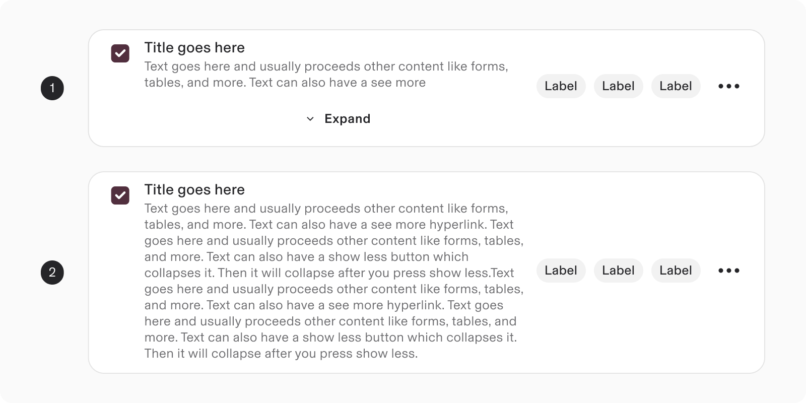

1.  With Text Clip
    
2.  Without Text Clip
    

## Content Guidelines

-   Ensure each list item is concise and begins with a capital letter.
    
-   Use nouns or verbs consistently to start each list item.
    
-   Maintain grammatical parallelism across list items for consistency and readability.
    

### Internationalisation

-   Be mindful of layout changes for right-to-left (RTL) languages, ensuring that list markers align correctly.
    
-   Text direction should adapt based on language settings to maintain readability.
    

---

# Accessibility

Ensure the list is navigable via keyboard for users relying on assistive technologies.

## Keyboard Navigation

**Keys**

**Action (default)**

Tab

-   Lists without interactive elements place the focus on subsequent list items.
    
-   Lists containing interactive elements initially focus on the first such element, allowing for sequential navigation through the remaining interactive items.
    

Space or Enter

-   Selectable lists allow users to choose individual items.
    
-   Actionable elements trigger a specific action upon interaction.
    

---

# Draggable Lists

A list that provides reordering functionality through drag-n-drop.

[Figma](https://www.figma.com/design/nhtRzieeGFf1tGVWnRxSK3/Web-Component-Library-\(v3\)?node-id=66809-108611&t=fldAtywqbOARRkiG-11) | [Storybook](https://pebble.ripplinginternal.com/?path=/docs/components-list-draggablelist--docs)

---

# Overview

-   The Draggable List component allows users to reorder items dynamically using drag-and-drop functionality.
    
-   Each item has a visible draggable handle indicating it can be reordered.
    
-   While they lack the extensive prefix/suffix customisation available in basic [Lists](https://rippling.atlassian.net/wiki/spaces/RDS/pages/edit-v2/4819617065#Overview).
    
-   Draggable Lists offer the unique advantage of being arranged both vertically and horizontally.
    

note

This section highlights the unique differences and changes related to this component.  
[Explore the ‘Lists’ documentation](https://rippling.atlassian.net/wiki/spaces/RDS/pages/edit-v2/4819617065#Overview)

This section highlights the unique differences and changes related to this component.  
[Explore the ‘Lists’ documentation](https://rippling.atlassian.net/wiki/spaces/RDS/pages/edit-v2/4819617065#Overview)

---

# Usage

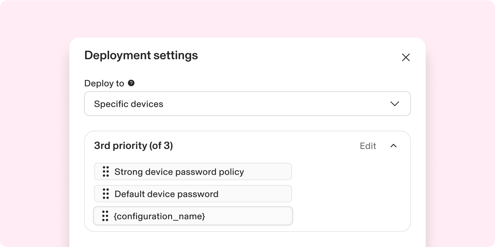

### When to Use

-   Use Draggable Lists when users need to rearrange list items dynamically, such as in assigning department or reorganising content in forms.
    
-   Ideal for scenarios where flexibility in item order is crucial to the user experience.
    

### When to Use Something Else

-   If the list order is fixed and does not require user interaction, a standard [List](https://rippling.atlassian.net/wiki/spaces/RDS/pages/edit-v2/4819617065#Overview) component may be more appropriate.
    
-   For simple selection of list items without reordering, consider a Checklist component.
    

---

# Specs

## Anatomy

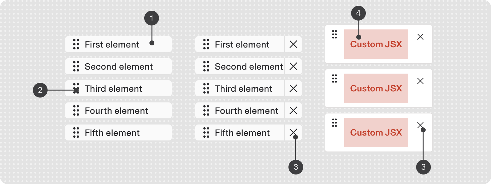

1.  Container (chip)
    
2.  Drag & drop - handle
    
3.  Removable - button
    
4.  Custom JSX
    

## Configuration

### States

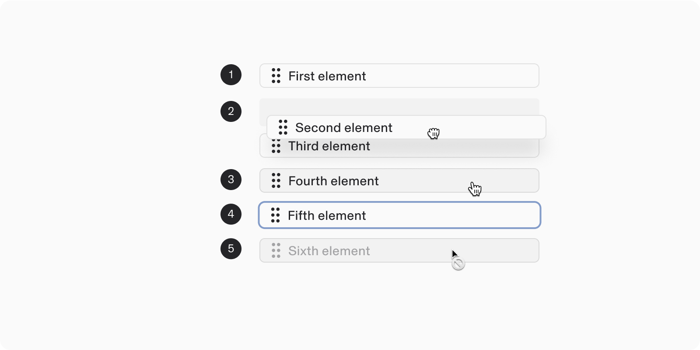

1.  Default
    
2.  Dragged
    
3.  Hover
    
4.  Focus
    
5.  Disabled / Fixed
    

### State: Fixed

The first and fifth elements are fixed and cannot be rearranged.

### State: Removable

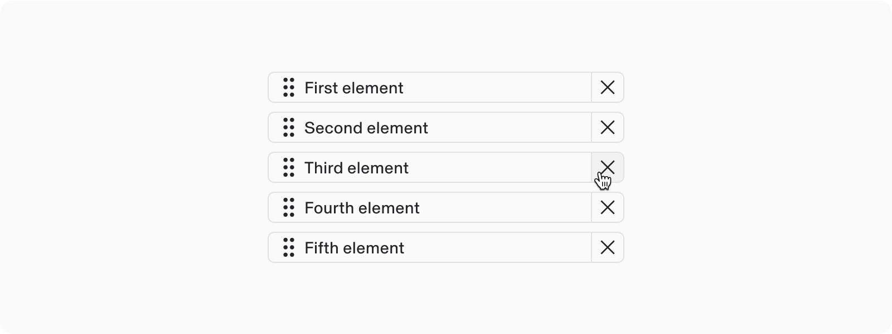

Draggable list items offer a configurable removal option.

### Orientation

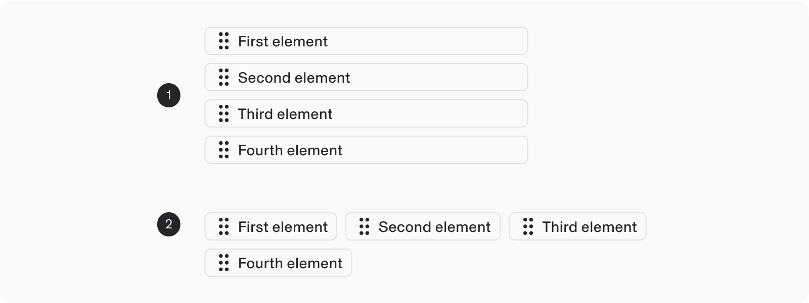

1.  Vertical (default)
    
2.  Horizontal
    

### Appearance

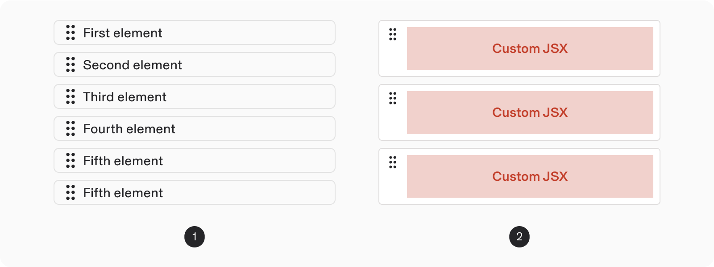

1.  Chips
    
2.  Custom renderer
    

---

# Guidelines

### Dragging interaction

-   Ensure that draggable handles are visible and intuitive to encourage user interaction.
    
-   Provide visual feedback during drag-and-drop actions to guide users effectively.
    

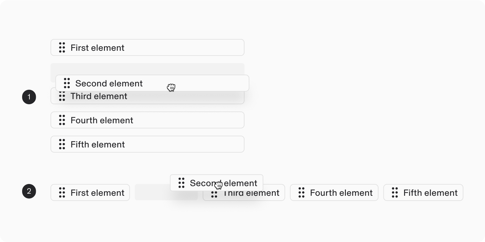

1- Vertical alignment & 2- Horizontal alignment

## Content Guidelines

-   Keep list items concise to prevents text wrapping; this facilitate easy dragging and prevent overlap.
    
-   Visual Cues: Use clear drag handle icons to distinguish draggable list items from fixed ones.
    

## Internationalisation

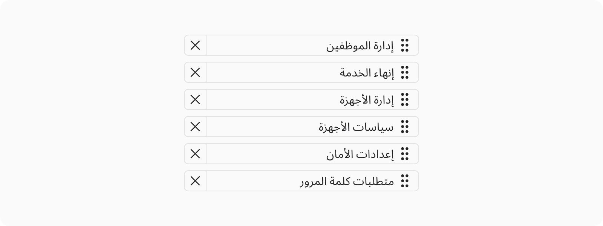

-   Support right-to-left (RTL) language by ensuring drag-and-drop functionality adapts to the text direction.
    
-   Adjust visual indicators to align with language orientation.
    

---

# Accessibility

## Keyboard Navigation

Keyboard interaction is not supported in Draggable list.

---

# Nested Lists

Nested list components is used to create a nested list of entities.

[Figma](https://www.figma.com/design/nhtRzieeGFf1tGVWnRxSK3/Web-Component-Library-\(v3\)?node-id=66676-180877&t=fldAtywqbOARRkiG-11) | [Storybook](https://pebble.ripplinginternal.com/?path=/docs/components-list-nestedlist--docs)

---

# Overview

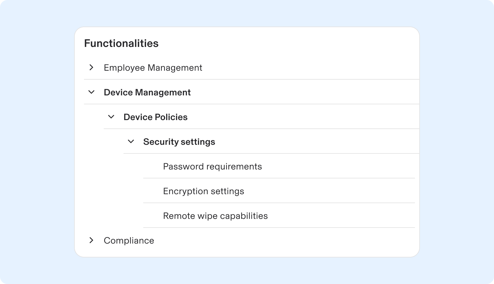

-   The Nested List component displays complex, hierarchical data structures like categories and subcategories.
    
-   It is ideal for organising large amounts of nested information in an intuitive and accessible way.
    
-   Offers expandable and collapsible parent items to efficiently manage data visibility.
    
-   Supports up to four levels of nesting, using chevrons and indentation to indicate hierarchy.
    
-   Unlike [draggable lists](https://rippling.atlassian.net/wiki/spaces/RDS/pages/edit-v2/4819617065#Draggable-Lists), nested Lists cannot be reordered through drag-and-drop.
    

note

This section highlights the unique differences and changes related to this component.  
[Explore the ‘Lists’ documentation](https://rippling.atlassian.net/wiki/spaces/RDS/pages/edit-v2/4819617065#Overview)

This section highlights the unique differences and changes related to this component.  
[Explore the ‘Lists’ documentation](https://rippling.atlassian.net/wiki/spaces/RDS/pages/edit-v2/4819617065#Overview)

---

# Usage

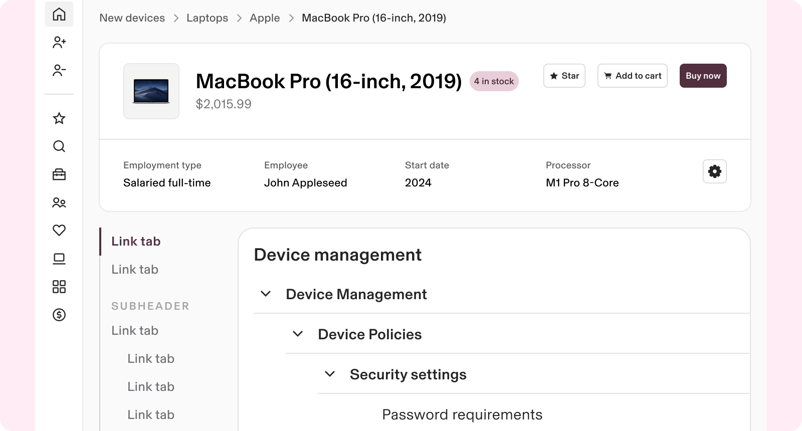

### When to use

-   Nested lists offer a clear and efficient way to visualize hierarchical information.
    
-   They are ideal for representing data requiring multi-level nesting, such as complex organisational structures or extensive lists of departments etc.
    

### When to use something else

Choose the right component for your needs:

-   Use an expansion panel for single-level expandable content. Don’t use nested list it for primary UI/product navigation.
    
-   Use Link tabs for product navigation within a UI. Combine link tabs with basic tabs and breadcrumb navigation for deeper information architectures.
    
-   Use tables for large, scannable datasets best viewed horizontally. For multi-level information, use nested lists with concise labels to avoid a columnar structure.
    
-   For non-hierarchical lists or simple selections, use a [Basic List](https://rippling.atlassian.net/wiki/spaces/RDS/pages/edit-v2/4819617065#Overview) or Checklist component.
    
-   Use a Dropdown Menu for managing data visibility efficiently when space is limited.
    

---

# Specs

### Anatomy

1.  Card Title
    
2.  Collapsed - List Item
    
3.  Expanded - List Item (Parent)
    
4.  Nesting - 1st level
    
5.  Nesting - 2nd level (child)
    
6.  Nesting - 3rd level (child)
    
7.  Nesting - 4th level (child)
    
8.  Chevron
    
9.  Custom JSX
    
10.  Card background
     
11.  Separator
     

## Configuration

### States

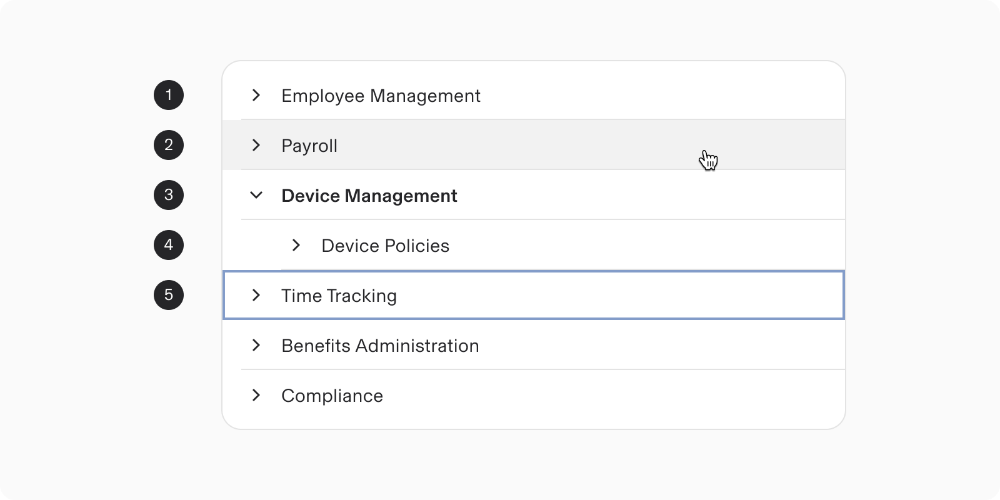

1.  Default
    
2.  Hover
    
3.  Collapsed
    
4.  Expanded
    
5.  Focused
    

### Nesting levels

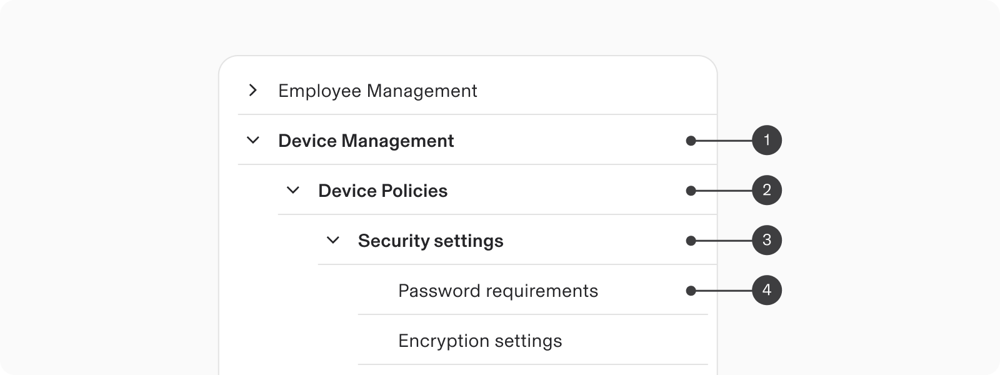

1.  1st Nesting level
    
2.  2nd Nesting level
    
3.  3rd Nesting level
    
4.  4th Nesting level
    

### Appearance

#### Card theme

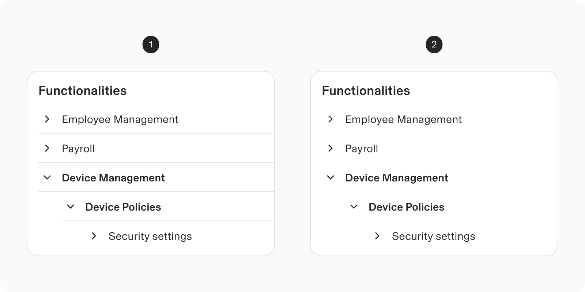

1.  With separators
    
2.  Without separators
    

#### Title

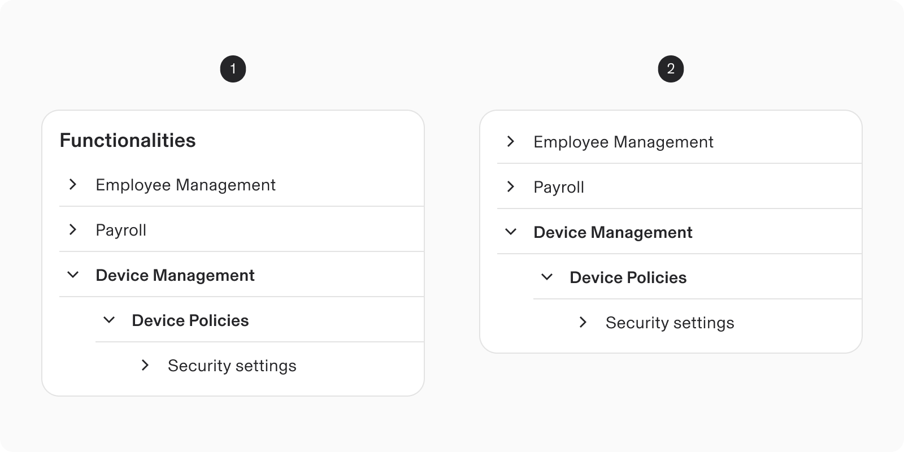

1.  With title
    
2.  Without title
    

#### No card theme

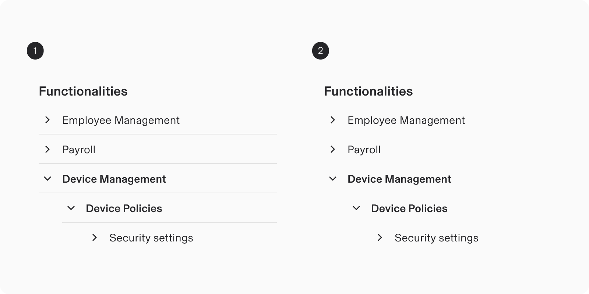

1.  With separators
    
2.  Without separators
    

### Appearance: with Text Clip

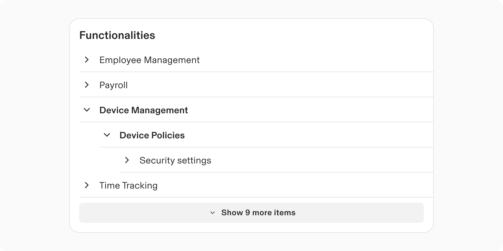

---

# Guidelines

### Nesting behavior indicators

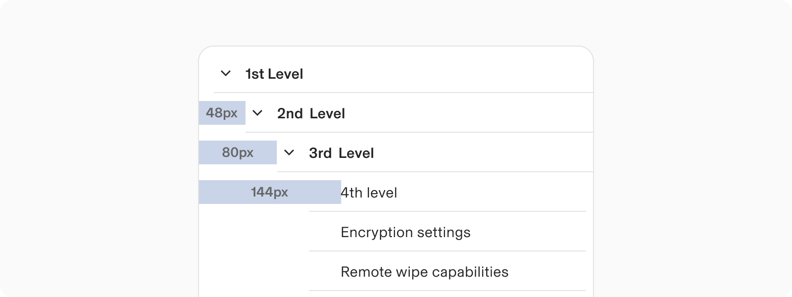

Ensure that each level of nesting is visually distinct, using indentation and chevrons to convey hierarchy.

### Visual Indicator

-   Provide visual indicators for expandable/collapsible items (using chevron icons directions).
    
-   This makes it clear to a user as to what kind of behavior to expect when they click on the icon of a nested list item.
    

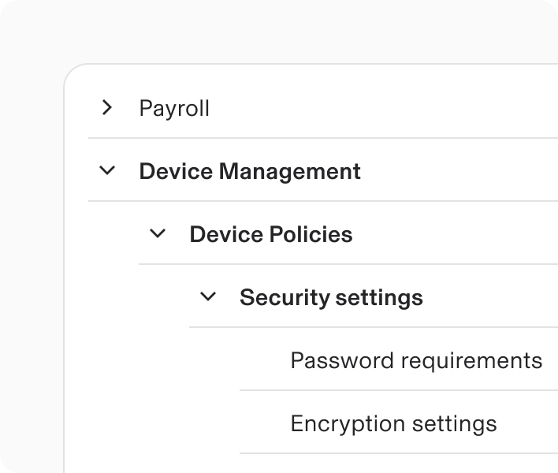

Do

Use chevron icon mandatorily to show the collapse/expand state and behavior.

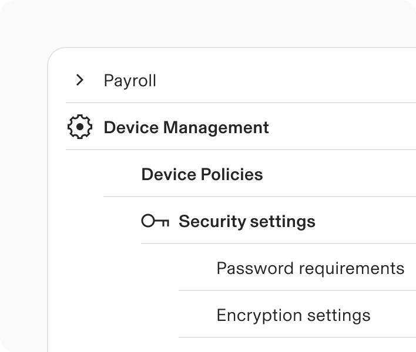

Don’t

Never remove or replace the chevron with custom icons.

### Show truncated labels in tooltip

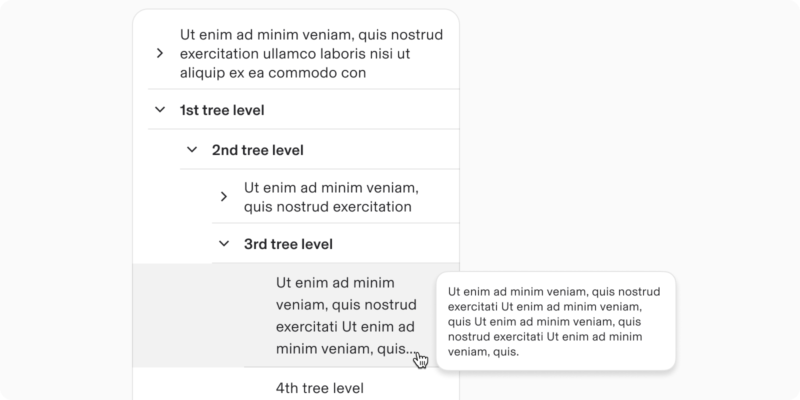

-   If a label is too long to fully display in the nested list-item, wrap the text up to 4 lines.
    
-   If doesn’t fit in 4 lines the text should get truncated with an ellipsis.
    
-   Hovering over or focusing on the truncated item will display a tooltip showing the complete label text.
    

## Content guidelines

Labels: Use descriptive labels for parent items to improve navigation and understanding.

## Internationalisation

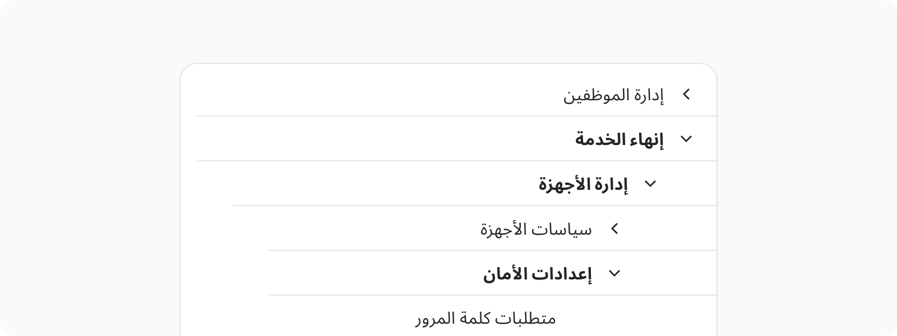

RTL languages mirror nested list items and chevrons horizontally.

---

# Accessibility

-   Use ARIA roles and properties to define element hierarchy.
    
-   Implement expandable states for assistive technologies.
    
-   Ensure keyboard accessibility for all elements.
    
-   Provide clear visual focus for nested items.
    

## Keyboard Interaction

Key

Action

Tab

Moves focus to the first tree view item.

Down Arrow

Moves focus to the next tree view item or thumbnail.

Up Arrow

Moves focus to the previous tree view item or thumbnail.

Enter or Space

Selects the focused tree view item. If a child element is focused, subsequent actions depend on that child's keyboard interactions. For the drag icon, this initiates drag-and-drop mode.

Right Arrow

Expands the focused tree view item. If already expanded or not expandable, focus moves left-to-right among child components (stopping at the rightmost child).

Left Arrow

Collapses the focused tree view item. If a child element is focused, focus moves right-to-left among child components (returning to the parent item from the leftmost child).

Home

Moves focus to the first focusable tree view item.

End

Moves focus to the last focusable tree view item.
