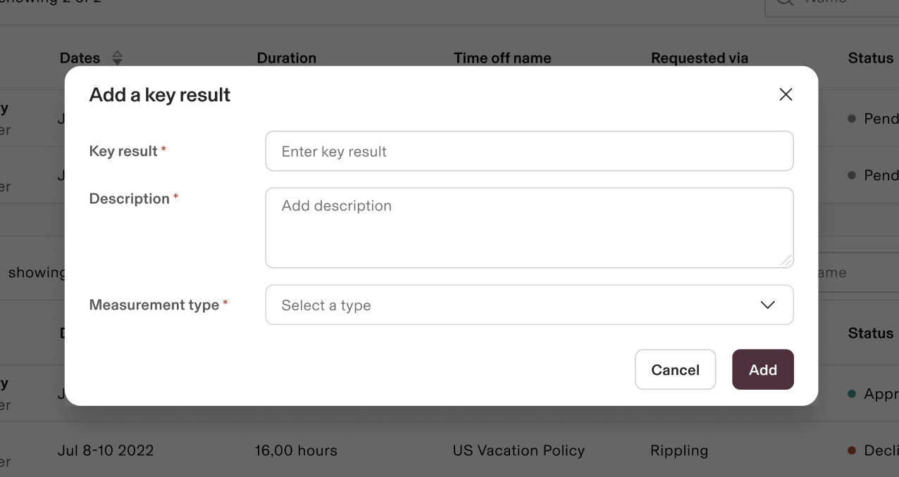
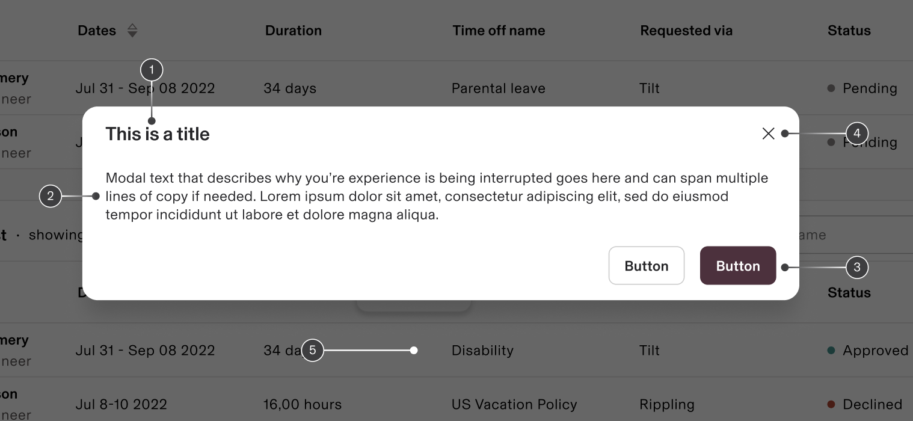
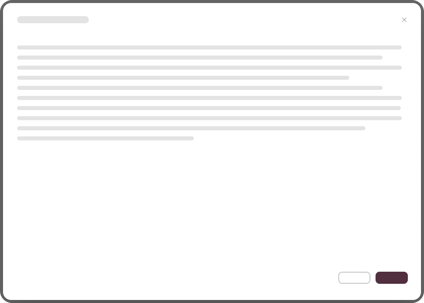

# Modal component - design systems

**Source:** [View in Confluence](https://rippling.atlassian.net/wiki/spaces/RDS/pages/4737565623)  
**Last Synced:** 11/3/2025, 6:09:48 PM  
**Confluence Version:** 7

---

A modal dialog is an interactive overlay that demands user attention and input, isolating specific tasks or information above the main page content.

[Figma](https://www.figma.com/design/nhtRzieeGFf1tGVWnRxSK3/Web-Component-Library-\(v3\)?node-id=66574-82255) [Storybook](https://pebble.ripplinginternal.com/?path=/docs/components-modal-modal--docs)

---

# Overview

Modal dialogs are interactive overlays that facilitate focused user interactions, temporarily interrupting workflows to present essential information or request input. They are effective for brief tasks and situations needing immediate attention. Key features include making primary content inaccessible while keeping the underlying page context visible.

To optimize modals, best practices recommend using them sparingly to minimize disruption, ensuring tasks are concise, and maintaining simple designs. Careful implementation is vital for a positive user experience, given the potentially intrusive nature of modal dialogs.

# Usage

## When to use

#### Require an immediate response from the user

Use a dialog to request information that is preventing the system from continuing a user-initiated process.

#### Notify the user of urgent information

Use a modal to notify the user of urgent information concerning their current work. Modals are commonly used to report system errors or convey a consequence of a user’s action.

#### Confirm a user decision

Use a modal to confirm user decisions. Clearly describe the action being confirmed and explain any potential consequences that it may cause. Both the title and the button should reflect the action that will occur. If the action is destructive or irreversible, then use a transactional danger modal.

# Specs

## Anatomy

The modal window consists of the following sections: header, body, and footer, each serving specific purposes. They also have a dismiss icon and overlay element with it.

Breakdown of sections:

1.  **Header**: Contains a title, optional label, and close icon for easy navigation.
    
2.  **Body**: Houses essential information and interactive controls, including:
    
    -   Message text
        
    -   User interface components
        
3.  **Footer**: Features primary action buttons for task completion or cancellation, with button arrangement varying by modal type.
    
4.  **x**: A close icon in the header allows users to dismiss the modal without saving changes.
    
5.  **Overlay**: A semi-transparent layer dims the background, focusing the user's attention on the modal.
    

## Configuration

### Sizing

Default

Full-screen

Modal components come in four responsive sizes to accommodate varying content needs:

1.  Default
    
2.  Full-screen
    

When selecting a modal size, consider your content requirements carefully:

-   For concise messages, choose default modals to maintain optimal line length and readability
    
-   For complex content like data tables, opt for default for smaller tables and full-screen modals to ensure proper content display
    

#### Maximum Height Guidelines

Consider these best practices:

-   If excessive scrolling occurs due to height constraints, scale it up to maximum height until it meets the viewport edges 48px away from the top and bottom.
    
-   When content exceeds even the large modal's maximum height, consider implementing a full-page solution instead
    

Components like data tables and forms can span the modal's full width.

### Interactions

### Trigger

Modals are user-initiated interfaces, not system-generated pop-ups. They can be activated through various interactive elements such as buttons, links, or icons. For keyboard users, pressing either the `Enter` or `Space` key should trigger the modal.

### Focus Management

When a modal opens, focus should automatically move to the first interactive element. For forms, this means the initial input field receives focus. In transactional modals without form inputs, the primary action button should receive initial focus.

Focus must remain confined within the modal until it's closed. Keyboard navigation using `Tab` and `Shift-Tab` should cycle through elements within the modal, preventing focus from escaping to the underlying page.

# Content guidelines

-   **Content Structure**:
    
    -   Include brief descriptions only when necessary.
        
    -   Focus body content on essential fields and maintain optimal readability.
        
-   **Interactive Elements**:
    
    -   Buttons should have action-focused labels, avoiding generic terms.
        
-   **Layout Management**:
    
    -   Prioritize vertical scrolling with fixed headers and footers for better navigation.
        

## Accessibility

When designing dialogs that contain input fields, it's essential to designate the first input field as the starting focus point. This deviates from the standard practice where buttons typically receive initial focus. Remember that while text links may be interactive elements, they are not classified as user input elements in this context and should not receive initial focus.

The guidelines outline various intuitive dismissal mechanisms to ensure a user-friendly experience while adhering to accessibility standards, such as:

-   Clicking the **Cancel** button
    
-   Using the **X** icon
    
-   Pressing the `Esc` key
    
-   Clicking the overlay background
    

These options ensure accessibility for both mouse and keyboard users, accommodating various interaction preferences.
