# Notice

**Source:** [View in Confluence](https://rippling.atlassian.net/wiki/spaces/RDS/pages/4724852200)  
**Last Synced:** 11/3/2025, 6:09:55 PM  
**Confluence Version:** 7

---

Introduction

Notice conveys high-priority information to users, guiding them to proceed or resolve issues.

[Figma](https://www.figma.com/design/nhtRzieeGFf1tGVWnRxSK3/Web-Component-Library-\(v3\)?node-id=66676-179390&t=M5ViVlhsdOy3l02Q-11) | [Storybook](https://pebble.ripplinginternal.com/?path=/docs/components-miscellaneous-notice--docs)

---

# Overview

Notices by design draw attention to prevent negative user experiences and prompt user to take actions for resolution.

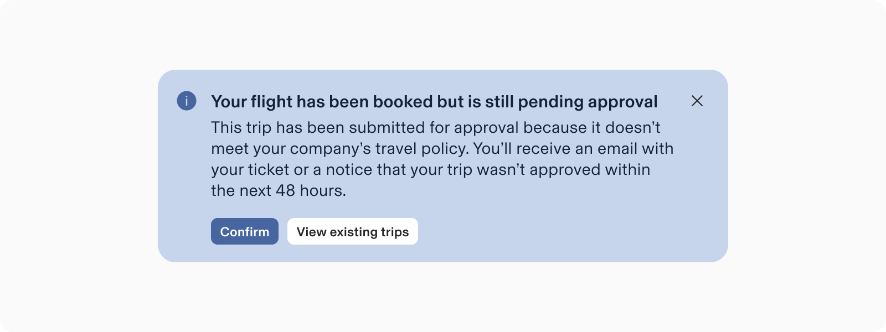

-   **Purpose**: Communicate high-priority information affecting the entire app or system.
    
-   **Behavior**: Appear automatically with the page content load and remain until dismissed or resolved.
    
-   **Persistence**: Always visible but can be dismissed, not acting as feedback but providing constant information.
    
-   **Usage**: Use notices sparingly to avoid disrupting user flow.
    
-   **Visual Cues:** Notices use icons and colors to indicate message severity.
    

note

A notification sent irrespective of the current user goal would likely be ignored, and may even annoy users because it will disrupt their current task and be irrelevant to their current needs.

_— Nielsen Norman Group,_ [_Indicators, Validations, and Notifications_](https://www.nngroup.com/articles/indicators-validations-notifications/)

A notification sent irrespective of the current user goal would likely be ignored, and may even annoy users because it will disrupt their current task and be irrelevant to their current needs.

_— Nielsen Norman Group,_ [_Indicators, Validations, and Notifications_](https://www.nngroup.com/articles/indicators-validations-notifications/)

---

# Specs

## Anatomy

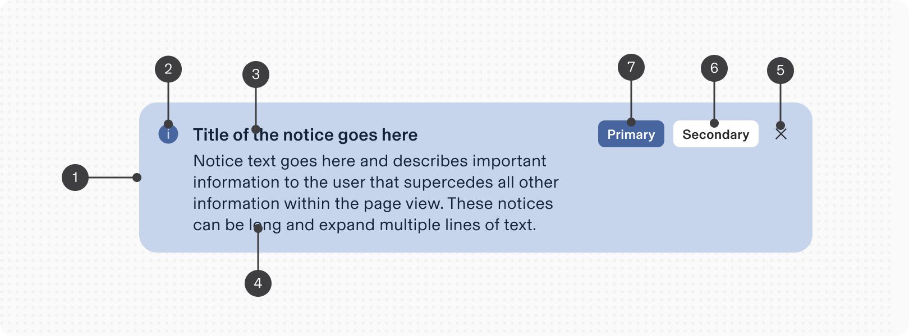

1.  **Container:** The area includes the header, message, link, and button, featuring a color that indicates the notice’s urgency.
    
2.  **Icon** (mandatory)**:** appears with the notice's text to emphasize the alert's nature.
    
3.  **Title** (optional): improves scannability by putting the most important info first.
    
4.  **Body** (optional): conveys the message succinctly and effectively.
    
5.  **Dismiss** (contextual): allows the user to dismiss the notice.
    
6.  **Secondary action / Link** (optional): offers further details pertaining to the message.
    
7.  **Primary action** (optional): provides a clear next step regarding the resolution.
    

## Configuration

### Appearance

Notices are semantic and vary by severity, using specific colors to indicate importance: information, error, warning, and success.

Icons provide visual context and are fixed by severity, with no customization allowed.

**Appearance**

**Use-case**

**Example**

1.  **Informative (default)**
    

Use to provide additional information unrelated to the user's current action or task.

_Feature prompts or ongoing processes._

2.  **Success**
    

Use to confirm a task was completed as expected.

note

Only use success messages if the success is not immediately apparent in the UI.

Only use success messages if the success is not immediately apparent in the UI.

_For instance, notify users of a successful issue transfer when they are not redirected to a new page._

3.  **Error**
    

Use to inform users of an error or critical failure, potentially blocking further actions until resolved.

_Form validation error summaries or repo deletion confirmations._

4.  **Warning**
    

Use to alert users about actions that may not be desirable or could lead to unexpected results.

_Potential connectivity issues or hidden items due to active filters._

### Dismissible

Notices can include a dismiss button to remove them from the page thus making them dismissible.E

note

Provide an alternative access method for dismissible notices.

Provide an alternative access method for dismissible notices.

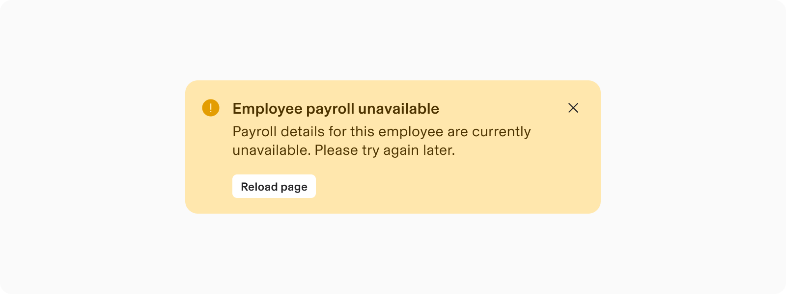

**Do**  
Make Notice dismissible if:

-   If Notice contain non-essential, general, or supplemental information
    
-   If Notice is on a page where users can engage in other tasks.
    
-   If Notice is neither obstructive nor requires immediate attention.
    

**Don’t**  
Don't make Notice dismissible if:

-   If closing the notice would prevent access to critical or persistent information.
    
-   Notices for user error resolution can only be dismissed after the user resolves the error.
    
-   If accidental closure could confuse the user or cause them to miss essential details.
    

### Actionable

**Action Buttons**  
Actions enables the user to either respond to or acknowledge the Notice directly within the component.

Limit notices to a maximum of two actions.

Preferably, include only one action to focus user attention effectively.

-   For a **single action**, decide between a primary or secondary action based on the desired emphasis.
    
-   If **two actions** are necessary, designate one as primary and the other as secondary.
    
    -   Use the primary action for the recommended task and the secondary for providing additional information.
        

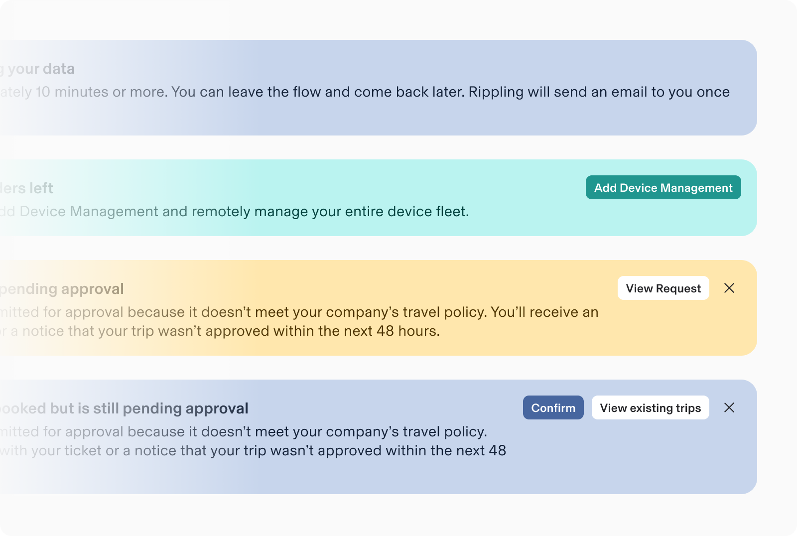

#### Link

Notice allows incorporating text links in the message section for additional context.

-   Ensure the link label accurately conveys what users can expect upon clicking.
    
-   Notices suggesting error resolution on a different page must include a link to that page.
    

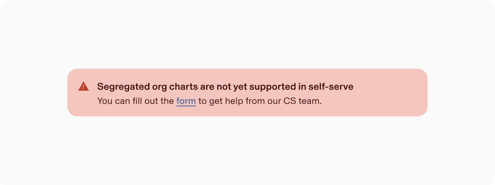

# Usage

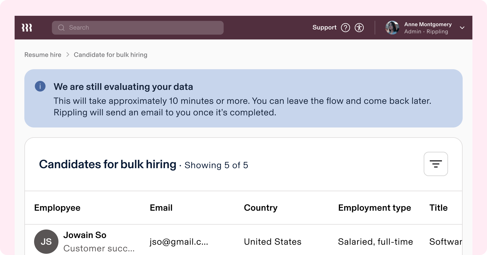

### When to use

-   Use notices for global, high-priority messages that affect the functionality of an entire system, not just those local to a feature or a page.
    
-   Use-case for Notice:
    
    -   System maintenance / status (eg. upgrade required)
        
    -   Confirm actions (eg. successful submission)
        
    -   Warn about potential problems that need user’s attention
        

### When to use something else

-   Avoid overusing notices to prevent the following:
    
    -   Desensitising users to important messages.
        
    -   Distract users from their primary tasks.
        

-   Notices should not be the main way users access regular information or actions.
    
-   Do not use notices to point out UI actions; these should be clear and intuitive within the interface itself.
    
-   Refrain from using notices for every product change, like marketing updates or trial statuses.
    
-   Avoid using notices for engagement messages, such as applied promotions.
    
-   Do not use notices to upsell new features.
    
-   **Snackbar****:**
    
    -   Opt for a snackbar instead of Notice for ephemeral feedback, such as:
        
        -   quick confirmation messages, (such as brief feedback) or
            
        -   status updates,
            
        -   confirming an action (e.g., "Copied to the clipboard").
            
    -   Avoid using notices for responses to user actions; use snackbars instead.
        
    -   Snackbars appear and disappear with minimal disruption, unlike notices that shift page content.
        
    -   If a notification requires multiple anchors or buttons, opt for a notice rather than a snackbar.
        
-   **Modal:**
    
    -   Use modals for contextual feedback that requires immediate user action or input.
        
    -   Modals interrupt the user experience to demand attention, so apply them thoughtfully and only when necessary to ensure user engagement.
        

# Guidelines

### Responsive Layout

Actions can be positioned below or inline with the content.  
Layout adjusts based on the enabled elements.

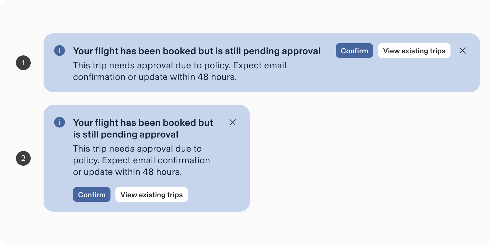

#### 1\. On Large screen

-   Actions are positioned inline with the content aligned to the right (by default).
    
-   When content exceeds container’s width or spans to multi-line; actions wraps to below the content.
    
-   Layout adjusts based on the enabled elements.
    

#### 2\. On smaller screen or container:

Actions are stacked beneath the content by default.

### Alignment and positioning

Notices appear within UI elements or layouts in the following types of format:

#### 1\. Global-Level (Full width)

-   Place at the top of the page, below the header.
    
-   Use full-width for notices relevant to the entire page.
    
-   Utilize single-line alerts to conserve space.
    

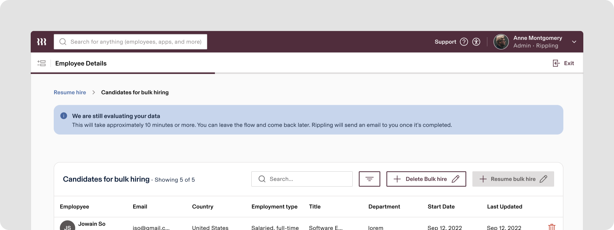

#### 2\. Feature-Level (parent component width)

-   Place within a specific section (e.g., card, popover, modal) below the section heading.
    
-   Do not use full-width.
    

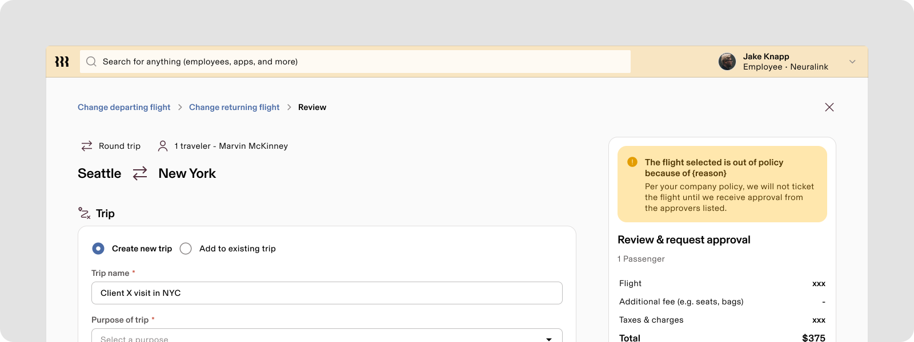

#### 3\. Content specific (content width)

-   Position these notices inside a section, below any section heading and above or below the specific element.
    
-   Keep placement close to the main context to avoid confusion.
    
-   Their notice adheres to the max width of the grid.
    

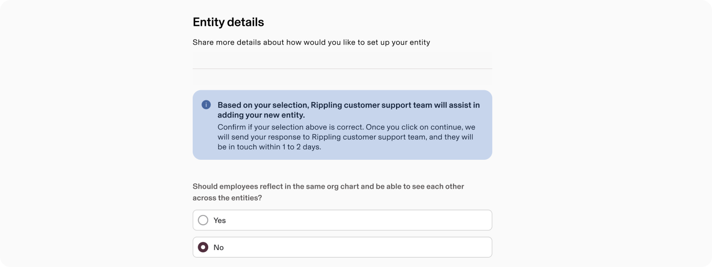

### Stacking

Display one notice per page at a time. Replace it with the next priority notice once dismissed or addressed.

Avoid stacking multiple notices to prevent overwhelming users.

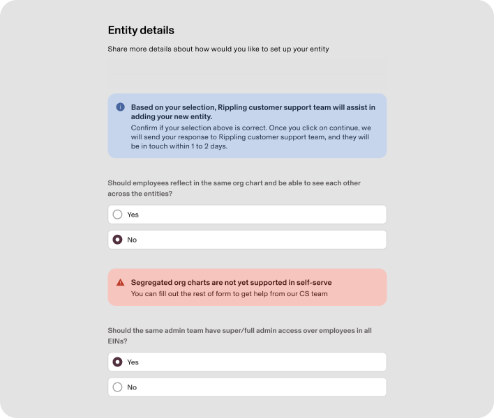

Do

Display one notice per page at a time.

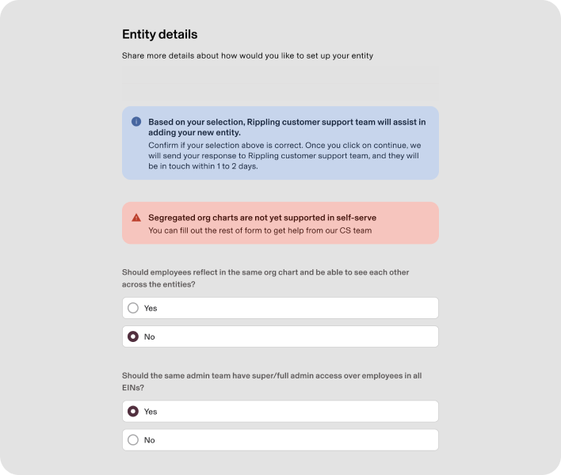

Don’t

Avoid stacking multiple notices to prevent overwhelming users.

## Content guidelines

-   Use titles for long messages & easier scannability.
    
-   Keep messages concise and direct, using default paragraph size; apply titles when appropriate.
    
-   Clearly explain the purpose of the notice to users, detailing what happened and why.
    
-   Notices interrupt user flow, so ensure clarity and brevity.
    
-   Titles are optional; use them for longer messages to enhance scannability.
    
-   Incorporate inline links to provide additional context for users.
    

### Title

-   Keep it short and descriptive, focusing on the key information.
    
-   Avoid using a period.
    
-   Do not rely on text styling for meaning, as screen readers read titles as one sentence.
    

### Body content

-   Be concise and avoid repeating the title.
    
-   Limit to one or two short sentences.
    
-   Include troubleshooting steps or next actions to ‘explain how to resolve the issue’.
    

### Button text

-   Ensure clarity and predictability; labels should indicate the action.
    
-   Use action-led verbs in a \[verb\]+\[noun\] format, except for common actions like Save, Close, Cancel, or OK.
    
-   Keep text scannable by avoiding unnecessary words such as the, an, or a.
    

### Link text

-   Clearly indicate the destination.
    
-   Use consistent labeling for navigation links (a navigational link leading to a page called Travel, label the link ‘Travel’).
    

### Icon

-   Use predefined icons for states like info, success, warning, and failure.
    
-   Icons are linked to the message-severity varinats and cannot be changed.
    

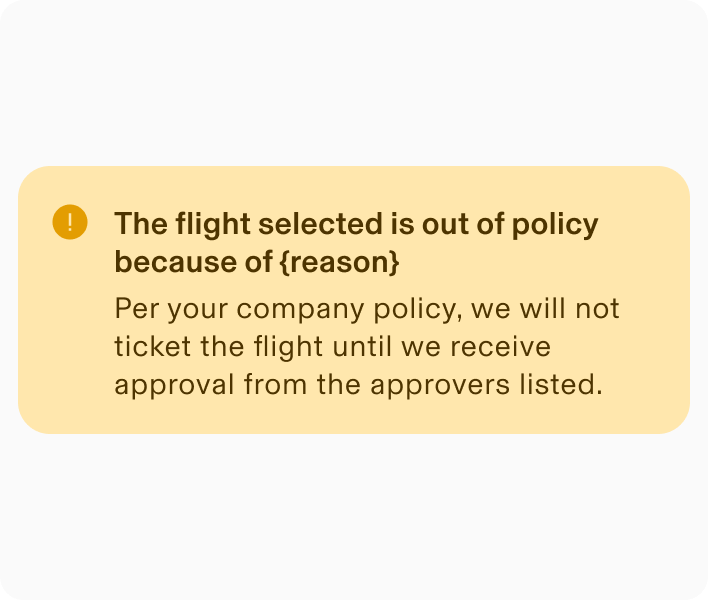

Do

Use an icon that’s predefined to matches the notice’s appearance color.

Don’t

Avoid customising icons that don't match the alert's importance.

### Truncation

-   Notice width adapts to browser size; lengthy text is truncated with ellipses.
    
-   Configure notices to wrap or truncate based on context.
    
-   Keep content to 2 lines (3 lines in languages with longer characters).
    
-   Avoid truncation for accessibility and localization unless space is limited.
    

---

## Internationalisation

When the display is in a right-to-left (RTL) language, the notice layout reverses, placing the action button on the left and the header on the right.

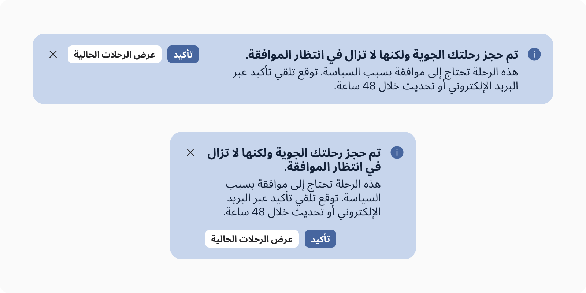

# Accessibility

### Aria Attributes:

Use aria-describedby to explain notice purpose.

If titled, use the title for aria-describedby; otherwise, use the full content.

-   Error and warning notices use aria-live="assertive" to interrupt other screen reader announcements.
    
-   Informational and success notices use aria-live="polite" and are read only if selected.
    
-   Critical and warning notices have role="alert"; others have role="status".
    

### Visual Indicators:

Notices use icons and colors to convey meaning and importance.

### Feedback Notices:

Use live region or focus management for accessibility:

-   **Live Region:** Suitable for non-critical updates.
    
-   **Focus Management:** Directs focus to notices when action is needed or information is critical.
    

### Considerations for Focus:

-   Notices have tabindex="0" for keyboard focus visibility, helping users navigate through interactions.
    
-   If missing a notice blocks user progress, use focus management.
    
-   If a notice contains a necessary action, focus management ensures immediate interaction.
    

## Keyboard Navigation

**Keys**

**Action**

Tab

Places the focus on the next interactive element, which is either a button or a close button

Space / Enter

-   Dismissible: If focus is on the close button, dismisses the notice.
    
-   If focus is on the button, executes the button action/ launch the link
