# Object

**Source:** [View in Confluence](https://rippling.atlassian.net/wiki/spaces/RDS/pages/4832559618)  
**Last Synced:** 11/3/2025, 6:10:01 PM  
**Confluence Version:** 10

---

obj

'Object' provides a simplified overview by structuring entity information (people, organisations, devices).

[Figma](https://www.figma.com/design/nhtRzieeGFf1tGVWnRxSK3/Web-Component-Library-\(v3\)?node-id=66677-182456&t=LIhVFq02mSjs4gJ7-11) | [Storybook](https://pebble.ripplinginternal.com/?path=/docs/components-objectui-header--docs)

---

# Overview

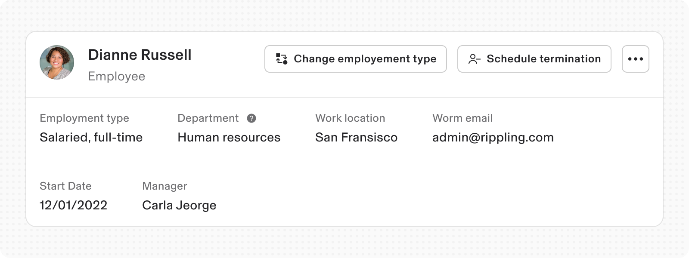

Object is a modular component that presents high-level information about an entity: such as a person, organization, device, or other concept.

It is typically placed at the top of a page, below navigation elements.

---

# Specs

## Anatomy

### Object

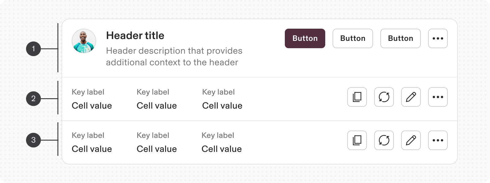

1.  Object header
    
2.  Object Stats
    
3.  Object stats (additional)
    

### Object - Header

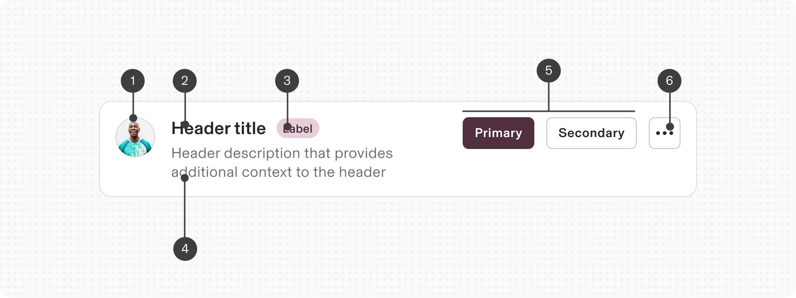

1.  Avatar
    
2.  Title
    
3.  Label
    
4.  Subtext
    
5.  Actions
    
6.  More actions - Overflow
    

### Object - Stats

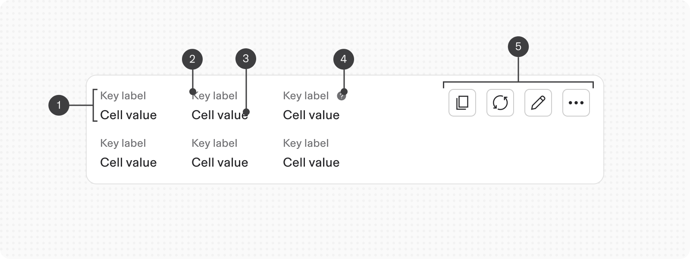

1.  Stat Item
    
2.  Key
    
3.  Value
    
4.  Tooltip
    
5.  UI Actions
    

## Configuration

### Object - Variants

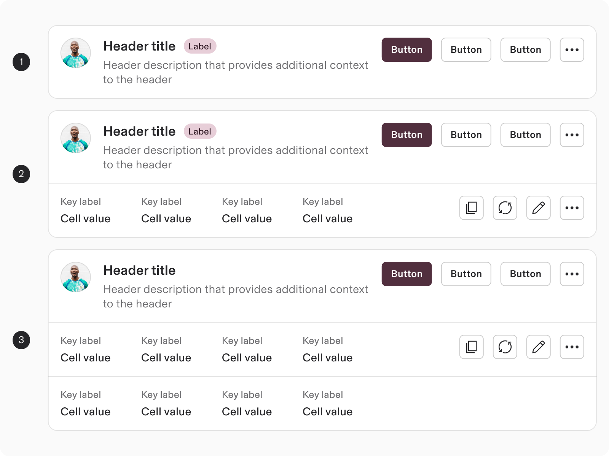

1.  Header (default)
    
2.  With Stats (optional)
    
3.  With multiple Stats (optional)
    

‌

### Object / Header

#### Modifiers:

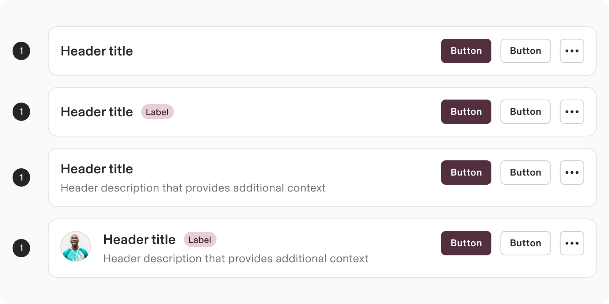

1.  Title (default)
    
2.  With Label (optional)
    
3.  with Subtext (optional)
    
4.  With Avatar (optional)
    

‌

### Object / Stats

#### Stats Modifiers:

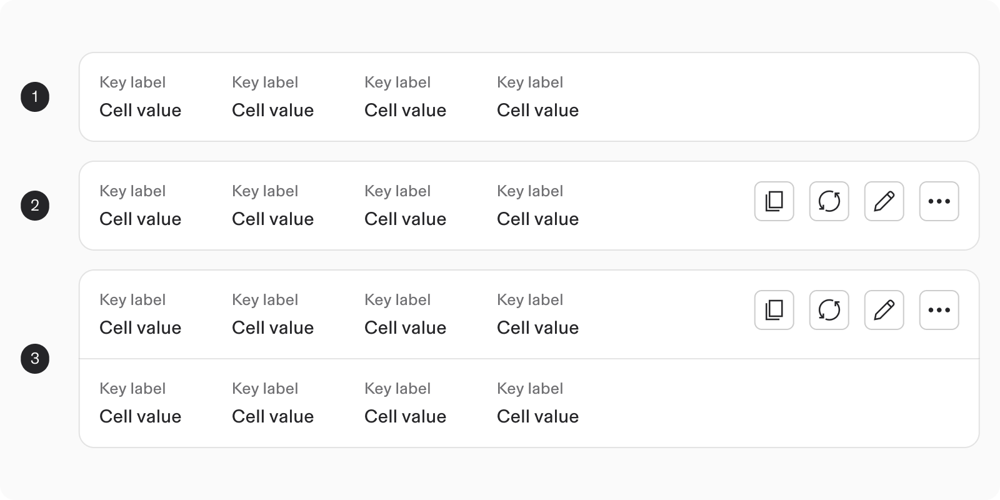

1.  Key & Value (default)
    
2.  With UI actions (optional)
    
3.  Key & value (multi-row)
    

‌

#### Object / Stats / Key:

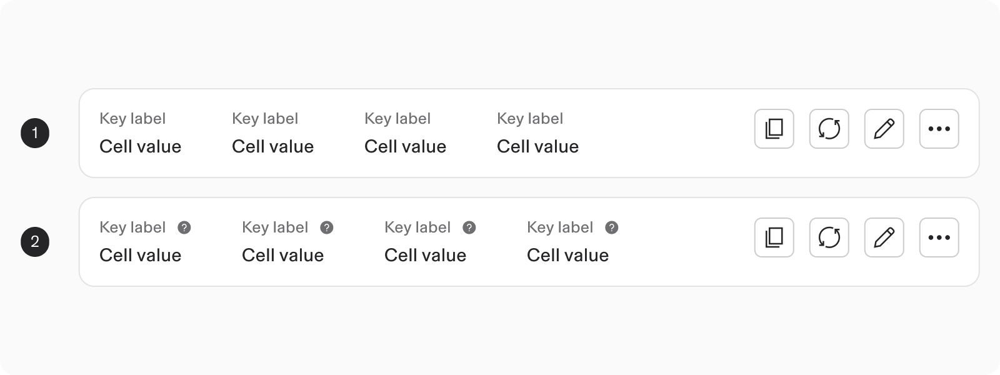

1.  Key
    
2.  With tooltip (optional)
    

‌

#### Object / Stats / Value:

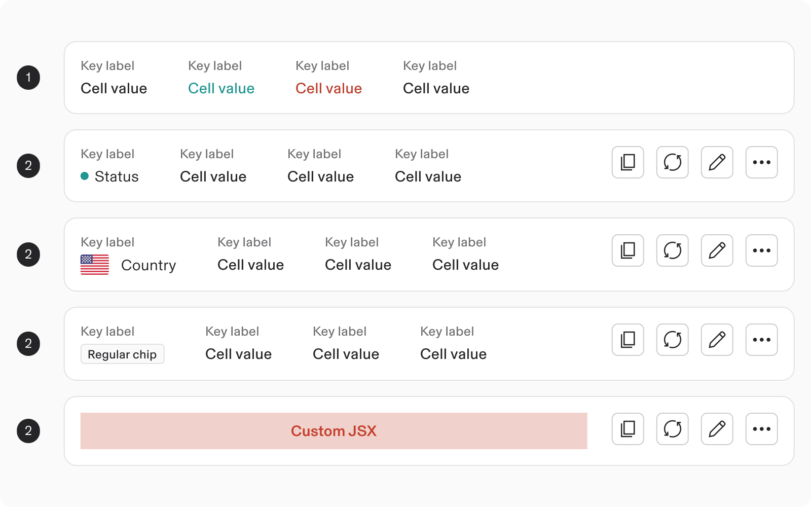

1.  Text (Default / positive / negative)
    
2.  Status
    
3.  Country
    
4.  Chip
    
5.  Custom JSX
    

‌

### Object / Actions

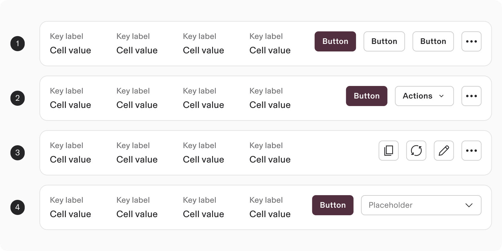

1.  With Primary Button And Action Config
    
2.  With Button Dropdown And Action Config
    
3.  With Icon Type And Action Config
    
4.  With Input Select Actions
    

‌

---

# Usage

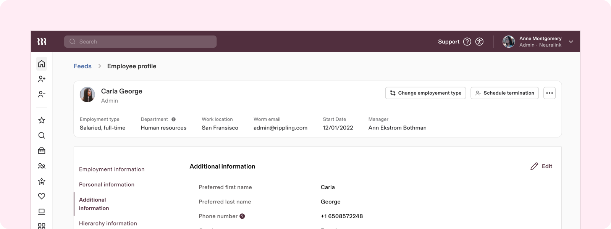

### When to use

‌Use Object when you want to:

-   Provide a quick overview of an entity.
    
-   Highlight key information and provide global-level actions related to the entity.
    

### When to use something else

-   **Cards vs Object:**
    
    -   Use Cards when you need to present more detailed information about an entity
        
    -   Use Object when you need to display a collection of varied information which offers a high-level overview at a glance.
        
-   **Lists vs Object**
    
    -   List is a better choice when the user's primary goal is to compare and interact with multiple similar items (homogenous content).
        
    -   Object is better for providing an overview (showing heterogenous content) and facilitating actions related to a single entity.
        
-   **Table vs Object:**
    
    -   Use Table to show big datasets that are all the same, and need to be sorted, filtered, and paginated.
        
    -   Use Object to give a quick summary of something with mixed types of data and overall actions.
        

## Guidelines

### Stacking Modularity

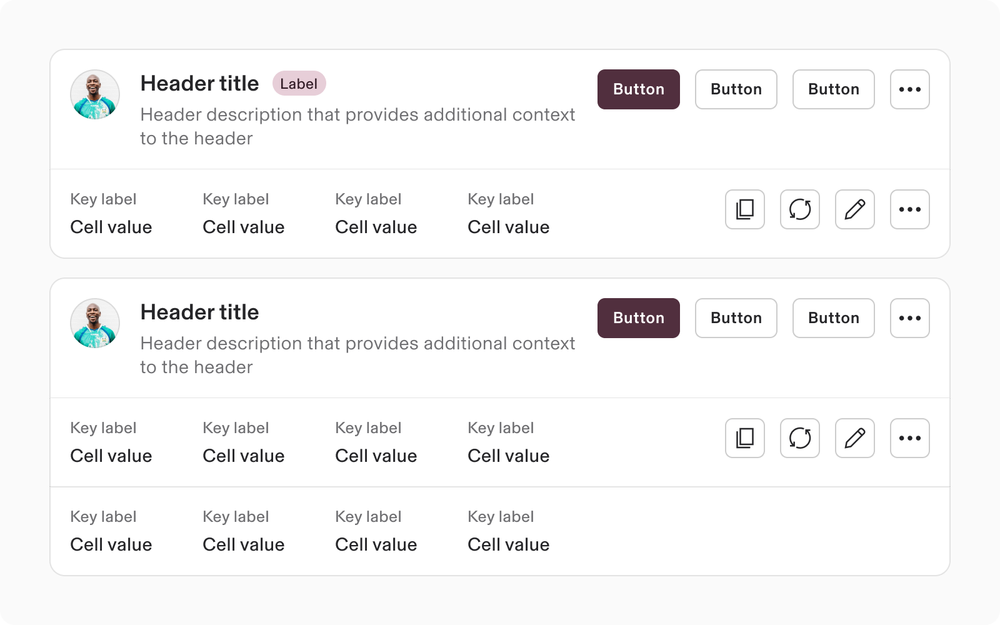

-   Organize & segregate additional information using: Secondary and tertiary stats-sections.
    
-   Stacking follows pre-determined component guidelines.
    
-   Border radius: The user controls border radius by setting the border-radius theme values (based on the Object stat's tier status).
    

### Content organisation

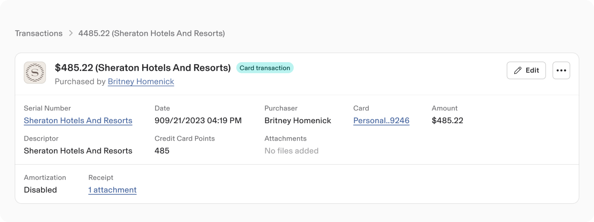

-   Separate content with a grid and space it evenly.
    
-   Ensure that the content wraps based on the available space.
    
-   **Customisation**: Consumers have flexibility to customize the stats section - using custom JSX.
    

## Content Guidelines

-   Use a clear and concise header to identify the entity.
    
-   Use short, descriptive key-value pairs to present information about the entity.
    

## Internationalization

-   When translating the Object into RTL languages, flip the layout based on the language-localisation guidelines.
    

---

# Accessibility

-   Ensure that the Object is accessible to users with disabilities.
    
-   Provide keyboard navigation for all interactive elements.
    
-   Use descriptive alt text for all images.
    

## Keyboard Navigation

**Key**

**Action**

Tab

Navigate through interactive elements

Enter

Activate interactive elements

‌

‌
