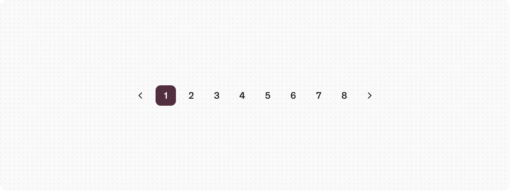
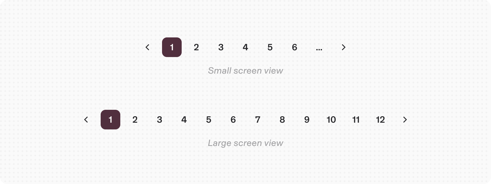
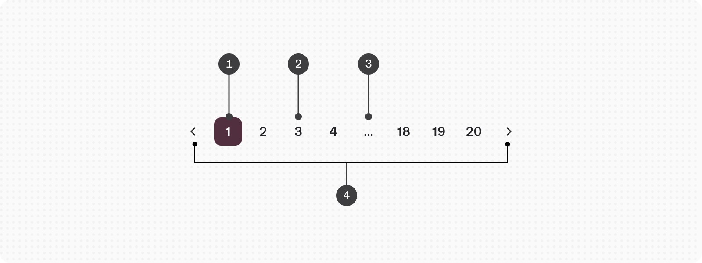
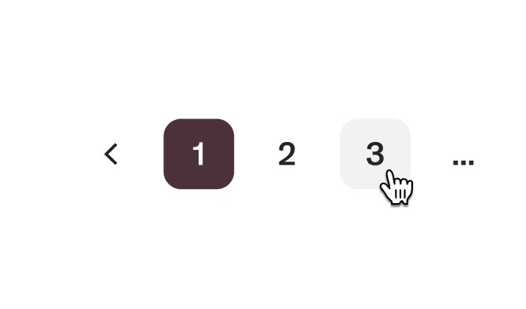
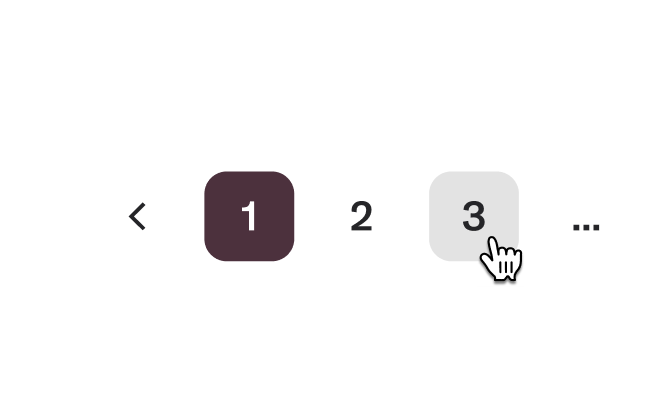
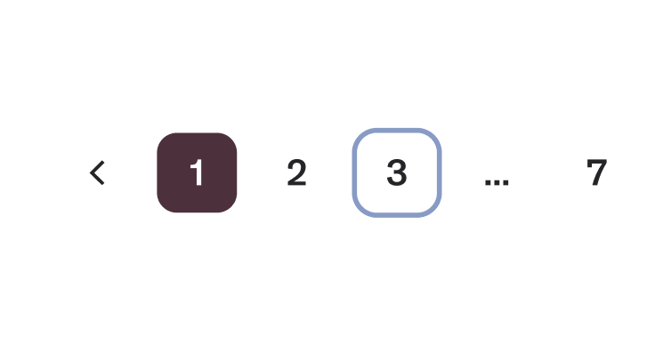
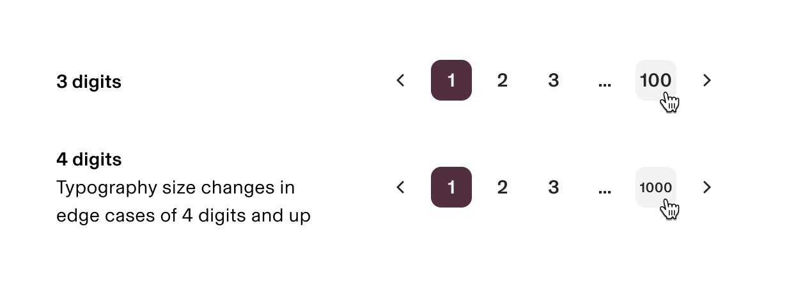

# Pagination

**Source:** [View in Confluence](https://rippling.atlassian.net/wiki/spaces/RDS/pages/4751851648)  
**Last Synced:** 11/3/2025, 6:10:04 PM  
**Confluence Version:** 6

---

Pagination allows us to break up large chunks of content into smaller, more digestible sections that can be spread out over multiple pages.

[Figma](https://www.figma.com/design/nhtRzieeGFf1tGVWnRxSK3/Web-Component-Library-\(v3\)?node-id=66574-100858) [Storybook](https://rippling.design/pebble?path=/docs/components-expandable-paginate--docs)

---

# Overview

Pagination is a technique for organizing and breaking up large chunks of content across multiple pages. It helps users keep track of the information displayed on each page. This approach is especially beneficial for data tables and any content-rich pages. By using pagination, we can enhance the user experience, making it easier to navigate without overwhelming anyone with too much information at once.

---

# Usage

Pagination is used for keeping content organized, whether it's tables, search results, or directories. The phrase “too many results” can really hinge on a few factors:

-   System load times
    
-   Data per entry
    
-   Screen space
    

## When to use

-   When loading all the data at once feels like a marathon.
    
-   When there's just too much information to fit on one page or view.
    
-   To make large datasets more accessible.
    
-   To make the most of on-page space.
    
-   To empower users to manage how they view extensive information.
    

## When not to use

-   Skip pagination for linear journeys, like filling out forms; progress bars or buttons work better here.
    
-   Avoid using pagination if it doesn’t genuinely enhance usability or performance.
    

## Best practices

### Responsiveness

-   For smaller screens, show a maximum of seven pages (including the ellipsis).
    
-   For larger screens, show a maximum of 14 pages (including the ellipsis).
    

---

# Specs

## Anatomy

1.  **Selected page button:** The current page the user is viewing.
    
2.  **Unselected page button:** A page the user could select and view.
    
3.  **Overflow button:** Contains available pages that can be navigated to but cannot be shown upfront in the component because of the current viewport.
    
4.  **Previous and next buttons:** Buttons that take you to the previous or next page.
    

## States

**Type**

**Purpose**

**Visual representation**

Hover

When a user’s mouse cursor is hovering over the page numbers

Pressed

When a user clicks on the page number

Focus

When a user intent is focused on a particular page number

Disabled

When one of the pages is disabled from access

# Content guidelines

In the pagination component, an ellipsis button is displayed between pages to signify the presence of additional pages available for navigation within the ellipsis button menu. We recommend avoiding the placement of the ellipsis button at the beginning or end of a series of pages in the pagination component.

The maximum page limit supported by this component is 3 digits. Increasing to 4 digits reduced the font size of the page.

## Accessibility

-   Using `aria-label` attributes improves the experience for people who use assistive technologies, like screen readers and speech recognition software.
    
-   Use the `label`, `pageLabel`, `nextLabel`, and `previousLabel` props to provide labels for the pagination buttons. While the default label props are in English, passing these props will ensure that assistive technologies in non-English languages can properly identify the content.
    
-   Be mindful of people using your product on small screen sizes and adjust the maximum number of pages accordingly.
