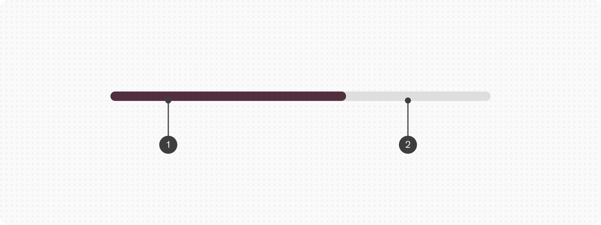
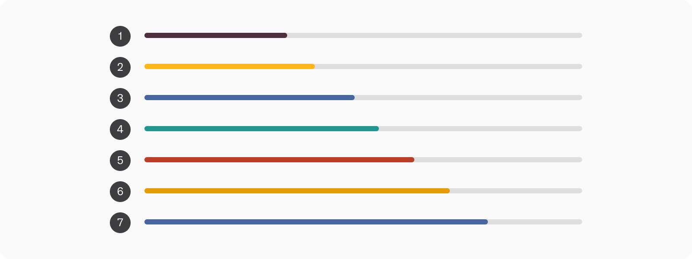
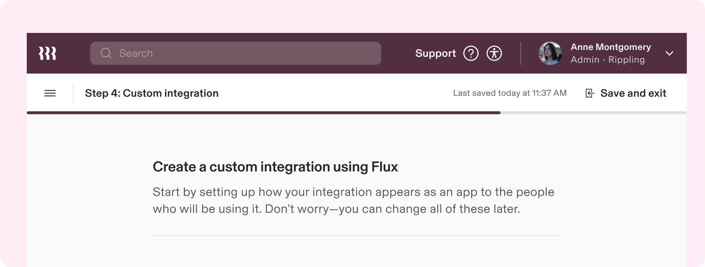

# Progress Bar component - Design Systems

**Source:** [View in Confluence](https://rippling.atlassian.net/wiki/spaces/RDS/pages/3896345378)  
**Last Synced:** 11/3/2025, 6:10:08 PM  
**Confluence Version:** 13

---

Introduction

Communicate the status of an ongoing process, like downloading or uploading files, to inform the user of the remaining wait time.

---

# Overview

-   Two types: `determinate` for when the amount of progress is known and `indeterminate` for when the remaining time is unknown
    

## Resources

**Type**

**Resource**

**Status**

Design

[Web Component (Figma)](https://www.figma.com/file/ysWbTtfWqhVDHQd1Mg2LQ1/Component-Library-v2?type=design&node-id=972-630&mode=design)

AVAILABLEGreen

Implementation

[Web Component (Storybook)](https://uikit.ripplinginternal.com/?path=/docs/components-miscellaneous-progressbar--props)

AVAILABLEGreen

---

# Specs

## Anatomy

1.  Indicator
    
2.  Track
    

## Configuration

### Type

1.  **Determinate**: Used when the progress is known and can be calculated against a specific goal like download, upload, or moving through a multi-step process
    
2.  **Indeterminate**: Used when the loading progress is unknown or the amount of wait time can’t be calculated. Once triggered, the bar indicator will repeatably animate from left to right
    

### Appearance

1.  Primary (default)
    
2.  Secondary
    
3.  Tertiary
    
4.  Success
    
5.  Error
    
6.  Warning
    
7.  Info
    

### Size

The height of a Progress Bar is fixed. The width is determined by the parent container.

---

# Usage

### When to use

-   To provide feedback on the completion status of a process or task
    
-   In forms, uploads, or operations where the user must wait for completion
    

### When to use something else

-   When user action is required to progress, consider the Progress Steps component which provides more affordance for the context of a multi-step process
    
-   If the loading time is always unknown or unpredictable and space is limited, consider a Spinner loader which indicates a broader “busy” state
    

## Guidelines

### Update progress from indeterminate to determinate

It’s optimal to present users the most precise representation of progress possible, and that isn’t always known at first. The Progress Bar is a great tool for updating the status from indeterminate to determinate as the progress becomes known.

---

# Accessibility

Users should be able to:

-   Understand what progress the indicator is communicating
    

## Labeling elements

Because the progress indicator is a visual cue, it needs an accessibility label to assist people who can't rely on visuals.

Be sure to write an accessibility label that describes the purpose of the progress indicator. The label should include the process, and ideally the subject. i.e. "Downloading PDF" or "Loading page content."
