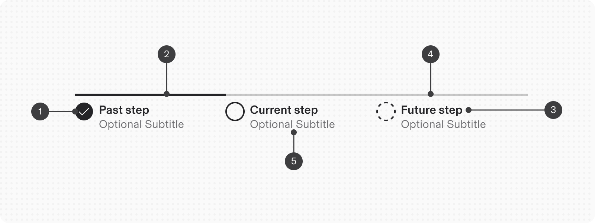
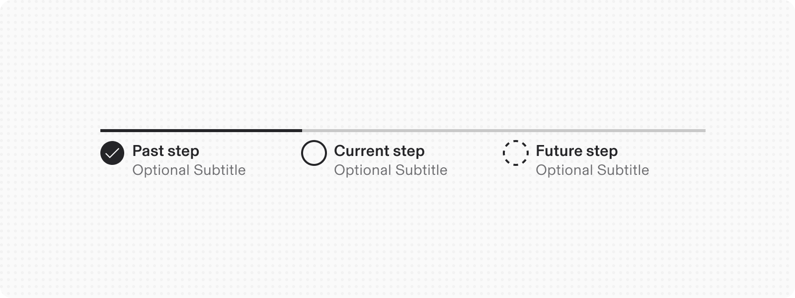
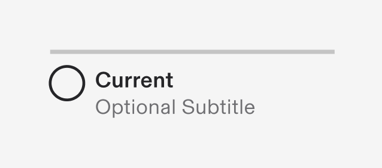
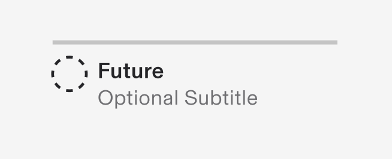
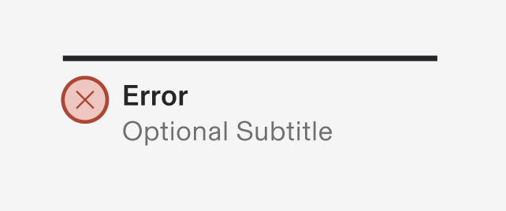
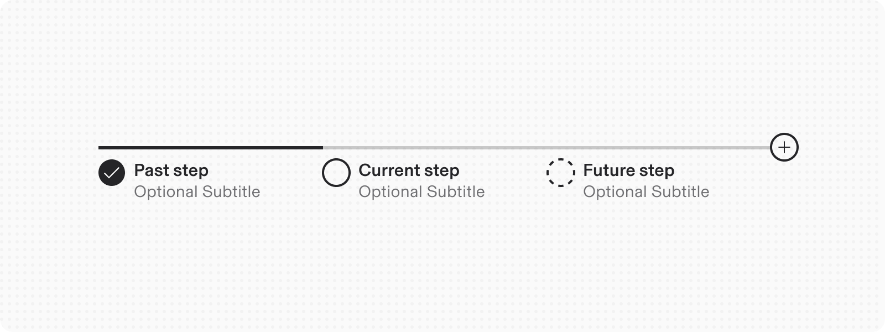
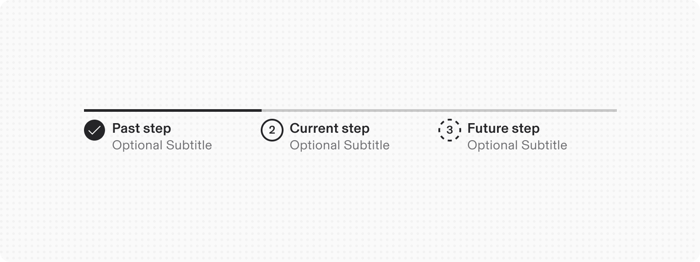

# Progress Steps

**Source:** [View in Confluence](https://rippling.atlassian.net/wiki/spaces/RDS/pages/4738023520)  
**Last Synced:** 11/3/2025, 6:09:26 PM  
**Confluence Version:** 7

---

Introduction

Progress indicators assist users in a multi-step journey by displaying completed steps, current position, and upcoming tasks.

This component will replace the **Stepper** component.

[Figma](https://www.figma.com/design/nhtRzieeGFf1tGVWnRxSK3/Web-Component-Library-\(v3\)?node-id=66574-102314) [Storybook](https://pebble.ripplinginternal.com/?path=/docs/components-miscellaneous-progresssteps--docs)

---

# Overview

Progress indicators are valuable tools for navigating multi-step processes. They manage user expectations by showing current progress, total steps, and completion status. **An effective tracker should have at least three steps and not more than 5-7 steps**, allowing users to visualize their advancement and navigate easily. This feature enhances user experience by providing guidance and a sense of control during task completion.

---

# Usage

## Interaction

The progress indicator serves as a visual representation, illustrating the user's current position within a multi-step process. It is designed to enhance user understanding of their progress and can be configured to enable interactive navigation between steps. Users gain the ability to navigate freely between steps by engaging with the step label containers. This feature significantly enhances the user experience by providing flexibility beyond the default view-only mode.

## Input Methods

#### Mouse Navigation

-   Users can click directly on any step label container to navigate to that specific step.
    

#### Keyboard Navigation

-   In its default state, the first step is automatically selected.
    
-   Users can utilize directional controls for navigation(will reverse for TRL languages):
    
    -   `Right Arrow`: Advances to the next step.
        
    -   `Left Arrow`: Reverts to the previous step.
        

## When to Use Progress Steps

A progress indicator is most effective in the following scenarios:

-   **Linear Multi-Step Processes**: This is particularly suitable for workflows that consist of three or more sequential steps that must be completed in a specific order.
    
-   **Extended Forms and Applications**: Progress indicators are ideal for:
    
    -   E-commerce checkout flows
        
    -   User onboarding sequences
        
    -   Complex application processes, such as visa applications
        
-   **Validated Sequential Input**: It is beneficial when each step necessitates verification before allowing progression to the next phase.
    
-   **Guided Navigation**: This enhances standard back/forward navigation by providing clear context within a linear sequence.
    

## When not to use

-   **Minimal Steps**: If the process comprises fewer than three distinct steps, a progress indicator may not be necessary. You can surface such processes upfront in a single screen.
    
-   **Non-Linear Workflows**: For tasks that can be completed in any sequence rather than a predetermined order, alternative methods may be more effective.
    
-   **Dynamic Step Count**: In processes where the number of steps may vary based on user choices or conditional logic, a progress indicator may not provide the intended clarity.
    

---

# Specs

## Anatomy

1.  **Status indicator:** Communicates if a step is completed, current, not started, disabled or has an error. See the status indicator pattern for guidance.
    
2.  **Active step line:** Indicates completed steps and the step the user is currently on.
    
3.  **Label:** Communicates what the user will accomplish in each step. Numbering each step also makes the progression more obvious.
    
4.  **Inactive step line:** Indicates steps that are not started as well as steps that are in an error, disabled, or skeleton state.
    
5.  **Helper text:** Labels a step as optional or in an error state.
    

## Configuration

### Orientation

Progress indicators can be in vertical or horizontal positions depending on the use case and the structure of the UI. When possible, arrange the progress indicator vertically for easier reading.

#### **Vertical**

#### **Horizontal**

### Placement

The progress indicator component can be placed on a full page, in a modal, or in a drawer.

## States

The progress indicator features seven distinct states that guide users through a multi-step process:

**State**

**Behavior**

**Visual Representation**

Completed

Indicates successfully completed steps with validated information

Current

Shows the step user is actively engaging with

Not Started

• Represents future steps awaiting user interaction

Error

• Indicates invalid or incomplete information • May reflect server-side issues • Provides clear error messaging and resolution guidance

## Variant

#### Add step

#### Custom icons

#### with Text

---

# Content Guidelines

When creating labels for steps, ensure they clearly convey the step's purpose. Use concise language (1-2 words), and follow these principles:

### Labeling Steps

Use clear, general themes that remain relevant even if details change. Example: In a checkout process, use "Add details" to cover both payment and shipping information.

#### Label

-   Communicate the user's goal in one or two words.
    
-   Utilize the {verb} + {noun} format, such as “Configure settings” or “Define endpoints.”
    
-   Single words are acceptable if universally understood, like “Cart” or “Payment.”
    
-   Avoid vague terms like “Processing.”
    
-   Consider numbering steps to clarify sequence.
    

#### Helper Text

Indicate if a step is optional or in error.

### Overflow Content

#### Label

Reword or truncate with an ellipsis if space is limited; use tooltips for additional information.

#### Helper Text

Allow long text to wrap to a second line, maintaining left alignment with the label.

### Localization

To handle localization, the content guidelines reverse the orientation for Right-To-Left languages including any Next and Back buttons.

# Accessibility

-   Link text is the visible label for the native HTML link and is used to provide the purpose of the link which is clear and easy to understand for all users.
    
-   Labels are clear, concise and include the state of each step.
