# Settings Form

**Source:** [View in Confluence](https://rippling.atlassian.net/wiki/spaces/RDS/pages/4837834942)  
**Last Synced:** 11/3/2025, 6:11:00 PM  
**Confluence Version:** 6

---

A form based components used to display settings information.

[Figma](https://www.figma.com/design/nhtRzieeGFf1tGVWnRxSK3/Web-Component-Library-\(v3\)?node-id=66574-84033) | [Storybook](https://pebble.ripplinginternal.com/?path=/docs/components-form--docs#settings-form)

---

# Overview

The Settings Form component is crucial for displaying a persistent, re-editable form arranged in a two-column layout. The first column contains all the labels, while the second column features the corresponding values and inputs. In Rippling, this component is commonly utilized to present settings information, whether in a read-only or editable format.

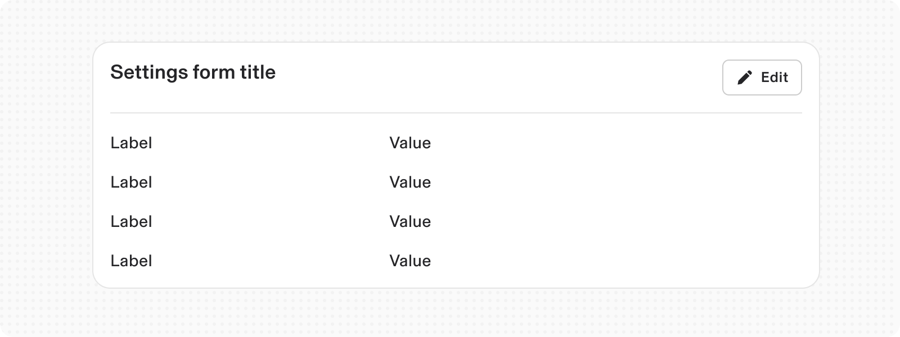

---

# Usage

## When to use

-   When a form is needed to expose Settings inside a product
    

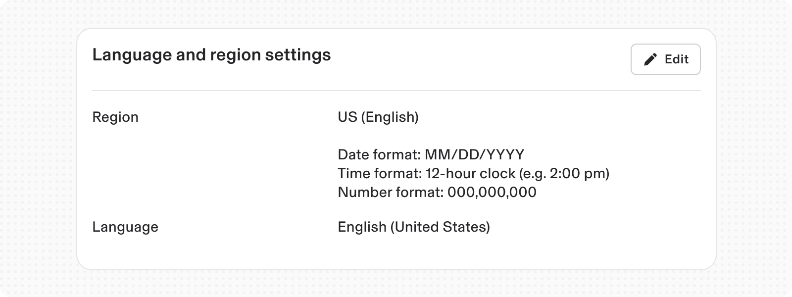

## When not to use

-   For regular forms needed to facilitate data entry at any point inside the product.
    
-   Used where users need to come back to modify any settings.
    

## Responsiveness

### Large Desktop

On a large desktop display, the container width of the settings form is fluid. However, the widths of the label and the input component are fixed, as specified below:

1.  Label content: 224px
    
2.  Input component: Maximum width of 576px
    

Additionally, when the background width is fluid on a large screen, the form elements within the Settings form align to the left, except for the footer action, which aligns to the right.

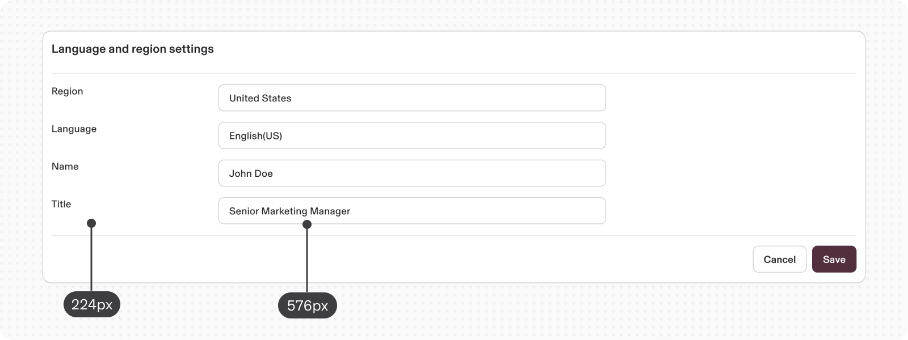

### Desktop

On a desktop, the settings form maintains a standard width that corresponds with the expansive nature of large screens, ensuring a fluid user experience. However, the input elements within the Settings form can only reduce to a minimum width of 288px. Beyond this point, the layout transitions to a mobile-friendly design.

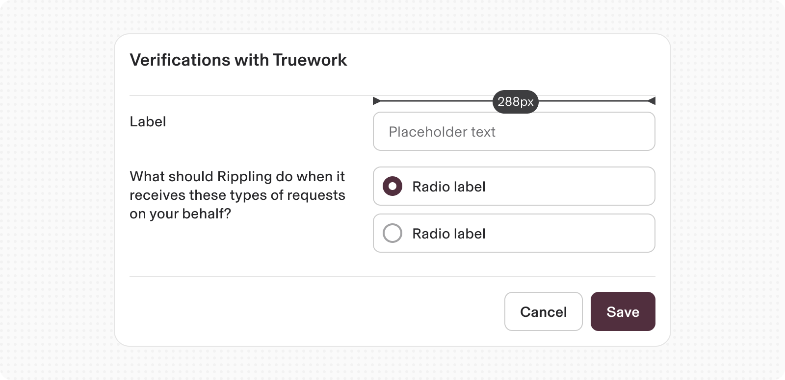

### Mobile

On mobile screens, the form adopts a vertical layout, with labels positioned above their corresponding input elements, rather than displaying them side by side.

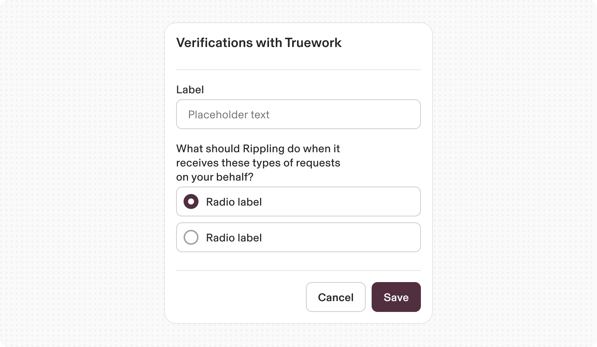

---

# Specs

## Anatomy

1.  **Title:** Title text establishes what the form is about.
    
2.  **Description:** Provides additional context and instructions around the form
    
3.  **Form body:** Area where users provide information. Information can be entered through various input fields, including text fields, checkboxes, and many other types. Input components contain labels and helper text that the user submits correct data.
    
4.  **Footer:** Provides actions that allow users to submit or cancel the data entered in the form. It also allows a custom action to be added if needed.
    

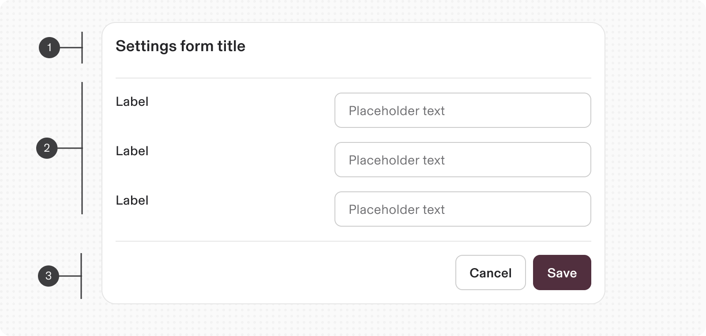

## Variants

1.  **Read only**: To show read-only state for settings
    

2.  **Editable**: To show editable state for settings
    

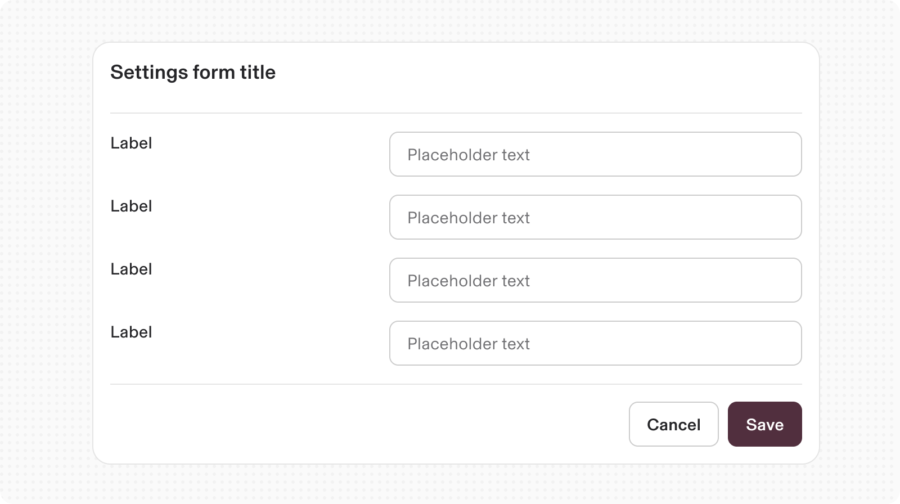

3.  **without Card background**: To use where the card background is not needed
    

## Properties

**Type**

**Purpose**

**Visual representation**

with Description

The text is utilized to display the supported options for the settings.

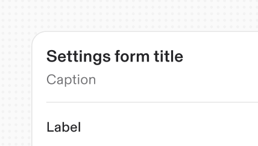

with Custom Header Actions

To enhance the header with additional custom actions tailored to specific use cases.

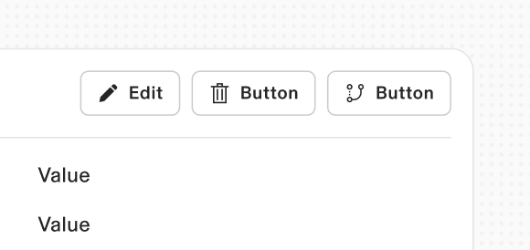

with Custom Footer Actions

Custom actions can be added while in the editable state. (Not available for read-only variant)

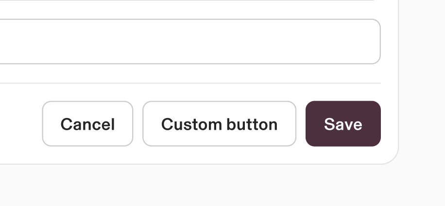

with Group Header

Utilized to distinguish between various sections or groups of settings.

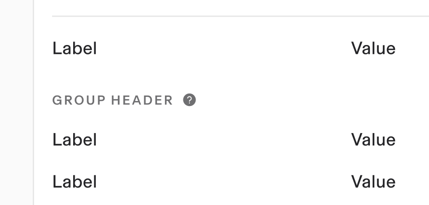

---

# Content guidelines

Follow the same guidelines as a **Form** component

---

# Accessibility

-   Keyboard Navigation: Ensure all fields and buttons are focusable and navigable using the Tab key.
    
-   Screen Reader Support: Use `aria-labels` and `aria-describedby` for input fields to provide context. Announce validation messages and form submission status.
    
-   Focus Indicators: Clear visual cues for focused elements to assist users with keyboard navigation.
