# Slider

**Source:** [View in Confluence](https://rippling.atlassian.net/wiki/spaces/RDS/pages/4759322771)  
**Last Synced:** 11/3/2025, 6:10:14 PM  
**Confluence Version:** 7

---

A Slider component allows users to select a value within a given range

[Figma](https://www.figma.com/design/nhtRzieeGFf1tGVWnRxSK3/Web-Component-Library-\(v3\)?node-id=66574-102221) [Storybook](https://pebble.ripplinginternal.com/?path=/docs/components-inputs-slider-slider--docs)

---

# Overview

A slider is an interactive component for selecting a single value or a range from a track. There are two main types: the default slider, with a label and number input, and the range slider, which has a label and two number inputs for a range. Sliders visually adjust values, allowing users to manipulate settings by moving a handle along a horizontal track.

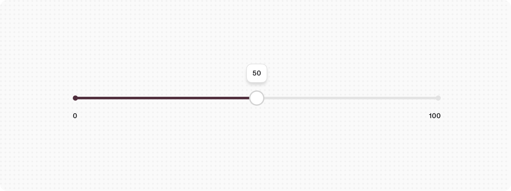

---

# Usage

### When to use

-   Use when selecting a single value or range of number values. Use it for ranges between 0 to 100.
    
-   Use when needing to expose a variety of options or to limit the number of options.
    

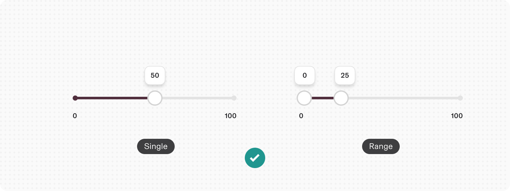

### When not to use

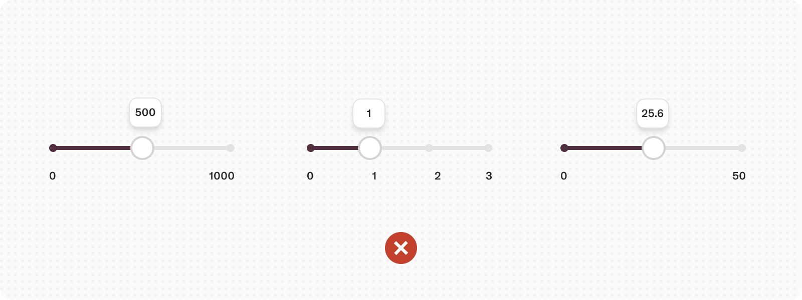

-   Do not use for extremely large ranges, for example, 1-1000.
    
-   Do not use ranges that are too small, for example, 1-3.
    
-   Do not use complex inputted values that are not numbers.
    

## Best practices

-   Place labels directly above the input, and align to the left.
    

---

# Specs

## Anatomy

1.  **Indicator:** Intermediate stages without values can be shown for sliders
    
2.  **Label:** Intermediate stages can be shown for sliders with marked values
    
3.  **Handle:** An indicator that can be moved on the track within the slider range to specify a selected value.
    
4.  **Track:** Shows a user’s available minimum and maximum values on the range to select from.
    
5.  **Tooltip:** Helps users view the value currently being selected
    

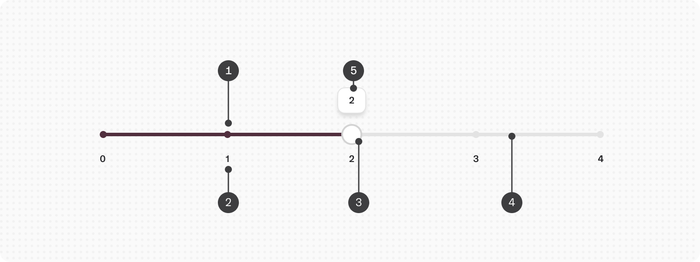

## States

**Type**

**Purpose**

**Visual representation**

Default

Shows the default state of a slider

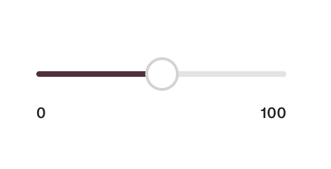

Hover

When a user’s mouse cursor is hovering over the slider handle

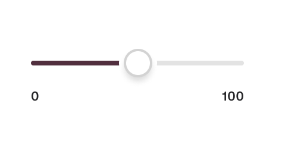

Focus

When a user intent is focused on the slider handle

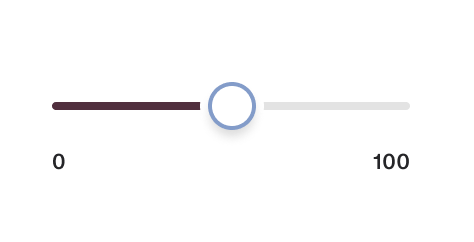

Disabled

When the slider is disabled from access

## Variants

**Type**

**Purpose**

**Visual representation**

Single

Used to select a single value

Range

Used to select a range

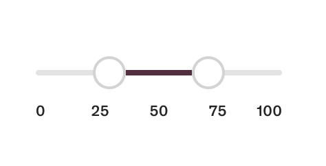

## Appearance

**Type**

**Purpose**

**Visual representation**

Default

To be used for majority of use cases

Success

Used to indicate success in an input operation

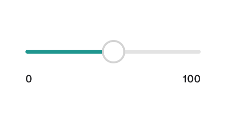

Warning

Used to indicate warning in an input operation

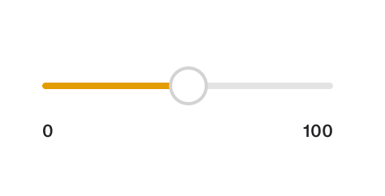

Error

Used to indicate error in an input operation

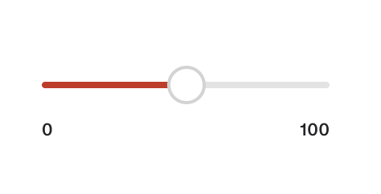

# Content guidelines

-   Keep labels short and concise.
    

# Accessibility

-   Using ranges to select values can be less accurate than typing them in or choosing from a list.
    
-   Avoid using ranges for non-numeric values, like days of the week.
    
-   Keyboard support is important for navigating and adjusting sliders with arrow keys and shortcuts.
    
-   Use ARIA labels and roles to help screen readers understand the slider's value and purpose.
    
-   Visual indicators should show focus and selection states to help users see the slider's position and range.
    

## Localization

-   For right-to-left user interfaces, put the lowest value on the right.
    

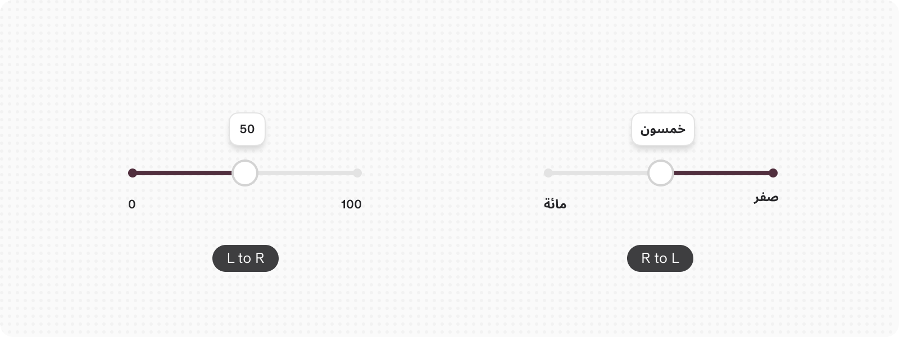
