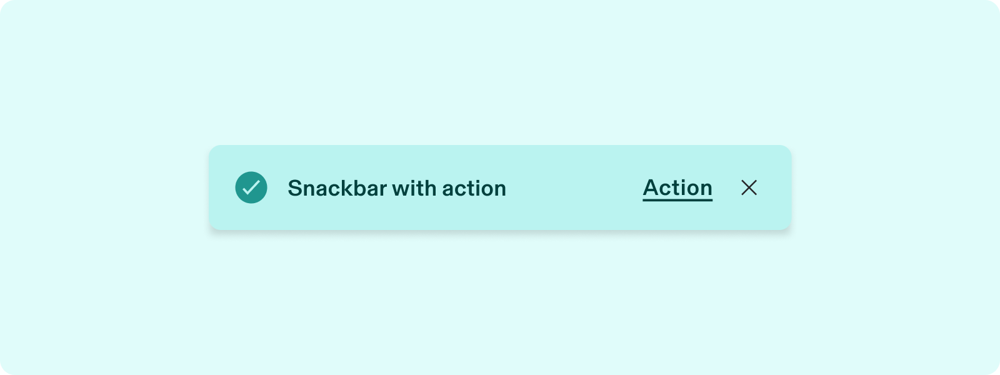
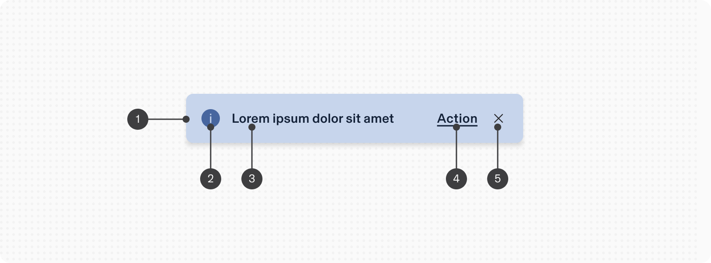
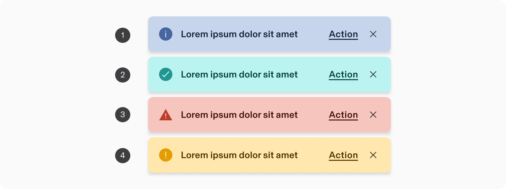
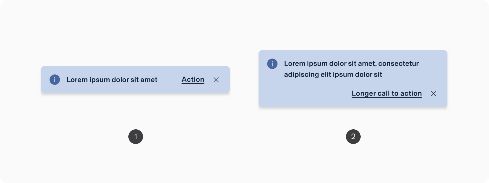
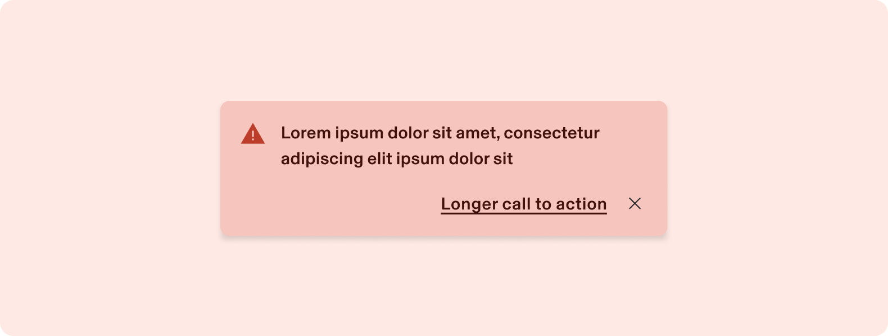
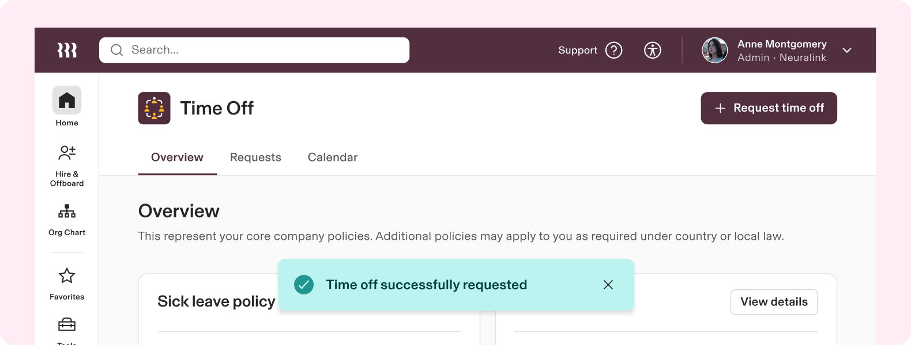
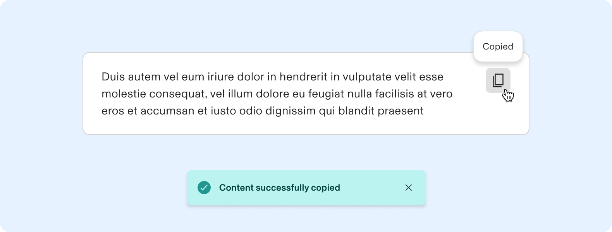
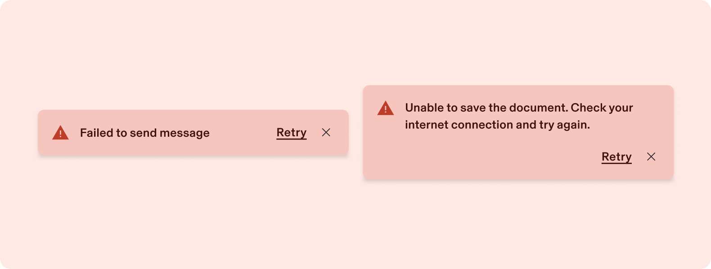
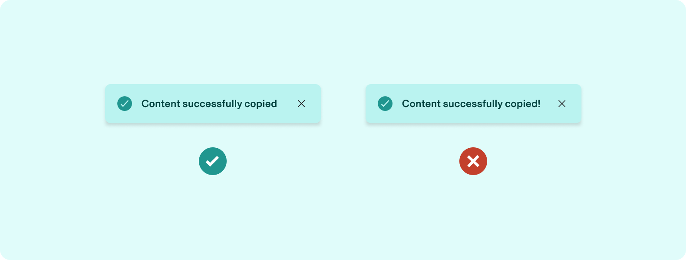

# Snackbar

**Source:** [View in Confluence](https://rippling.atlassian.net/wiki/spaces/RDS/pages/3922427910)  
**Last Synced:** 11/3/2025, 6:10:19 PM  
**Confluence Version:** 2

---

Introduction

A passive notification that appears at the bottom of the screen to provide quick, at-a-glance feedback on the outcome of an action.

---

# Overview

-   A passive alert that doesn’t interrupt the user’s experience
    
-   Can disappear on their own or remain on screen until the user takes action
    
-   Appears at the bottom of the screen
    

## Resources

**Type**

**Resource**

**Status**

Design

[Web Component (Figma)](https://www.figma.com/file/ysWbTtfWqhVDHQd1Mg2LQ1/Component-Library-v2?type=design&node-id=1056-2727&mode=design)

AVAILABLEGreen

Implementation

[Web Component (Storybook)](https://uikit.ripplinginternal.com/?path=/docs/components-miscellaneous-snackbar--props)

AVAILABLEGreen

---

# Specs

## Anatomy

1.  Container
    
2.  Icon
    
3.  Message
    
4.  Action (optional)
    
5.  Dismiss (contextual)
    

## Configuration

### Type

1.  **Informative (default)**: Utilized for general information sharing without any implied urgency or emotional significance.
    
2.  **Success**: Used to inform the user with positive sentiment, often after a successful action or the completion of a task to encourage user engagement.
    
3.  **Error**: Essential for informing users of errors, failures, or critical issues that impact their tasks or data integrity. These typically persist until dismissed by the user to ensure they have been acknowledged.
    
4.  **Warning**: Serves as a preemptive alert to situations that, if unaddressed, could escalate into more critical issues.
    

### Number of lines

1.  **Single line (default)**: Optimized for brief messages and actions, providing a streamlined presentation
    
2.  **Two lines**: Extensive text or complex action labels can cause poor formatting and hurt legibility if too long. To resolve this, the layout distributes content over two lines: the main message occupies the full width of the first line, while action and dismiss affordance are aligned on the second line.
    

## Persistent

By default, the snackbar automatically disappears after 7 seconds, regardless of whether it includes an action or a dismiss option. For essential messages requiring acknowledgment, it can remain visible with a `persist` property until actively dismissed. In such cases, the dismiss affordance is required and is integrated into the element. Regardless, clicking on an action or the close button will always dismiss the snackbar.

---

# Usage

### When to use

-   Snackbars are best as passive notifications. They're meant to be noticed without disrupting a user's experience or requiring an action
    

### When to use something else

-   For contextual feedback that _requires_ user action or feedback, use a dialogue. Dialogues interrupt the user’s experience and mandate an action be taken, so be intentional about their application
    

## Guidelines

### Snackbars are for non-critical messages

For users with low vision or those who need more time to read and understand information, auto-dismissing snackbars can pose accessibility challenges. These users might not be able to perceive the information before it disappears. To mitigate these issues, consider the following strategies:

1.  Ensure that snackbars convey only non-critical, supplementary information. Critical messages that require user action or acknowledgment are often better served in modal dialogs
    
2.  For information that auto-dismisses, ensure there are other means to access the same information within the application. For example, if a snackbar notifies about a successful copy-to-clipboard operation, the status could also be indicated in the relevant UI area.
    
3.  Persist the message until the user has had a chance to interact with the actions inside (_this is the default behavior of persisting the snackbar_)
    

## Content standards

### Write in sentence case with no period

[Like all in-product content](https://rippling.atlassian.net/wiki/spaces/RDS/pages/3774153201/Guidelines#3.-Use-sentence-case-for-everything-except-branded-terms) at Rippling, snackbars and their actions are written in sentence case. If the message is a single sentence, do not add a period to the end; this helps keep the text quicker to read and easier to parse.

Snackbars should ideally only be a single sentence, but if you need two or more sentences to communicate the information, add a period to the end of each sentence.

### Limit the use of exclamation points

Use positive language to confirm success when an expected outcome is achieved, but **don’t celebrate it with an exclamation point**. Consider adding the word “successfully” to larger tasks, like bulk uploads. For example, you could write “Image uploaded successfully” or “Image uploaded”—both are fine, and neither need an exclamation mark.

---

# Accessibility

When keyboard focus is placed on buttons in a snackbar, any auto-dismiss behavior is paused in order to meet [WCAG Guideline 2.2 Enough Time](https://www.w3.org/TR/WCAG21/#enough-time).

## Keyboard Navigation

**Keys**

**Action**

Tab

Places the focus on the next interactive element, which is either a button or a close button

Space / Enter

If focus is on the close button, dismisses the snackbar. If focus is on the button, executes the button action.
